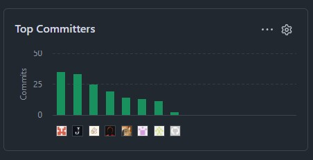
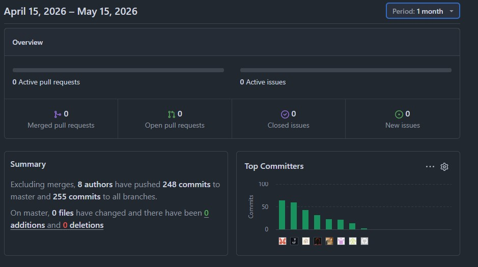
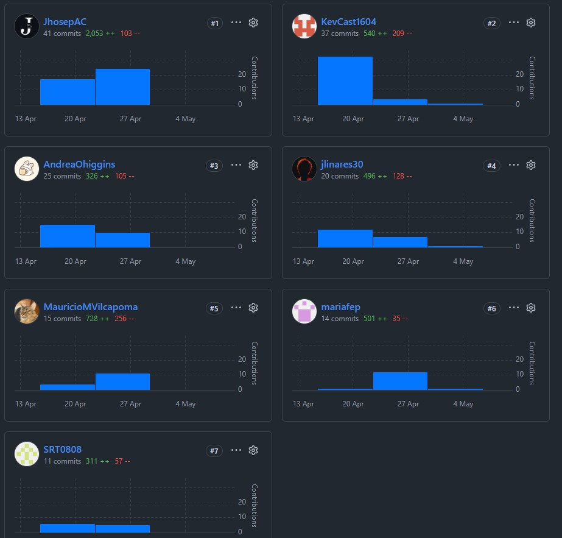
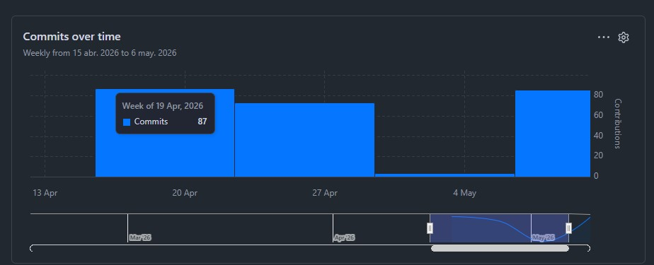
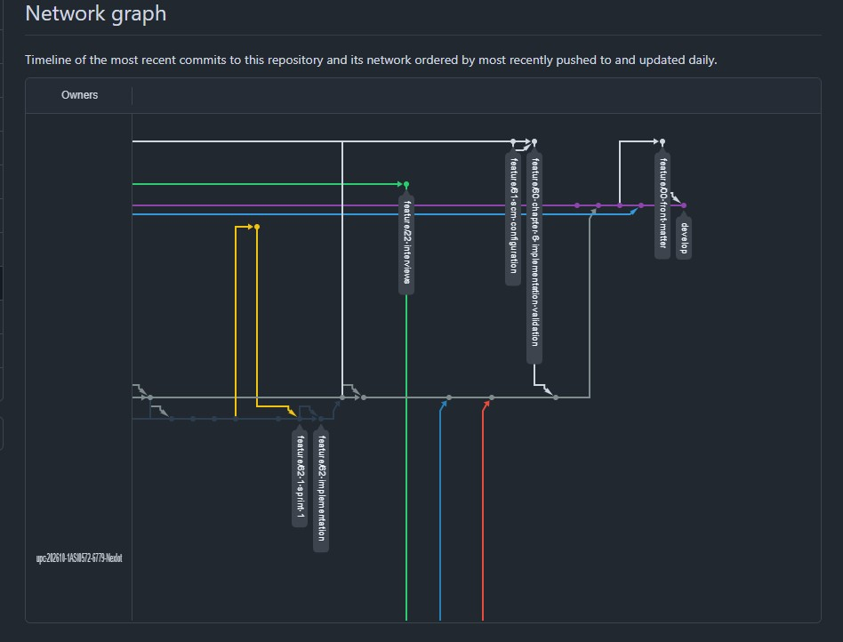
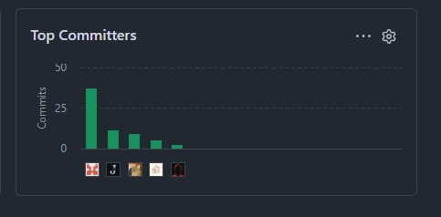
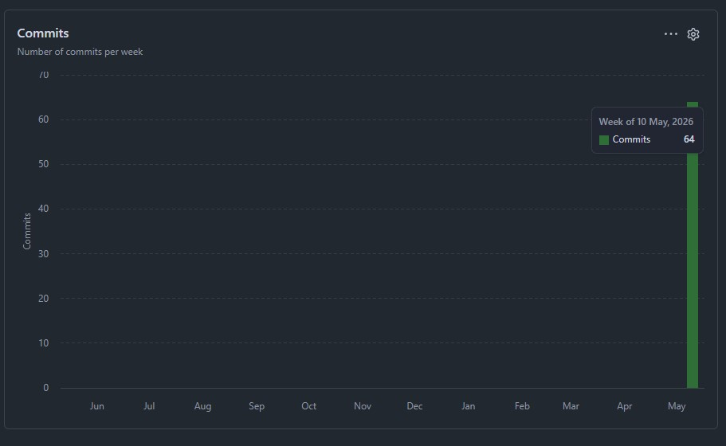
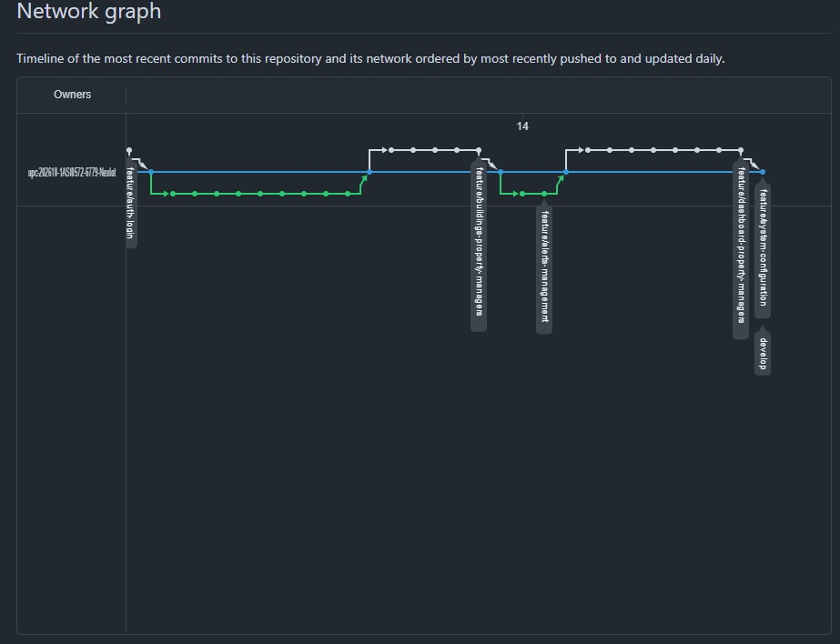

## Collaboration Insights

En esta sección, el equipo detalla la metodología de trabajo colaborativo empleada para la elaboración del informe técnico y presenta las evidencias de contribución de cada integrante en el repositorio del proyecto.

## Repositorio del Proyecto

El informe del proyecto se gestiona de manera colaborativa en un repositorio dedicado dentro de la organización de GitHub del equipo:

*   **URL de la Organización:** [https://github.com/upc-202610-1ASI0572-6779-NexIot](https://github.com/upc-202610-1ASI0572-6779-NexIot)
*   **URL del Repositorio del Informe:** [https://github.com/upc-202610-1ASI0572-6779-NexIot/nexora.report](https://github.com/upc-202610-1ASI0572-6779-NexIot/nexora.report)

## Actividades de Elaboración por Entrega

### Entrega AV1 (Análisis y Validación 1)
Durante esta etapa inicial, el equipo se enfocó en la definición estratégica y técnica del proyecto.
*   **Metodología:** Se realizaron sesiones de redacción conjunta para los perfiles de la startup y la definición del problema. La elaboración del DDD estratégico y los diagramas C4 iniciales se distribuyó por Bounded Contexts.
*   **Colaboración:** Cada miembro fue responsable de documentar sus hallazgos de entrevistas y diseñar la arquitectura táctica de sus respectivos módulos, integrando los archivos Markdown directamente en el repositorio.

### Entrega TB1 (Trabajo de Base 1)
Esta fase se centró en el diseño de UI/UX y la documentación del primer ciclo de implementación.
*   **Metodología:** El equipo adoptó una estructura de documentación modular. Se asignaron responsabilidades para la redacción de lineamientos de diseño, arquitectura de información y evidencias de ejecución.
*   **Colaboración:** Se realizaron revisiones cruzadas (*Peer Reviews*) de los contenidos antes de consolidar la versión final, asegurando que todos los apartados mantuvieran un tono y estilo coherente.

## Analíticos de Colaboración del Informe

### Insights de Github (AV1)

A continuación, se presentan las evidencias gráficas del repositorio `nexora.report`, que ilustran la participación activa y equitativa de todos los miembros del equipo:

### 1. Historial de Commits (Activity)
Evidencia la frecuencia de trabajo y la colaboración constante a lo largo de las semanas de desarrollo.

### Insights de Github (TB1)

A continuación, se presentan las evidencias gráficas para el segundo entregable del reporte:

#### 1. Historial de Commits (Activity)

#### 2. Historial de Commits (Activity)

#### 4. Network Graph

### Insights de Github (AV2)

A continuación, se presentan los analíticos de colaboración recopilados de los repositorios de GitHub, que evidencian la actividad y contribución de cada miembro del equipo durante el Sprint 2 para el Reporte:

#### Sprint 2

##### 1. Actividad de Contribuciones (Contributors)

Distribución de los Top Comitters para el reporte.

##### 2. Frecuencia de Commits y Trabajo Diario

##### 3. Flujo de Red y Ramas (Network Graph)

### Insights de Github (TB2):

A continuación, se presentan los analíticos relacionados al Sprint 3, para el reporte. Se detallan mejoras en algunas secciones para aplicar mejora continua, así como también la mejora de la organización del reporte en la carátula, anexos, fuentes bibliográficas, etc.

#### Sprint 3: 

A continuación, se detallan los insights de Github en función a este último entregable.

## Interpretación de los Analíticos

A partir de las evidencias mostradas, el equipo concluye lo siguiente:

1.  **Participación Equitativa:** El gráfico de contribuyentes demuestra que todos los miembros del equipo han realizado aportes significativos al repositorio del informe, cumpliendo con el requisito de participación conjunta en todas las etapas.
2.  **Coherencia con el Registro de Versiones:** La actividad registrada en GitHub (fechas y autores) guarda total coherencia con el [Registro de Versiones del Informe](./02-version-history.md), validando la veracidad de los cambios documentados.
3.  **Flujo de Trabajo Iterativo:** La frecuencia de commits muestra un proceso de elaboración progresivo y no acumulativo al final de los plazos, lo que facilitó la revisión y mejora continua de la calidad del documento final.

