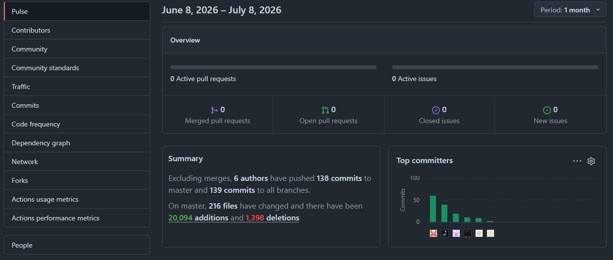
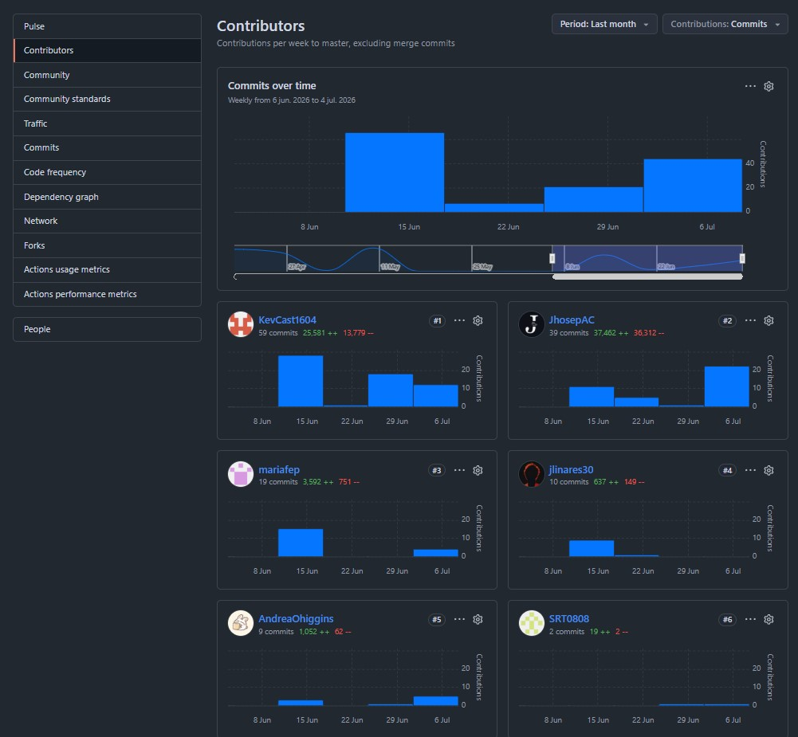

## Project Report Collaboration Insights

En esta sección, el equipo detalla la metodología de trabajo colaborativo empleada para la elaboración del informe técnico y presenta las evidencias de contribución de cada integrante en el repositorio del proyecto.

## Repositorio del Proyecto

El informe del proyecto se gestiona de manera colaborativa en un repositorio dedicado dentro de la organización de GitHub del equipo:

*   **URL de la Organización:** [https://github.com/upc-202610-1ASI0572-6779-NexIot](https://github.com/upc-202610-1ASI0572-6779-NexIot)
*   **URL del Repositorio del Informe:** [https://github.com/upc-202610-1ASI0572-6779-NexIot/nexora.report](https://github.com/upc-202610-1ASI0572-6779-NexIot/nexora.report)

## Actividades de Elaboración por Entrega

### Entrega AV1 (Análisis y Validación 1)
Durante esta etapa inicial, el equipo se enfocó en la definición estratégica y técnica del proyecto.
*   **Metodología:** Se realizaron sesiones de redacción conjunta para los perfiles de la startup y la definición del problema. La elaboración del DDD estratégico y los diagramas C4 iniciales se distribuyó por Bounded Contexts.
*   **Colaboración:** Cada miembro fue responsable de documentar sus hallazgos de entrevistas y diseñar la arquitectura táctica de sus respectivos módulos, integrando los archivos Markdown directamente en el repositorio.

### Entrega TB1 (Trabajo de Base 1)
Esta fase se centró en el diseño de UI/UX y la documentación del primer ciclo de implementación.
*   **Metodología:** El equipo adoptó una estructura de documentación modular. Se asignaron responsabilidades para la redacción de lineamientos de diseño, arquitectura de información y evidencias de ejecución.
*   **Colaboración:** Se realizaron revisiones cruzadas (*Peer Reviews*) de los contenidos antes de consolidar la versión final, asegurando que todos los apartados mantuvieran un tono y estilo coherente.

### Entrega AV2 (Análisis y Validación 2)
En esta fase se presentó las primeras versiones de nuestras soluciones como el Embedded Apps, Prototype, Web Service, Mobile App y la segunda versión de la Landing Page y App Web.

* **Metodología:** El equipo se centró en la documentación de la arquitectura implementada, el Diseño de la Solución y el desarrollo de las primeras versiones funcionales de las soluciones propuestas. Dividmos las tareas por User Stories y avanzamos segun estas para el Sprint 2.
* **Colaboración:** Se asignaron responsabilidades para la redacción de la arquitectura de software, la documentación de las soluciones y la integración de los archivos Markdown en el repositorio.

### Entrega TB2 (Trabajo de Base 2)
En esta fase se presentó la versión final de nuestras soluciones como el Embedded Apps, Prototype, Web Service, Mobile App, Landing Page y App Web.

* **Metodología:** El equipo se encargo en la realización de los últimos bounded contexts, la integración de todos los componentes del sistema y la revisión final del informe, aplicando mejora continua.  
* **Colaboración:** Se asignaron las responsabildiades de forma equitativa entre los integrantes del equipo, donde cada uno se encargo de realizar sus tareas asignadas.

## Analíticos de Colaboración del Informe

A continuación, se presentan los analíticos de colaboración extraídos directamente de los repositorios de GitHub para cada una de las entregas del proyecto. Estas métricas y gráficos evidencian la constancia, el flujo de trabajo y la participación activa de cada integrante del equipo.

### Insights de GitHub - Entrega AV1

Para la primera entrega (AV1), la actividad en el repositorio se centró principalmente en la estructuración de la documentación inicial y la definición de la arquitectura de software.

#### 1. Historial de Commits y Actividad (Activity)

Muestra la frecuencia de las contribuciones y el ritmo de trabajo colaborativo durante las primeras semanas del proyecto. La constancia en la actividad refleja una planificación temprana y el avance continuo en la redacción técnica.

  

---

### Insights de GitHub - Entrega TB1

Durante el primer Trabajo de Base (TB1), el equipo incrementó la intensidad de la colaboración, integrando los diseños UI/UX y la documentación técnica de base.

#### 1. Historial de Commits y Actividad (Activity)

Este gráfico ilustra la frecuencia de commits durante el desarrollo de la entrega TB1, destacando la regularidad del trabajo grupal a lo largo de las semanas de diseño.

  

#### 2. Participación y Contribuciones por Miembro (Contributors)

Los siguientes gráficos detallan la contribución individual de cada integrante en el repositorio del informe. Se puede observar una distribución equitativa de los commits y el volumen de líneas agregadas o modificadas, garantizando la corresponsabilidad en el trabajo.

  

  

#### 3. Flujo de Trabajo en Red (Network Graph)

El grafo de red muestra cómo se ramificó el trabajo para la elaboración de secciones individuales y cómo estas se integraron posteriormente mediante Pull Requests a la rama principal del informe, evitando conflictos y manteniendo la integridad del documento.

  

---

### Insights de GitHub - Entrega AV2

En la segunda fase de Análisis y Validación (AV2 / Sprint 2), la actividad se centró en la implementación de las soluciones funcionales (Web, Mobile, Embedded, API) y su respectiva documentación.

#### 1. Actividad de Contribuciones (Contributors)

Este gráfico muestra la distribución de aportaciones y los commits realizados en el marco de las User Stories del Sprint 2, constatando que cada desarrollador lideró y completó las secciones asociadas a sus funcionalidades asignadas.

  

#### 2. Frecuencia de Commits y Trabajo Diario

Este analítico muestra el ritmo de integraciones diarias realizadas. Los picos representados coinciden con los hitos de integración continua previos al cierre de la entrega AV2.

  

#### 3. Flujo de Trabajo en Red (Network Graph)

Visualiza el flujo de bifurcación de ramas y el proceso de integración en el Sprint 2. Se observa un control estricto de las ramas de características antes de consolidarse en la versión de producción y en la documentación maestra.

  

---

### Insights de GitHub - Entrega TB2

Para la entrega final de Trabajo de Base 2 (TB2 / Sprint 3), los analíticos reflejan las actividades de mejora continua, aseguramiento de la calidad, estructuración de anexos, fuentes bibliográficas y detalles finales del reporte.

#### 1. Resumen de Actividad del Proyecto (Pulse)

Muestra la actividad general del repositorio en la fase final, incluyendo Pull Requests completados, incidencias resueltas y el volumen general de aportes al informe en el último mes de desarrollo.

  

#### 2. Participación de Colaboradores (Contributors)

Registra la distribución final de contribuciones acumuladas por integrante en este período. Muestra una colaboración continua y ratifica el esfuerzo de todos los miembros del equipo en la consolidación final del informe.

  

#### 3. Flujo de Trabajo en Red (Network Graph)

El grafo de red final muestra la consolidación de todas las ramas de trabajo en la rama principal del informe, evidenciando un proceso de integración exitoso y ordenado de todos los capítulos del reporte final.

  

## Interpretación de los Analíticos

A partir de las evidencias mostradas, el equipo concluye lo siguiente:

1.  **Participación Equitativa:** El gráfico de contribuyentes demuestra que todos los miembros del equipo han realizado aportes significativos al repositorio del informe, cumpliendo con el requisito de participación conjunta en todas las etapas.
2.  **Coherencia con el Registro de Versiones:** La actividad registrada en GitHub (fechas y autores) guarda total coherencia con el [Registro de Versiones del Informe](./02-version-history.md), validando la veracidad de los cambios documentados.
3.  **Flujo de Trabajo Iterativo:** La frecuencia de commits muestra un proceso de elaboración progresivo y no acumulativo al final de los plazos, lo que facilitó la revisión y mejora continua de la calidad del documento final.

