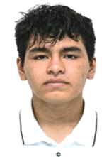
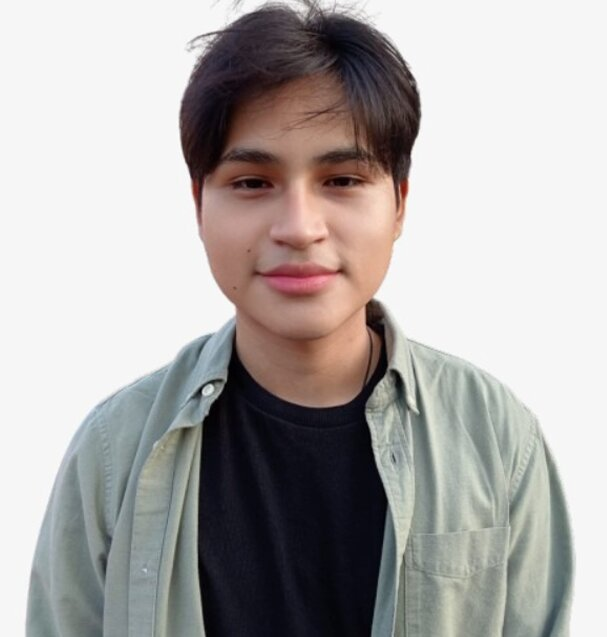
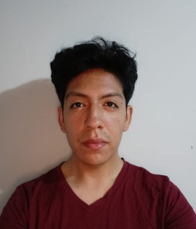
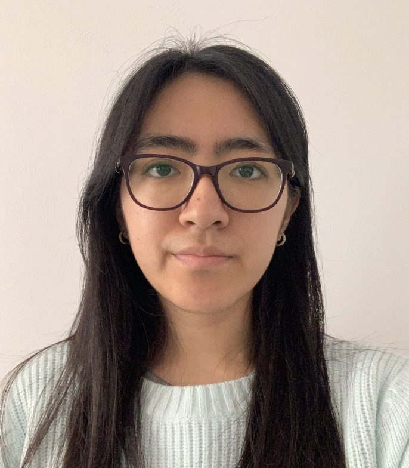
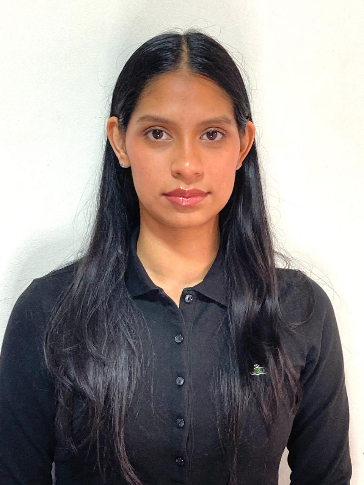
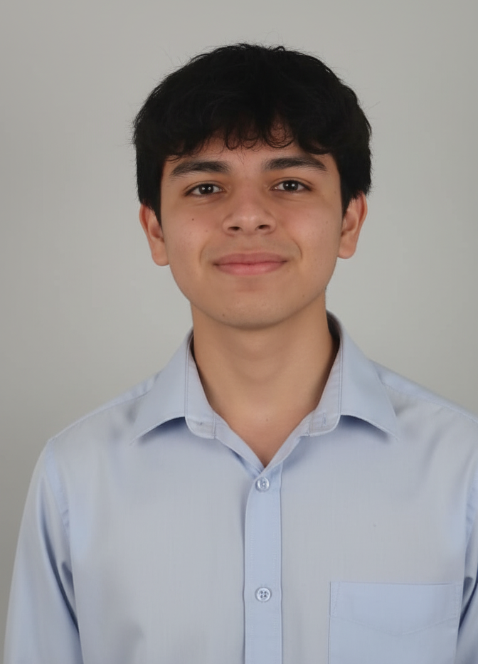
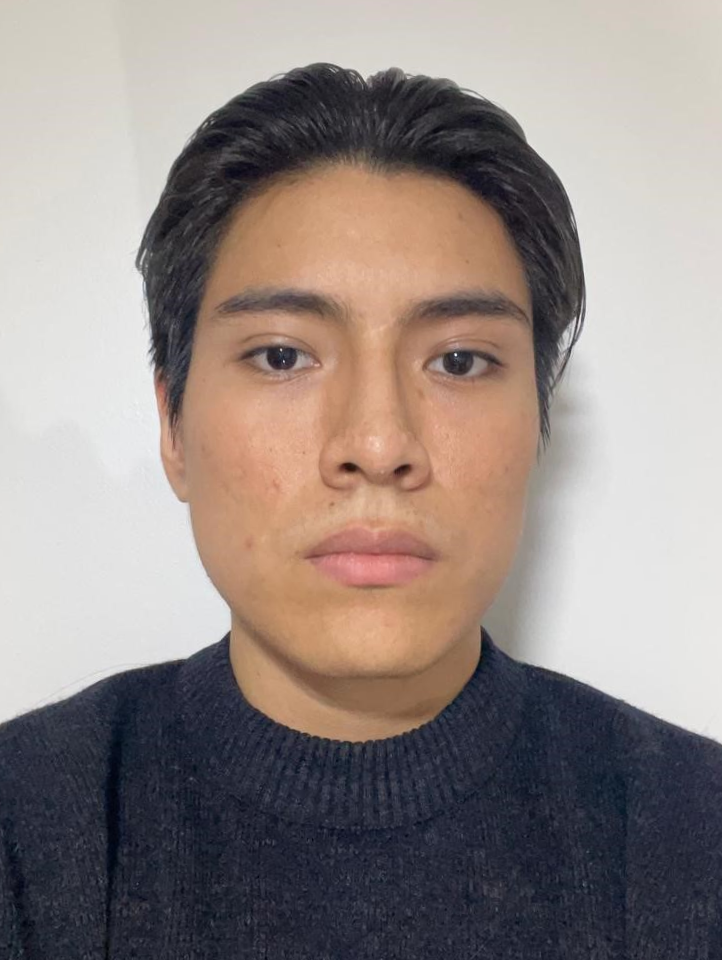

### 1.1.2. Perfiles de integrantes del equipo

| **Integrante** | **Perfil** | **Foto** |
|----------------|------------|----------|
| **Jhosep Jamil Argomedo Camacho**    **Código:** U20231D978    **Carrera:** Ingeniería de Software    **Rol:** Miembro de equipo | Soy estudiante de Ingeniería de Software con experiencia en desarrollo de aplicaciones web y móviles utilizando React. Manejo bases de datos SQL y NoSQL, así como el desarrollo de APIs RESTful para la integración de sistemas. Utilizo herramientas como Git, GitHub y Figma, y aplico metodologías ágiles como SCRUM. Me caracterizo por mi responsabilidad, trabajo en equipo y enfoque en el desarrollo de soluciones eficientes y escalables. |  |
| **Sebastian Ramirez Tello**    **Código:** U202316122    **Carrera:** Ingeniería de Software    **Rol:** Miembro de equipo | Soy estudiante de Ingeniería de Software en la UPC. Manejo herramientas como Git, GitHub y Figma, así como lenguajes de programación como HTML, CSS, Python, JavaScript, y bases de datos SQL y NoSQL.  me destaco por mi responsabilidad y habilidad para coordinar equipos, enfocándome en el logro de objetivos comunes. |  |
| **Jorge Alexandro Linares Arroyo**    **Código:** U202318624    **Carrera:** Ingeniería de Software    **Rol:** Miembro de equipo | Estudiante de la carrera de Ingeniería de Software, interesado por el mundo tecnológico y cuento con habilidades para formar parte de ello con conocimiento en desarrollo web. Me considero una persona muy perseverante que le gusta hacer las cosas detalladamente y con criterio. |  |
| **Andrea Namie O'Higgins Rosales**    **Código:** U20221B178    **Carrera:** Ingeniería de Software    **Rol:** Miembro de equipo | Soy estudiante de Ingeniería de Software en la Universidad Peruana de Ciencias Aplicadas. Me considero una persona organizada, responsable y comprometida con cada proyecto en el que participo. Tengo disposición para colaborar en equipo, aportar soluciones técnicas e investigar de manera proactiva con el fin de contribuir activamente al cumplimiento de los objetivos planteados. |  |
|**Maria Fernada Peña Riofrio**    **Código:** U202113279    **Carrera:** Ingeniería de Software    **Rol:** Miembro de equipo | Soy estudiante de Ingeniería de Software con interés en el desarrollo móvil y frontend, así como en el diseño de experiencias de usuario. Tengo conocimientos en desarrollo web con Vue y Vite, también en el diseño UX/UI y el desarrollo de interfaces funcionales y atractivas en Figma. Aplico metodologías ágiles como SCRUM y me caracterizo por mi aprendizaje autónomo y enfoque en crear soluciones eficientes y centradas en el usuario. |  |
|**Castañeda Llanos, Kevin Alexander**    **Código:** U202317110    **Carrera:** Ingeniería de Software    **Rol:** Miembro de equipo | Soy estudiante de Ingeniería de Software con interés en el desarrollo web y la creación de aplicaciones web impulsadas con IA como sistemas RAG, IA generativa y agentes inteligentes. Tengo experiencia en lenguajes como Next, Typescript, Python, FastAPI, Django y Bases de Datos vectoriales. |  |
| **Mauricio Muñoz Vilcapoma**    **Código:** U202217212    **Carrera:** Ingeniería de Software    **Rol:** Miembro de equipo | Soy estudiante de Ingeniería de Software en la UPC con interés en desarrollo web, backend y soluciones empresariales. Manejo tecnologías como Java, Python, JavaScript y Angular, además de bases de datos SQL y APIs REST. Cuento con conocimientos en arquitecturas de software, metodologías ágiles, Git, GitHub, Excel e IA aplicada a productividad. Me caracterizo por mi responsabilidad, aprendizaje continuo y enfoque en desarrollar soluciones funcionales y escalables. |  |

