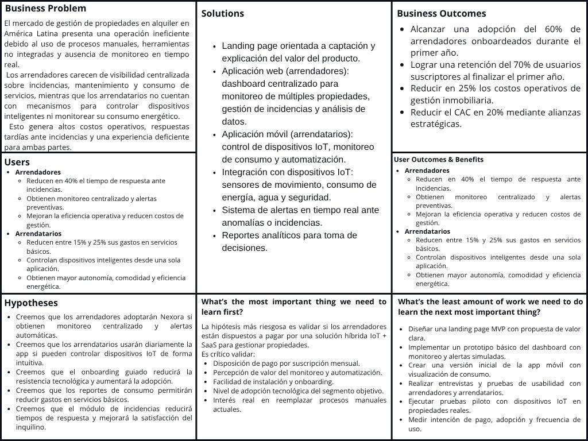

### 1.2.2. Lean UX Process
#### 1.2.2.1. Lean UX Problem Statements

El estado actual del mercado de gestión de propiedades en alquiler en América Latina se ha enfocado principalmente en arrendadores y administradores que dependen de métodos manuales, herramientas no integradas (hojas de cálculo, llamadas telefónicas, visitas físicas) y plataformas genéricas no diseñadas para el contexto de alquiler, lo que genera ineficiencias operativas, tiempos de respuesta tardíos ante incidencias y una experiencia deficiente para los inquilinos.

Lo que los productos y servicios existentes no logran resolver es la ausencia de una plataforma integral, específicamente diseñada para propiedades en alquiler, que combine dispositivos IoT con un sistema centralizado de monitoreo en tiempo real, automatización de procesos y análisis de datos accesible para arrendadores y arrendatarios sin requerir conocimientos técnicos avanzados.

Nexora, producto de la startup NextIoT, abordará esta brecha mediante un modelo híbrido que integra hardware IoT instalable con una plataforma SaaS (dashboard web para arrendadores y aplicación móvil para arrendatarios), diseñada específicamente para el contexto de viviendas en alquiler y orientada a la gestión centralizada, el monitoreo preventivo y la reducción de costos operativos.

El enfoque inicial será en arrendadores independientes y pequeñas administradoras de propiedades en Lima, Perú, que gestionan entre 2 y 20 unidades de alquiler y actualmente no cuentan con ninguna solución tecnológica integrada para su operación diaria.
Sabremos que hemos tenido éxito cuando observemos las siguientes conductas medibles en nuestra audiencia objetivo:

- Al menos el 60% de los arrendadores onboardeados utiliza el dashboard web como herramienta principal de gestión dentro de los primeros 90 días.
- Una reducción del 40% en el tiempo promedio de respuesta ante incidencias reportadas en propiedades gestionadas con Nexora.
- Al menos el 75% de los arrendatarios activos utiliza la aplicación móvil de forma diaria durante el primer mes tras la instalación.
- Una tasa de retención del 70% de arrendadores suscriptores al término del primer año de operación.

---

### 1.2.2.2. Lean UX Assumptions

En la fase inicial de desarrollo de la plataforma Nexora, producto de la startup NextIoT, hemos identificado y estructurado una serie de supuestos fundamentales siguiendo los principios de la metodología Lean UX (3rd Edition). Estos supuestos representan nuestras hipótesis iniciales sobre quiénes son nuestros usuarios, qué necesidades buscan resolver, cómo interactuarán con la tecnología IoT, cómo operará el modelo de negocio y qué impacto esperamos generar. Formalizar estas creencias nos permite enfocar el desarrollo del producto en la validación temprana, reducir la incertidumbre y tomar decisiones estratégicas basadas en evidencia.

Los supuestos se clasifican en cinco categorías:

- **User Assumptions:** Creencias sobre las necesidades, comportamientos y motivaciones de propietarios de inmuebles e inquilinos en el contexto de viviendas en alquiler.
- **User Outcome Assumptions:** Beneficios y cambios de comportamiento que esperamos que los usuarios logren al utilizar Nexora.
- **Business Assumptions:** Hipótesis sobre la viabilidad del modelo de negocio híbrido (hardware IoT + SaaS) y su adopción en el mercado inmobiliario.
- **Business Outcome Assumptions:** Resultados medibles que esperamos alcanzar como organización.
- **Feature Assumptions:** Creencias sobre cómo las funcionalidades clave resolverán los problemas identificados y validarán nuestra propuesta de valor.

 

**USER ASSUMPTIONS**

- Creemos que los **arrendadores** son propietarios o administradores que gestionan entre 2 y 20 unidades de alquiler, actualmente resuelven incidencias de forma reactiva y manual, y no disponen de ninguna herramienta centralizada para monitorear el estado de sus propiedades en tiempo real.

- Creemos que los **arrendatarios** son inquilinos urbanos de entre 22 y 45 años, habituados al uso de smartphones, que valoran la autonomía sobre su entorno doméstico, pero que actualmente no tienen visibilidad sobre su consumo real de servicios básicos ni control sobre los dispositivos de su vivienda.

- Creemos que el **70% de los arrendadores** no cuenta con un sistema centralizado de seguimiento de incidencias, lo que los obliga a depender de comunicación informal (WhatsApp, llamadas) para coordinar mantenimiento, generando demoras y pérdida de información.

- Creemos que el **60% de los arrendatarios** percibe un gasto innecesario en servicios básicos (agua, electricidad) porque no dispone de herramientas que les entreguen datos comprensibles y accionables sobre su consumo.

- Creemos que tanto arrendadores como arrendatarios **adoptarán la plataforma si el proceso de instalación y onboarding es guiado, visual y completable en menos de 10 minutos**, ya que la resistencia al cambio tecnológico es la principal barrera de adopción en el segmento objetivo.

 

**USER OUTCOME ASSUMPTIONS**

- Creemos que si los arrendadores utilizan el dashboard web de Nexora, entonces **reducirán el tiempo de respuesta ante incidencias en al menos un 40%**, al pasar de una gestión reactiva y fragmentada a una centralizada con alertas automáticas.

- Creemos que si los arrendatarios acceden al monitoreo de consumo en tiempo real desde la app móvil, entonces **reducirán su gasto en servicios básicos entre un 15% y un 25%**, al tomar decisiones informadas sobre su uso diario de agua y electricidad.

- Creemos que si los arrendadores cuentan con una plataforma centralizada que reemplaza sus herramientas fragmentadas, entonces **el 70% reportará una mejora significativa en su experiencia de gestión** durante los primeros 90 días de uso activo.

- Creemos que si los arrendatarios pueden controlar dispositivos inteligentes de forma intuitiva desde la app móvil, entonces **el 75% la utilizará diariamente**, incorporándola como parte natural de su rutina en el hogar.

- Creemos que si Nexora proporciona alertas inteligentes ante anomalías detectadas por sensores IoT, entonces los arrendadores **prevendrán al menos el 60% de los incidentes críticos** que actualmente se detectan de forma tardía o accidental.

 

**BUSINESS ASSUMPTIONS**

- Creemos que el modelo de negocio de Nexora se sustentará en un **esquema híbrido**: venta o instalación de dispositivos IoT (hardware) + suscripción mensual al software (SaaS), combinando ingresos por implementación inicial con ingresos recurrentes y escalables.

- Creemos que el **60% de los ingresos** provendrá de suscripciones recurrentes y el 40% restante de la implementación inicial de dispositivos, lo que garantiza estabilidad financiera desde el primer año.

- Creemos que al menos el **50% de los arrendadores contactados** estará dispuesto a pagar una suscripción mensual si durante el proceso comercial se demuestra de forma tangible el ahorro operativo y el mayor control sobre sus propiedades.

- Creemos que **establecer alianzas con inmobiliarias y administradoras de edificios** en Lima permitirá acelerar la adquisición de clientes, facilitando el acceso simultáneo a múltiples propiedades desde el primer contacto comercial y reduciendo el costo de adquisición por cliente (CAC).

- Creemos que el mercado de propiedades en alquiler en Perú representa una **oportunidad de crecimiento sostenido**, dado que la penetración actual de soluciones IoT integradas en el segmento residencial de alquiler es menor al 5% en América Latina.

 

**BUSINESS OUTCOME ASSUMPTIONS**

- Creemos que si Nexora logra una adopción efectiva, entonces **alcanzará una tasa de retención del 70% en el primer año**, impulsada por el valor continuo que genera el monitoreo en tiempo real y la automatización de procesos repetitivos.

- Creemos que si la plataforma ofrece una experiencia de usuario intuitiva y un onboarding guiado, entonces **reduciremos los costos de soporte técnico en un 25%** al minimizar errores de configuración y consultas recurrentes durante los primeros meses.

- Creemos que si se implementa correctamente el modelo SaaS con facturación recurrente, entonces **se generará un flujo de ingresos predecible y escalable** que permitirá financiar la expansión a nuevas ciudades a partir del segundo año de operaciones.

- Creemos que si se establecen alianzas estratégicas con inmobiliarias y administradoras, entonces **se reducirá el CAC en un 20%** respecto al canal de adquisición directa, al aprovechar la confianza y la red de contactos de esos socios.

- Creemos que si los usuarios perciben ahorros concretos y medibles en sus servicios básicos, entonces **aumentará orgánicamente la disposición a pagar y el número de referidos**, reduciendo la dependencia de canales de adquisición pagados.

 

**FEATURE ASSUMPTIONS**

- Creemos que un **dashboard web multi-propiedad para arrendadores** con visualización en tiempo real del estado operativo de todas sus unidades logrará que el **80% de los arrendadores activos lo adopte como herramienta principal de gestión** en los primeros 60 días tras el onboarding.

- Creemos que una **aplicación móvil para arrendatarios** que centraliza el control de dispositivos IoT (iluminación, sensores, consumo) logrará que el **75% la utilice diariamente**, convirtiéndola en la interfaz principal de su experiencia doméstica.

- Creemos que la **funcionalidad de monitoreo de consumo** (agua y energía eléctrica) con historial, comparativas y proyecciones permitirá a los usuarios tomar decisiones informadas que se traducirán en una reducción observable del gasto en servicios dentro del primer trimestre de uso.

- Creemos que el **sistema de alertas inteligentes configurables** ante anomalías detectadas por sensores IoT (fugas, accesos no autorizados, consumo inusual) logrará que el **60% de los arrendadores configure al menos una alerta personalizada** durante el proceso de onboarding.

- Creemos que el **módulo de gestión de incidencias** (registro, asignación, seguimiento y cierre) permitirá a los arrendadores reducir el tiempo promedio de resolución de problemas y mejorar la satisfacción del inquilino, al reemplazar la comunicación informal por un flujo estructurado y trazable.

- Creemos que la **compatibilidad con dispositivos IoT estándar** (Wi-Fi, Zigbee, MQTT) y un flujo de configuración guiado paso a paso lograrán que el **70% de los nuevos usuarios conecte al menos un dispositivo en la primera semana** de uso activo.

- Creemos que una **landing page orientada a conversión** con propuesta de valor segmentada por tipo de usuario (arrendador / arrendatario), casos de uso reales y llamados a la acción claros logrará una **tasa de conversión del 20%** de visitantes a usuarios registrados durante la etapa de lanzamiento.

- Creemos que los **reportes analíticos periódicos** (semanales y mensuales) sobre consumo, incidencias activas y estado de dispositivos permitirán a los arrendadores tomar decisiones de mantenimiento preventivo, contribuyendo a una reducción sostenida de costos operativos a lo largo del tiempo.

---

### 1.2.2.3. Lean UX Hypothesis Statements

> *We believe we will achieve [this business outcome]*
> *If [these personas]*
> *Attain [this benefit/user outcome]*
> *With [this feature or solution]*

 

**Hipótesis 1**  
Creemos que lograremos **una tasa de adopción del 60% entre arrendadores durante el primer año y una reducción del 40% en el tiempo promedio de respuesta ante incidencias**
si los **arrendadores (propietarios y administradores de propiedades en alquiler)**
logran **visibilidad centralizada en tiempo real del estado operativo de todas sus propiedades y reciben notificaciones automáticas ante cualquier anomalía detectada**
con el **dashboard web de monitoreo multi-propiedad y el sistema de alertas inteligentes en tiempo real**.

 

**Hipótesis 2**  
Creemos que lograremos **una retención del 70% de arrendatarios activos al término del primer año**
si los **arrendatarios (inquilinos de propiedades equipadas con Nexora)**
logran **reducir entre un 15% y un 25% su gasto mensual en servicios básicos gracias a decisiones informadas sobre su consumo**
con la **aplicación móvil de monitoreo de consumo en tiempo real con historial y comparativas**.

 

**Hipótesis 3**  
Creemos que lograremos **una reducción del 25% en los costos operativos de gestión inmobiliaria para arrendadores**
si los **arrendadores**
logran **gestionar incidencias y solicitudes de mantenimiento de forma centralizada, estructurada y con trazabilidad completa desde el reporte hasta el cierre**
con el **módulo de gestión de incidencias integrado en la plataforma web**.

 

**Hipótesis 4**  
Creemos que lograremos **una tasa de conversión del 20% de visitantes interesados a usuarios registrados activos**
si los **arrendadores en etapa de evaluación de la plataforma**
logran **comprender de forma clara e inmediata el valor diferencial de Nexora frente a sus métodos actuales y visualizar el impacto concreto en su operación diaria**
con una **landing page optimizada con propuesta de valor segmentada, casos de uso reales y llamados a la acción orientados al registro**.

 

**Hipótesis 5**  
Creemos que lograremos **que el 75% de los arrendatarios utilice la aplicación móvil diariamente durante el primer mes de uso**
si los **arrendatarios**
logran **controlar de forma sencilla e intuitiva los dispositivos inteligentes de su vivienda desde un único punto de acceso, sin requerir conocimientos técnicos**
con la **interfaz móvil centrada en experiencia de usuario, con automatizaciones programables y control de dispositivos en un toque**.

 

**Hipótesis 6**  
Creemos que lograremos **una reducción del 20% en incidentes críticos no detectados oportunamente en propiedades gestionadas con Nexora**
si los **arrendadores**
logran **recibir notificaciones inmediatas y contextualizadas ante anomalías detectadas por los sensores IoT instalados en sus propiedades**
con el **sistema de alertas inteligentes configurables por propiedad, tipo de sensor y umbral de activación**.

 

**Hipótesis 7**  
Creemos que lograremos **que el 70% de los nuevos usuarios conecte al menos un dispositivo IoT durante la primera semana de uso**
si **arrendadores y arrendatarios**
logran **completar el proceso de instalación y configuración de dispositivos sin asistencia técnica presencial y en menos de 10 minutos**
con la **compatibilidad con estándares IoT abiertos (Wi-Fi, Zigbee, MQTT) y el flujo de onboarding guiado paso a paso integrado en la plataforma**.

 

**Hipótesis 8**  
Creemos que lograremos **una disminución del 25% en consultas al soporte técnico durante los primeros seis meses de operación**
si **arrendadores y arrendatarios**
logran **resolver dudas de uso de forma autónoma desde la primera sesión, sin necesidad de contactar al equipo de soporte**
con una **interfaz optimizada bajo principios de UX, con tooltips contextuales, tutoriales integrados y documentación accesible desde la propia plataforma**.

 

**Hipótesis 9**  
Creemos que lograremos **una mejora del 30% en la eficiencia de gestión de arrendadores que administran tres o más propiedades simultáneamente**
si los **arrendadores con cartera de múltiples inmuebles**
logran **tener una vista unificada que consolida en tiempo real el estado operativo, las alertas activas y el consumo de todos sus inmuebles desde un único panel**
con el **dashboard web multi-propiedad con filtros comparativos entre unidades y resumen ejecutivo exportable**.

 

**Hipótesis 10**  
Creemos que lograremos **una reducción del 20% en el consumo energético promedio de las propiedades gestionadas con Nexora**
si los **arrendatarios**
logran **identificar patrones de consumo ineficiente y actuar sobre ellos gracias a información histórica, comparativas y recomendaciones personalizadas de ahorro**
con los **reportes analíticos periódicos y el módulo de recomendaciones de eficiencia energética dentro de la aplicación móvil**.

---

### 1.2.2.4. Lean UX Canvas

