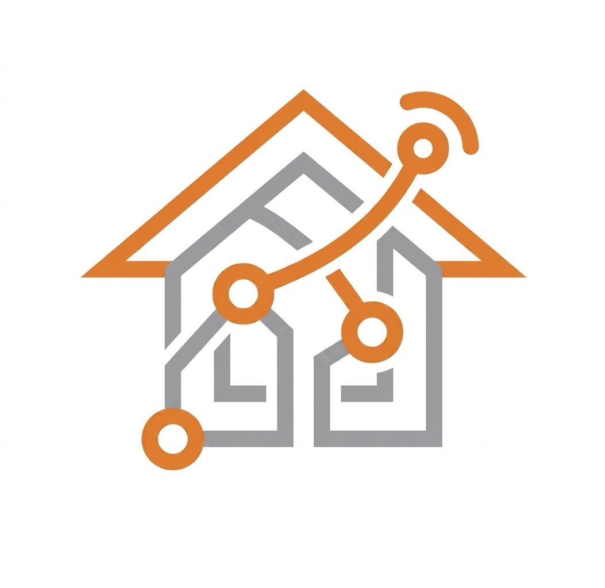

# Capítulo II: Requirements Elicitation & Analysis
## 2.1. Competidores
### 2.1.1. Análisis competitivo.

<table>
  <tr>
    <th colspan="7" valign="top"><b>Competitive Analysis Landscape</b></th>
  </tr>
  <tr>
    <td colspan="2" rowspan="2">¿Por qué llevar a cabo este análisis?</td>
  </tr>
  <tr>
    <td colspan="5">¿Cómo puede NexIoT desplazar a los competidores anglosajones en el mercado latinoamericano de alquileres ofreciendo una solución híbrida SaaS+IoT de menor costo operativo?</td>
  </tr>
  <tr style="text-align: center;">
    <td colspan="3">Nombre y Logo</td>
    <td colspan="1" valign="top" style="font-weight: bold;">
        NexIoT
         
        

                
        

    </td>
    <td colspan="1" valign="top" style="font-weight: bold;">
    SmartRent
    

                
        

    </td>
    <td colspan="1" valign="top" style="font-weight: bold;">
      ButterflyMX
      

                
      

      </td>
    <td colspan="1" valign="top" style="font-weight: bold;" >
      Savant
      

                
            

    </td>
  </tr>
  <tr>
    <td colspan="1" rowspan="2">
Perfil
</td>
    <td colspan="2">Overview</td>
    <td colspan="1" valign="top">Plataforma IoT para la gestión inteligente de propiedades en alquiler que integra sensores, monitoreo en tiempo real y automatización, permitiendo optimizar el consumo, la seguridad y la operación de los inmuebles. </td>
    <td colspan="1" valign="top">Es una plataforma tecnológica enfocada en la automatización y gestión de propiedades residenciales en alquiler mediante el uso de dispositivos IoT.</td>
    <td colspan="1" valign="top">Es una plataforma tecnológica que ofrece soluciones de acceso inteligente para edificios residenciales y propiedades en alquiler.</td>
    <td colspan="1" valign="top">Es una plataforma de automatización del hogar que permite la integración y control de múltiples dispositivos inteligentes dentro de una vivienda.</td>
  </tr>
  <tr>
    <td colspan="2">Ventaja competitiva¿Qué valor ofrece a los clientes?</td>
    <td colspan="1" valign="top">Integra hardware IoT y software en una sola plataforma, ofreciendo monitoreo en tiempo real, automatización basada en datos y optimización del consumo energético, con un enfoque accesible para el mercado latinoamericano.</td>
    <td colspan="1" valign="top">Permite administrar múltiples propiedades de forma remota con integración de dispositivos IoT a gran escala.</td>
    <td colspan="1" valign="top">Facilita el acceso seguro y remoto a edificios, mejorando la experiencia del usuario y la seguridad.</td>
    <td colspan="1" valign="top">Ofrece una experiencia premium de automatización completa con alta personalización en hogares inteligentes
</td>
  </tr>
  <tr>
    <td colspan="1" rowspan="2">
Perfil de Marketing
</td>
    <td colspan="2">Mercado objetivo</td>
    <td colspan="1" valign="top">Inmobiliarias, administradores de propiedades y propietarios en Latinoamérica.</td>
    <td colspan="1" valign="top">Empresas inmobiliarias y complejos residenciales de gran escala en mercados desarrollados.</td>
    <td colspan="1" valign="top">Edificios residenciales, condominios y propiedades urbanas.</td>
    <td colspan="1" valign="top">Usuarios de alto poder adquisitivo interesados en la automatización y control inteligente del hogar de forma avanzada.</td>
  </tr>
  <tr>
    <td colspan="2">Estrategias de marketing</td>
    <td colspan="1" valign="top"> Alianzas estratégicas con inmobiliarias, marketing digital enfocado en eficiencia energética y smart living.</td>
    <td colspan="1" valign="top">Marketing B2B dirigido a grandes empresas inmobiliarias y desarrolladores de proyectos residenciales.</td>
    <td colspan="1" valign="top">Promoción basada en seguridad, conveniencia y modernización de accesos en edificios.</td>
    <td colspan="1" valign="top">Marketing enfocado en lujo, exclusividad y experiencias personalizadas.</td>
  </tr>
  <tr>
    <td colspan="1" rowspan="3">
Perfil de Producto
</td>
    <td colspan="2">Productos & Servicios</td>
    <td colspan="1" valign="top">Plataforma SaaS + integración de sensores IoT (movimiento, consumo, automatización) con app web y móvil.</td>
    <td colspan="1" valign="top">Software de gestión + dispositivos IoT (cerraduras, termostatos, sensores).</td>
    <td colspan="1" valign="top">Sistema de intercomunicación inteligente y control de accesos mediante app móvil.</td>
    <td colspan="1" valign="top">Sistema completo de automatización (iluminación, clima, seguridad, entretenimiento).</td>
  </tr>
  <tr>
    <td colspan="2">Precios & Costos</td>
    <td colspan="1" valign="top">Modelo de suscripción flexible adaptado al tamaño de la propiedad + costos de instalación</td>
    <td colspan="1" valign="top">Modelo de suscripción + costos de instalación de hardware.</td>
    <td colspan="1" valign="top">Suscripción por uso del sistema de acceso inteligente.</td>
    <td colspan="1" valign="top">Alto costo de instalación y dispositivos premium.</td>
  </tr>
  <tr>
    <td colspan="2">Canales de distribución (Web y/o Móvil)</td>
    <td colspan="1" valign="top">Web y móvil (iOS y Android).</td>
    <td colspan="1" valign="top">Web y móvil (iOS y Android).</td>
    <td colspan="1" valign="top">Web y móvil (iOS y Android).</td>
    <td colspan="1" valign="top">Móvil (iOS y Android).</td>
  </tr>
  <tr>
    <td colspan="1" rowspan="5">
Análisis SWOT
</td>
    <td colspan="6">Realice esto para su startup y sus competidores. Sus fortalezas deberían apoyar sus oportunidades y contribuir a lo que ustedes definen como su posible ventaja competitiva.</td>
  </tr>
  <tr>
    <td colspan="2">Fortalezas</td>
    <td colspan="1" valign="top">Solución integral IoT, enfoque en LATAM, monitoreo en tiempo real, automatización inteligente y optimización del consumo energético.</td>
    <td colspan="1" valign="top">Alta escalabilidad y experiencia en gestión de grandes propiedades.</td>
    <td colspan="1" valign="top">Alta especialización en control de procesos.</td>
    <td colspan="1" valign="top">Alta calidad y tecnología avanzada.</td>
  </tr>
  <tr>
    <td colspan="2">Debilidades</td>
    <td colspan="1" valign="top">Baja presencia de marca, necesidad de inversión inicial en hardware IoT y dependencia de conectividad estable.</td>
    <td colspan="1" valign="top">Alto costo y enfoque limitado a grandes mercados</td>
    <td colspan="1" valign="top">Funcionalidad limitada a accesos, poca integración IoT completa.</td>
    <td colspan="1" valign="top">Muy costoso y poco accesible.</td>
  </tr>
  <tr>
    <td colspan="2">Oportunidades</td>
    <td colspan="1" valign="top">Crecimiento del mercado smart home en LATAM y digitalización inmobiliaria.</td>
    <td colspan="1" valign="top">Expansión en mercados internacionales.</td>
    <td colspan="1" valign="top">Creciente demanda de seguridad en edificios.</td>
    <td colspan="1" valign="top">Crecimiento del mercado premium de hogares inteligentes.</td>
  </tr>
  <tr>
    <td colspan="2">Amenazas</td>
    <td colspan="1" valign="top">Competencia de grandes empresas tecnológicas y adopción lenta del IoT.</td>
    <td colspan="1" valign="top">Nuevas startups más accesibles.</td>
    <td colspan="1" valign="top">Integración de nuevas tecnologías en otras plataformas.</td>
    <td colspan="1" valign="top">Competidores más económicos con soluciones similares.</td>
  </tr>
</table>

