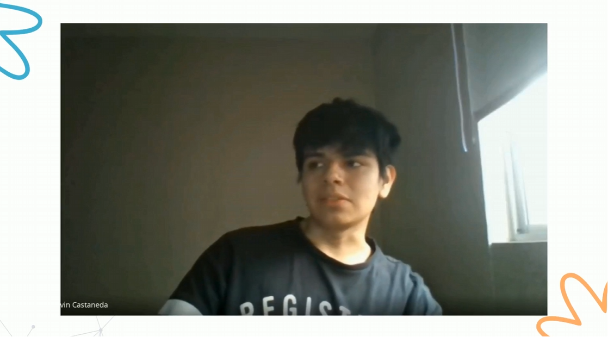

### 2.2.2. Registro de Entrevistas

### Segmento 1: Arrendadores (Administradores de propiedades)

#### Entrevista 1

| **Campo** | **Detalle** |
| --- | ---|
| | Enlace: [https://upcedupe-my.sharepoint.com/:v:/g/personal/u20221b178_upc_edu_pe/IQDwQoPzna4aR7DQdkB41uIpAWqNVdp2TSAwU951AcLJ5tY](https://upcedupe-my.sharepoint.com/:v:/g/personal/u20221b178_upc_edu_pe/IQDwQoPzna4aR7DQdkB41uIpAWqNVdp2TSAwU951AcLJ5tY)  |
| **Entrevistado(a)**      | Salvatierra Arbierto, Erica |
| **Edad**              | 47 años  |
| **Rubro**             | Arrendadora, Dueña de Bodega |
| **Ubicación**         | Breña, Lima |
| **Medio**             | Presencial  |
| **Entrevistador**     | Peña Riofrio, Maria Fernanda  |
| **Instante inicio**   | 00:22:40   |
| **Duración**          | 9 min 40 seg |
| **Resumen**           | La señora Erika nos cuenta que su trabajo principal es ser dueña de una bodega, pero gracias a esos ingresos, tiene 2 propiedades a su nombre. Erika trabaja de manera independiente y actualmente administra los pagos con sus inquilinos mes a mes, además de realizar un chequeo cada 3 meses. Nos comenta que, si ocurre algún incidente, su principal medio de comunicación con los inquilinos es WhatsApp, aunque en casos urgentes utilizan llamadas telefónicas. También menciona que le gustaría visitar con más frecuencia las viviendas, pero el tiempo entre ella y los inquilinos lo dificulta. Considera muy útil recibir alertas automáticas, ya que le facilitaría comunicarse con personal externo para solucionar problemas en los departamentos. Esto también le ayudaría a conocer mejor el estado de las viviendas y optimizar su tiempo para dedicarlo a otras actividades.  **Características del Arquetipo (Datos Recolectados):** - **Personalidad:** Responsable, organizada, tradicional y muy práctica. - **Marcas e Influencias:** Influenciada por recomendaciones familiares; utiliza bancos locales (BCP, Interbank) para recaudación. - **Tecnología y Dispositivos:** Smartphone de gama media (Samsung Galaxy) y Laptop básica de casa. - **Canales de Interacción:** Mensajería instantánea (WhatsApp) y llamadas telefónicas directas. - **Browser:** Google Chrome (versión móvil y de escritorio).  |

### Entrevista 2 

| **Campo** | **Detalle** |
| --- | --- |
|  | Enlace: [https://upcedupe-my.sharepoint.com/:v:/g/personal/u20221b178_upc_edu_pe/IQDwQoPzna4aR7DQdkB41uIpAWqNVdp2TSAwU951AcLJ5tY](https://upcedupe-my.sharepoint.com/:v:/g/personal/u20221b178_upc_edu_pe/IQDwQoPzna4aR7DQdkB41uIpAWqNVdp2TSAwU951AcLJ5tY)  |
| **Entrevistado(a)**      | Canahuiri Frisancho, Yoselin Mijayra |
| **Edad**              | 25 años  |
| **Rubro**             | Arrendadora, Dueña de 4 propiedades |
| **Ubicación**         | Surco, Lima |
| **Medio**             | Virtual  |
| **Entrevistador**     | Castañeda Llanos, Kevin Alexander  |
| **Instante inicio**   | 00:31:43   |
| **Duración**          | 6 min 20 seg |
| **Resumen**           | Yoselin Canahuiri es una arrendadora independiente que gestiona cuatro propiedades en Lima. Para mantener la comunicación con sus inquilinos, utiliza mayormente WhatsApp, reservando las llamadas para situaciones de urgencia. Aunque suele visitar sus inmuebles una vez al mes, reconoce que le gustaría tener una mayor frecuencia para supervisar su estado, pero su agenda actual se lo impide. Valora positivamente el uso de alertas automáticas, ya que le facilitarían una respuesta más rápida ante posibles incidentes. Además, considera que recibir notificaciones sobre el estado de sus propiedades le permitiría gestionar mejor su tiempo y optimizar sus visitas presenciales.  **Características del Arquetipo (Datos Recolectados):** - **Personalidad:** Proactiva, multitarea, ocupada y abierta a la innovación digital. - **Marcas e Influencias:** Usuaria activa de redes sociales e influenciada por tendencias PropTech y herramientas de productividad (Notion, Google Workspace). - **Tecnología y Dispositivos:** iPhone 14 y MacBook Air. - **Canales de Interacción:** Redes sociales, correo electrónico corporativo y WhatsApp de trabajo. - **Browser:** Safari (en móvil) y Google Chrome (en laptop). | 

 

## Segmento 2: Arrendatarios (Inquilinos de propiedades)

### Entrevista 1

| **Campo** | **Detalle** |
| --- | --- |
|  |  Enlace: [https://upcedupe-my.sharepoint.com/:v:/g/personal/u20221b178_upc_edu_pe/IQDwQoPzna4aR7DQdkB41uIpAWqNVdp2TSAwU951AcLJ5tY](https://upcedupe-my.sharepoint.com/:v:/g/personal/u20221b178_upc_edu_pe/IQDwQoPzna4aR7DQdkB41uIpAWqNVdp2TSAwU951AcLJ5tY)  |
| **Entrevistado(a)**      | Diaz Fiestas, Jorge Luis |
| **Edad**              | 26 años  |
| **Rubro**             | Ing. Sistemas |
| **Ubicación**         | Lince, Lima |
| **Medio**             |  Google Meet |
| **Entrevistador**     | Ramirez Tello, Sebastian  |
| **Instante inicio**   | 00:00:10   |
| **Duración**          | 5 min 15 seg |
| **Resumen**           | Luis trabaja bajo una modalidad híbrida y reside en una vivienda alquilada desde hace tres años. Debido a su perfil, utiliza hojas de cálculo en Excel para registrar sus gastos en servicios básicos. Reconoce que el ingreso manual representa una limitación por errores u omisiones. Manifestó preocupación por la dificultad de detectar incrementos inusuales en agua y electricidad antes de recibir la facturación. Expresó gran interés en contar con notificaciones automáticas ante consumos excesivos para evitar gastos innecesarios. Asimismo, destacó la posibilidad de controlar dispositivos relacionados con el consumo energético, como iluminación inteligente, directamente desde una aplicación móvil para optimizar los recursos de su vivienda.  **Características del Arquetipo (Datos Recolectados):** - **Personalidad:** Metódico, analítico, estructurado y orientado al ahorro financiero. - **Marcas e Influencias:** Microsoft (Excel), comunidades open-source, marcas de gadgets como Sonoff o Philips Hue. - **Tecnología y Dispositivos:** Laptop Asus ROG (Trabajo/Gaming) y Smartphone Samsung. - **Canales de Interacción:** Mensajería (Slack/WhatsApp), plataformas Git y entornos virtuales corporativos. - **Browser:** Mozilla Firefox (por privacidad) y Google Chrome. |

---

#### Entrevista 2 

| **Campo** | **Detalle** |
| --- | --- |
|  | Enlace: [https://upcedupe-my.sharepoint.com/:v:/g/personal/u20221b178_upc_edu_pe/IQDwQoPzna4aR7DQdkB41uIpAWqNVdp2TSAwU951AcLJ5tY](https://upcedupe-my.sharepoint.com/:v:/g/personal/u20221b178_upc_edu_pe/IQDwQoPzna4aR7DQdkB41uIpAWqNVdp2TSAwU951AcLJ5tY)  |
| **Entrevistado(a)**      | Castro Soto, Diego |
| **Edad**              | 25 años  |
| **Rubro**             | Ing. Software |
| **Ubicación**         | Jesus María, Lima |
| **Medio**             |  Zoom |
| **Entrevistador**     | O'Higgins Rosales, Andrea  |
| **Instante inicio**   | 00:05:28   |
| **Duración**          | 5 min 33 seg |
| **Resumen**           | Diego reside solo y se desempeña como practicante, lo que lo hace sensible al control de gastos. Reconoce que no lleva una gestión estructurada de agua y luz, recurriendo a estimaciones mentales y revisando la factura digital por correo electrónico. Relató un incidente con una filtración de tubería que pasó desapercibida hasta impactar el recibo, evidenciando la falta de detección temprana. Olvidar dispositivos encendidos o el uso del aire acondicionado son hábitos difíciles de controlar para él. Cuenta con experiencia previa básica en apps de automatización Wi-Fi (luces inteligentes). Muestra una disposición positiva hacia una app móvil de gestión de consumos IoT y considera que las notificaciones push en tiempo real serían la funcionalidad más útil.  **Características del Arquetipo (Datos Recolectados):** - **Personalidad:** Descomplicado, tecnófilo, propenso a olvidos y muy consciente de su presupuesto limitado. - **Marcas e Influencias:** Ecosistemas de Google Home, marcas accesibles (Tuya Smart, Xiaomi). - **Tecnología y Dispositivos:** Laptop Lenovo ThinkPad y Smartphone POCO (Android). - **Canales de Interacción:** Correo electrónico (recibo digital), notificaciones push y redes de mensajería. - **Browser:** Google Chrome (con sincronización móvil completa). |

---
#### Entrevista 3

| **Campo** | **Detalle** |
| --- | ---|
|  > | Enlace: [https://upcedupe-my.sharepoint.com/:v:/g/personal/u20221b178_upc_edu_pe/IQDwQoPzna4aR7DQdkB41uIpAWqNVdp2TSAwU951AcLJ5tY](https://upcedupe-my.sharepoint.com/:v:/g/personal/u20221b178_upc_edu_pe/IQDwQoPzna4aR7DQdkB41uIpAWqNVdp2TSAwU951AcLJ5tY) |
| **Entrevistado(a)** | Pedraza, Joaquín |
| **Edad** | 25 años |
| **Rubro** | Desarrollador Web |
| **Ubicación** | San Miguel, Lima |
| **Medio** | Virtual |
| **Entrevistador** | Muñoz Vilcapoma, Mauricio |
| **Instante inicio** | 00:11:00 |
| **Duración** | 10 min 57 seg |
| **Resumen** | Joaquín reside con su madre en un departamento alquilado. Comparten la gestión económica y registran los gastos mediante Excel y notas. Menciona problemas como el olvido de pagos (el internet el primer mes), cobros elevados injustificados de luz y fallas de servicios básicos. Muestra alto entusiasmo por una solución móvil que centralice las alertas y permita apagados remotos de luces o televisores, aunque le preocupa una potencial inestabilidad en la conexión de los dispositivos inteligentes.  **Características del Arquetipo (Datos Recolectados):** - **Personalidad:** Colaborativo, detallista, preventivo pero con escepticismo técnico constructivo. - **Marcas e Influencias:** Herramientas de desarrollo (GitHub, Vercel), plataformas streaming (Netflix) y servicios fintech (Yape/Plin). - **Tecnología y Dispositivos:** MacBook Pro de desarrollo y iPhone 13. - **Canales de Interacción:** Canales digitales, grupos de WhatsApp familiares y recordatorios móviles. - **Browser:** Brave Browser y Google Chrome Canary. |