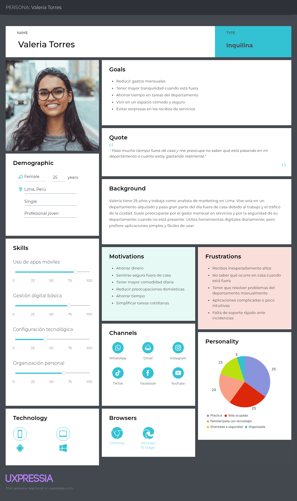
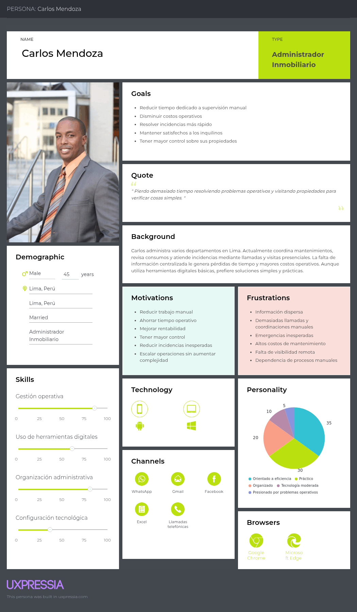

### 2.3.1. User Personas

Las fichas de User Persona presentadas a continuación no constituyen perfiles ideales aislados, sino arquetipos de diseño sintetizados directamente a partir de los datos cuantitativos y cualitativos obtenidos en el **Análisis de Entrevistas (Sección 2.2.3)** y el **Análisis de la Competencia (Sección 2.1.1)**:

* **Sustento del Análisis de Entrevistas:** El perfil de Valeria Torres (Arrendataria) absorbe directamente la realidad del 100% de los inquilinos que experimentan frustración por cobros elevados y el 66.67% que ha sufrido filtraciones de agua desapercibidas (rasgos extraídos de Diego y Joaquín). El perfil de Carlos Mendoza (Arrendador) consolida la necesidad del 100% de la muestra de administradores de optimizar el tiempo ante agendas saturadas y depender críticamente de canales como WhatsApp (rasgos de Yoselin y Erica).

* **Alineamiento con el Análisis Competitivo:** Al identificar que competidores como *Savant* se enfocan de manera exclusiva en mercados de lujo inaccesibles y *SmartRent* carece de presencia local y adaptabilidad de costos para la región, ambos arquetipos se han diseñado reflejando usuarios latinoamericanos que exigen optimización de costos y retornos de inversión basados en la eficiencia energética y operativa de bajo costo.

Las fichas permiten comprender las características, objetivos, motivaciones, frustraciones, hábitos tecnológicos y comportamiento digital de los usuarios más representativos del ecosistema inmobiliario abordado por la solución. Asimismo, facilitan la toma de decisiones relacionadas con la experiencia de usuario, funcionalidades prioritarias y enfoque general del producto.

Para la construcción de los User Persona se consideraron factores como:

- Rutinas y estilo de vida de los usuarios
- Nivel de adopción tecnológica
- Necesidades operativas y domésticas
- Canales de comunicación más utilizados
- Problemas frecuentes asociados a seguridad, monitoreo y gestión inmobiliaria
- Motivaciones y frustraciones identificadas durante el proceso de needfinding
- Contexto social y tecnológico del entorno peruano

Los segmentos objetivo considerados son los siguientes:

1. **Valeria Torres** – Arrendataria
2. **Carlos Mendoza** – Arrendador

#### User Persona – Valeria Torres

Valeria Torres representa el segmento de jóvenes profesionales que alquilan departamentos en Lima Metropolitana y buscan mayor tranquilidad, comodidad y control sobre su hogar. Este perfil se caracteriza por mantener una rutina urbana acelerada, utilizar herramientas digitales diariamente y valorar soluciones simples que permitan optimizar tiempo, reducir preocupaciones y evitar gastos inesperados relacionados con servicios y seguridad del inmueble.

#### User Persona – Carlos Mendoza

Carlos Mendoza representa el segmento de administradores inmobiliarios responsables de supervisar múltiples propiedades y coordinar operaciones relacionadas con mantenimiento, incidencias y atención a inquilinos. Este perfil prioriza la eficiencia operativa, la reducción de costos y el acceso rápido a información centralizada que le permita tomar decisiones y gestionar propiedades de manera más práctica y organizada.

