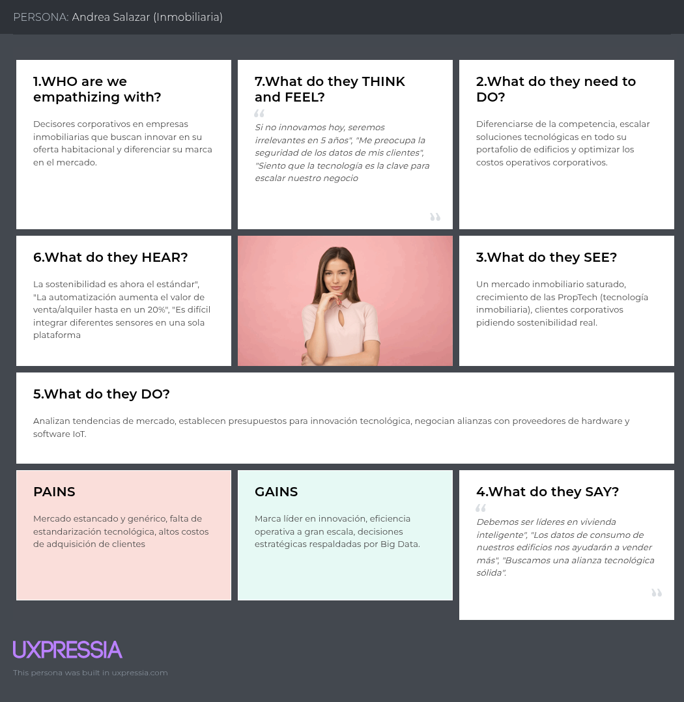

### 2.3.4. Empathy Mapping

En esta sección se presentan los mapas de empatía para nuestros tres segmentos objetivo, elaborados mediante la herramienta UXPressia. Estos artefactos nos permiten profundizar en el entorno, comportamiento, aspiraciones y preocupaciones de nuestros usuarios, asegurando que la solución **Nexora** esté alineada con su realidad emocional y operativa.

#### Mapa de Empatía – Valeria Torres (Inquilina)

Valeria representa a los arrendatarios jóvenes que buscan independencia, ahorro y modernidad en su hogar. A continuación, se presenta su mapa de empatía detallando lo que ve, oye, piensa, siente, hace y dice, junto con sus dolores y ganancias.

---

#### Mapa de Empatía – Carlos Mendoza (Administrador/Propietario)

Carlos representa a quienes gestionan múltiples propiedades y buscan optimizar su rentabilidad y tiempo mediante el monitoreo remoto y la prevención de incidencias.

---

#### Mapa de Empatía – Andrea Salazar (Empresa Inmobiliaria)

Andrea representa el enfoque estratégico B2B que busca diferenciar su oferta en un mercado competitivo mediante la adopción de tecnologías IoT y escalabilidad.

