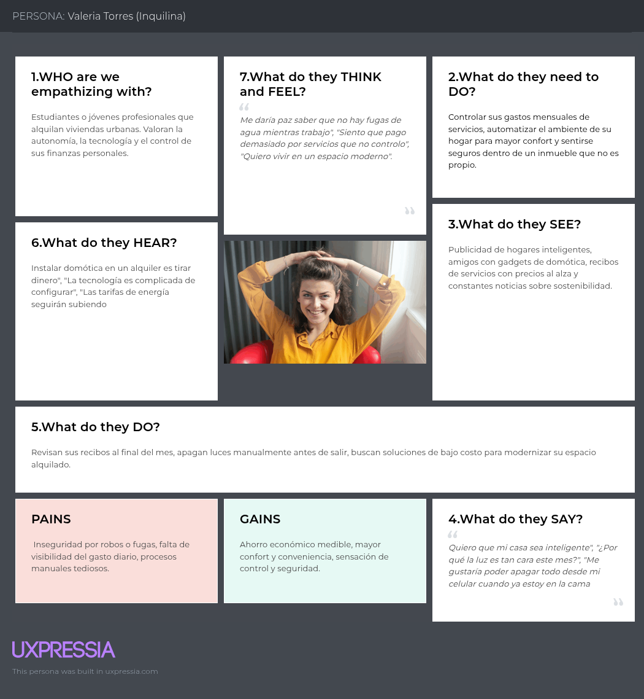
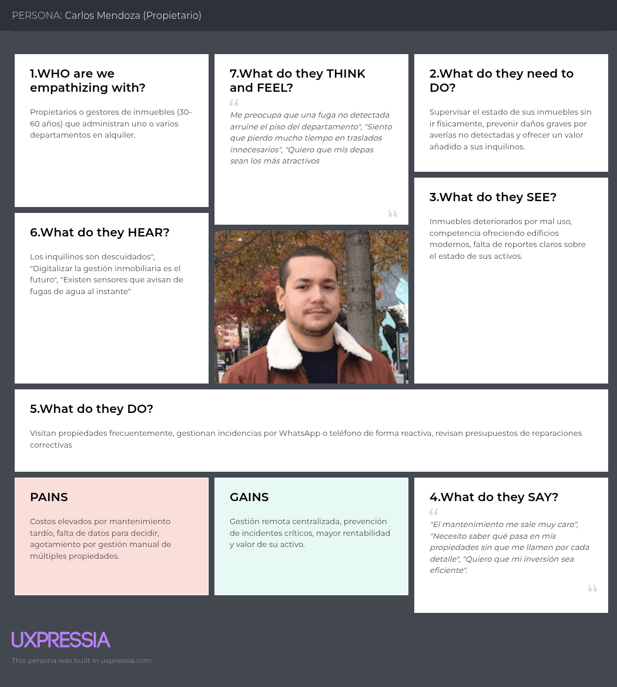

### 2.3.4. Empathy Mapping

Para la construcción de los mapas de empatía, el equipo de desarrollo de NexIoT llevó a cabo una sesión de diseño colaborativo utilizando la herramienta UXPressia. El proceso se ejecutó bajo las siguientes fases metodológicas:

1. **Preparación y Contextualización:** Se recolectaron los hallazgos empíricos del *Análisis de Entrevistas* y los perfiles de los *User Personas* previamente consolidados, posicionando el arquetipo en el núcleo del artefacto para delimitar claramente con quién se estaba empatizando.

2. **Mapeo de Estímulos y Comportamientos:** El equipo distribuyó observaciones cualitativas respondiendo de manera estricta a los cuadrantes de comportamiento: ¿Qué ve en su entorno urbano?, ¿Qué escucha de sus círculos cercanos?, ¿Qué hace y dice en su cotidianidad?, y ¿Qué piensa o siente realmente en su subconsciente?

3. **Identificación de Pains y Gains:** Se definieron los dolores (*Pains*) basándose en qué le preocupa, qué le quita el tiempo o qué le genera incertidumbre económica. Asimismo, se estructuraron las ganancias (*Gains*) respondiendo a qué elementos facilitarían su vida, qué aliviaría sus fricciones operativas y qué características clave los convencerían de que Nexora es la alternativa correcta para su día a día.

---

#### Mapa de Empatía – Valeria Torres (Inquilina)

Valeria representa a los arrendatarios jóvenes que buscan independencia, ahorro y modernidad en su hogar. A continuación, se presenta su mapa de empatía detallando lo que ve, oye, piensa, siente, hace y dice, junto con sus dolores y ganancias.

---

#### Mapa de Empatía – Carlos Mendoza (Propietario)

Carlos representa a quienes gestionan múltiples propiedades y buscan optimizar su rentabilidad y tiempo mediante el monitoreo remoto y la prevención de incidencias.

