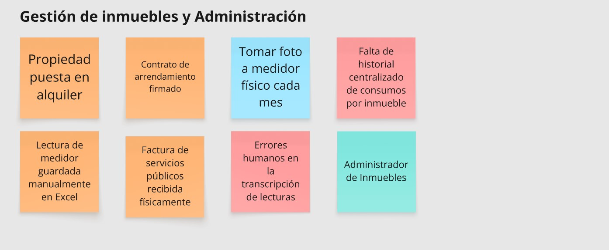
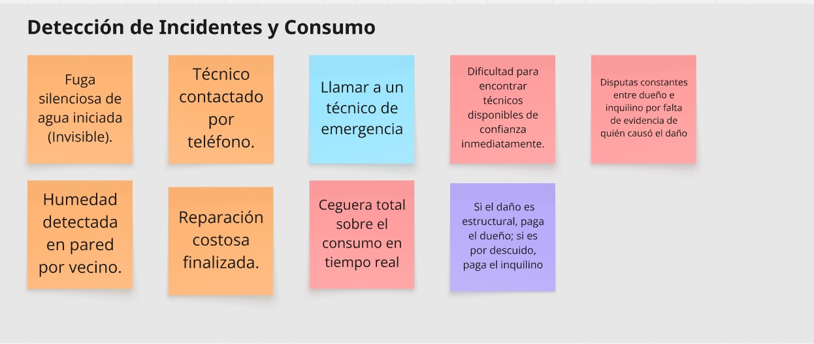
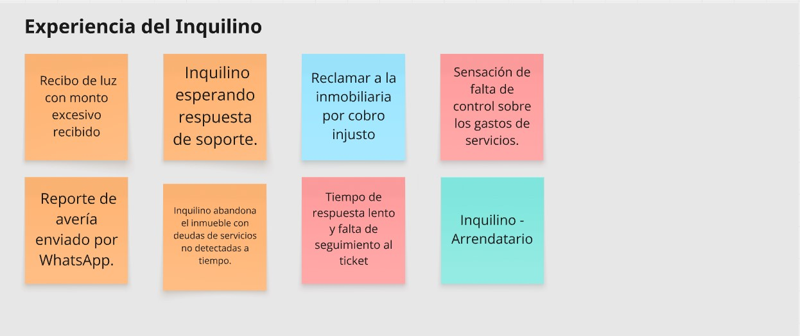

# 2.4. Big Picture EventStorming

En esta sección, el equipo presenta el modelado de **Big Picture EventStorming** enfocado en la fase de **Needfinding**. A diferencia de un modelado de solución, este proceso se centra en el "Problem Space", mapeando la situación actual de los arrendadores e inquilinos sin la intervención de la plataforma Nexora. El objetivo es identificar los cuellos de botella, ineficiencias y puntos de dolor que justifican el desarrollo de nuestra solución IoT.

### Descripción de la sesión
La sesión se realizó de forma colaborativa utilizando **Miro**, con una duración de 2 horas. El equipo se dividió en roles de expertos de dominio y stakeholders para simular el flujo actual de gestión de inmuebles. Se priorizó la identificación de **Hotspots** (post-its rojos) para resaltar dónde el modelo tradicional falla en la detección de fugas o en la transparencia del consumo energético.

### Objetivos de la Actividad
*   **Comprensión del Problema:** Visualizar el ciclo de vida actual de un alquiler y cómo se gestionan los incidentes críticos de forma reactiva.
*   **Identificación de Puntos de Dolor:** Exponer los "Hotspots" donde la falta de datos en tiempo real genera pérdidas económicas y conflictos entre las partes.
*   **Descubrimiento de Oportunidades:** Validar que la automatización y el monitoreo IoT resolverían los cuellos de botella detectados en la comunicación y el mantenimiento.

### Modelado por Carriles (Swimlanes)

#### Carril 1: Gestión de Inmuebles y Administración (Arrendador e Inmobiliaria)
Este carril detalla el flujo administrativo tradicional. Se observa una fuerte dependencia de procesos manuales, como la toma de fotos a medidores físicos y el registro en hojas de cálculo, lo que genera una alta probabilidad de error humano y falta de datos históricos confiables.

**Nota.** Mapeo de la gestión administrativa actual y procesos de mantenimiento correctivo.

#### Carril 2: El Ciclo de las Averías y el Gasto (Incidentes y Consumo)
Muestra la "ceguera" operativa del modelo actual. Los eventos reflejan cómo una fuga de agua o un consumo excesivo de energía pasan desapercibidos durante semanas, convirtiéndose en incidentes solo cuando el daño físico es evidente o el recibo llega con montos impagables.

**Nota.** Flujo de detección reactiva de problemas y el impacto económico de las fugas no detectadas.

#### Carril 3: Experiencia del Inquilino (Arrendatario)
Se enfoca en la frustración del usuario final. Los eventos muestran la incertidumbre ante cobros elevados y la dificultad para comunicarse con la inmobiliaria. La falta de control sobre sus propios gastos de servicios es el principal punto de fricción identificado en este carril.

**Nota.** Percepción del inquilino ante la falta de transparencia en los consumos y la lentitud en el soporte.

### Conclusiones del EventStorming
El taller permitió concluir que el modelo actual es **excesivamente reactivo**. Los principales Hotspots identificados se centran en la demora de detección de anomalías y en la desconfianza mutua entre arrendador e inquilino por la falta de evidencia basada en datos. Nexora atacará estos puntos transformando el mantenimiento correctivo en preventivo y otorgando transparencia total a través del monitoreo IoT en tiempo real.
