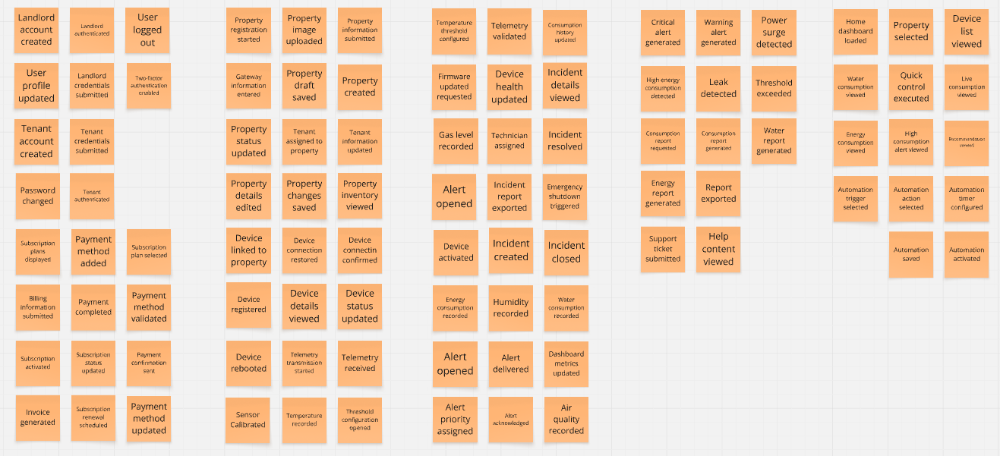
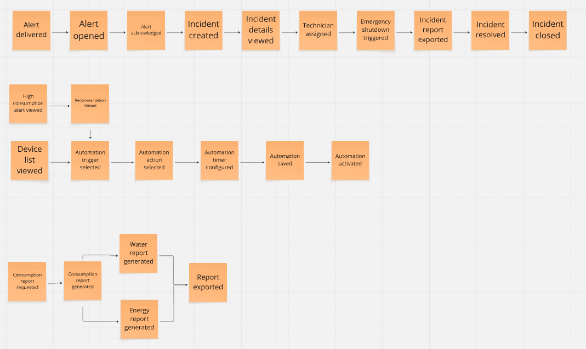
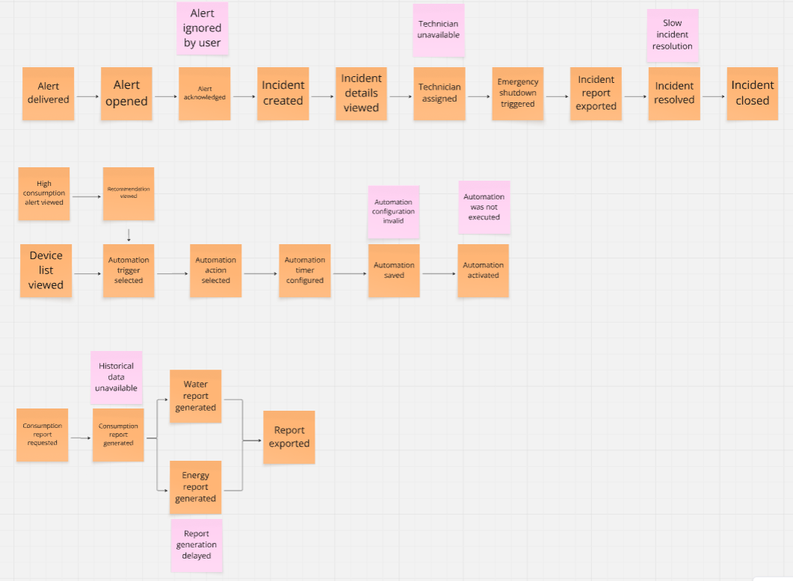
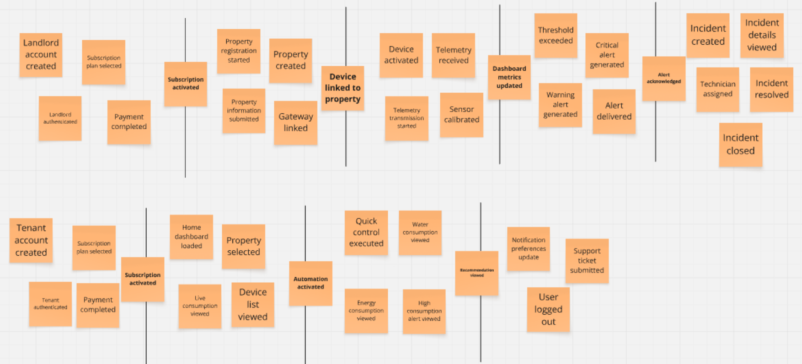
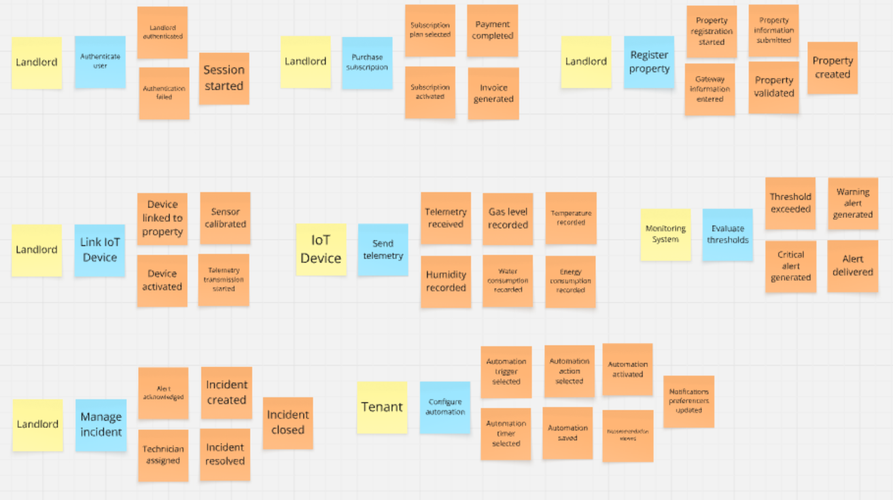
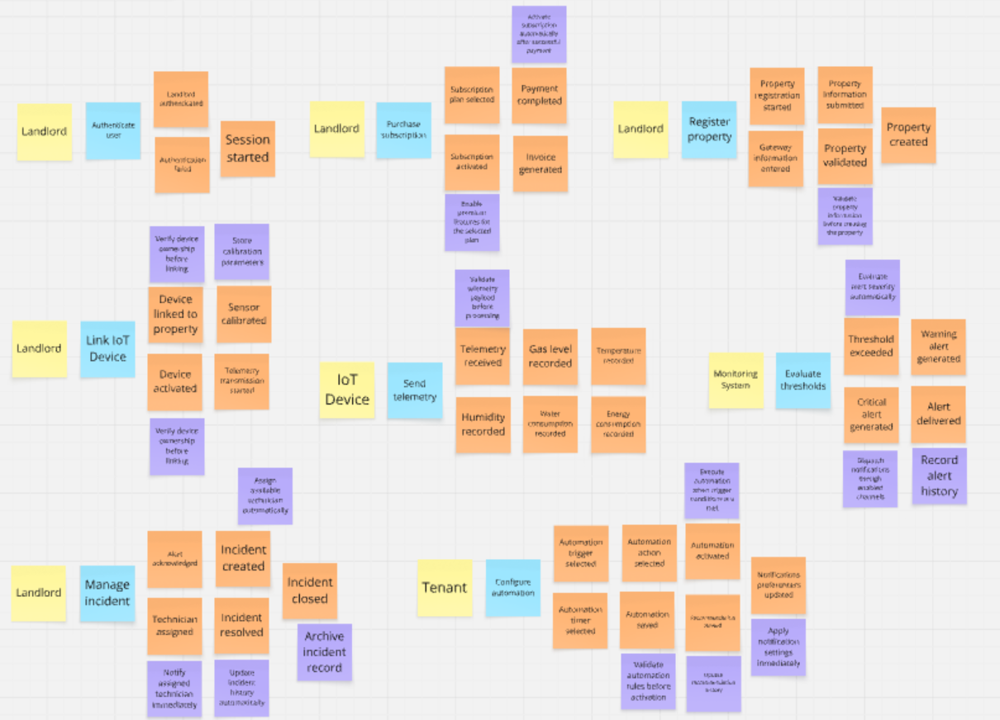
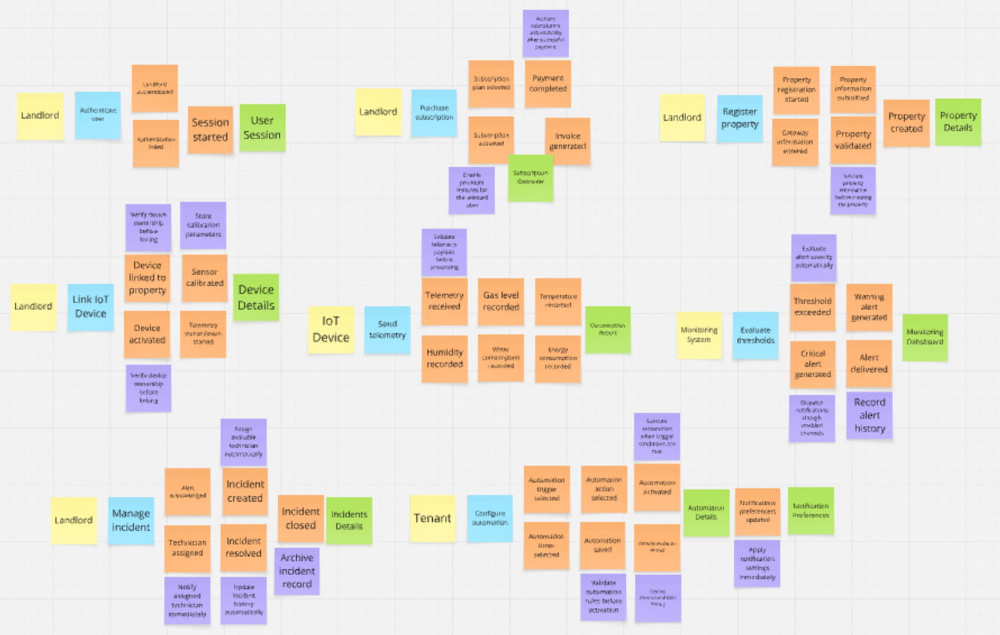
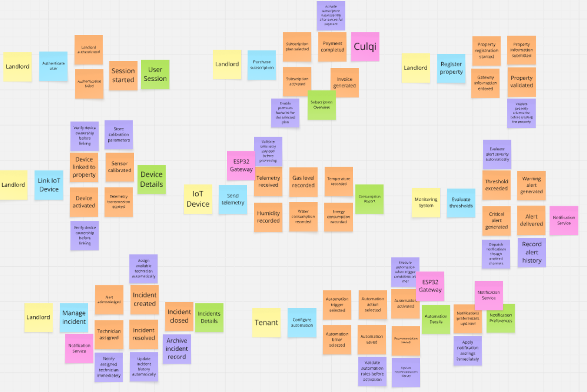
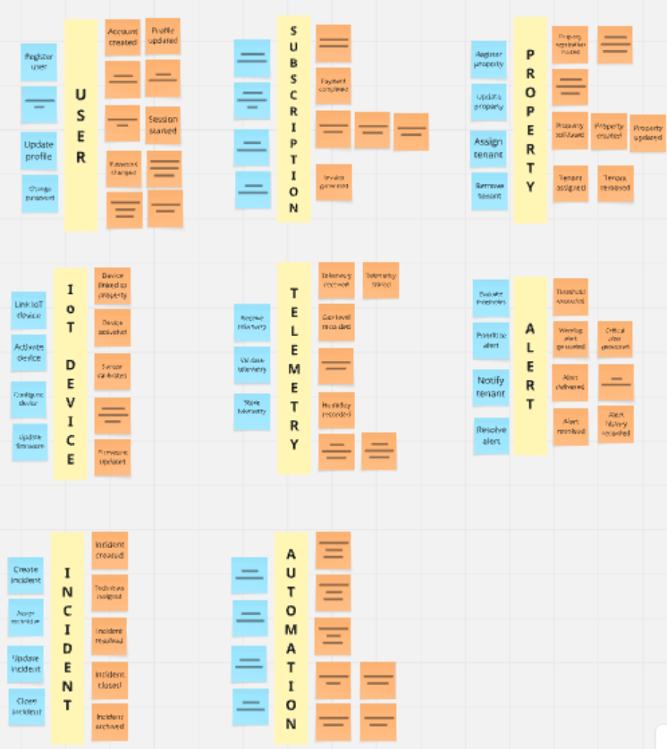
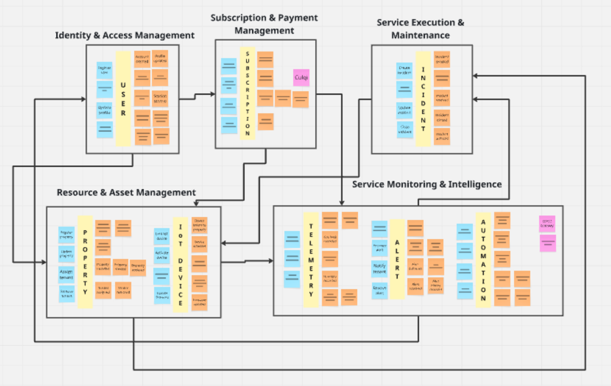

## 2.4. Big Picture EventStorming

El **Big Picture EventStorming** es una técnica de modelado colaborativo que permite comprender el comportamiento del dominio a través de la identificación cronológica de eventos de negocio. En el contexto de **Nexora**, esta metodología permitió representar el flujo completo de la plataforma, desde el registro de usuarios y propiedades hasta el monitoreo inteligente, la gestión de incidentes y la ejecución de automatizaciones IoT.

Gracias a este proceso, fue posible identificar los principales procesos del negocio, las reglas que gobiernan el sistema, las integraciones con servicios externos y las responsabilidades de cada contexto delimitado, sirviendo como base para el diseño estratégico basado en Domain-Driven Design (DDD).

**Enlace de acceso a Miro (Big Picture EventStorming):**

[https://miro.com/welcomeonboard/Nmpsc21Zd1g3VmI4OHFtem42WW1aYXNwUmRLOUpJeUF4RFM4RFVBcy9qcXdjelZTcGttUW5Fb1VycUY2dDVHa3hOWU1mNUpoZm9UcmxxcHNUMkQ0SDRXZEVjK2VFRjB6OXpDT0pqQ0xNREhnZzZ3QzRVUmJQQU55MXllcm9HeUVBS2NFMDFkcUNFSnM0d3FEN050ekl3PT0hdjE=?share_link_id=325946189300](https://miro.com/welcomeonboard/Nmpsc21Zd1g3VmI4OHFtem42WW1aYXNwUmRLOUpJeUF4RFM4RFVBcy9qcXdjelZTcGttUW5Fb1VycUY2dDVHa3hOWU1mNUpoZm9UcmxxcHNUMkQ0SDRXZEVjK2VFRjB6OXpDT0pqQ0xNREhnZzZ3QzRVUmJQQU55MXllcm9HeUVBS2NFMDFkcUNFSnM0d3FEN050ekl3PT0hdjE=?share_link_id=325946189300)

---

### Step 1: Unstructured Exploration

En esta etapa se identificaron todos los eventos relevantes del dominio sin seguir un orden específico. Los eventos fueron definidos en tiempo pasado, siguiendo las convenciones de EventStorming, e incluyen los principales procesos de la plataforma como el registro de arrendadores e inquilinos, la administración de propiedades, la gestión de suscripciones, el monitoreo de dispositivos IoT, la generación de alertas, las automatizaciones y la gestión de incidentes.

Esta exploración permitió obtener una visión completa del dominio antes de estructurar los diferentes procesos de negocio.

---

### Step 2: Timelines

Los eventos identificados fueron organizados en diferentes líneas de tiempo de acuerdo con los principales procesos del negocio. En lugar de construir un único flujo lineal, se definieron múltiples flujos independientes que representan procesos como el registro de usuarios, la administración de propiedades, la gestión de dispositivos IoT, el procesamiento de telemetría, las automatizaciones, las alertas y la atención de incidentes.

Esta organización permitió visualizar con mayor claridad cómo evolucionan los diferentes procesos dentro de la plataforma y cómo interactúan entre sí.

---

### Step 3: Pain Points

En este paso se identificaron los principales puntos de fricción presentes en los procesos del negocio. Estos representan situaciones donde pueden producirse errores, retrasos, pérdida de información o una experiencia deficiente para los usuarios.

La identificación de estos problemas permitió reconocer oportunidades de mejora relacionadas con la automatización, la disponibilidad del sistema, la confiabilidad de los datos y la capacidad de respuesta frente a incidentes.

---

### Step 4: Pivotal Points

Se identificaron los eventos más importantes que representan cambios significativos dentro de los procesos del negocio. Estos puntos marcan transiciones relevantes, como la activación de una suscripción, la validación de telemetría, la generación de alertas, la ejecución de automatizaciones o la creación de un incidente.

Los puntos críticos permiten dividir procesos complejos en etapas más fáciles de comprender y representan los momentos de mayor impacto dentro del dominio.

---

### Step 5: Commands

En esta etapa se incorporaron los comandos que representan las acciones ejecutadas por los usuarios o por el propio sistema para iniciar un proceso de negocio. Cada comando puede desencadenar uno o varios eventos del dominio, reflejando la relación entre las acciones realizadas y el comportamiento esperado del sistema.

Esto permitió establecer claramente cómo se originan los diferentes procesos dentro de Nexora.

---

### Step 6: Policies

Se agregaron las políticas de negocio encargadas de reaccionar automáticamente ante determinados eventos del dominio. Estas políticas incluyen validaciones, reglas de negocio, reintentos automáticos, generación de notificaciones, verificación de datos y otras acciones ejecutadas sin intervención directa del usuario.

Su incorporación permitió representar el comportamiento inteligente y automatizado de la plataforma.

---

### Step 7: Read Models

En este paso se identificaron las vistas de información que consumen los usuarios desde la aplicación web y la aplicación móvil. Estas representaciones permiten visualizar información como propiedades registradas, dispositivos IoT, alertas, incidentes, automatizaciones, consumo de recursos, reportes y suscripciones.

Los Read Models representan la información preparada para la consulta por parte de los diferentes actores del sistema.

---

### Step 8: External Systems

Se incorporaron los sistemas externos con los cuales Nexora interactúa para ofrecer sus funcionalidades. Entre ellos se encuentran los servicios encargados del procesamiento de pagos, el envío de notificaciones, la generación de recomendaciones mediante inteligencia artificial y otros proveedores utilizados durante la operación del sistema.

Este paso permitió identificar claramente los límites entre el dominio de Nexora y las plataformas externas.

---

### Step 9: Aggregates

Los eventos del dominio fueron agrupados alrededor de los principales **Aggregates**, los cuales representan las entidades encargadas de mantener la consistencia del negocio dentro de cada contexto.

Entre los Aggregates identificados se encuentran **User**, **Subscription**, **Property**, **IoT Device**, **Telemetry**, **Alert**, **Automation** e **Incident**, cada uno responsable de encapsular el comportamiento asociado a un área específica del dominio.

---

### Step 10: Bounded Contexts

Finalmente, los Aggregates fueron organizados dentro de sus respectivos **Bounded Contexts**, definiendo los límites funcionales del dominio de Nexora y las relaciones existentes entre ellos.

Como resultado se obtuvieron los siguientes contextos delimitados:

- Identity & Access Management
- Subscription & Payment Management
- Resource & Asset Management
- Service Monitoring & Intelligence
- Service Execution & Maintenance

Esta organización permitió establecer una separación clara de responsabilidades entre los distintos módulos del sistema y sirvió como base para el diseño estratégico de la arquitectura basada en Domain-Driven Design.

