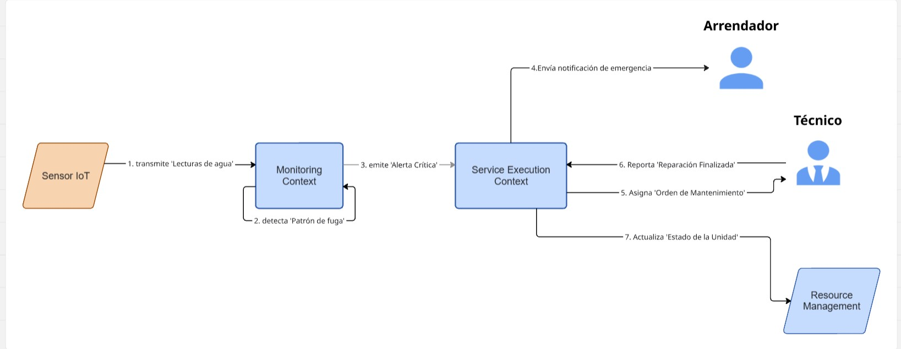
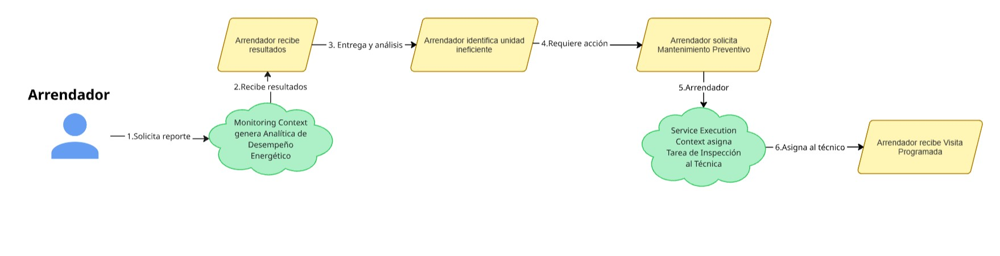

#### 4.1.1.2 Domain Message Flows Modeling

En esta sección se visualiza la colaboración entre los contextos definidos a través de historias que resuelven problemas reales del negocio. Se han elaborado dos diagramas principales utilizando la técnica de **Domain Storytelling**:

### Escenario 1: Respuesta ante Emergencias (Fuga de Agua)
Este flujo representa el valor principal de Nexora: la capacidad de actuar sin intervención humana inicial para mitigar daños.

1.  **Sensor IoT** transmite lecturas de agua en tiempo real al **Monitoring Context**.
2.  **Monitoring Context** detecta un patrón de fuga analizando los datos (Auto-colaboración).
3.  **Monitoring Context** emite una **Alerta Crítica** hacia el **Service Execution Context**.
4.  **Service Execution Context** envía una **Notificación de Emergencia** al **Arrendador**.
5.  **Service Execution Context** asigna automáticamente una **Orden de Mantenimiento** al **Técnico**.
6.  **Técnico** reporta la **Reparación Finalizada** al sistema.
7.  **Service Execution Context** actualiza el **Estado de la Unidad** en el contexto de **Resource Management**.

 

*Nota. Diagrama de Domain Storytelling: Flujo de respuesta ante fugas.*

### Escenario 2: Gestión de Controles y Optimización del Arrendador
Este flujo demuestra cómo el sistema empodera al administrador para tomar decisiones basadas en datos y optimizar el portafolio.

1.  El **Arrendador** solicita un **Reporte de Consumo Global** al **Monitoring Context**.
2.  **Monitoring Context** procesa los datos y genera una **Analítica de Desempeño Energético**.
3.  El **Arrendador** recibe y analiza los resultados.
4.  El **Arrendador** identifica una unidad ineficiente y determina que requiere acción inmediata.
5.  El **Arrendador** solicita un **Mantenimiento Preventivo** a través del sistema.
6.  **Service Execution Context** procesa la solicitud y asigna una **Tarea de Inspección** al **Técnico**.
7.  El **Arrendador** recibe la confirmación de la **Visita Programada**.

 

*Nota. Diagrama de Domain Storytelling: Flujo de gestión y optimización de activos.*