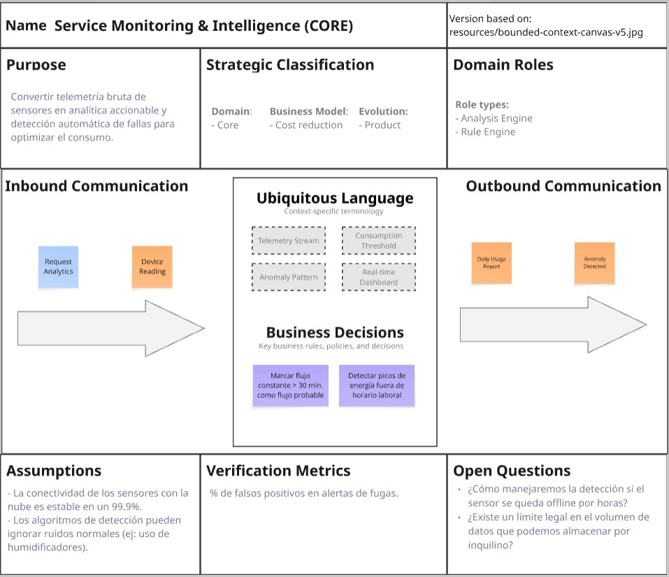
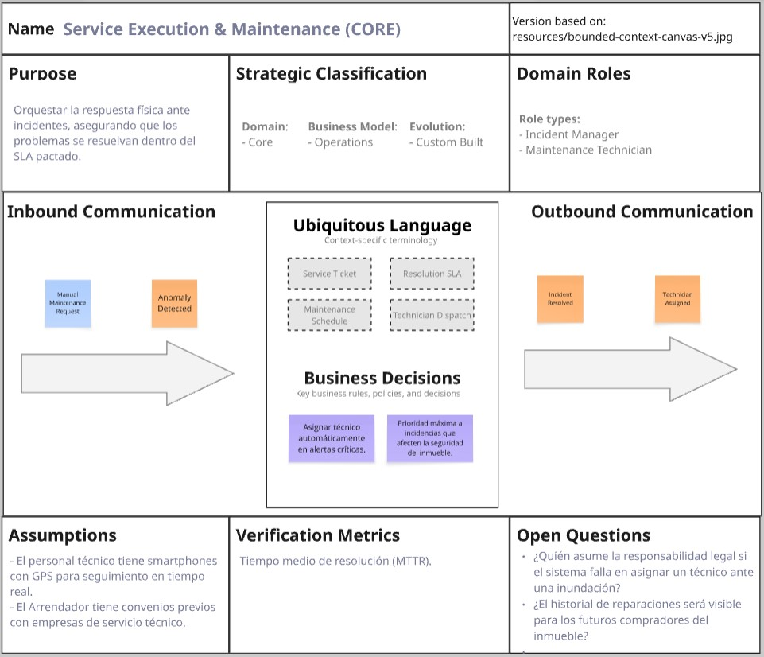
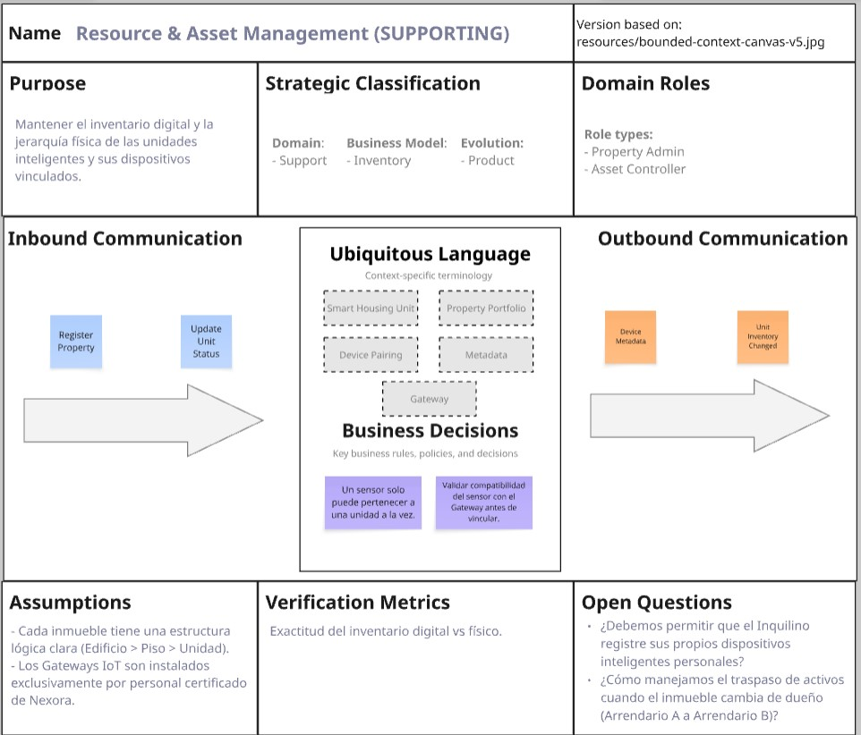
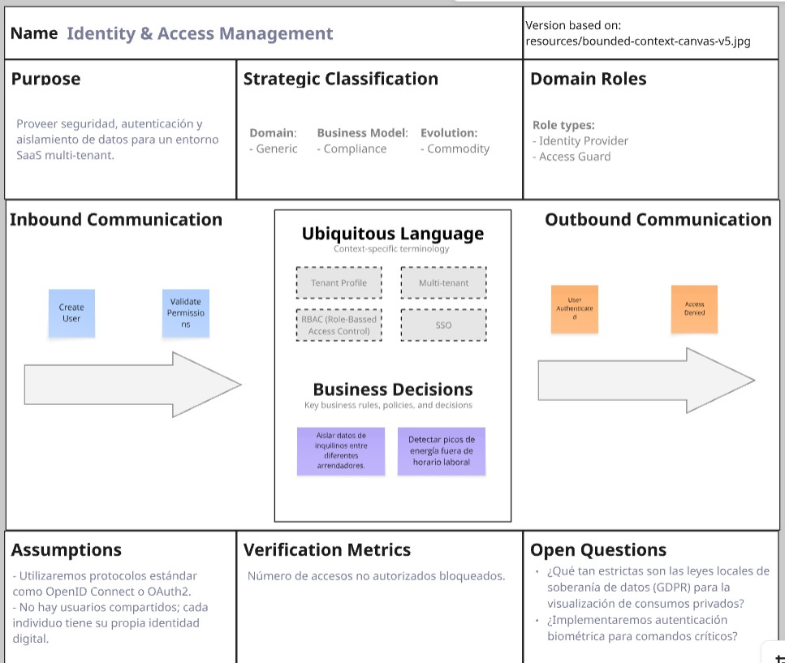
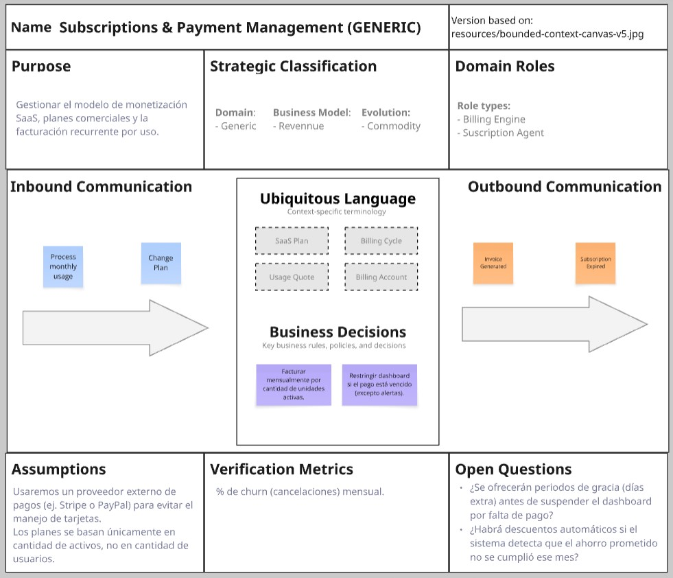

#### 4.1.1.3 Bounded Context Canvases

A continuación, se presentan los lienzos detallados para cada uno de los contextos identificados. Estos lienzos sirven como la "ficha técnica" que define los límites, responsabilidades y proyecciones de cada subsistema dentro de Nexora.

### Bounded Context Canvas: Service Monitoring & Intelligence
Contexto encargado de transformar la telemetría bruta de los sensores en analítica accionable y detección proactiva de fallas.

- **Strategic Classification:** Core Domain | Business Model: Cost Reduction | Evolution: Product.
- **Context Overview:** Motor de análisis en tiempo real enfocado en la eficiencia energética y seguridad hídrica.
- **Capabilities:** Telemetry Ingestion, Pattern Recognition, Consumption Analytics, Real-time Dashboarding.
- **Business Rules:**
    *   Una lectura de agua constante por más de 30 min sin picos se clasifica automáticamente como fuga probable.
    *   Los reportes de ahorro energético se consolidan cada 24 horas para su visualización.
- **Ubiquitous Language:** Telemetry Stream, Consumption Threshold, Anomaly Pattern, Intelligence Report.
- **Dependencies:** 
    *   *Inbound:* Metadatos de dispositivos desde Resource BC.
    *   *Outbound:* Alertas críticas a Service Execution BC.
- **Assumptions & Open Questions:**
    *   **Assumptions:** Conectividad constante de sensores; los algoritmos de filtrado pueden ignorar ruidos menores (ej. humificadores).
    *   **Open Questions:** ¿Cómo manejar la detección offline prolongada? ¿Existen límites legales en el volumen de datos históricos por inquilino?

---

 

### Bounded Context Canvas: Service Execution & Maintenance
Responsable de la operatividad física y la respuesta inmediata a incidentes técnicos.

- **Strategic Classification:** Core Domain | Business Model: Operations Efficiency | Evolution: Custom Built.
- **Context Overview:** Orquestación integral del ciclo de vida de incidencias y despacho técnico en campo.
- **Capabilities:** Ticket Lifecycle Management, Technical Dispatching, SLA Tracking, Maintenance Scheduling.
- **Business Rules:**
    *   Toda Alerta Crítica recibida debe generar una incidencia en el sistema en menos de 5 segundos.
    *   Las tareas de mantenimiento preventivo tienen prioridad alta según el tiempo de vida reportado del sensor.
- **Ubiquitous Language:** Critical Alert, Incident Ticket, Technician, Resolution SLA, Dispatch Order.
- **Dependencies:** 
    *   *Inbound:* Alertas desde Monitoring BC.
    *   *Outbound:* Actualización del estado de operatividad de la unidad a Resource BC.
- **Assumptions & Open Questions:**
    *   **Assumptions:** Técnicos cuentan con dispositivos móviles y GPS; existencia de convenios previos de servicio técnico.
    *   **Open Questions:** ¿Cuál es la responsabilidad legal ante fallas críticas de asignación? ¿El historial de reparaciones será público para futuros compradores?

---

 

### Bounded Context Canvas: Resource & Asset Management
Este contexto define la estructura física y técnica que sostiene la jerarquía de la plataforma.

- **Strategic Classification:** Supporting Domain | Business Model: Inventory Control | Evolution: Product.
- **Context Overview:** Gestión de la jerarquía de activos (Propiedades, Unidades) e inventario de hardware IoT vinculado.
- **Capabilities:** Assets Inventory Management, Device Commissioning, Physical Mapping, Status Tracking.
- **Business Rules:**
    *   Un sensor inteligente no puede estar vinculado a más de una Unidad Habitacional simultáneamente.
    *   El alta de un nuevo sensor requiere validación de compatibilidad con el Gateway local de la propiedad.
- **Ubiquitous Language:** Smart Housing Unit, Property Portfolio, Device Pairing, Metadata, Gateway.
- **Dependencies:** 
    *   *Outbound:* Provee el contexto físico y metadatos de sensores a Monitoring BC.
- **Assumptions & Open Questions:**
    *   **Assumptions:** Estructura jerárquica clara (Edificio > Piso > Unidad); Gateways instalados por personal certificado.
    *   **Open Questions:** ¿Debe el inquilino poder registrar dispositivos propios? ¿Cómo se maneja el traspaso de activos entre inmobiliarias?

---

 

### Bounded Context Canvas: Identity & Access Management
Garantiza la seguridad y la correcta segregación de datos en el entorno multi-tenant.

- **Strategic Classification:** Generic Domain | Business Model: Compliance & Security | Evolution: Commodity.
- **Context Overview:** Administración centralizada de identidades, perfiles y políticas de acceso granular.
- **Capabilities:** SSO Integration, Role-Based Access Control (RBAC), User Lifecycle Management, Multi-tenant Isolation.
- **Business Rules:**
    *   Los datos de consumos deben estar aislados lógicamente entre diferentes empresas inmobiliarias clientes.
    *   El acceso a comandos críticos (ej: cierre de válvulas) requiere un rol de nivel "Manager" o superior.
- **Ubiquitous Language:** Tenant Profile, Manager Role, Authentication Policy, Data Isolation, Identity Provider.
- **Dependencies:** 
    *   *Inbound:* Recibe solicitudes de autorización de todos los demás contextos (Cross-cutting).
- **Assumptions & Open Questions:**
    *   **Assumptions:** Uso de estándares industriales (OAuth2/OIDC); identidades únicas por individuo.
    *   **Open Questions:** ¿Cómo impacta la ley de protección de datos (GDPR) en la visualización de consumos privados?

---

 

### Bounded Context Canvas: Subscriptions & Payment Management
Maneja la monetización SaaS y el ciclo de facturación de la plataforma Nexora.

- **Strategic Classification:** Generic Domain | Business Model: Revenue Generation | Evolution: Commodity.
- **Context Overview:** Gestión del ciclo de vida de suscripciones corporativas y motor de facturación por uso (metered billing).
- **Capabilities:** Recurring Billing Management, Plan Provisioning, Payment Gateway Integration, Usage Metering.
- **Business Rules:**
    *   La facturación se realiza mensualmente basándose en la cantidad de Unidades Inteligentes activas en la cuenta.
    *   La falta de pago restringe el acceso al Dashboard analítico, pero mantiene activo el sistema de alertas críticas de seguridad.
- **Ubiquitous Language:** SaaS Plan, Billing Cycle, Usage Quota, Invoice, Subscription Tier.
- **Dependencies:** 
    *   *Inbound:* Consume métricas de uso y cantidad de activos desde Resource BC.
- **Assumptions & Open Questions:**
    *   **Assumptions:** Integración con un proveedor externo (Stripe/PayPal); facturación en formato digital estándar.
    *   **Open Questions:** ¿Existirán periodos de gracia por impago? ¿Habrá descuentos dinámicos basados en ahorros detectados?
