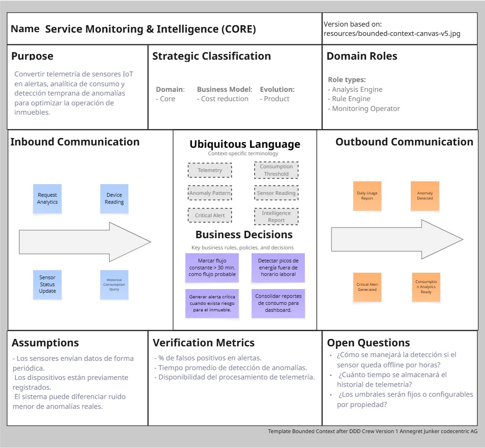
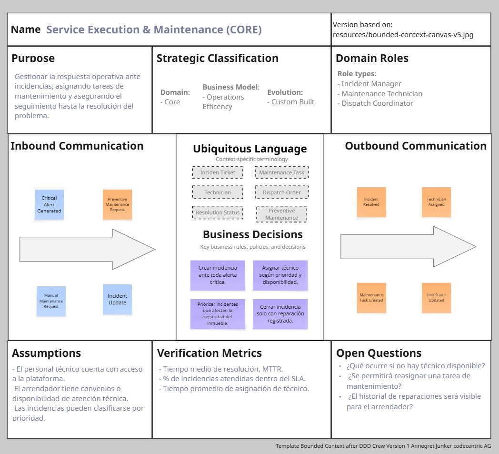
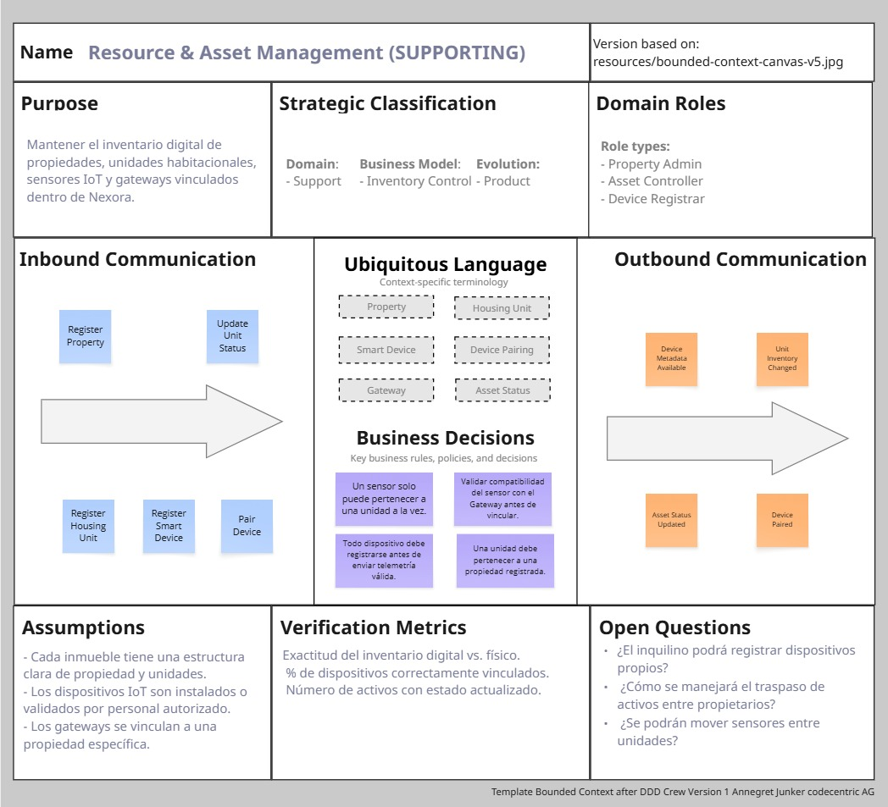
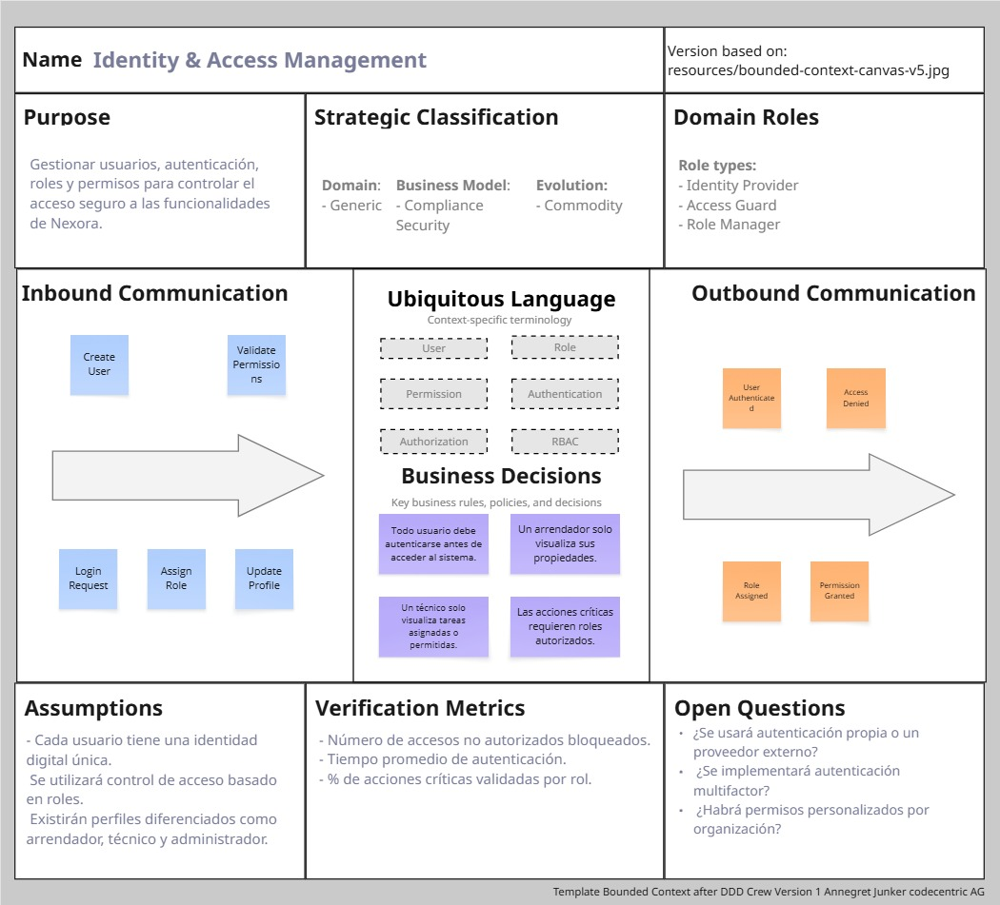
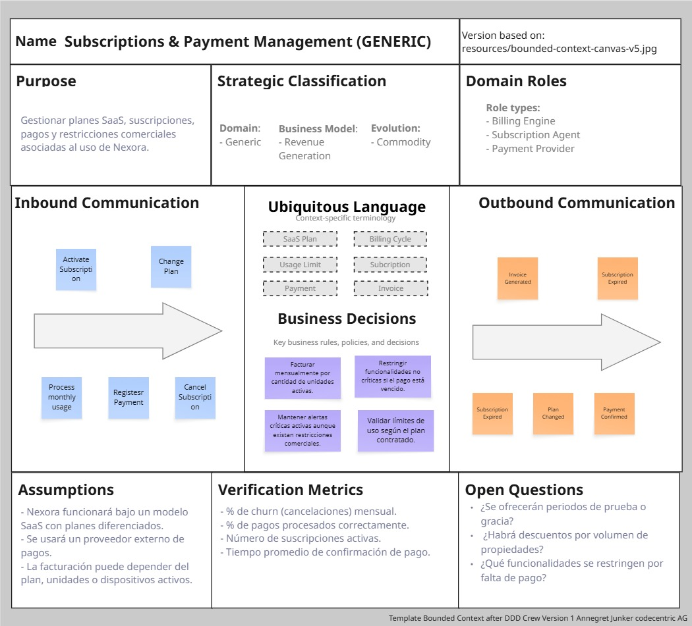

#### 4.1.1.3 Bounded Context Canvases

En esta sección se presentan los **Bounded Context Canvases** elaborados para los candidate bounded contexts identificados en la sesión de Candidate Context Discovery. El objetivo de estos canvases es detallar los criterios de diseño de cada contexto, considerando su propósito, reglas de negocio, lenguaje ubicuo, capacidades, dependencias y principales decisiones de diseño.

Para Nexora, los bounded contexts se organizan como módulos internos de una **arquitectura monolítica modular**. Por ello, cada canvas no representa un microservicio independiente, sino un límite funcional y conceptual dentro del backend principal. Esta organización permite separar responsabilidades de dominio, mantener claridad en el modelo y facilitar la evolución del sistema sin asumir una arquitectura distribuida.

### Bounded Context Canvas: Service Monitoring & Intelligence
Contexto encargado de transformar la telemetría enviada por los sensores IoT en información útil para el monitoreo, la detección de anomalías y la generación de alertas dentro de Nexora.

- **Strategic Classification:** Core Domain | Business Model: Cost Reduction | Evolution: Product.
- **Context Overview:** Módulo central del backend monolítico encargado de recibir, procesar y analizar datos de sensores IoT para identificar patrones de consumo, condiciones anómalas y eventos críticos.
- **Capabilities:** Telemetry Ingestion, Sensot data validation, Anomaly detection, Consumption Analytics, Alert genertaion, Dashboard data preparation.
- **Business Rules:**
    *   Una lectura de agua constante por más de 30 min sin picos esperadas, se clasifica como posible fuga.
    *   Una anomalía detectada debe generar una alerta interna para su evaluación o atención.
    *   Los reportes de consumo se consolidan periódicamente para su visualización en el dashboard.
    *   La telemetría debe estar asociada a un dispositivo previamente registrado en el sistema.
- **Ubiquitous Language:** Telemetry, Sensor Reading, Consumption Threshold, Anomaly Pattern, Critical Alert, Intelligence Report.
- **Dependencies:** 
    *   Requiere información de dispositivos, propiedades y unidades desde **Resource & Asset Management**.
    *   Genera alertas que serán atendidas por **Service Execution & Maintenance**.
    *   Respeta las políticas de acceso definidas por **Identity & Access Management** para la visualización de datos.
- **Design Critique:**
    *   Este contexto concentra una parte importante del valor diferencial de Nexora, porque convierte datos IoT en información accionable.
    *   Debe mantenerse separado conceptualmente de la gestión de incidencias para evitar mezclar análisis de datos con operación técnica.
    *   Al estar dentro de un monolito modular, la comunicación con otros contextos puede manejarse mediante casos de uso internos o eventos de dominio internos, evitando dependencias directas a entidades internas de otros módulos.
- **Assumptions & Open Questions:**
    *   **Assumptions:** Los sensores envían datos de forma periódica; los dispositivos se encuentran previamente registrados y vinculados a una unidad.
    *   **Open Questions:** ¿Cómo debe actuar el sistema si un sensor deja de enviar datos por un periodo prolongado? ¿Cuánto tiempo se conservará el historial de telemetría?

---

 

### Bounded Context Canvas: Service Execution & Maintenance
Contexto responsable de gestionar la atención operativa de las incidencias detectadas por Nexora, así como las tareas de mantenimiento correctivo y preventivo.

- **Strategic Classification:** Core Domain | Business Model: Operations Efficiency | Evolution: Custom Built.
- **Context Overview:** Módulo del backend monolítico encargado de administrar el ciclo de vida de incidencias, tickets, órdenes de mantenimiento, asignación de técnicos y seguimiento de la resolución..
- **Capabilities:** Incident ticket creation,Maintenance task assignment, Technical Dispatching, Inicident status Tracking, Preventive maintenance Scheduling, Resolution registration.
- **Business Rules:**
    *   Toda alerta crítica debe generar una incidencia para su seguimiento operativo.
    *   Una incidencia debe contar con estado, prioridad y responsable asignado.
    *   Una tarea de mantenimiento solo puede cerrarse cuando el técnico registra la atención realizada.
    *   Las incidencias críticas deben ser notificadas al arrendador o responsable de la propiedad.
- **Ubiquitous Language:** Incident Ticket, Critical Alert, Maintenance Task Technician, Dispatch Order, Resolution Status, Preventive Maintenance.
- **Dependencies:** 
    *   Recibe alertas generadas por S**ervice Monitoring & Intelligence**.
    * Consulta datos de propiedades, unidades y dispositivos desde **Resource & Asset Management**.
    * Usa información de usuarios y roles desde **Identity & Access Management** para validar acciones.
- **Design Critique:**
    * Este contexto debe mantenerse como core domain porque materializa la respuesta operativa frente a los problemas detectados.
    * Se recomienda evitar que este módulo procese directamente reglas complejas de telemetría, ya que esa responsabilidad pertenece a **Service Monitoring & Intelligence**.
    * Dentro del monolito modular, este contexto debe exponer casos de uso claros para crear, asignar y cerrar incidencias sin compartir directamente su modelo interno con otros módulos.
- **Assumptions & Open Questions:**
    *   **Assumptions:** Los técnicos cuentan con acceso a la plataforma para registrar avances y cierres de atención.
    *   **Open Questions:** ¿Se manejarán niveles de prioridad según tipo de incidencia? ¿El sistema permitirá reasignar técnicos en caso de indisponibilidad?

---

 

### Bounded Context Canvas: Resource & Asset Management
Contexto encargado de gestionar la estructura física y técnica de Nexora, incluyendo propiedades, unidades habitacionales, sensores IoT y gateways.

- **Strategic Classification:** Supporting Domain | Business Model: Inventory Control | Evolution: Product.
- **Context Overview:** Módulo del backend monolítico que administra el inventario de activos físicos y tecnológicos, permitiendo vincular sensores IoT con propiedades, unidades y gateways.
- **Capabilities:** Property registration, Housing unit management, Smart device registration, Device pairing, Gateway association, Asset status tracking.
- **Business Rules:**
    *   Un sensor IoT no puede estar vinculado a más de una unidad habitacional al mismo tiempo.
    * Todo dispositivo debe estar registrado antes de enviar telemetría válida al sistema.
    * Una unidad habitacional debe pertenecer a una propiedad registrada.
    * El estado operativo de un dispositivo puede actualizarse según su registro, actividad o incidencia asociada.
- **Ubiquitous Language:** Property, Housing Unit, Smart Device, Sensor, Gateway, Device Pairing, Asset Status.
- **Dependencies:** 
    *   Proporciona información estructural a **Service Monitoring & Intelligence** para interpretar la telemetría.
    * Proporciona datos de ubicación y activos a **Service Execution & Maintenance** para atender incidencias.
    * Puede ser consultado por **Subscriptions & Payment Management** para validar la cantidad de unidades o dispositivos activos.
- **Design Critique:**
    *   Este contexto es supporting domain porque habilita el funcionamiento del monitoreo y la atención de incidencias, pero no concentra por sí solo el valor diferencial del negocio.
    *   Debe mantener un modelo claro de propiedades, unidades y dispositivos para evitar inconsistencias en otros módulos.
    *   En el monolito modular, se debe evitar que otros módulos modifiquen directamente sus entidades internas; los cambios deben realizarse mediante casos de uso definidos.
- **Assumptions & Open Questions:**
    *   **Assumptions:** La estructura base del inmueble puede representarse como propiedad, unidad y dispositivo.
    *   **Open Questions:** ¿El sistema permitirá que un arrendador gestione múltiples propiedades? ¿Se podrán transferir dispositivos entre unidades?

---

 

### Bounded Context Canvas: Identity & Access Management
Contexto encargado de gestionar la identidad de los usuarios, sus roles y los permisos necesarios para acceder a las funcionalidades de Nexora.

- **Strategic Classification:** Generic Domain | Business Model: Compliance & Security | Evolution: Commodity.
- **Context Overview:** Módulo transversal del backend monolítico que administra autenticación, autorización, roles y control de acceso para los distintos usuarios de la plataforma.
- **Capabilities:**User registration, Authentication, Role-based access control, Permission validation, User profile management, Session management.
- **Business Rules:**
    *   Cada usuario debe autenticarse antes de acceder a las funcionalidades principales.
    *   Las acciones críticas solo pueden ser ejecutadas por usuarios con roles autorizados.
    *   Un técnico solo debe visualizar las tareas asignadas o permitidas según su rol.
    *   Un arrendador solo debe acceder a la información relacionada con sus propiedades.
- **Ubiquitous Language:** User, Role, Permission, Authentication, Authorization, Manager, Landlord, Technician.
- **Dependencies:** 
    *   Es consultado por los demás módulos para validar permisos y acceso.
    *   Puede restringir funcionalidades comerciales según información de **Subscriptions & Payment Management.**
- **Design Critique:**
    *   Este contexto es generic domain porque responde a necesidades comunes de seguridad y acceso presentes en muchas plataformas SaaS.
    *   Debe mantenerse desacoplado de las reglas específicas de monitoreo, mantenimiento o gestión de activos.
    *   En el monolito modular, puede funcionar como un módulo transversal, pero sin mezclarse directamente con la lógica de negocio de los contextos core.
- **Assumptions & Open Questions:**
    *   **Assumptions:** La plataforma contará con perfiles diferenciados como arrendador, técnico y administrador.
    *   **Open Questions:** ¿Se implementará autenticación externa o solo autenticación propia? ¿Se manejarán permisos personalizados por organización?

---

 

### Bounded Context Canvas: Subscriptions & Payment Management
Contexto responsable de gestionar los planes comerciales, suscripciones y pagos asociados al uso de Nexora como plataforma SaaS.

- **Strategic Classification:** Generic Domain | Business Model: Revenue Generation | Evolution: Commodity.
- **Context Overview:** Módulo del backend monolítico encargado de administrar el ciclo comercial de Nexora, incluyendo planes, suscripciones, pagos y restricciones de acceso según el plan contratado.
- **Capabilities:** Plan management, Subscription activation, Payment registration, Billing cycle tracking, Usage limit validation, Access restriction by plan.
- **Business Rules:**
    *   Una organización o arrendador debe contar con una suscripción activa para acceder a las funcionalidades principales.
    *   La facturación puede basarse en la cantidad de unidades, dispositivos o plan contratado.
    *   La falta de pago puede restringir funcionalidades no críticas, como reportes avanzados o analítica histórica.
    *   Las alertas críticas de seguridad deben mantenerse disponibles incluso si existen restricciones comerciales.
- **Ubiquitous Language:** SaaS Plan, Subscription, Billing Cycle, Payment, Invoice, Usage Limit, Plan Restriction.
- **Dependencies:** 
    *   Consulta información de activos desde **Resource & Asset Management** para validar unidades o dispositivos activos.
    *   Puede integrarse con un proveedor externo de pagos.
    *   Puede informar restricciones de acceso a **Identity & Access Management.**
- **Design Critique:**
    *   Este contexto es generic domain porque la gestión de planes y pagos puede apoyarse en soluciones comunes de plataformas SaaS.
    *   No debe contener lógica de monitoreo IoT ni gestión de incidencias, ya que su responsabilidad se limita al ciclo comercial.
    *   En el monolito modular, debe mantener límites claros para que las reglas comerciales no contaminen los módulos core del negocio.
- **Assumptions & Open Questions:**
    *   **Assumptions:** Nexora funcionará bajo un modelo SaaS con planes comerciales diferenciados.
    *   **Open Questions:** ¿Se manejarán periodos de prueba? ¿Habrá planes personalizados para empresas inmobiliarias grandes?
