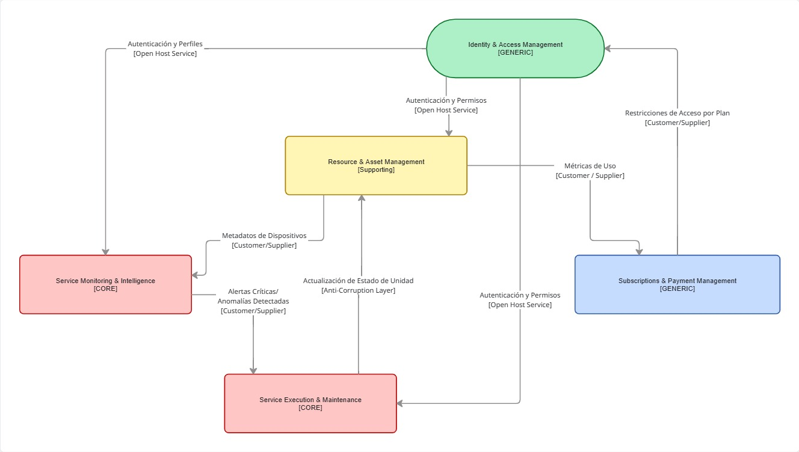

## 4.1.2. Context Mapping

En esta sección, el equipo de **Nexora** explica el proceso realizado para elaborar los **Context Maps**, los cuales permiten visualizar las relaciones estructurales entre los bounded contexts identificados durante el diseño estratégico. El objetivo principal de esta actividad fue analizar cómo colaboran los contextos, qué dependencias existen entre ellos y qué patrones de relación de Domain-Driven Design resultan más adecuados para proteger los modelos core del negocio.

Para el caso de Nexora, el Context Mapping se utiliza para definir los límites entre bounded contexts, identificar dependencias y establecer cómo colaboran entre sí dentro de la solución. Esto permite mantener responsabilidades claras y proteger los modelos de negocio más importantes del sistema.

### Estrategias de Relación entre Contextos

Para llegar al diseño final, el equipo evaluó la naturaleza de cada interacción basándose en la soberanía de los datos, la ubicación de las capacidades principales y la necesidad de proteger los modelos core:

*   **Identity & Access Management (Open Host Service - OHS):** Se definió como un módulo transversal, ya que todos los demás contextos dependen de él para validar autenticación, autorización, roles y permisos. Implementar una interfaz interna estandarizada evita que cada contexto tenga que duplicar reglas de seguridad o negociar una integración particular.
*   **Service Monitoring a Service Execution (Event-Driven):** La relación permite que el contexto de monitoreo provea alertas críticas y anomalías detectadas al contexto de ejecución. Service Execution consume esta información para generar incidencias y tareas de mantenimiento, pero mantiene su propio modelo de tickets, prioridades y resolución.
*   **Service Execution a Resource Management (Anti-Corruption Layer - ACL):** Se decidió aplicar una capa anticorrupción lógica para evitar que la lógica operativa de las reparaciones, técnicos e incidencias contamine el modelo de activos físicos, propiedades y unidades. En el monolito modular, esta capa puede representarse mediante casos de uso internos, DTOs o adaptadores entre módulos.
*   **Resource Management a Subscriptions (Customer/Supplier):** Existe una relación de cliente/proveedor, ya que el módulo de suscripciones y pagos necesita información precisa del inventario, como cantidad de unidades o dispositivos activos, para aplicar reglas de facturación, límites de uso o restricciones comerciales

### Análisis de Alternativas y Decisiones de Diseño

Siguiendo el proceso de diseño estratégico, el equipo se planteó las siguientes interrogantes para validar la arquitectura:

*   **¿Qué pasaría si movemos la gestión de dispositivos al contexto de Monitoreo?**
    *   *Decisión:* SSe descartó. Aunque el monitoreo usa los dispositivos para interpretar lecturas de telemetría, el ciclo de vida del activo, su registro, vinculación y baja pertenecen a Resource & Asset Management. Mezclarlos sobrecargaría el contexto de Monitoreo con responsabilidades administrativas que no forman parte de su propósito principal.
*   **¿Qué pasaría si el contexto de Ejecución (Mantenimiento) se vuelve un "Conformista" del modelo de Monitoreo?**
    *   *Decisión:* Se descartó. Ser conformista obligaría a que el modelo de mantenimiento dependa directamente de los cambios en el modelo de telemetría. En su lugar, Service Execution debe recibir una alerta ya interpretada y transformarla en conceptos propios de su dominio, como incidencia, prioridad, tarea de mantenimiento o resolución.
*   **¿Qué pasaría si integramos la facturación dentro de Identity & Access Management?**
    *   *Decisión:* Se descartó. Aunque ambos son contextos genéricos, Identity se encarga de usuarios, autenticación y permisos, mientras que Subscriptions maneja planes, pagos y monetización SaaS. Mezclarlos violaría el principio de responsabilidad única y haría más difícil mantener reglas de seguridad y reglas comerciales por separado.
*   **¿Qué pasaría si aislamos la analítica en un contexto aparte?**
    *   *Decisión:* Se decidió mantenerla dentro de **Service Monitoring & Intelligence**, ya que la detección de patrones, análisis de consumo y generación de alertas forman parte del valor principal de Nexora. Separarlos en este punto agregaría complejidad innecesaria para el alcance actual del proyecto.
*   **¿Qué pasaría si creamos un Shared Kernel entre todos los contextos?**
    *   *Decisión:* Se descartó un Shared Kernel amplio, porque podría aumentar el acoplamiento entre módulos. En su lugar, solo se recomienda compartir elementos mínimos y estables, como identificadores comunes o contratos internos simples, manteniendo las reglas de negocio dentro de cada bounded context.

### Diagrama de Context Map

El siguiente diagrama sintetiza las relaciones finales y los patrones de integración adoptados. Estas relaciones deben entenderse como colaboraciones internas entre módulos del backend monolítico, no como comunicación entre microservicios independientes:

