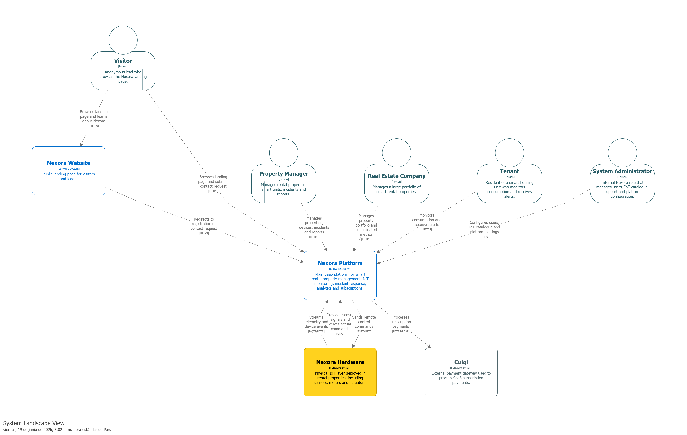

### 4.1.3. Software Architecture

En esta sección se presenta la arquitectura de software de Nexora utilizando el modelo C4. El objetivo es representar la solución desde diferentes niveles de abstracción para comprender la estructura general del sistema, los actores que interactúan con él, los sistemas externos involucrados y la distribución de responsabilidades dentro de la plataforma.

Las vistas presentadas permiten analizar la solución desde una perspectiva estratégica y técnica, mostrando cómo los diferentes componentes colaboran para soportar la gestión de inmuebles inteligentes, el monitoreo IoT, la gestión de incidencias, la analítica de consumo y la administración de suscripciones dentro de una arquitectura monolítica modular.

### 4.1.3.1. Software Architecture System Landscape Diagram

La vista System Landscape representa el ecosistema general en el que opera Nexora. Su propósito es identificar los principales actores del negocio, los sistemas que forman parte de la solución y los sistemas externos con los que interactúa la plataforma.

Esta vista permite comprender el alcance de Nexora dentro del contexto de negocio, mostrando cómo los usuarios, la plataforma SaaS, la infraestructura IoT y los servicios externos colaboran para proporcionar capacidades de monitoreo inteligente, mantenimiento preventivo y gestión de propiedades.

<!-- imagen en markdown -->

El diagrama muestra a los principales actores del negocio, incluyendo visitantes, administradores de propiedades, empresas inmobiliarias, inquilinos y administradores del sistema. Asimismo, se identifican los sistemas que conforman el ecosistema de Nexora, tales como la plataforma principal, la infraestructura IoT desplegada en los inmuebles y el sistema externo de pagos Culqi.

Las relaciones representadas permiten visualizar cómo los usuarios interactúan con la plataforma, cómo los dispositivos IoT suministran información operativa y cómo la solución se integra con servicios externos para soportar funcionalidades de negocio como la facturación de suscripciones SaaS.