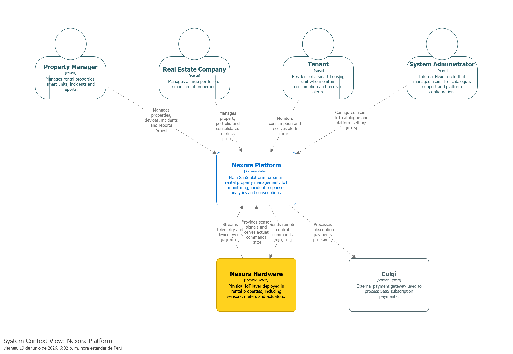

## 4.1.3.2. Software Architecture Context Level Diagrams

La vista Context Level se centra en el sistema principal Nexora Platform y muestra las interacciones que mantiene con los actores del negocio y sistemas externos. Su propósito es delimitar claramente las responsabilidades de la plataforma dentro del ecosistema general.

Esta representación permite identificar quiénes utilizan la solución, qué necesidades atiende la plataforma y cuáles son las integraciones externas necesarias para soportar las funcionalidades del negocio.

 

El diagrama muestra a Nexora Platform como el núcleo de la solución. Los administradores de propiedades y empresas inmobiliarias utilizan la plataforma para gestionar inmuebles, dispositivos y reportes de consumo. Los inquilinos acceden a información de monitoreo y alertas mediante aplicaciones digitales, mientras que los administradores del sistema realizan tareas de configuración, soporte y gestión de usuarios.

Adicionalmente, la plataforma interactúa con Nexora Hardware para recibir telemetría y ejecutar acciones de control sobre dispositivos IoT, así como con Culqi para procesar pagos asociados a las suscripciones SaaS ofrecidas por la solución.