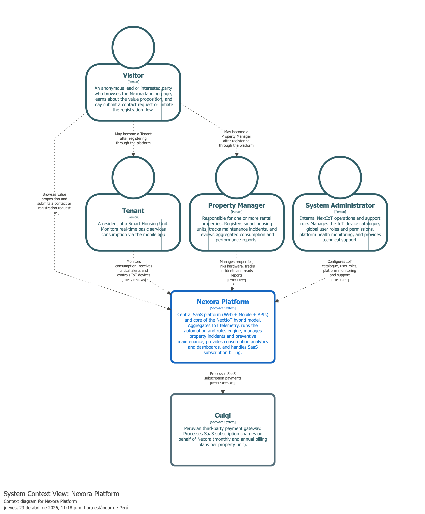

## 4.1.3.2. Context Level (C4)

Esta vista describe el **diagrama de contexto** centrado en el sistema principal **Nexora Platform**. Su propósito es clarificar quién usa el sistema, qué responsabilidades tiene y con qué sistemas externos se integra.

 