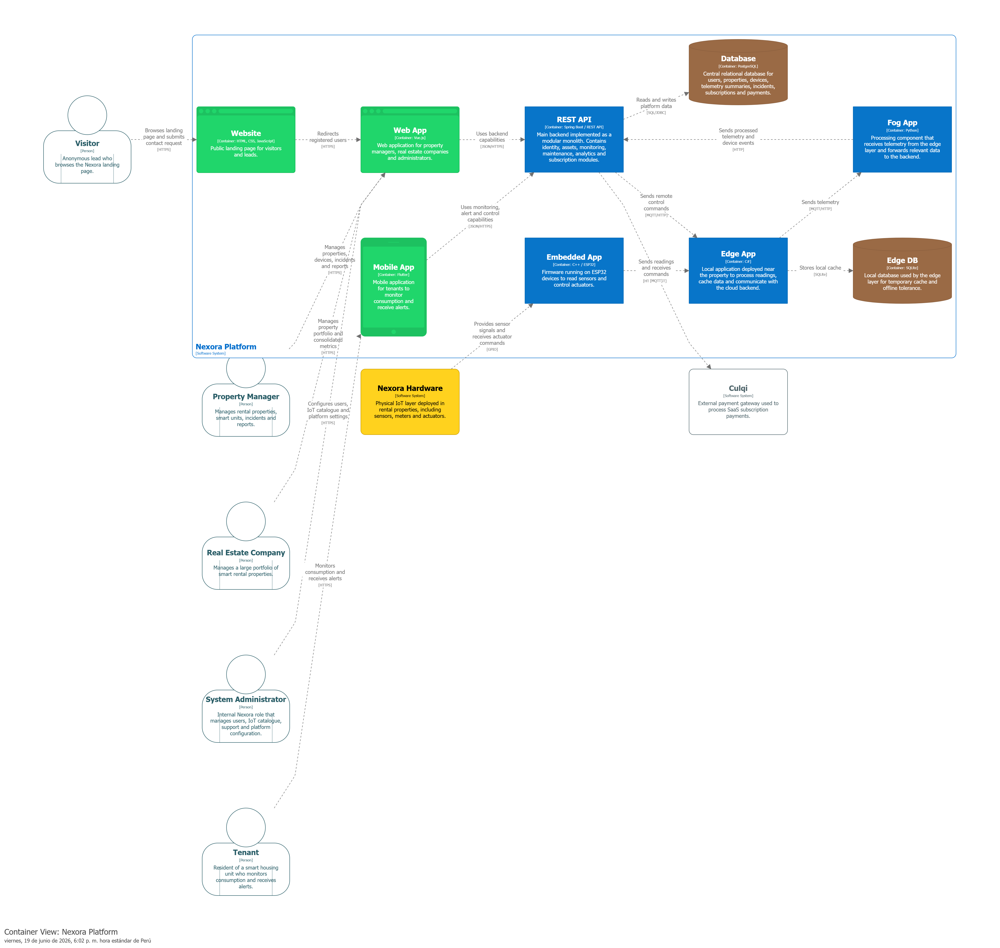

#### 4.1.3.3. Software Architecture Container Level Diagram

La vista Container Level describe los principales elementos de software que conforman Nexora Platform y la forma en que colaboran para implementar las capacidades del negocio.

Esta vista permite comprender la distribución de responsabilidades entre los distintos contenedores de la solución, las tecnologías utilizadas y los mecanismos de comunicación empleados para soportar la gestión de propiedades inteligentes y el procesamiento de información IoT.

El diagrama muestra los principales contenedores que conforman la solución. La Website funciona como punto de entrada para visitantes y potenciales clientes. La Web App permite a administradores y empresas inmobiliarias gestionar propiedades, incidencias y reportes, mientras que la Mobile App proporciona a los inquilinos acceso a información de monitoreo y control.

El backend se implementa mediante un REST API desarrollado bajo una arquitectura monolítica modular, donde residen las capacidades de negocio relacionadas con gestión de activos, monitoreo, mantenimiento, analítica y suscripciones. La información es almacenada en una base de datos centralizada.

Por otro lado, la capa IoT está compuesta por componentes Edge, Embedded y Fog, responsables de procesar telemetría, coordinar la comunicación con sensores y transmitir información relevante hacia la plataforma central.