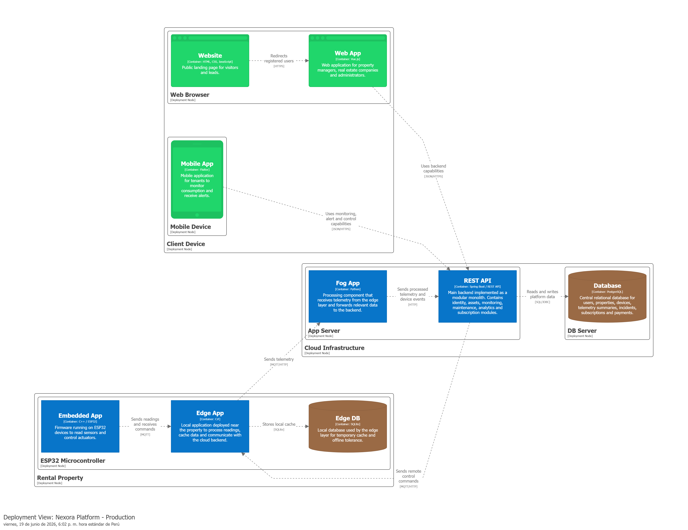

#### 4.1.3.4. Software Architecture Deployment Diagram

La vista Deployment representa la distribución física de los componentes de software sobre la infraestructura tecnológica utilizada por Nexora.

El propósito de esta vista es mostrar dónde se ejecutan los diferentes contenedores de la solución y cómo se comunican entre sí para soportar los procesos de monitoreo, control y gestión de propiedades inteligentes.

 

El diagrama muestra la distribución de los componentes en diferentes nodos de despliegue. Los usuarios acceden a la solución desde dispositivos cliente mediante navegadores web y aplicaciones móviles. La infraestructura cloud aloja el backend principal, compuesto por el REST API, los componentes de procesamiento y la base de datos central.

En los inmuebles inteligentes se despliega la infraestructura IoT, compuesta por dispositivos ESP32, firmware embebido, aplicaciones Edge y almacenamiento local. Esta capa permite recopilar información de sensores, ejecutar acciones de control sobre actuadores y mantener la operación incluso ante interrupciones temporales de conectividad.

La comunicación entre los diferentes nodos permite integrar el mundo físico de los dispositivos IoT con la plataforma SaaS centralizada, garantizando la disponibilidad de información para la toma de decisiones y la atención de incidencias.