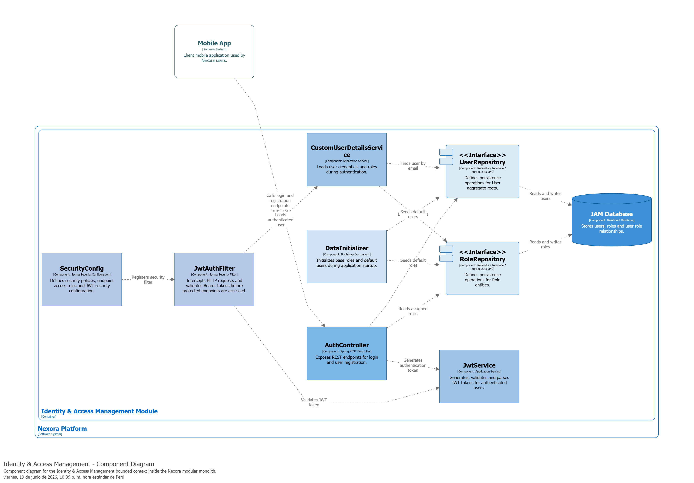
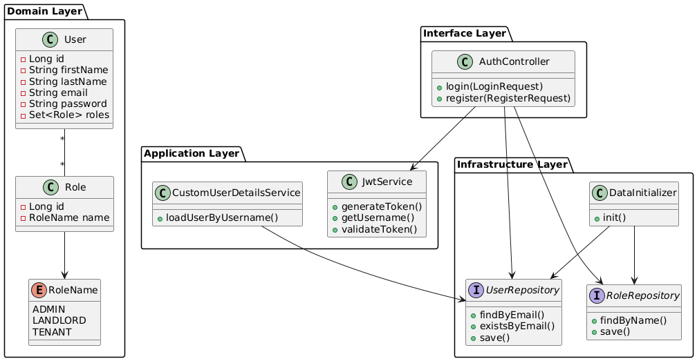
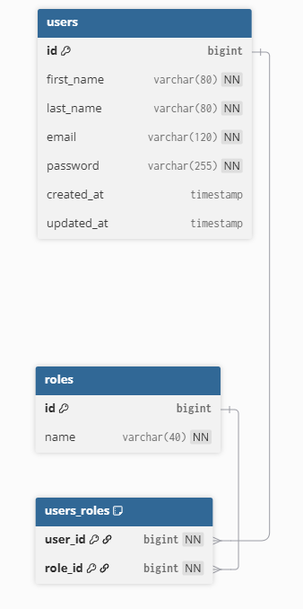

##### 4.2.1.5. Bounded Context Software Architecture Component Level Diagrams

El siguiente diagrama de componentes presenta la arquitectura interna del bounded context **Identity & Access Management**, mostrando cómo colaboran los principales componentes de las capas de interfaz, aplicación e infraestructura para soportar los procesos de autenticación y autorización de usuarios dentro de la plataforma Nexora.

La interacción inicia cuando una aplicación cliente consume los endpoints expuestos por **AuthController**, responsable de recibir solicitudes de autenticación y registro. Dichas solicitudes son coordinadas por los servicios de aplicación **JwtService** y **CustomUserDetailsService**, los cuales gestionan la generación de tokens JWT, validación de credenciales y recuperación de información de usuarios y roles.

La infraestructura de seguridad se encuentra soportada por **SecurityConfig** y **JwtAuthFilter**, componentes encargados de configurar las políticas de acceso y validar los tokens enviados en las solicitudes protegidas. Asimismo, los repositorios **UserRepository** y **RoleRepository** proporcionan acceso a la persistencia de usuarios y roles almacenados en la base de datos IAM.

Finalmente, el componente **DataInitializer** permite inicializar información básica del sistema durante el arranque de la aplicación, garantizando la disponibilidad de roles y configuraciones esenciales para el funcionamiento del bounded context.

---

##### 4.2.1.6. Bounded Context Software Architecture Code Level Diagrams

En esta sección se presentan los diagramas de nivel de código correspondientes al bounded context **Identity & Access Management**. Estos diagramas permiten visualizar la estructura interna del modelo de dominio y el diseño de persistencia utilizado para soportar las funcionalidades de autenticación y autorización.

---

###### 4.2.1.6.1. Bounded Context Domain Layer Class Diagrams

El siguiente diagrama de clases representa los principales elementos del dominio pertenecientes al bounded context **Identity & Access Management**. El modelo se encuentra centrado en la gestión de identidades digitales y perfiles de autorización utilizados por la plataforma Nexora.

La entidad **User** actúa como Aggregate Root del dominio y representa a los usuarios registrados dentro del sistema. Cada usuario puede estar asociado a uno o varios roles mediante una relación muchos-a-muchos con la entidad **Role**, permitiendo un esquema flexible de autorización basado en roles.

Por su parte, la enumeración **RoleName** define los perfiles de acceso válidos dentro del sistema, incluyendo los roles **ADMIN**, **LANDLORD** y **TENANT**. Adicionalmente, el diagrama incorpora las interfaces **UserRepository** y **RoleRepository**, las cuales representan los mecanismos de acceso a persistencia definidos por el dominio.

Este modelo constituye la base conceptual sobre la cual se implementan los procesos de autenticación y autorización del bounded context.

---

###### 4.2.1.6.2. Bounded Context Database Design Diagram

El diseño de base de datos del bounded context **Identity & Access Management** está orientado a soportar el registro de usuarios, la gestión de roles y la relación entre ambos. El modelo utiliza un enfoque relacional simple y coherente con la implementación en Spring Boot y JPA.

La tabla **users** almacena la información principal de cada usuario, incluyendo nombres, correo electrónico, contraseña cifrada y campos de auditoría. El campo **email** se define como único para evitar cuentas duplicadas. La tabla **roles** almacena los perfiles de acceso disponibles y define el campo **name** como único para asegurar consistencia en la asignación de roles.

Finalmente, la tabla **users_roles** resuelve la relación muchos-a-muchos entre usuarios y roles mediante las claves foráneas **user_id** y **role_id**, permitiendo un modelo flexible de autorización dentro de la plataforma.

### Constraints Principales

**users**
- PK: id
- UK: email

**roles**
- PK: id
- UK: name

**users_roles**
- PK: (user_id, role_id)
- FK: user_id → users.id
- FK: role_id → roles.id

