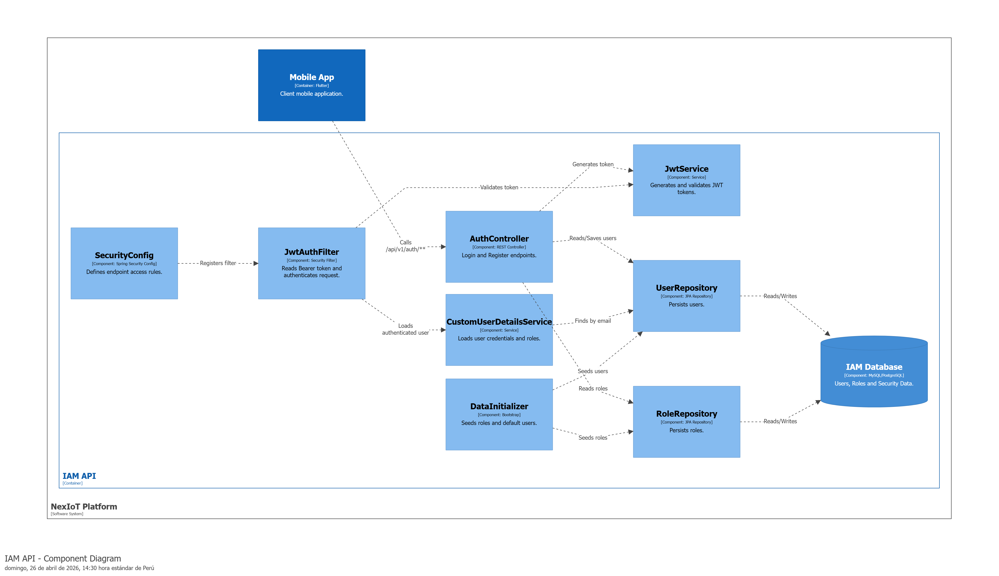
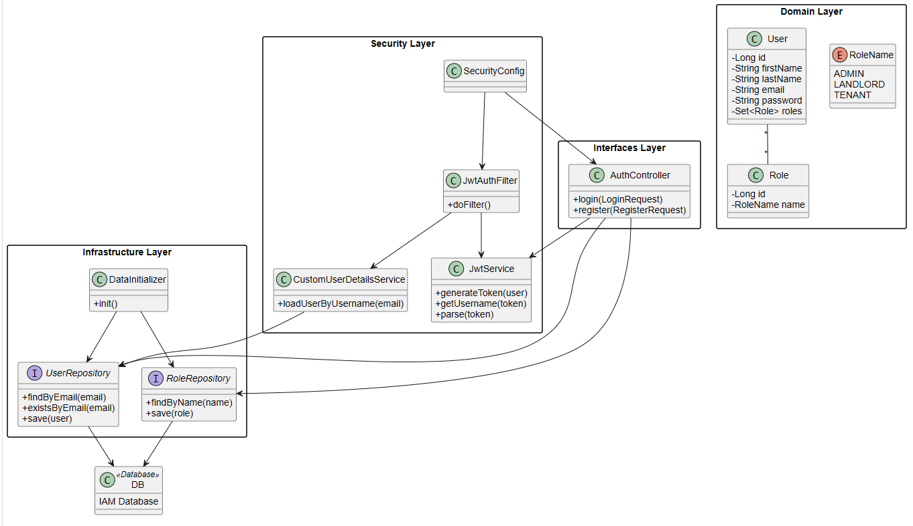

##### 4.2.4.5. Bounded Context Software Architecture Component Level Diagrams

Este diagrama de nivel de componentes describe la arquitectura interna del bounded context **Identity & Access Management**. En esta vista se observa cómo la **Mobile App** consume los endpoints expuestos por el **AuthController**, el cual centraliza las operaciones de autenticación y registro de usuarios.

La seguridad del contexto se apoya en **SecurityConfig**, encargado de definir las reglas de acceso y registrar el filtro de autenticación, y en **JwtAuthFilter**, responsable de validar los tokens enviados en las solicitudes. Asimismo, **JwtService** permite generar y validar tokens JWT, mientras que **CustomUserDetailsService** carga las credenciales y roles del usuario desde persistencia.

Los componentes **UserRepository** y **RoleRepository** permiten acceder a la información almacenada en la base de datos IAM. Finalmente, **DataInitializer** prepara datos iniciales como roles y usuarios base para el funcionamiento del sistema.

---

##### 4.2.4.6. Bounded Context Software Architecture Code Level Diagrams

En esta sección se presentan los diagramas de nivel de código correspondientes al bounded context **Identity & Access Management**. Estos diagramas permiten visualizar la estructura interna del modelo de dominio y el diseño de persistencia utilizado para soportar las funcionalidades de autenticación y autorización.

---

###### 4.2.4.6.1. Bounded Context Domain Layer Class Diagrams

El diagrama de clases del dominio para el contexto de **Identity & Access Management** representa las principales clases, interfaces y relaciones que soportan el control de acceso de la plataforma. Se identifican como elementos centrales a **User**, **Role** y **RoleName**, los cuales permiten modelar identidades digitales y perfiles de autorización.

La clase **User** representa a los usuarios registrados en NexIoT y mantiene una relación muchos-a-muchos con **Role**, permitiendo que una misma cuenta pueda tener uno o más perfiles de acceso. La enumeración **RoleName** define los roles válidos para el sistema, adaptados al contexto del proyecto: **ADMIN**, **LANDLORD** y **TENANT**.

Además, el diagrama incluye componentes de seguridad como **JwtService**, **JwtAuthFilter**, **SecurityConfig** y **CustomUserDetailsService**, así como los repositorios **UserRepository** y **RoleRepository**, mostrando la trazabilidad entre las capas de interfaz, seguridad, dominio e infraestructura.

---

###### 4.2.4.6.2. Bounded Context Database Design Diagram

El diseño de base de datos del bounded context **Identity & Access Management** está orientado a soportar el registro de usuarios, la gestión de roles y la relación entre ambos. El modelo utiliza un enfoque relacional simple y coherente con la implementación en Spring Boot y JPA.

La tabla **users** almacena la información principal de cada usuario, incluyendo nombres, correo electrónico, contraseña cifrada y campos de auditoría. El campo **email** se define como único para evitar cuentas duplicadas. La tabla **roles** almacena los perfiles de acceso disponibles y define el campo **name** como único para asegurar consistencia en la asignación de roles.

Finalmente, la tabla **users_roles** resuelve la relación muchos-a-muchos entre usuarios y roles mediante las claves foráneas **user_id** y **role_id**, permitiendo un modelo flexible de autorización dentro de la plataforma.

