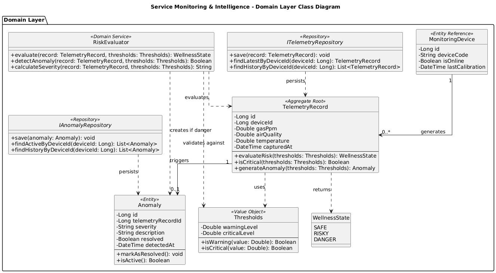
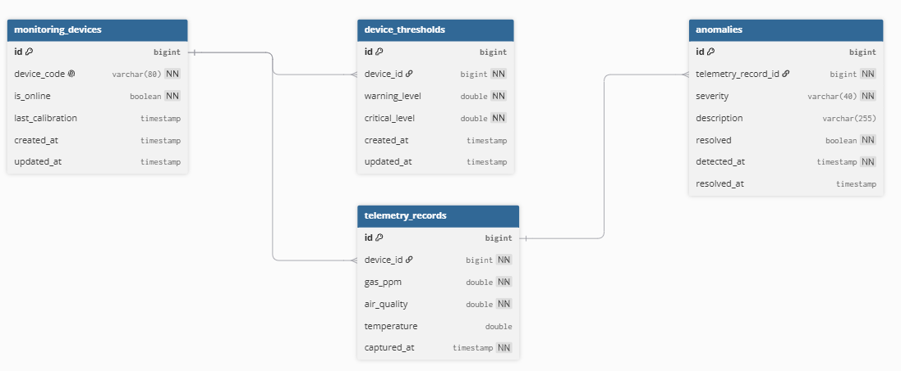

### 4.2.2.5. Bounded Context Software Architecture Component Level Diagrams

El diagrama de nivel de componentes describe la arquitectura interna del bounded context **Service Monitoring & Intelligence**, el cual forma parte del backend monolítico modular de Nexora. Esta vista permite observar cómo se distribuyen las responsabilidades entre los componentes encargados de recibir telemetría, procesar lecturas, evaluar riesgos, consultar información histórica y registrar anomalías.

El flujo principal inicia cuando **MqttInboundAdapter** recibe lecturas provenientes del hardware IoT mediante MQTT y las transforma en información procesable por la Application Layer. Luego, **TelemetryCommandService** coordina la ingesta de datos, registra la lectura mediante **ITelemetryRepository** y solicita a **RiskEvaluator** la evaluación del riesgo según los umbrales configurados.

La lógica principal del dominio se concentra en **RiskEvaluator**, un Domain Service encargado de determinar si una lectura se encuentra en estado seguro, riesgoso o crítico. Cuando se detecta una condición anómala, **AnomalyCommandService** registra la anomalía correspondiente mediante **IAnomalyRepository**.

Por otro lado, **MonitoringController** expone endpoints REST para que las aplicaciones cliente consulten el estado actual, el historial de telemetría y las anomalías detectadas. Estas consultas son coordinadas por **MonitoringQueryService**, permitiendo separar las operaciones de escritura y procesamiento de las operaciones de lectura, siguiendo un enfoque CQRS.

La persistencia se realiza en la base de datos central de Nexora, específicamente en las tablas relacionadas con este bounded context, como `telemetry_records`, `anomalies` y `device_thresholds`.

---

### 4.2.2.6. Bounded Context Software Architecture Code Level Diagrams

En esta sección se presentan los diagramas de nivel de código correspondientes al bounded context **Service Monitoring & Intelligence**. Estos diagramas permiten visualizar la estructura del modelo de dominio y el diseño de persistencia utilizado para soportar el monitoreo IoT, la evaluación de riesgos y la gestión de anomalías dentro de Nexora.

#### 4.2.2.6.1. Bounded Context Domain Layer Class Diagrams

El diagrama de clases del dominio representa los principales elementos tácticos del bounded context **Service Monitoring & Intelligence**. El modelo se centra en la clase **TelemetryRecord**, la cual actúa como Aggregate Root al representar una lectura completa capturada por el sistema IoT en un momento específico.

La entidad **Anomaly** modela una condición fuera de los parámetros normales y se relaciona con la lectura que la originó. Asimismo, **MonitoringDevice** se representa como una referencia al dispositivo IoT desde la perspectiva del monitoreo, debido a que el ciclo de vida completo de los dispositivos pertenece al bounded context **Resource & Asset Management**.

El modelo también incluye el Value Object **Thresholds**, utilizado para definir los niveles de advertencia y criticidad, y la enumeración **WellnessState**, que establece los posibles estados de bienestar de la vivienda: **SAFE**, **RISKY** y **DANGER**. Finalmente, **RiskEvaluator** se define como un Domain Service encargado de evaluar las lecturas contra los umbrales configurados, mientras que **ITelemetryRepository** e **IAnomalyRepository** representan las interfaces de persistencia requeridas por el dominio.

---
#### 4.2.2.6.2. Bounded Context Database Design Diagram

El diseño de base de datos del bounded context **Service Monitoring & Intelligence** representa las tablas necesarias para persistir la información de monitoreo dentro de la base de datos central de Nexora. Aunque el sistema utiliza una sola base de datos física por su enfoque de monolito modular, este diagrama muestra únicamente las tablas asociadas a este bounded context.

La tabla `monitoring_devices` almacena la referencia mínima de los dispositivos monitoreados desde la perspectiva de este contexto. La tabla `device_thresholds` registra los niveles de advertencia y criticidad configurados para evaluar las lecturas recibidas. Por su parte, `telemetry_records` almacena el histórico de lecturas provenientes de sensores IoT, incluyendo gas, calidad de aire, temperatura y fecha de captura.

Finalmente, la tabla `anomalies` permite registrar las condiciones críticas detectadas por el sistema y mantener trazabilidad con la lectura de telemetría que originó la anomalía. Esta relación permite auditar qué lectura específica disparó una alerta y consultar posteriormente el historial de eventos críticos.

### Constraints Principales

**monitoring_devices**
- PK: id
- UK: device_code

**device_thresholds**
- PK: id
- FK: device_id → monitoring_devices.id

**telemetry_records**
- PK: id
- FK: device_id → monitoring_devices.id

**anomalies**
- PK: id
- FK: telemetry_record_id → telemetry_records.id

