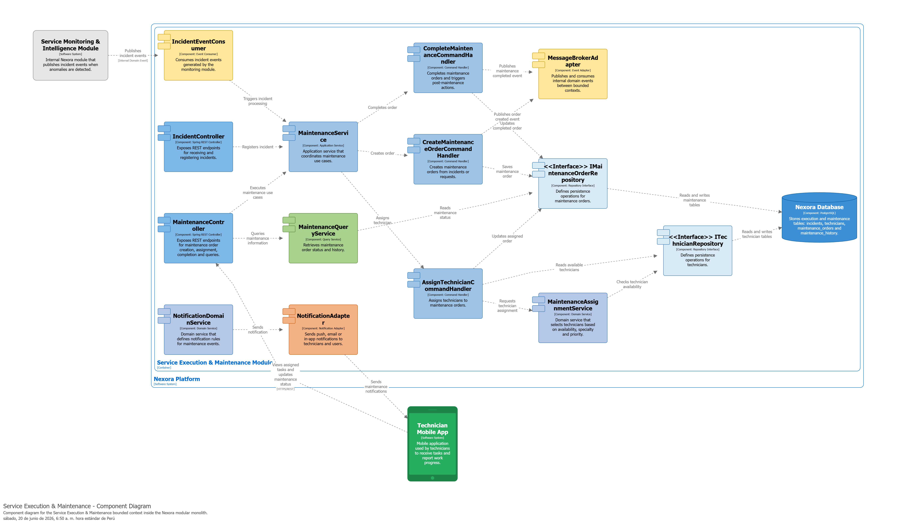
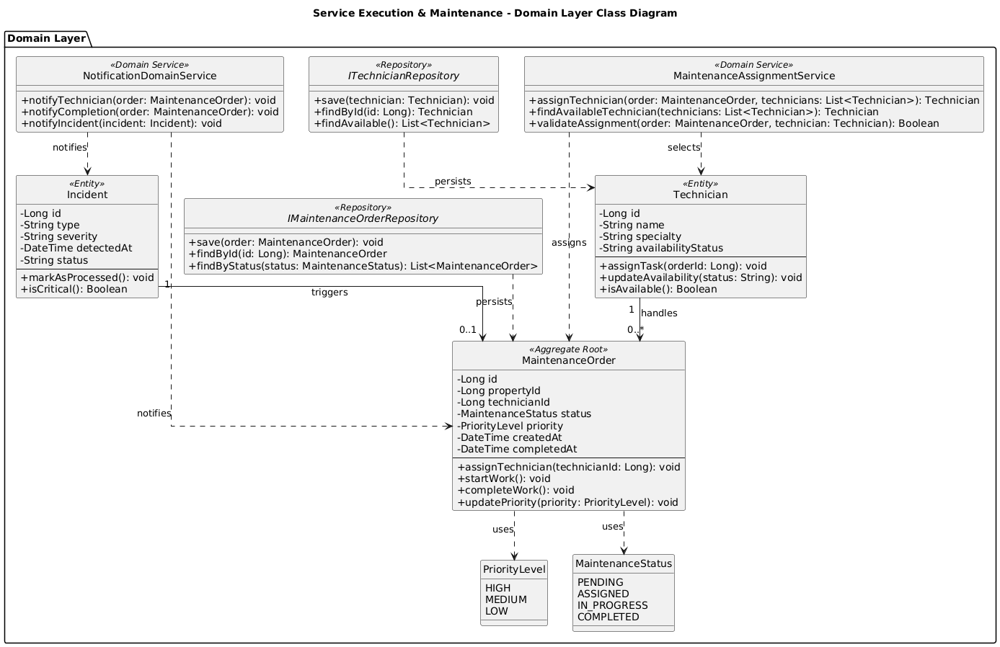
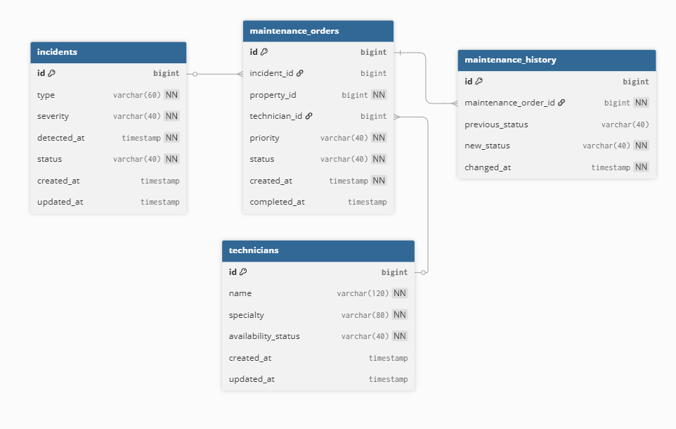

#### 4.2.4.5. Bounded Context Software Architecture Component Level Diagrams

El diagrama de componentes describe la arquitectura interna del bounded context **Service Execution & Maintenance**, responsable de gestionar incidentes técnicos, órdenes de mantenimiento, asignación de técnicos y cierre de intervenciones dentro de Nexora.

El flujo principal inicia cuando **IncidentEventConsumer** recibe eventos internos provenientes del bounded context **Service Monitoring & Intelligence**. Estos eventos son procesados por la Application Layer mediante **MaintenanceService** y los Command Handlers encargados de crear, asignar y completar órdenes de mantenimiento.

La lógica de negocio se concentra en **MaintenanceOrder**, que actúa como Aggregate Root, y en **MaintenanceAssignmentService**, Domain Service encargado de seleccionar técnicos disponibles según prioridad y especialidad. Las notificaciones se gestionan mediante **NotificationDomainService** y se ejecutan técnicamente a través de **NotificationAdapter**.

La persistencia se realiza en la base de datos central de Nexora mediante **IMaintenanceOrderRepository** e **ITechnicianRepository**, manteniendo separación lógica mediante tablas propias del bounded context.

---

### 4.2.4.6. Bounded Context Software Architecture Code Level Diagrams

En esta sección se presentan los diagramas de nivel de código correspondientes al bounded context **Service Execution & Maintenance**, incluyendo el diagrama de clases del dominio y el diseño de base de datos utilizado para persistir incidentes, técnicos, órdenes de mantenimiento e historial operativo.

---

#### 4.2.4.6.1. Bounded Context Domain Layer Class Diagrams

El diagrama de clases del dominio representa los principales elementos tácticos del bounded context **Service Execution & Maintenance**. El modelo se centra en **MaintenanceOrder**, que actúa como Aggregate Root al representar el ciclo de vida completo de una intervención técnica.

La entidad **Incident** representa el problema técnico detectado que puede originar una orden de mantenimiento, mientras que **Technician** modela al personal encargado de ejecutar las tareas. Las enumeraciones **PriorityLevel** y **MaintenanceStatus** permiten mantener consistencia en los niveles de prioridad y estados de la orden.

El modelo también incluye **MaintenanceAssignmentService** y **NotificationDomainService** como Domain Services, además de las interfaces **IMaintenanceOrderRepository** e **ITechnicianRepository**, encargadas de representar las abstracciones de persistencia requeridas por el dominio.

---

#### 4.2.4.6.2. Bounded Context Database Design Diagram

El diseño de base de datos del bounded context **Service Execution & Maintenance** representa las tablas necesarias para persistir información operativa dentro de la base de datos central de Nexora. Aunque el sistema mantiene una sola base de datos física por su enfoque de monolito modular, este diagrama muestra únicamente las tablas asociadas a este bounded context.

La tabla `incidents` almacena los incidentes técnicos recibidos desde el monitoreo. La tabla `maintenance_orders` registra las órdenes generadas para atender dichos incidentes, incluyendo prioridad, estado, técnico asignado y fechas relevantes. La tabla `technicians` permite gestionar la información del personal técnico y su disponibilidad. Finalmente, `maintenance_history` mantiene trazabilidad de los cambios de estado realizados durante el ciclo de vida de cada orden.

### Constraints Principales

**incidents**
- PK: id

**technicians**
- PK: id

**maintenance_orders**
- PK: id
- FK: incident_id → incidents.id
- FK: technician_id → technicians.id

**maintenance_history**
- PK: id
- FK: maintenance_order_id → maintenance_orders.id

