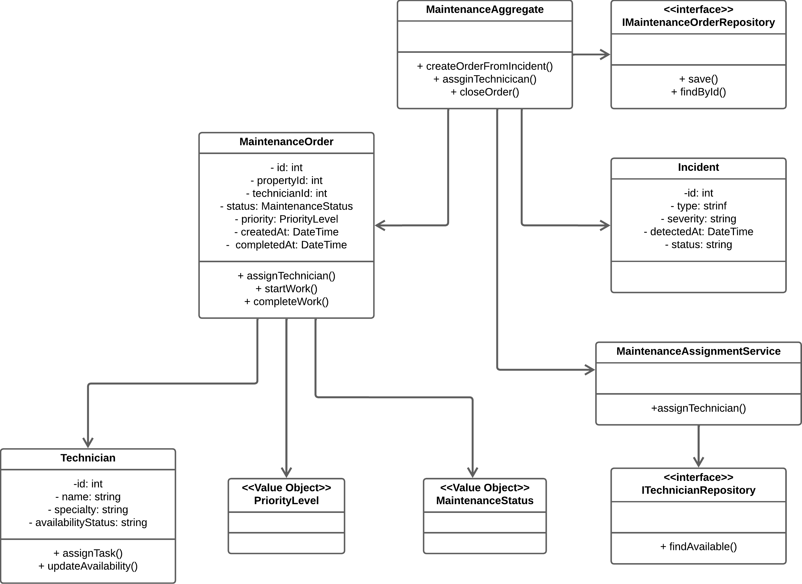
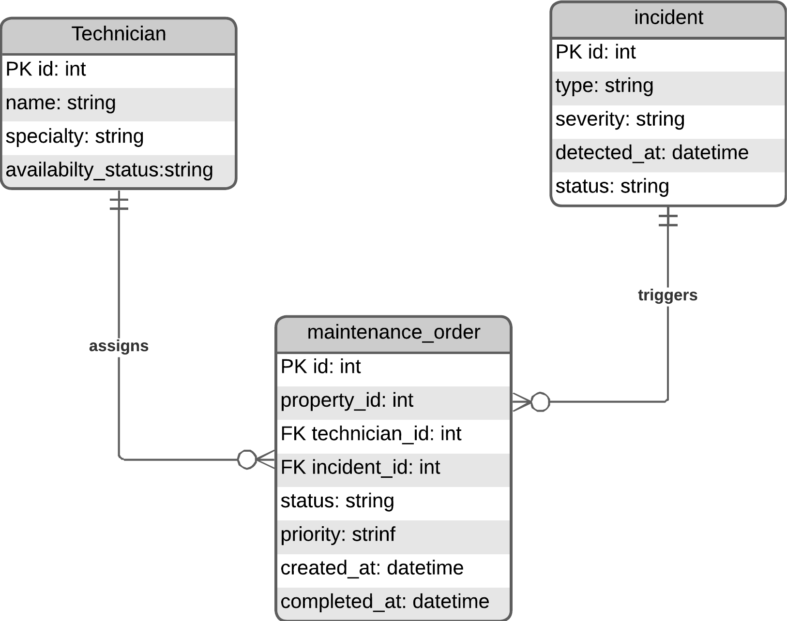

#### 4.2.4.5. Bounded Context Software Architecture Component Level Diagrams

Este diagrama de nivel 3 describe la arquitectura interna del Bounded Context encargado de la ejecución operativa de mantenimientos y la atención de incidentes técnicos. Se observa un flujo basado en eventos donde el Incident Event Consumer recibe alertas provenientes del Monitoring Context y las traslada a los servicios de aplicación (Maintenance Command Service), encargados de orquestar la creación y gestión de órdenes de mantenimiento.

La lógica de negocio reside en el Maintenance Aggregate y en servicios de dominio como MaintenanceAssignmentService, que permiten gestionar la asignación automática de técnicos según disponibilidad y prioridad. Este diseño sigue un enfoque desacoplado y orientado a eventos, donde se separan las operaciones de escritura (gestión de órdenes) de las consultas (estado de mantenimiento), permitiendo además la integración con aplicaciones móviles para notificación y actualización en tiempo real.

---

### 4.2.4.6. Bounded Context Software Architecture Code Level Diagrams

#### 4.2.4.6.1. Bounded Context Domain Layer Class Diagrams

El diagrama de clases del dominio para el contexto de Service Execution & Maintenance define las reglas tácticas para la gestión de órdenes de mantenimiento y la atención de incidentes técnicos. Se identifican como entidades clave a MaintenanceOrder, que representa la ejecución de trabajos técnicos, Technician, encargado de realizar las tareas, y Incident, que representa la alerta recibida desde el Monitoring Context.

El modelo utiliza un Domain Service (MaintenanceAssignmentService) para desacoplar la lógica de asignación de técnicos de las entidades, permitiendo una mayor flexibilidad en la gestión de disponibilidad y prioridad. Asimismo, el uso de value objects como PriorityLevel y MaintenanceStatus asegura la consistencia del lenguaje ubicuo dentro del dominio.

---

#### 4.2.4.6.2. Bounded Context Database Design Diagram

El diseño del esquema de base de datos para el contexto de Service Execution & Maintenance está orientado a la gestión de órdenes de mantenimiento y la trazabilidad de incidentes técnicos. La tabla maintenance_orders actúa como el núcleo del modelo, almacenando el ciclo de vida completo de cada intervención técnica.

El esquema establece una relación directa entre los incidentes detectados y las órdenes generadas, permitiendo identificar qué evento originó cada acción de mantenimiento. Asimismo, la tabla technicians permite gestionar la asignación de recursos humanos, asegurando la disponibilidad y especialización adecuada para cada tarea. Este diseño facilita el seguimiento, auditoría y control de las operaciones en campo.

