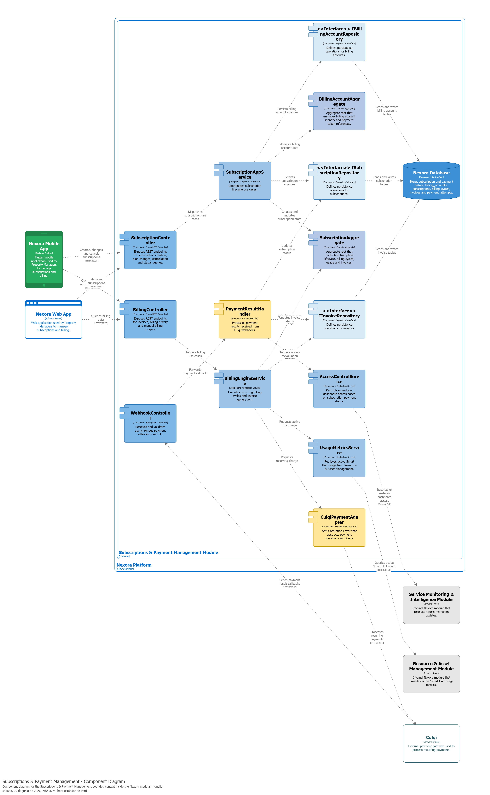
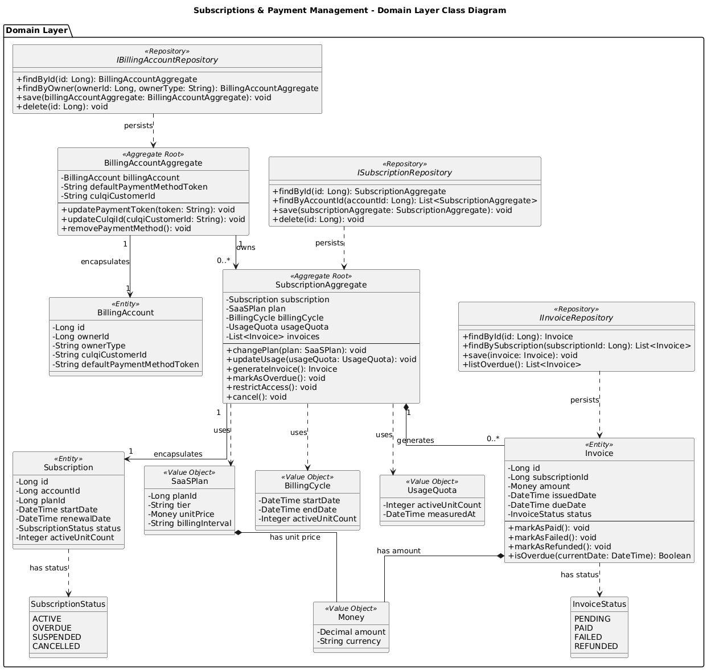
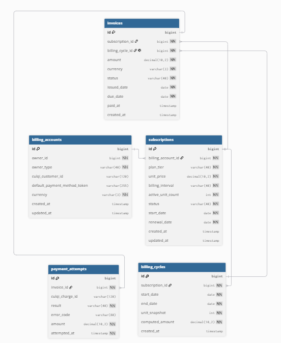

### 4.2.5.5. Bounded Context Software Architecture Component Level Diagrams

El diagrama de componentes describe la arquitectura interna del bounded context **Subscriptions & Payment Management**, responsable de gestionar el ciclo de vida de suscripciones SaaS, la facturación recurrente, el cálculo de uso y la integración con la pasarela de pagos Culqi.

El flujo principal inicia cuando **Nexora Mobile App** o **Nexora Web App** consumen los endpoints expuestos por **SubscriptionController** y **BillingController**. Estos controladores delegan la ejecución de los casos de uso a **SubscriptionAppService** y **BillingEngineService**, los cuales coordinan el dominio, repositorios y adaptadores externos.

La integración con Culqi se realiza mediante **CulqiPaymentAdapter**, que actúa como Anti-Corruption Layer para evitar que los modelos externos de la pasarela de pagos contaminen el dominio. Los resultados de pago son recibidos por **WebhookController** y procesados por **PaymentResultHandler**.

Asimismo, **UsageMetricsService** consulta información del bounded context **Resource & Asset Management** para obtener la cantidad de Smart Units activas, mientras que **AccessControlService** coordina restricciones de acceso con **Service Monitoring & Intelligence** cuando una suscripción presenta mora. La persistencia se realiza en la base de datos central de Nexora mediante tablas especializadas del bounded context.

---

### 4.2.5.6. Bounded Context Software Architecture Code Level Diagrams

En esta sección se presentan los diagramas de nivel de código correspondientes al bounded context **Subscriptions & Payment Management**, incluyendo el diagrama de clases del dominio y el diseño de base de datos utilizado para persistir cuentas de facturación, suscripciones, ciclos, facturas e intentos de pago.

---

#### 4.2.5.6.1. Bounded Context Domain Layer Class Diagrams

El diagrama de clases del dominio representa los principales elementos tácticos del bounded context **Subscriptions & Payment Management**. El modelo se centra en **SubscriptionAggregate**, raíz de agregado encargada de controlar el ciclo de vida de una suscripción, sus planes, cuotas de uso, ciclos de facturación y facturas asociadas.

También se incluye **BillingAccountAggregate**, responsable de gestionar la identidad financiera del cliente y su vinculación con Culqi. La entidad **Invoice** representa las facturas generadas por cada ciclo de facturación, mientras que los Value Objects **SaaSPlan**, **BillingCycle**, **UsageQuota** y **Money** encapsulan conceptos relevantes del dominio.

Finalmente, las enumeraciones **SubscriptionStatus** e **InvoiceStatus** permiten mantener consistencia en los estados de suscripción y facturación, mientras que las interfaces **ISubscriptionRepository**, **IInvoiceRepository** e **IBillingAccountRepository** representan las abstracciones de persistencia requeridas por el dominio.

---

#### 4.2.5.6.2. Bounded Context Database Design Diagram

El diseño de base de datos del bounded context **Subscriptions & Payment Management** representa las tablas necesarias para persistir información financiera dentro de la base de datos central de Nexora. Aunque la solución mantiene una sola base de datos física por su enfoque de monolito modular, este diagrama muestra únicamente las tablas asociadas a este bounded context.

La tabla `billing_accounts` almacena las cuentas de facturación de los clientes. La tabla `subscriptions` registra las suscripciones activas o históricas asociadas a una cuenta. La tabla `billing_cycles` representa los períodos de facturación generados por cada suscripción, mientras que `invoices` almacena las facturas emitidas. Finalmente, `payment_attempts` mantiene trazabilidad de cada intento de cobro realizado mediante Culqi.

### Constraints Principales

**billing_accounts**
- PK: id

**subscriptions**
- PK: id
- FK: billing_account_id → billing_accounts.id

**billing_cycles**
- PK: id
- FK: subscription_id → subscriptions.id

**invoices**
- PK: id
- FK: subscription_id → subscriptions.id
- FK: billing_cycle_id → billing_cycles.id

**payment_attempts**
- PK: id
- FK: invoice_id → invoices.id

