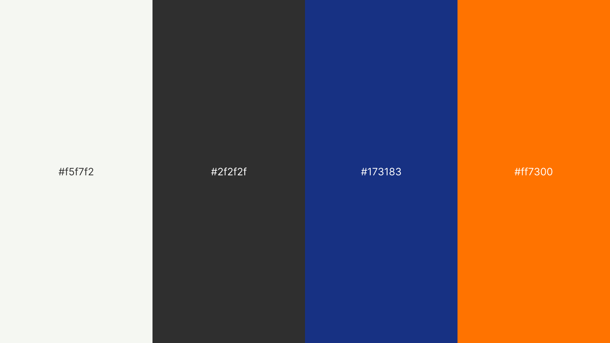

# Capítulo V: Solution UI/UX Design
## 5.1. Style Guidelines
### 5.1.1. General Style Guidelines

En esta sección se establecen los lineamientos visuales y comunicacionales que guiarán el diseño de Nexora, asegurando coherencia en todos los puntos de contacto con el usuario. Estas decisiones están fundamentadas en la naturaleza tecnológica del producto, su enfoque en eficiencia operativa y su rol dentro del ecosistema inmobiliario inteligente.

El sistema de diseño toma como referencia principios de **Material Design** y **Human-Centered Design**, adaptados al contexto de plataformas IoT y dashboards de monitoreo en tiempo real, donde la claridad, jerarquía visual y respuesta rápida son esenciales.

 

---

#### **Branding**

El branding de Nexora está diseñado para reflejar una **marca tecnológica, confiable y orientada a la eficiencia**, alineada con su propuesta de valor basada en automatización, análisis de datos y conectividad inteligente.

Se construye sobre cuatro pilares fundamentales:

1. **Tecnología accesible:**
   Nexora traduce la complejidad del IoT en una experiencia simple, intuitiva y comprensible para usuarios no técnicos.

2. **Eficiencia operativa:**
   La identidad visual transmite orden, precisión y optimización, atributos clave para administradores de propiedades.

3. **Seguridad y confianza:**
   Se priorizan elementos visuales sólidos y estructurados que generen credibilidad en el manejo de datos y control de inmuebles.

4. **Innovación sostenible:**
   La marca comunica modernidad sin perder responsabilidad ambiental, alineándose con la eficiencia energética.

 

---

#### **Logo**

 

El logotipo de Nexora representa visualmente la **dirección, conectividad y flujo de datos** dentro de un ecosistema inteligente.

**Elementos clave:**

1. **Flecha ascendente:**
   Simboliza progreso, optimización y crecimiento, alineado con la mejora continua en la gestión inmobiliaria.

2. **Líneas internas paralelas:**
   Representan los flujos de datos y la comunicación entre dispositivos IoT, evocando conectividad y sincronización.

3. **Forma angular:**
   Refuerza una estética tecnológica, moderna y dinámica, asociada a sistemas digitales y precisión.

4. **Color naranja predominante:**
   Introduce energía e innovación, diferenciando la marca dentro de un sector tradicionalmente sobrio como el inmobiliario.

*El logo sintetiza la esencia de Nexora: transformar datos en decisiones inteligentes.*

 

---

#### **Favicon**

El favicon es una simplificación del logotipo, manteniendo la **flecha característica** como elemento principal.

Esto permite mantener reconocimiento de marca incluso en interfaces mínimas como pestañas del navegador o aplicaciones móviles.

 

---

#### **Tipografía**

La selección tipográfica de Nexora responde a la necesidad de equilibrar **expresividad visual y funcionalidad**, en coherencia con los principios de diseño centrados en el usuario y la naturaleza tecnológica de la plataforma.

Se adopta una combinación de dos tipografías: **Exo 2** para títulos e **Inter** para contenido y componentes de interfaz. Esta decisión se fundamenta en criterios de **jerarquía visual, legibilidad en entornos digitales y coherencia con el branding tecnológico** del sistema.

 

**Exo 2 — Títulos y encabezados**

Se emplea en títulos y encabezados debido a su carácter geométrico y contemporáneo, que refuerza la percepción de innovación, precisión y modernidad.

* Aporta personalidad y diferenciación visual.
* Mejora la identificación de secciones clave.
* Refuerza el carácter tecnológico de la plataforma.

 

**Inter — Texto y componentes UI**

Se utiliza como tipografía base para textos, labels y elementos funcionales de la interfaz, priorizando claridad y eficiencia en la lectura.

* Alta legibilidad en pantallas y tamaños pequeños.
* Ideal para dashboards, métricas y contenido continuo.
* Reduce la carga cognitiva del usuario.

 

---

**Síntesis de la decisión tipográfica**

La combinación de ambas tipografías permite:

* Establecer una **jerarquía visual clara** entre títulos y contenido.
* Garantizar **legibilidad y accesibilidad** en distintos dispositivos.
* Mantener una **experiencia consistente y eficiente**.
* Reforzar el **carácter tecnológico y profesional** de la marca.

 

---

#### **Colores**

La paleta de Nexora está diseñada para equilibrar **tecnología, confianza y dinamismo**, combinando tonos neutros con un color acento fuerte.

##### **Colores principales:**

1. **Naranja (#ff7300) – Color primario**

   * Representa innovación, energía y acción.
   * Se utiliza en botones principales, indicadores activos y elementos clave de interacción.

2. **Azul profundo (#173183) – Color secundario**

   * Transmite confianza, estabilidad y tecnología.
   * Ideal para dashboards, encabezados y elementos estructurales.

##### **Colores neutros:**

3. **Gris claro (#f5f7f2)**

   * Fondo principal, aporta limpieza visual.

4. **Gris oscuro (#2f2f2f)**

   * Texto principal, alto contraste y legibilidad.

---

##### **Principios de uso del color:**

* **Jerarquía visual clara:** El naranja se reserva para acciones clave (CTA).
* **Contraste funcional:** Garantiza accesibilidad (WCAG).
* **Consistencia:** Cada color cumple un rol definido dentro del sistema.
* **Feedback visual:**

  * Naranja → acción / activo
  * Azul → información / estructura
  * Gris → neutral / fondo

 

---

#### **Spacing (Espaciado)**

Se adopta un sistema de espaciado basado en una **escala de 8px**, estándar en diseño de interfaces modernas.

**Escala base:**

* 4px (micro espacio)
* 8px (base)
* 16px (espacio estándar)
* 24px (secciones)
* 32px – 48px (bloques grandes)

**Principios:**

* **Consistencia:** mantiene orden visual en dashboards complejos.
* **Respiración visual:** evita sobrecarga de información.
* **Escalabilidad:** facilita diseño responsive en distintos dispositivos.

 

---

#### **Tono de Comunicación**

El tono de Nexora responde a un equilibrio entre tecnología avanzada y facilidad de uso, considerando que sus usuarios incluyen tanto perfiles técnicos como no técnicos.

1. **Serio, pero accesible:**
   Se comunica profesionalismo sin caer en tecnicismos innecesarios.

2. **Formal, pero claro:**
   Lenguaje estructurado, directo y comprensible.

3. **Respetuoso y confiable:**
   Refuerza la seguridad en el manejo de datos e infraestructura.

4. **Sereno y orientado a soluciones:**
   Evita alarmismo; prioriza claridad y control ante incidencias.

5. **Preciso y funcional:**
   Cada mensaje tiene un propósito: informar, alertar o guiar acciones.

 

---

#### **Principios de Diseño Aplicados**

**Las decisiones de diseño de Nexora se fundamentan en principios consolidados del diseño centrado en el usuario (*Human-Centered Design*) y en estándares internacionales de usabilidad, como la norma ISO 9241, así como en las heurísticas de usabilidad propuestas por Jakob Nielsen.** Estos lineamientos permiten garantizar una experiencia eficiente, comprensible y consistente en entornos de alta demanda informativa, como los sistemas de monitoreo IoT.

- **Usabilidad primero:**
Siguiendo los principios de la ingeniería de usabilidad, el sistema prioriza la facilidad de aprendizaje (*learnability*) y la eficiencia de uso (*efficiency*). Las interfaces están diseñadas para ser intuitivas desde el primer contacto, utilizando patrones de interacción reconocibles y reduciendo la carga cognitiva del usuario. Esto resulta clave en contextos donde los usuarios no necesariamente poseen conocimientos técnicos avanzados.

- **Visibilidad del estado del sistema:**
En concordancia con una de las heurísticas principales de Nielsen, Nexora garantiza que el sistema mantenga informado al usuario en todo momento. Los estados de dispositivos, alertas y métricas se presentan en tiempo real mediante indicadores claros y actualizados, permitiendo una supervisión constante sin ambigüedad.

- **Feedback inmediato:**
Toda acción del usuario genera una respuesta perceptible por parte del sistema en un tiempo adecuado. Este principio refuerza la percepción de control y confiabilidad, elementos fundamentales en plataformas de gestión operativa. El feedback se implementa a través de cambios visuales, notificaciones y confirmaciones de acción.

- **Jerarquía visual y diseño de la información:**
La organización de la interfaz responde a principios de arquitectura de la información y percepción visual. Se priorizan los elementos críticos mediante el uso estratégico de color, tamaño, contraste y posición, facilitando el escaneo rápido de la información. Esto es especialmente relevante en dashboards donde se manejan múltiples fuentes de datos simultáneamente.

- **Minimalismo funcional:**
Inspirado en el principio de “estética y diseño minimalista” de Nielsen, se eliminan elementos innecesarios que no aportan valor a la tarea del usuario. Este enfoque reduce la sobrecarga cognitiva y mejora la claridad general de la interfaz, permitiendo que el usuario se concentre en la información y acciones relevantes.

- **Accesibilidad:**
El diseño considera criterios de accesibilidad basados en las pautas WCAG, asegurando niveles adecuados de contraste, legibilidad tipográfica y estructura visual. Esto permite que la plataforma sea utilizable por una mayor diversidad de usuarios, incluyendo aquellos con limitaciones visuales o en condiciones de uso adversas.

- **Consistencia y estándares:**
Se mantiene coherencia en todos los componentes y patrones de interacción, siguiendo convenciones ampliamente adoptadas en diseño de interfaces. La consistencia reduce la necesidad de reaprendizaje y minimiza errores, alineándose con el principio de “consistencia y estándares” de Nielsen.

- **Eficiencia en la interacción:**
El sistema optimiza los flujos de trabajo mediante la reducción de pasos innecesarios y la priorización de acciones frecuentes. Esto responde al principio de flexibilidad y eficiencia de uso, permitiendo que tanto usuarios novatos como expertos interactúen con el sistema de manera productiva.