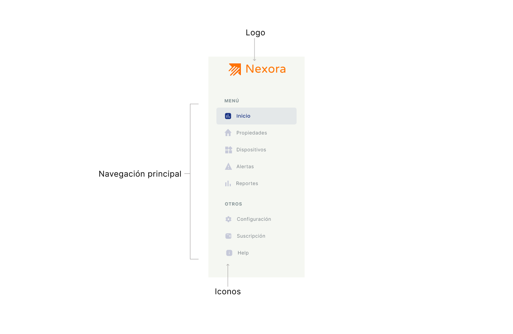
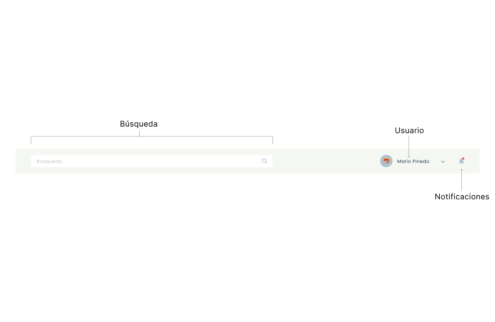
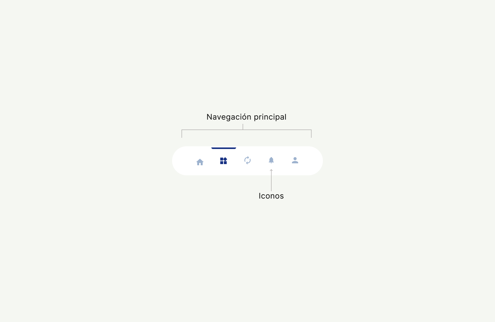
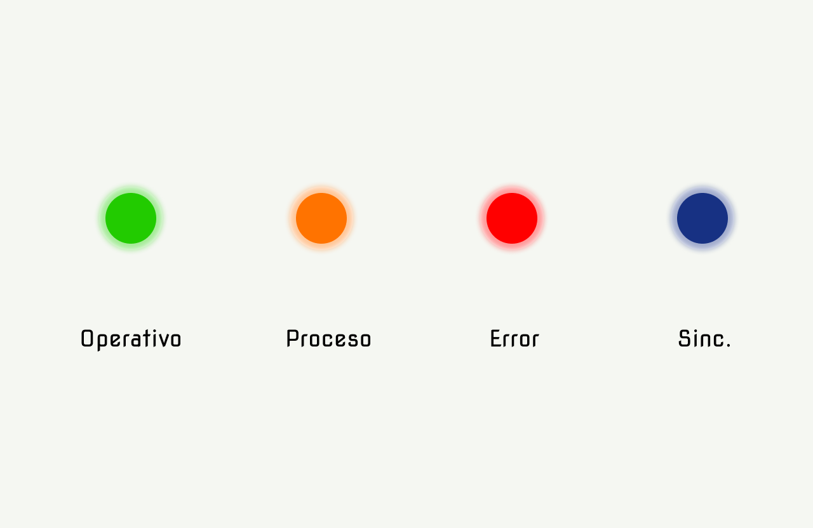

### 5.1.2. Web, Mobile and IoT Style Guide

En esta sección se definen los lineamientos específicos de diseño e interacción para los distintos puntos de contacto del ecosistema **Nexora**, asegurando coherencia con los **General Style Guidelines** previamente establecidos y adaptando la experiencia a las particularidades de cada entorno: web, mobile e interfaces físicas IoT.

Estos lineamientos serán materializados y centralizados en un **Design System en Figma**, que funcionará como repositorio vivo de componentes, patrones y prototipos interactivos, facilitando la colaboración entre equipos de diseño y desarrollo.

---

#### **5.1.2.1. Web Style Guidelines (Aplicación Web - Arrendadores)**

La aplicación web está orientada principalmente a **administradores de propiedades (arrendadores)**, quienes requieren gestionar múltiples inmuebles, monitorear métricas y tomar decisiones operativas.

##### **Enfoque de diseño**

El diseño web prioriza:

* Alta densidad de información controlada
* Visualización estructurada tipo dashboard
* Eficiencia en tareas recurrentes
* Escalabilidad para múltiples propiedades

---

##### **Estructura de interfaz**

Se adopta un patrón de **Dashboard Layout**:

* **Sidebar lateral (izquierda):**

  * Navegación principal (Inicio, Propiedades, Dispositivos, Alertas, Reportes, Configuración, Suscripción, Ayuda)
  * Íconos + texto (colapsable)

 

 

* **Topbar superior:**

  * Búsqueda global
  * Notificaciones
  * Perfil de usuario

 

* **Main Content:**

  * Visualización dinámica según módulo seleccionado

 

---

##### **Componentes clave**

1. **Cards de métricas**

   * Uso de KPIs: consumo energético, estado de dispositivos, incidencias
   * Colores:

     * Azul → información
     * Naranja → acción/alerta leve
     * Rojo (derivado) → error crítico

2. **Tablas inteligentes**

   * Ordenamiento, filtros, búsqueda
   * Paginación optimizada
   * Acciones rápidas (editar, ver, eliminar)

3. **Gráficos y visualización**

   * Line charts → consumo en el tiempo
   * Bar charts → comparativas por unidad
   * Pie charts → distribución de dispositivos

4. **Estados visuales**

   * Online → indicador verde
   * Offline → gris
   * Error → rojo

 

---

##### **Interacciones**

* Hover states claros en botones y filas
* Feedback inmediato en acciones CRUD
* Confirmaciones para acciones críticas
* Uso de modales para edición rápida

 

---

##### **Responsive Design**

* Breakpoints:

  * Desktop ≥ 1280px
  * Tablet ≥ 768px
  
* Sidebar colapsable en tablet
* Priorización de métricas clave en pantallas pequeñas

 

---

##### **Principios aplicados**

* **Optimización cognitiva:** organización jerárquica
* **Scan rápido:** uso de patrones visuales repetitivos
* **Eficiencia operativa:** reducción de clics

---

#### **5.1.2.2. Mobile Style Guidelines (Aplicación Móvil - Arrendatarios)**

La aplicación móvil está orientada a **inquilinos (arrendatarios)**, cuyo objetivo principal es el **control de dispositivos IoT** de manera rápida, simple e intuitiva.

 

---

##### **Enfoque de diseño**

El diseño mobile prioriza:

* Simplicidad extrema
* Acciones rápidas (1–2 taps)
* **Interacción táctil intuitiva
* Contexto en tiempo real

---

##### **Estructura de navegación**

Se adopta un patrón de **Bottom Navigation**:

* Inicio
* Dispositivos
* Automatizaciones
* Notificaciones
* Perfil

 

 

---

##### **Pantallas clave**

1. **Home (Dashboard simplificado)**

   * Estado general del hogar
   * Accesos rápidos (luces, clima, seguridad)

2. **Control de dispositivos**

   * Cards interactivas:

     * Switch (on/off)
     * Slider (intensidad, temperatura)
     * Botones de acción

3. **Automatizaciones**

   * Creación de reglas:

     * “Si X → entonces Y”
   * Ejemplo:

     * Si no hay movimiento → apagar luces

4. **Alertas**

   * Notificaciones push
   * Historial de eventos

 

---

##### **Patrones de interacción**

* **Gestos táctiles:**

  * Swipe → navegación
  * Tap → acción
  * Long press → configuración avanzada

* **Feedback inmediato:**

  * Animaciones suaves (150–300ms)
  * Cambio de estado visual instantáneo

 

---

##### **Componentes clave**

* Toggles grandes (uso con pulgar)
* Botones con alto contraste (naranja)
* Cards con sombras suaves (elevación)

 

---

##### **Accesibilidad**

* Tamaño mínimo táctil: 48px
* Alto contraste
* Uso de iconografía clara

 

---

##### **Principios aplicados**

* Mobile-first
* Minimización de esfuerzo
* Control en tiempo real

 

---

#### **5.1.2.3. IoT Style Guidelines (Interfaz de Dispositivos Físicos)**

Esta sección define los lineamientos para la interacción con **dispositivos físicos IoT** dentro del ecosistema Nexora.

A diferencia de web y mobile, aquí se consideran **interfaces embebidas y comportamiento físico-digital**.

 

---

##### **Enfoque de diseño**

* Interacción mínima
* Feedback inmediato físico/visual
* Alta claridad de estado
* Bajo margen de error

 

---

##### **Tipos de interfaz IoT**

1. **Interfaces sin pantalla**

   * LEDs
   * Botones físicos
   * Indicadores sonoros

2. **Interfaces con pantalla**

   * Displays pequeños (LCD/OLED)
   * Paneles táctiles básicos

 

---

##### **Estándares de feedback**

**Colores LED:**

* Verde → operativo / conectado
* Naranja → proceso / transición
* Rojo → error / alerta
* Azul → sincronización

 

 

---

##### **Interacciones físicas**

* **Botón único**

  * Tap → acción primaria (encender/apagar)
  * Long press → reset o emparejamiento

* **Botones múltiples**

  * Separación clara por función
  * Etiquetado físico o iconográfico

 

---

##### **Sincronización con App**

* Cada acción física debe reflejarse en:

  * App móvil
  * Plataforma web

* Latencia máxima aceptable:

  * < 1 segundo (ideal)

 

---

##### **Estados del dispositivo**

* Conectado
* Desconectado
* En sincronización
* Error técnico
* Bajo nivel de batería

Todos deben ser visibles mediante:

* LED
* App móvil
* Web dashboard

 

---

##### **Principios de diseño IoT**

* Visibilidad del estado
* Redundancia de feedback (visual + digital)
* Robustez operativa
* Consistencia cross-platform

 

---

#### **5.1.2.4. Implementación en Figma (Design System Nexora)**

Para garantizar consistencia y escalabilidad, todos los lineamientos serán implementados en un **Design System centralizado en Figma**, que incluirá:

 

##### **Librerías compartidas**

* Componentes UI (botones, inputs, cards)
* Iconografía
* Tipografía (Exo 2, Inter)
* Colores y tokens de diseño

 

---

##### **Sistemas definidos**

1. **Web Design System**

   * Dashboards
   * Tablas
   * Gráficos

2. **Mobile Design System**

   * Navegación
   * Componentes táctiles
   * Microinteracciones

3. **IoT Interaction System**

   * Estados de dispositivos
   * Flujos de emparejamiento
   * Feedback visual

 

---

##### **Prototipos**

* Flujos completos:

  * Registro
  * Vinculación de dispositivos
  * Gestión de propiedades
  * Control IoT

 

---

##### **Beneficios**

* Consistencia visual total
* Reducción de errores en desarrollo
* Escalabilidad del producto
* Mejor comunicación entre equipos

