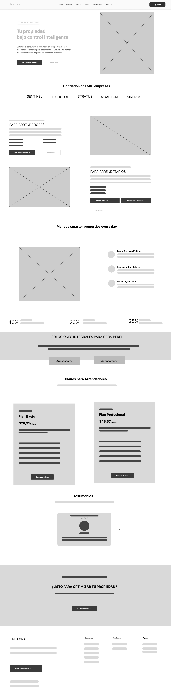
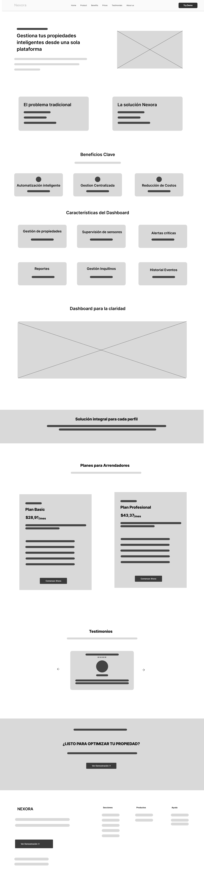
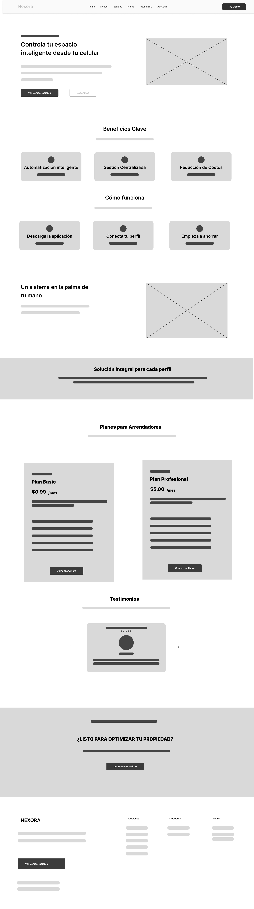
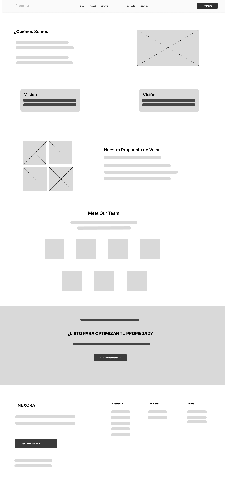
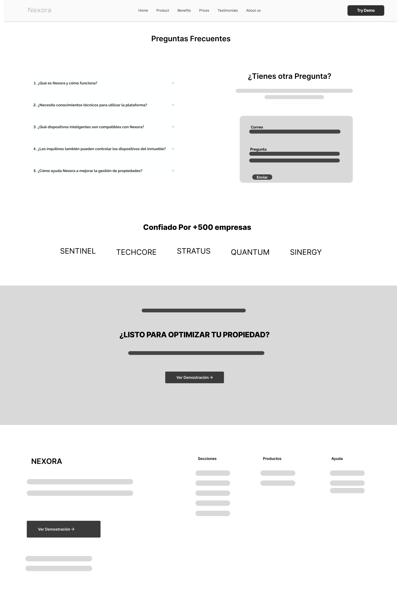
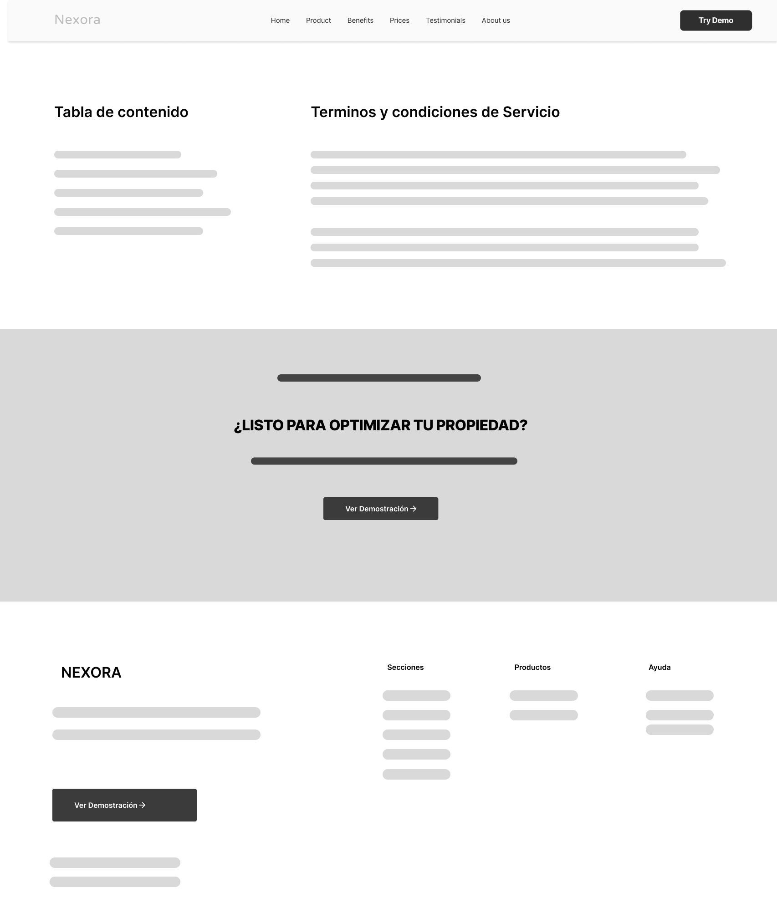

## 5.3.1. Wireframes

Esta sección presenta y explica los Wireframes del Landing Page, diseñados tanto para Desktop Web Browser como para Mobile Web Browser. Estas representaciones de baja/media fidelidad permiten definir la estructura, la disposición de los elementos y el flujo de navegación antes de la aplicación de estilos visuales finales.

### Aplicación de Criterios en el Diseño de Wireframes

Para garantizar una base sólida en la experiencia de usuario, se han aplicado los siguientes criterios fundamentales:

- **Principios y Elementos de Diseño:** Se ha establecido una jerarquía visual clara basada en el tamaño y la posición de los contenedores de información. Se utiliza el contraste de formas y el espaciado (espacio en blanco) para separar secciones y destacar los elementos de interacción principal (botones de llamado a la acción). El diseño sigue un equilibrio visual que facilita el escaneo rápido de la página.
- **Diseño Inclusivo:** Desde la etapa de wireframing, se ha planificado una estructura lógica que facilita la navegación mediante teclado y lectores de pantalla. Se han definido tamaños de botones y áreas de clic que cumplen con los estándares de accesibilidad para dispositivos móviles, asegurando que cualquier usuario, independientemente de sus capacidades, pueda navegar e interactuar con la plataforma de manera efectiva.
- **Arquitectura de Información:** La estructura del contenido se organiza de manera que la propuesta de valor sea lo primero que el usuario perciba (Hero Section). La navegación se ha simplificado para reducir la carga cognitiva, agrupando la información en categorías lógicas como "Arrendadores", "Arrendatarios" y "Preguntas Frecuentes", permitiendo un acceso directo a la información relevante según el perfil del visitante.

### Vistas de los Wireframes

A continuación, se presentan las estructuras diseñadas para las principales vistas del Landing Page:

#### Landing Page Principal (Home)
Representa la puerta de entrada a Nexora. En el wireframe se observa la distribución del Hero Section, los beneficios generales y los accesos rápidos a las secciones de los diferentes tipos de usuarios.

#### Producto para Arrendadores (Property Managers)
Esta vista se enfoca en las herramientas de gestión y beneficios para los propietarios. La estructura resalta los puntos de dolor que resuelve la plataforma mediante listas de beneficios y llamados a la acción para el registro.

#### Producto para Arrendatarios (Tenants)
Diseñado para facilitar la búsqueda y alquiler de propiedades. El wireframe muestra la disposición de los filtros de búsqueda y la presentación de los inmuebles destacados de forma clara y accesible.

#### Sobre Nosotros (About Us)
Estructura dedicada a presentar la misión, visión y el equipo detrás de Nexora, construyendo confianza con el usuario a través de una disposición limpia y narrativa.

#### Preguntas Frecuentes (FAQ)
Organizado mediante una estructura de acordeones que permite condensar gran cantidad de información sin saturar visualmente al usuario, facilitando la búsqueda de respuestas específicas.

#### Términos Legales
Una estructura simplificada que prioriza la legibilidad del texto legal, asegurando que la información importante sobre privacidad y términos de uso sea fácilmente consultable.

