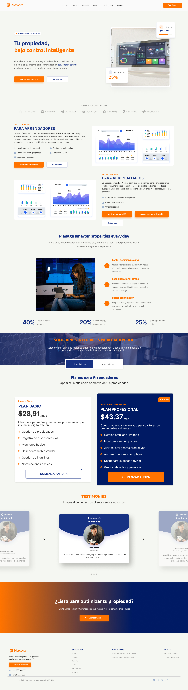
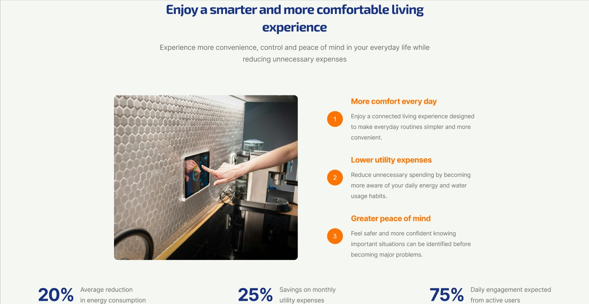
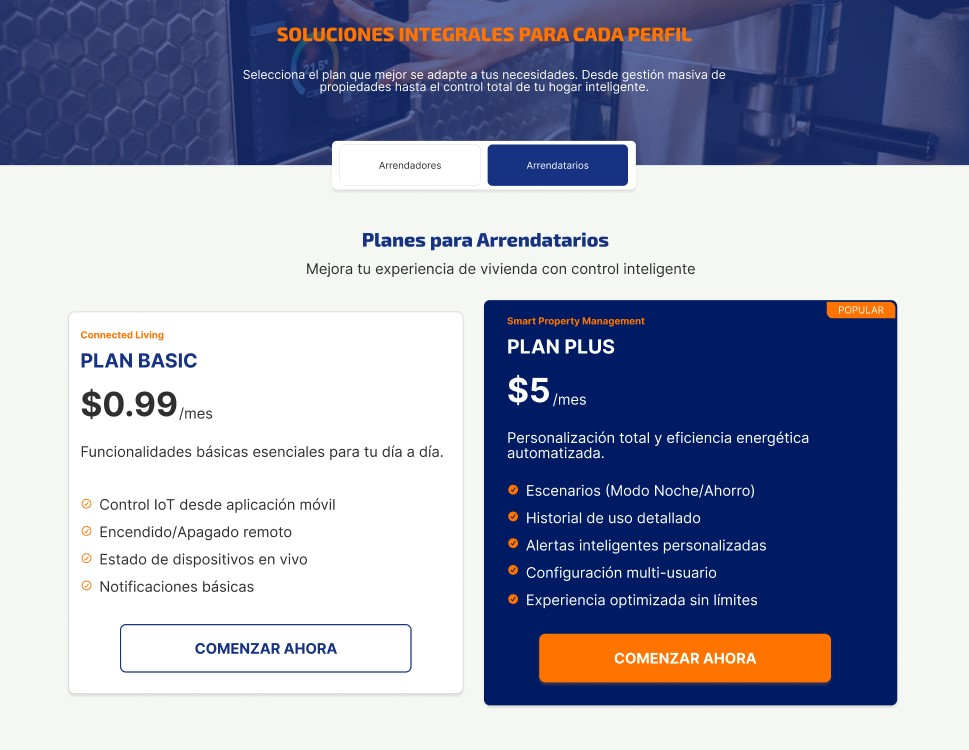
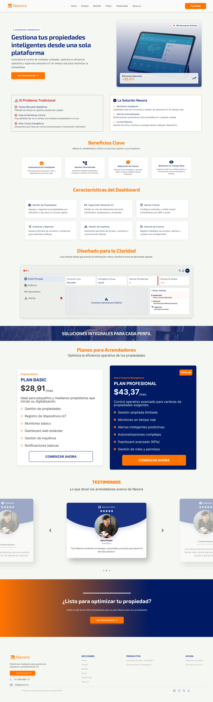
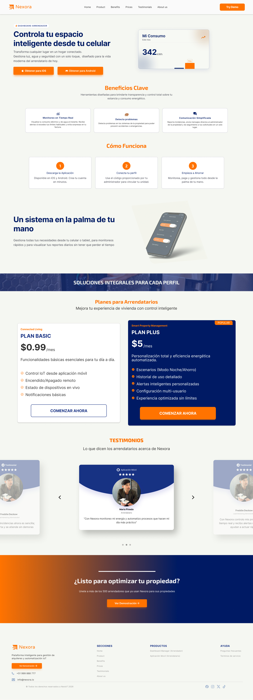
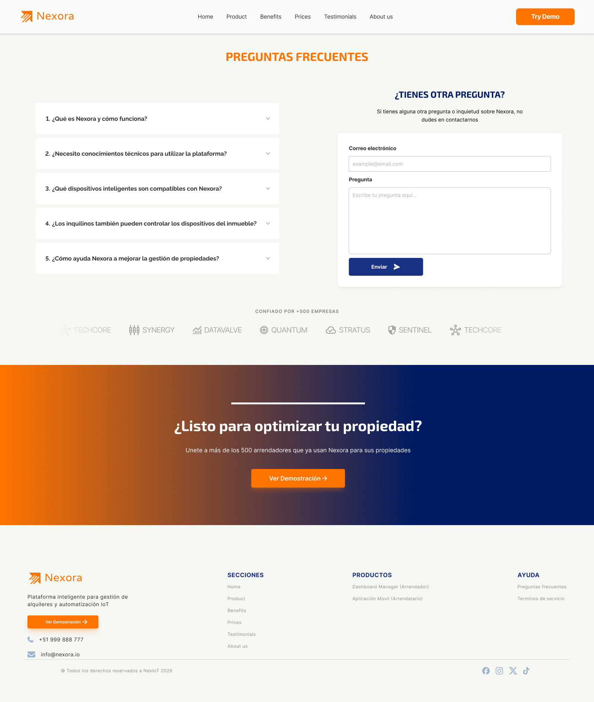

## 5.3.2. Mock-ups

Esta sección presenta y explica los Mock-ups del Landing Page, tanto en su versión para Desktop Web Browser como Mobile Web Browser. En la propuesta y la explicación se evidencia la aplicación de los principios, elementos de diseño, diseño inclusivo y arquitectura de información, así como el Design System establecido para los productos digitales.

### Aplicación de Criterios en el Diseño de los Mock-ups

Para la construcción de estas interfaces de alta fidelidad, se ha seguido un enfoque sistemático basado en los siguientes pilares:

- **Principios y Elementos de Diseño:** Se aplica una jerarquía visual clara utilizando el contraste entre fondos (claros y oscuros) y los colores primarios para los *Call to Action* (CTA). El balance asimétrico y el uso del espacio negativo (white space) guían el flujo de lectura del usuario, asegurando que la información clave y las funcionalidades principales destaquen sin generar saturación cognitiva.
- **Diseño Inclusivo:** La interfaz considera un contraste de color adecuado para garantizar la legibilidad en diferentes condiciones de iluminación y para usuarios con deficiencias visuales. Las tipografías seleccionadas del *Design System* ofrecen excelente lectura en diferentes tamaños de pantalla, y en la versión móvil se ha asegurado que los botones cuenten con un área táctil (hit target) lo suficientemente amplia.
- **Arquitectura de Información:** La navegación es intuitiva y el contenido se estructura de manera lógica. Se divide la propuesta de valor por segmentos de usuarios (Arrendadores y Arrendatarios) permitiendo encontrar la información de manera eficiente. La información fluye de lo general (Hero Section) a lo específico (Características, FAQ).
- **Design System:** Se evidencia un uso consistente de los tokens de diseño (tipografías, paleta de colores, sombras, bordes redondeados). Los componentes de la interfaz como botones, tarjetas (cards) de características, y barras de navegación mantienen una estética unificada en todas las vistas, fortaleciendo la identidad de marca del producto.

### Vistas del Landing Page

### Landing Page Principal (Desktop y Mobile)
La página principal consolida la propuesta de valor de la plataforma. La adaptación a Mobile reorganiza los bloques de contenido verticalmente para facilitar el escaneo (scrolling), mientras que en Desktop aprovecha el espacio horizontal para presentar la información en columnas o distribuciones más amplias.

### Producto para Arrendadores
Esta vista está optimizada para convencer a los propietarios de registrar sus inmuebles. Se emplea la arquitectura de la información para resaltar los beneficios clave, como la seguridad en la gestión, los ingresos garantizados y las herramientas administrativas. El diseño enfoca la atención en los CTAs de registro o contacto.

### Producto para Arrendatarios
Diseñada pensando en la experiencia del inquilino, esta sección destaca la facilidad de búsqueda de inmuebles, la transparencia en los procesos y la seguridad de la plataforma. Se utilizan componentes visuales accesibles y amigables (cards de inmuebles, iconos representativos) para generar confianza y guiar al usuario hacia la exploración de propiedades.

### Preguntas Frecuentes (FAQ)
La sección de FAQ utiliza un diseño limpio con componentes desplegables (accordion) que organizan la información de manera eficiente. Esto evita la sobrecarga visual, mejora la escaneabilidad del texto y permite al usuario, tanto en Desktop como en Mobile, acceder a las respuestas específicas que necesita con un mínimo esfuerzo.

