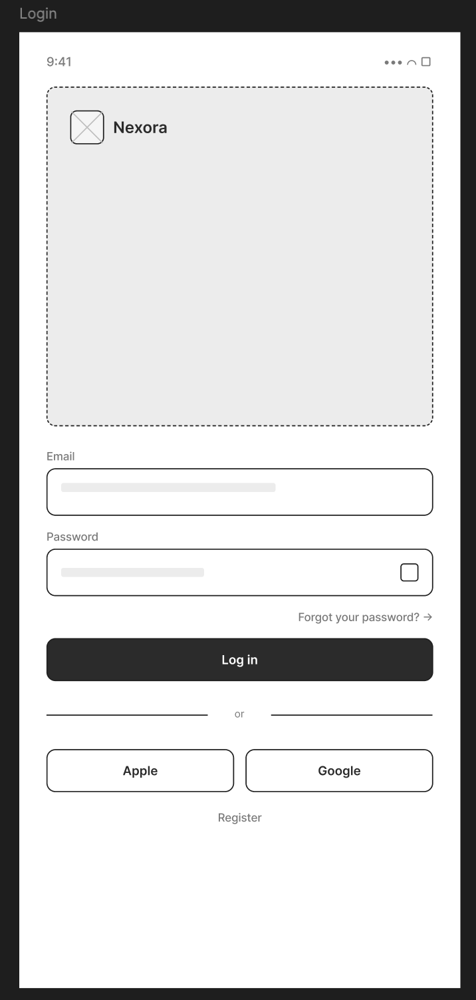
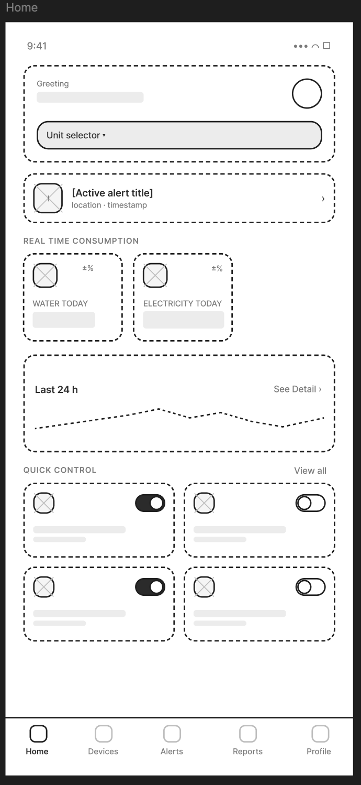
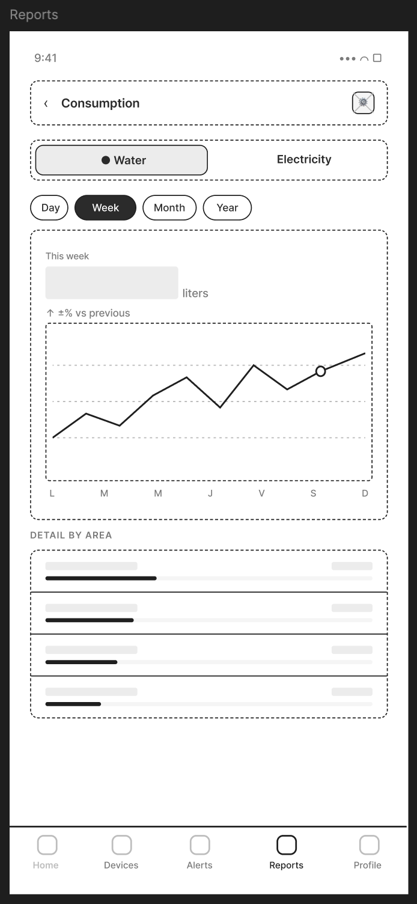
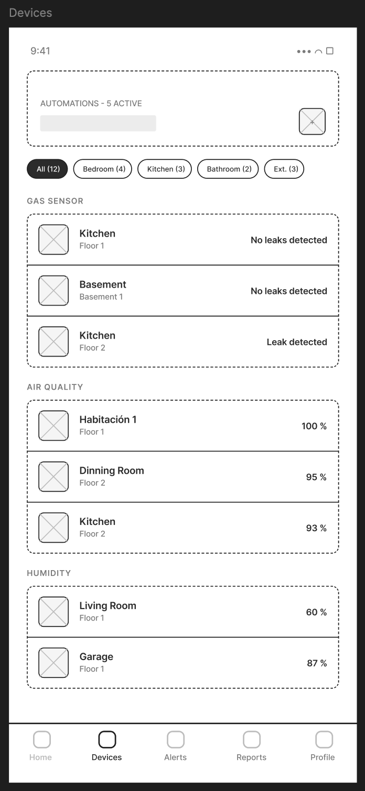

### 5.4. Applications UX/UI Design

#### 5.4.1. Application Wireframes

Los siguientes wireframes representan las pantallas principales de la aplicación móvil Nexora. El diseño aplica principios de jerarquía visual, consistencia de componentes y diseño inclusivo mediante etiquetas claras, contraste suficiente y áreas de toque generosas en todos los controles interactivos.

**Login**

La pantalla de login presenta el logotipo de Nexora en una zona hero de alto contraste, seguida de los campos de Email y Password con sus etiquetas visibles fuera del input. El botón primario Log in ocupa el ancho completo para maximizar el área de toque. Se ofrecen alternativas de autenticación mediante Apple y Google como opciones secundarias, y un enlace Register para nuevos usuarios. 
  

**Home (Dashboard)**

La pantalla principal muestra en la parte superior el saludo personalizado con el selector de unidad activa. Un banner de alerta activa aparece cuando hay incidentes en curso. La sección Real Time Consumption presenta tarjetas métricas para agua y electricidad con el valor del día y su variación porcentual. Un sparkline de las últimas 24 horas ofrece contexto de tendencia sin necesidad de navegar a Reports. La sección Quick Control expone los dispositivos de mayor uso en una grilla de dos columnas con toggles de control directo.

**Detalle de consumo**

La pantalla de consumo permite alternar entre agua y electricidad mediante tabs superiores, y seleccionar la granularidad temporal con pills (Day, Week, Month, Year). El KPI principal muestra el valor del período seleccionado en tipografía grande junto a la unidad y la variación respecto al período anterior. Un gráfico de línea ocupa el área central. La sección Detail by Area desglosa el consumo por habitación con barras horizontales comparativas.

**Incidents Center (Alerts)**

El centro de incidentes presenta tres contadores de resumen (Critical, Warning, Dismissed) en la parte superior, seguidos de tabs de filtrado (All, Active, Dismissed) con el total de registros. Cada card de alerta muestra el nivel de severidad (CRIT/WARN/INFO) mediante una etiqueta coloreada, el timestamp, una descripción breve y el estado actual (Active/Pend.). Las alertas críticas aparecen con un borde diferenciador.

**Devices — Sensores**

La pantalla de Devices organiza los sensores por categoría (Gas Sensor, Air Quality, Humidity) con sus items listados por ubicación. Cada ítem muestra el icono del sensor, el nombre, la ubicación y el valor o estado actual. Los sensores con anomalías como Leak detected se destacan visualmente para captar atención inmediata. Los tabs superiores permiten filtrar por habitación.

**Subscription and Payments**

La pantalla de perfil de suscripción muestra el plan activo (PRO PLAN) con el número de smart units activas y los datos de facturación: fecha de próximo cargo y monto en PEN. La sección Future Invoice presenta el estado de la factura próxima con botones Pay Now y See Details. La lista de Active Smart Units detalla el costo mensual por unidad. La sección Payment Method muestra el método registrado con opción de cambiarlo.

**Devices — Automatizaciones**

La sección de automatizaciones dentro de Devices presenta las reglas agrupadas en Active y Paused. Cada automatización muestra su nombre, las condiciones IF y THEN en chips compactos, y un toggle para activarla o pausarla sin entrar al detalle. El botón + New automation al final de la lista inicia el flujo de creación.

