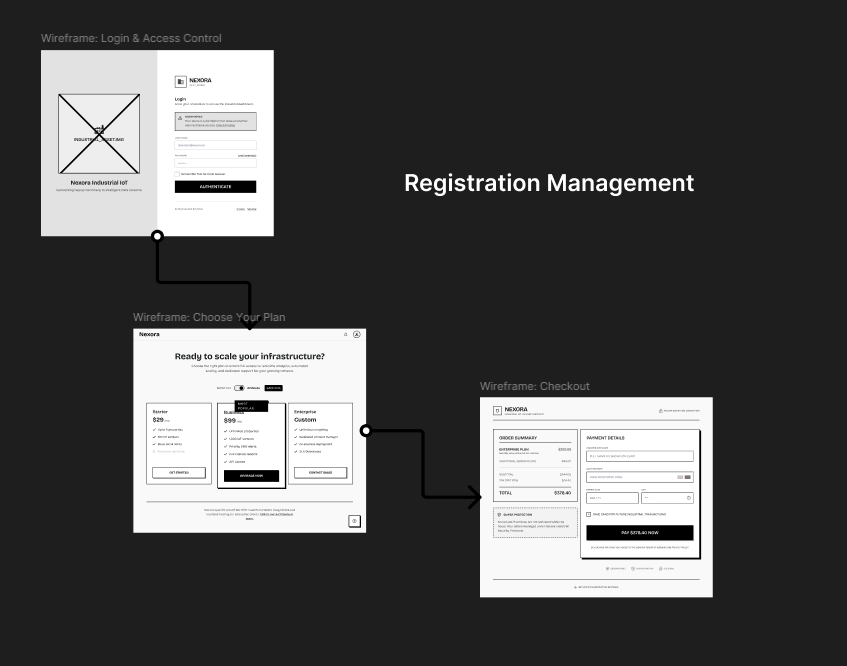
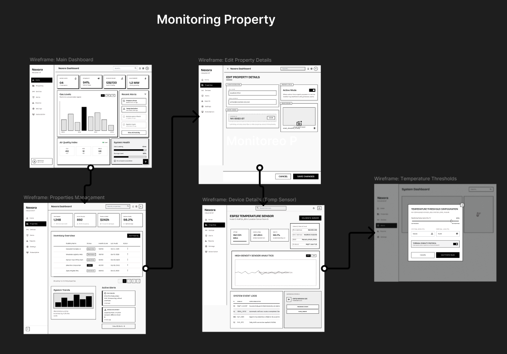
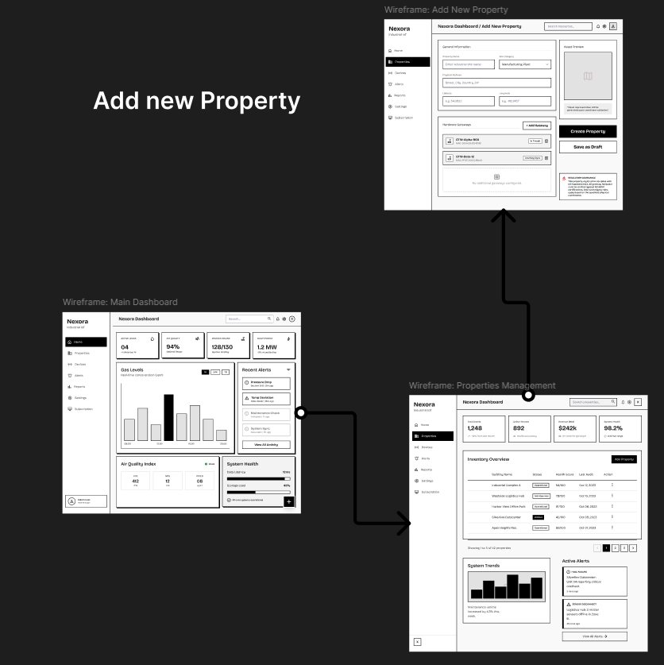
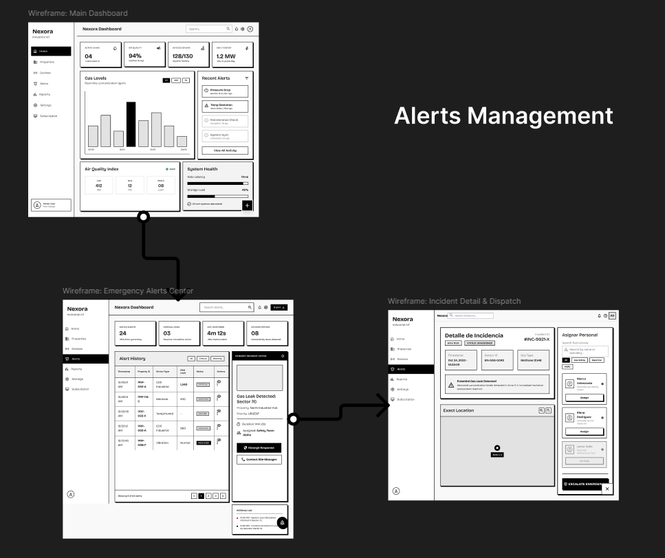
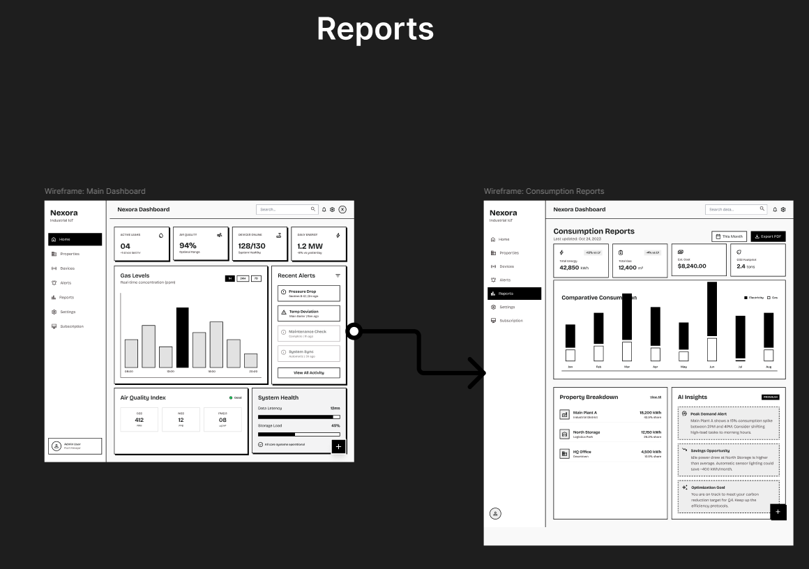
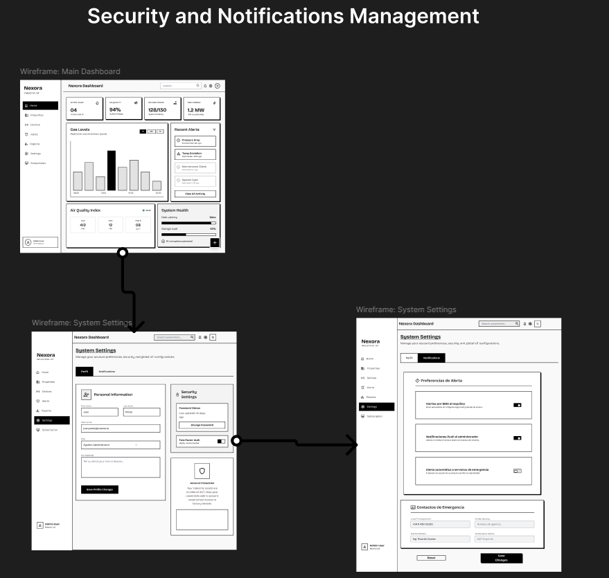
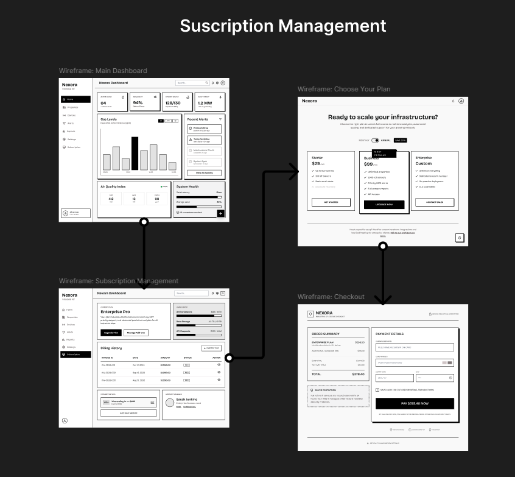
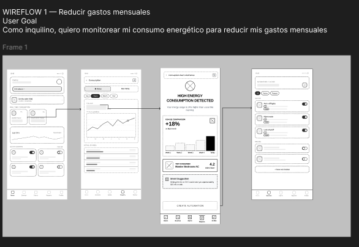
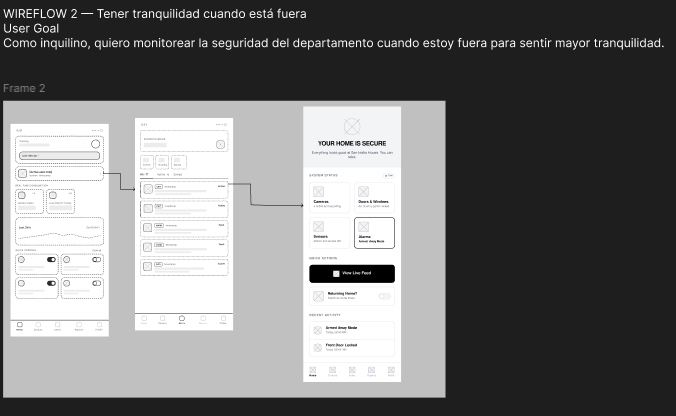
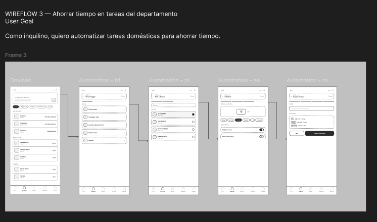

### 5.4.2. Application Wireflows Diagrams

**Wireflows Web App**

**Registration**

**Monitoring property**

**Add property**

**Alerts**

**Reports**

**Security Notifications**

**Subscription**

**Wireflows Mobile App**

**Reduce expenses**

**Security monitoring**

**Automation**

