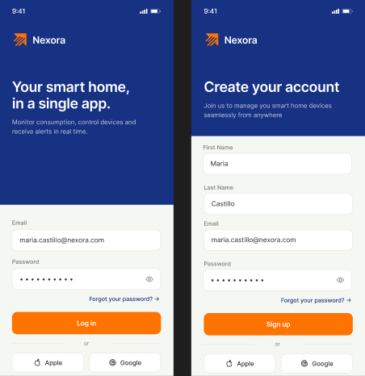
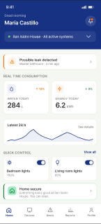
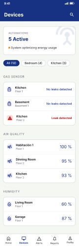
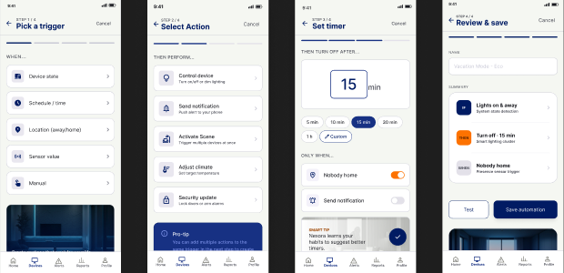
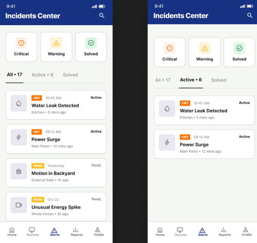
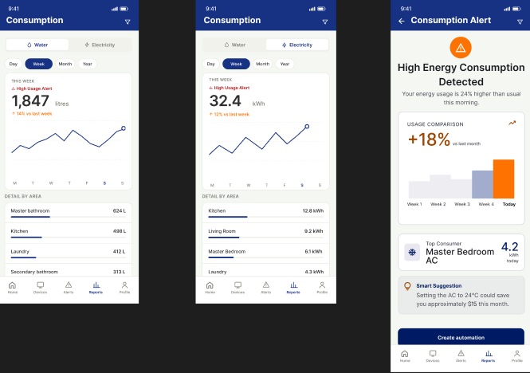
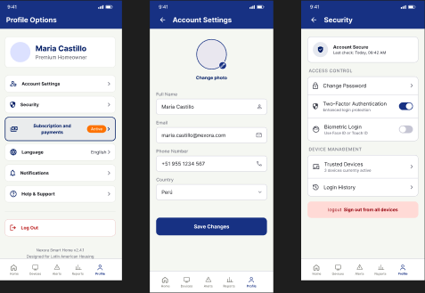
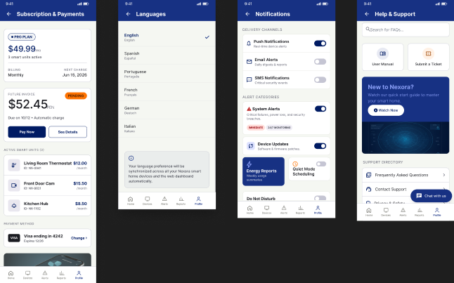

### 5.4.3. Application Mock-ups

#### Aplicación Web
Esta sección presenta y explica los Mock-ups de la aplicación web de Nexora. En la propuesta y la explicación se evidencia la aplicación de los principios de diseño, elementos visuales, diseño inclusivo y arquitectura de información definidos en el Design System del proyecto.

Los mock-ups han sido diseñados siguiendo un enfoque de minimalismo funcional y jerarquía visual, utilizando la paleta de colores corporativa (Naranja #ff7300 y Azul Profundo #173183) para guiar la atención del usuario hacia las acciones críticas y el estado del sistema.

#### **1. Autenticación y Acceso**

El proceso de acceso prioriza la seguridad y la simplicidad. Se utiliza un diseño limpio con un enfoque central en el formulario de login, garantizando que el usuario pueda ingresar a la plataforma sin distracciones.

 

#### **2. Dashboard Principal**

El dashboard es el núcleo de monitoreo en tiempo real. Aplica el principio de **visibilidad del estado del sistema**, presentando métricas clave de consumo energético, hídrico e incidencias activas mediante tarjetas informativas y gráficos dinámicos.

 

#### **3. Gestión de Propiedades**

Esta sección permite la administración jerárquica de inmuebles. Se utiliza una arquitectura de información clara para navegar entre diferentes edificios y unidades, facilitando la visualización de datos específicos por ubicación.

 

#### **4. Gestión de Dispositivos (Device Fleet)**

Permite el control y monitoreo individual de los dispositivos IoT desplegados. Se aplican principios de **feedback inmediato** para mostrar el estado de conexión y el nivel de batería de cada sensor.

 

#### **5. Sistema de Alertas e Incidencias**

Diseñado para una respuesta rápida ante anomalías. Las alertas utilizan códigos de color y tipografía clara para indicar la severidad, permitiendo al administrador tomar decisiones informadas de manera eficiente.

 

#### **6. Reportes y Análisis de Datos**

Sección dedicada al análisis histórico. Utiliza visualizaciones de datos avanzadas para identificar patrones de consumo y eficiencia, apoyando la toma de decisiones basada en datos.

 

#### **7. Gestión de Suscripciones y Facturación**

Interfaz para la administración de planes y pagos. Mantiene la transparencia en el consumo y los costos asociados al servicio, utilizando tablas estructuradas y resúmenes claros.

 

#### **8. Configuración y Perfil**

Permite personalizar la experiencia del usuario y ajustar los parámetros del sistema. Se mantiene la **consistencia** visual en los formularios y controles de selección.

#### Aplicación Móvil
Esta sección presenta y explica los Mock-ups de la aplicación móvil de Nexora. En la propuesta y la explicación se evidencia la aplicación de los principios de diseño, elementos visuales, diseño inclusivo y arquitectura de información definidos en el Design System del proyecto.

Los mock-ups han sido diseñados siguiendo un enfoque de minimalismo funcional y jerarquía visual, utilizando la paleta de colores corporativa (Naranja #ff7300 y Azul Profundo #173183) para guiar la atención del usuario hacia las acciones críticas y el estado del sistema.

#### **1. Autenticación y Acceso**

Las pantallas de autenticación fueron diseñadas para ofrecer un acceso rápido, seguro y sencillo a la aplicación. Se emplea una interfaz minimalista con un formulario centralizado que reduce distracciones y facilita el ingreso del usuario. Además, se utiliza una jerarquía visual clara mediante colores contrastantes y botones destacados para mejorar la identificación de acciones principales.

 

#### **2. Dashboard Principall**

La pantalla principal centraliza la información más relevante del hogar inteligente, permitiendo al usuario visualizar rápidamente métricas de consumo, estado de dispositivos y accesos directos a funcionalidades clave. El diseño prioriza la rapidez de lectura mediante tarjetas organizadas y gráficos simplificados.

 

#### **3. Gestión de Dispositivos**

La pantalla de dispositivos permite al usuario controlar y monitorear los dispositivos inteligentes conectados al departamento. La interfaz prioriza la identificación rápida del estado de cada dispositivo mediante íconos, etiquetas y porcentajes de uso energético.

 

#### **4. Automatización Inteligente**

El flujo de automatización fue diseñado para simplificar la creación de tareas automáticas dentro del hogar inteligente. El proceso guía al usuario paso a paso mediante una estructura secuencial que reduce la complejidad de configuración.

 

#### **5. Centro de Incidentes**

La pantalla de incidentes permite visualizar alertas y eventos detectados dentro del hogar inteligente. Se prioriza la rápida identificación de incidentes críticos mediante etiquetas de color, categorías y niveles de prioridad.

 

#### **6. Monitoreo de Consumo**

Las pantallas de consumo permiten al usuario visualizar estadísticas energéticas y patrones de uso dentro del hogar. El diseño busca facilitar la comprensión de datos mediante gráficos simplificados y métricas destacadas.

 

#### **7. Perfil y Configuración de Cuenta**

La sección de perfil centraliza las configuraciones personales y preferencias del usuario dentro de la aplicación, permitiéndole administrar su información, seguridad, notificaciones, idioma, suscripciones y soporte desde un único punto de acceso. El diseño busca ofrecer una experiencia organizada y fácil de navegar, agrupando las opciones según su funcionalidad para reducir la complejidad y mejorar la accesibilidad.

Además, esta sección brinda al usuario un mayor control sobre la personalización y seguridad de su experiencia dentro del ecosistema IoT, facilitando la gestión de configuraciones importantes de manera rápida e intuitiva.

 

