### 5.4.4. Application User Flow Diagrams

**Userflows Mobile App**

#### **1. Acceso a la Plataforma**

Este User Flow representa el proceso mediante el cual el inquilino accede a la aplicación móvil utilizando sus credenciales. El flujo prioriza una autenticación rápida, segura e intuitiva, permitiendo al usuario ingresar al ecosistema IoT del hogar inteligente de manera sencilla y eficiente.

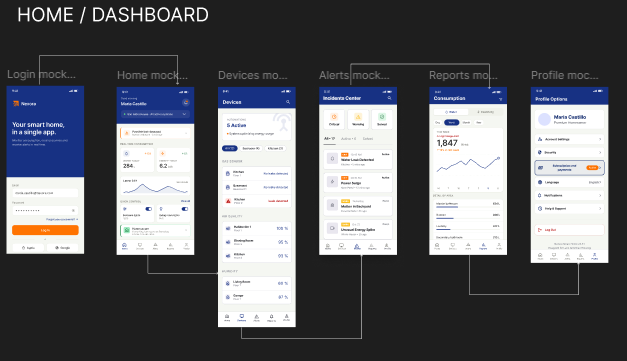

#### **2. Gestión y Control de Dispositivos**

Este User Flow muestra cómo el usuario interactúa con los dispositivos inteligentes conectados al hogar. El flujo permite monitorear estados, activar funciones y administrar dispositivos desde una interfaz centralizada y fácil de usar.

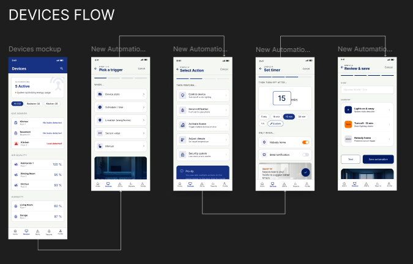

#### **3. Monitoreo de Consumo Energético**

Este User Flow describe el proceso mediante el cual el usuario visualiza y analiza el consumo energético de su departamento. El flujo permite identificar patrones de gasto, acceder a métricas detalladas y recibir alertas preventivas para optimizar el uso de recursos y reducir costos mensuales.

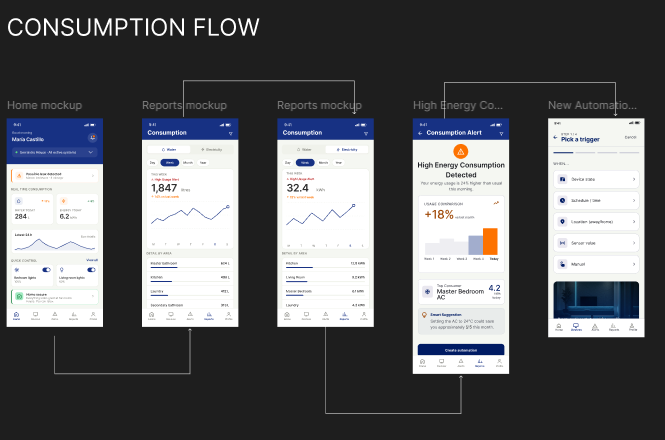

#### **4. Configuración de Seguridad de la Cuenta**

Este User Flow representa la gestión de opciones de seguridad y privacidad dentro de la aplicación. El usuario puede modificar configuraciones de autenticación, permisos y preferencias de protección para mantener un entorno digital seguro.

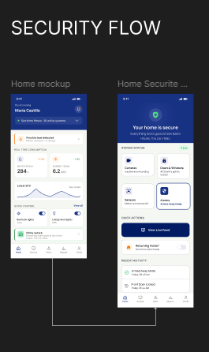

#### **7. Administración de Perfil y Preferencias**

Este User Flow describe el proceso mediante el cual el usuario administra su información personal, preferencias de idioma, notificaciones, suscripciones y opciones de soporte. El flujo centraliza las configuraciones de cuenta para ofrecer una experiencia personalizada y accesible.

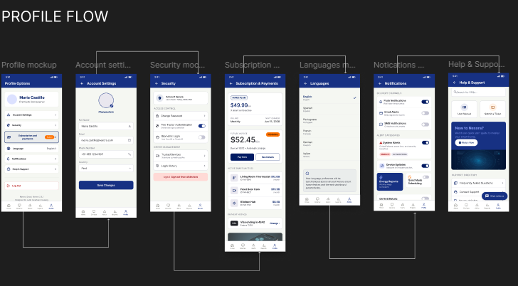

**Userflows Web App**

#### **1. Reducción del Tiempo de Supervisión Manual**

**User Persona:** Carlos Mendoza — Property Administrator

**User Goal:** Reducir el tiempo dedicado a tareas de supervisión manual en múltiples propiedades.

Este User Flow representa el proceso mediante el cual Carlos Mendoza supervisa múltiples propiedades desde un dashboard centralizado, permitiéndole monitorear dispositivos IoT, visualizar métricas operacionales y detectar incidencias de manera eficiente. El flujo prioriza la automatización del monitoreo y la visualización en tiempo real para optimizar la gestión operativa de los inmuebles.

El flujo esperado permite al administrador acceder al dashboard principal, revisar métricas generales, consultar el estado de dispositivos conectados y configurar umbrales de monitoreo. Asimismo, el User Flow incorpora rutas alternativas relacionadas con fallos de sincronización, dispositivos desconectados y errores de telemetría que pueden afectar el monitoreo de las propiedades.

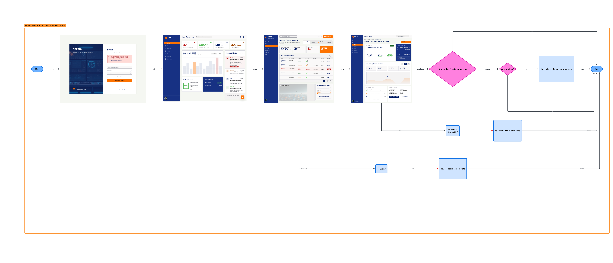

---

#### **2. Reducción de Costos Operativos**

**User Persona:** Carlos Mendoza — Property Administrator

**User Goal:** Disminuir costos operativos mediante monitoreo inteligente y análisis de consumo.

Este User Flow describe el proceso mediante el cual Carlos Mendoza analiza reportes operacionales y métricas de consumo para identificar patrones de gasto excesivo y optimizar el uso de recursos dentro de las propiedades administradas. El flujo se centra en la visualización de reportes analíticos y recomendaciones inteligentes generadas por la plataforma.

La ruta principal contempla el acceso al módulo de reportes, la visualización de métricas históricas y el análisis de insights operacionales. Asimismo, se incluyen rutas alternativas relacionadas con datos incompletos, errores de generación de reportes y fallos de conexión con sensores IoT.

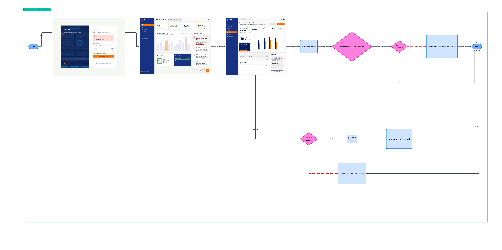

---

#### **3. Resolución Rápida de Incidencias**

**User Persona:** Carlos Mendoza — Property Administrator

**User Goal:** Resolver incidencias de manera más rápida y eficiente.

Este User Flow representa el proceso de gestión de alertas críticas e incidencias operacionales dentro de la plataforma Nexora. El flujo permite al administrador identificar alertas activas, inspeccionar información del incidente y coordinar acciones correctivas desde un centro de monitoreo centralizado.

El flujo esperado contempla la recepción de alertas, el acceso al Emergency Alerts Center y la revisión de detalles del incidente. Además, el User Flow incorpora rutas alternativas relacionadas con indisponibilidad de personal técnico, errores de sincronización y fallos en la obtención de datos de telemetría.

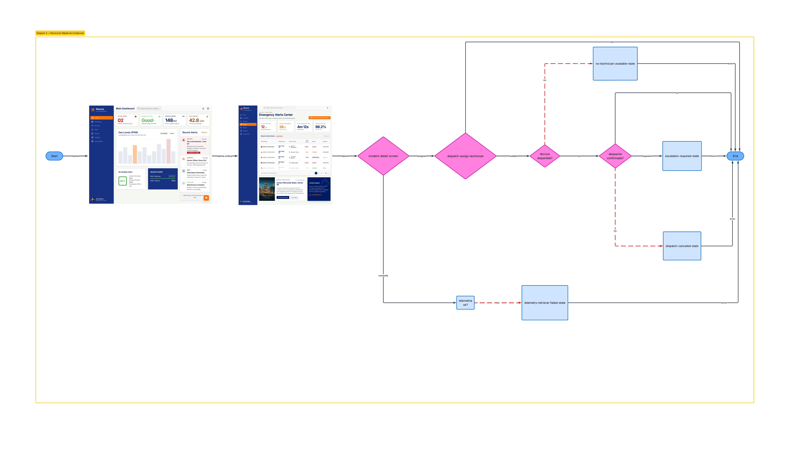

---

#### **4. Mantenimiento de la Satisfacción de los Inquilinos**

**User Persona:** Carlos Mendoza — Property Administrator

**User Goal:** Mantener satisfechos a los inquilinos mediante monitoreo preventivo de infraestructura.

Este User Flow describe cómo el administrador supervisa condiciones ambientales y operacionales de las propiedades para prevenir incidentes que afecten la experiencia de los inquilinos. El flujo busca garantizar una gestión preventiva y continua de la infraestructura inteligente.

La ruta principal permite visualizar métricas ambientales, revisar alertas activas y configurar parámetros de monitoreo preventivo. Asimismo, el flujo contempla rutas alternativas relacionadas con configuraciones inválidas, fallos de notificaciones y errores en la sincronización de dispositivos.

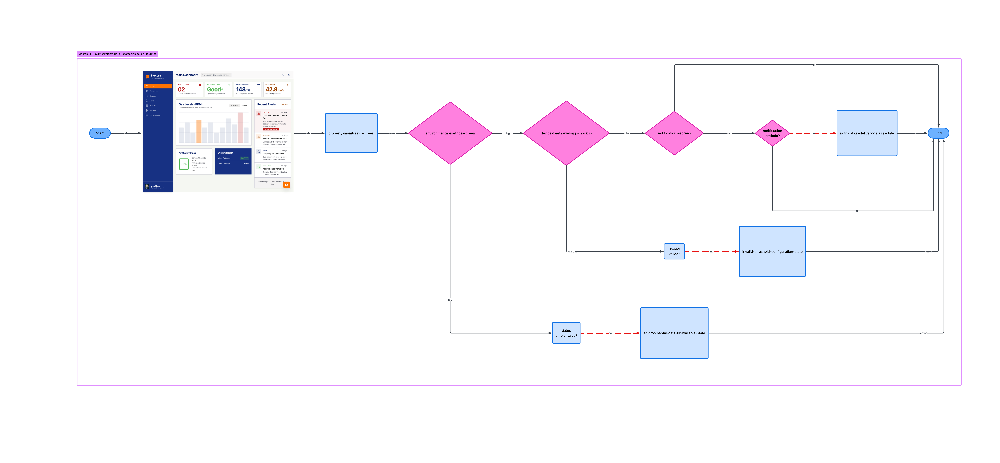

---

#### **5. Control Centralizado de Propiedades**

**User Persona:** Carlos Mendoza — Property Administrator

**User Goal:** Tener mayor control sobre las propiedades y la infraestructura conectada.

Este User Flow representa el proceso de registro y configuración de nuevas propiedades dentro del ecosistema Nexora. El flujo permite al administrador agregar propiedades, vincular gateways IoT y configurar parámetros iniciales de monitoreo desde una interfaz centralizada.

El flujo esperado incluye el registro exitoso de propiedades y la validación de conectividad de dispositivos inteligentes. Del mismo modo, se incorporan rutas alternativas relacionadas con campos incompletos, errores de detección de gateways y problemas de sincronización con la plataforma.

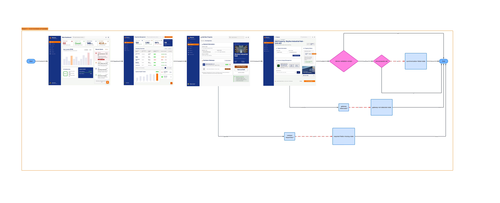

---

#### **6. Reducción de Gastos Mensuales**

**User Persona:** Valeria Torres — Tenant

**User Goal:** Reducir gastos mensuales relacionados con servicios y consumo energético.

Este User Flow describe el proceso mediante el cual Valeria Torres analiza métricas de consumo y configura alertas preventivas para optimizar el uso de recursos dentro de su departamento. El flujo permite acceder a reportes energéticos y recomendaciones inteligentes orientadas a reducir costos operacionales.

La ruta principal contempla la visualización de métricas de consumo, el análisis de tendencias históricas y la configuración de alertas automáticas. Asimismo, el flujo incorpora rutas alternativas relacionadas con ausencia de datos de consumo, errores de sincronización y fallos en la configuración de notificaciones.

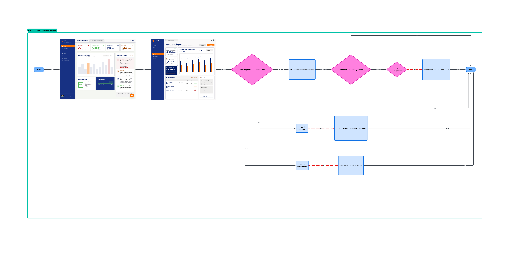

---

#### **7. Monitoreo Remoto y Tranquilidad del Usuario**

**User Persona:** Valeria Torres — Tenant

**User Goal:** Tener mayor tranquilidad cuando se encuentra fuera de casa.

Este User Flow representa el proceso mediante el cual Valeria Torres monitorea remotamente el estado de su departamento utilizando el ecosistema IoT de Nexora. El flujo prioriza la supervisión en tiempo real y la recepción de alertas preventivas relacionadas con seguridad y condiciones ambientales.

La ruta esperada permite visualizar el estado actual de la propiedad y revisar alertas activas desde el dashboard principal. Además, el flujo contempla rutas alternativas relacionadas con fallos de notificación, pérdida de conexión y errores de sincronización entre sensores y la plataforma.

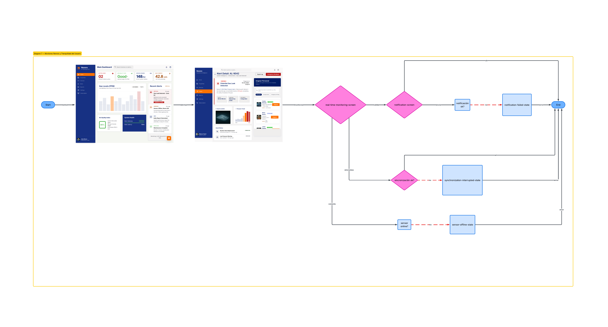

---

#### **8. Optimización de Tareas del Departamento**

**User Persona:** Valeria Torres — Tenant

**User Goal:** Ahorrar tiempo en tareas relacionadas con el monitoreo del departamento.

Este User Flow describe cómo la plataforma centraliza información operativa y automatiza tareas de monitoreo para reducir la necesidad de supervisión manual por parte de la usuaria. El flujo busca simplificar la gestión del entorno inteligente mediante una interfaz intuitiva y automatizada.

La ruta principal permite acceder rápidamente a métricas resumidas, alertas recientes y estados operacionales del departamento. Asimismo, se incluyen rutas alternativas relacionadas con errores de carga de información y retrasos en la actualización de datos.

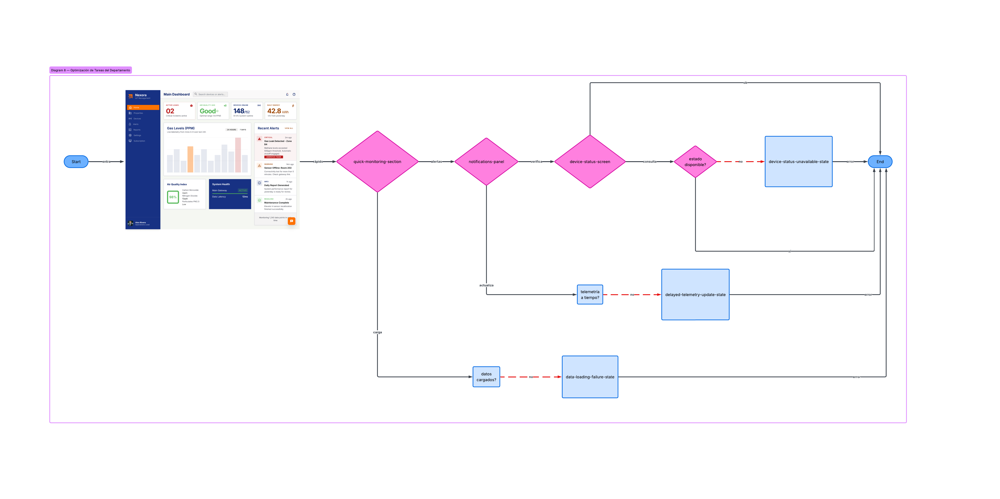

---

#### **9. Monitoreo de Confort y Seguridad Ambiental**

**User Persona:** Valeria Torres — Tenant

**User Goal:** Vivir en un entorno más cómodo y seguro.

Este User Flow representa el monitoreo de condiciones ambientales y parámetros de seguridad dentro del departamento inteligente. El flujo permite visualizar métricas relacionadas con temperatura, estabilidad ambiental y estados de sensores conectados.

La ruta esperada incluye la revisión de indicadores ambientales y la configuración de parámetros de monitoreo. Además, el flujo incorpora rutas alternativas relacionadas con datos ambientales no disponibles, configuraciones inválidas y problemas de sincronización de sensores.

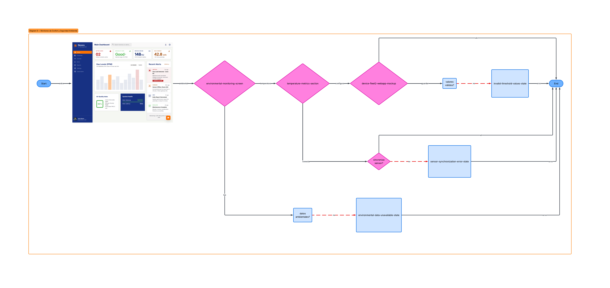

---

#### **10. Prevención de Cobros Inesperados**

**User Persona:** Valeria Torres — Tenant

**User Goal:** Evitar sorpresas en los recibos de servicios mediante alertas preventivas.

Este User Flow describe el proceso de configuración de alertas de consumo y monitoreo preventivo para evitar incrementos inesperados en los gastos mensuales. El flujo permite a la usuaria establecer umbrales personalizados y recibir notificaciones automáticas ante patrones anómalos de consumo.

La ruta principal contempla la configuración exitosa de alertas inteligentes y el monitoreo continuo de métricas de consumo. Asimismo, el flujo incorpora rutas alternativas relacionadas con límites inválidos, errores de configuración y fallos de sincronización de datos energéticos.

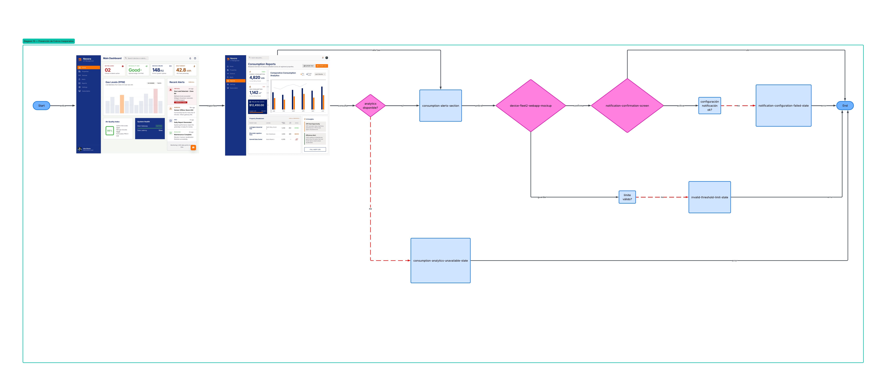

