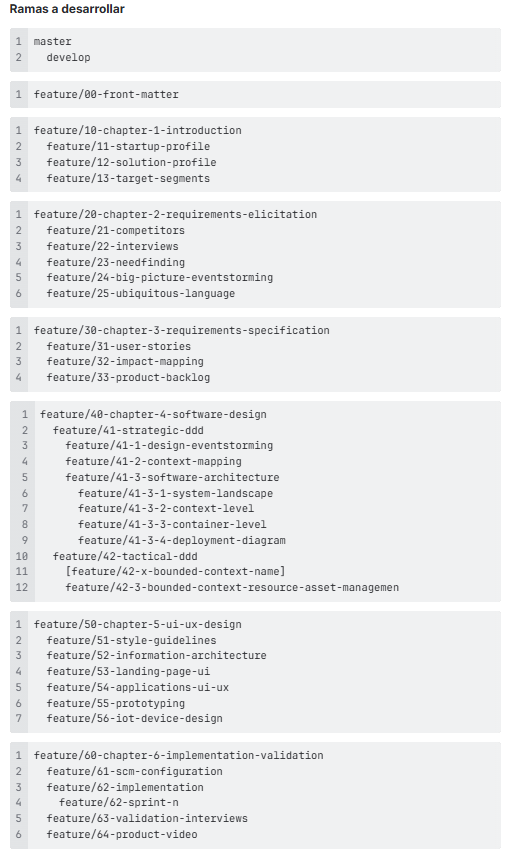

## 6.1.2. Source Code Management

La gestión del código fuente en Nexora se establece como un pilar clave para garantizar colaboración eficiente, trazabilidad de cambios y control de calidad en todos los componentes del sistema (web, mobile e IoT).

Se adopta GitHub como plataforma central y Git como sistema de control de versiones, implementando el modelo GitFlow junto con estándares como Semantic Versioning y Conventional Commits.

---

<br>

### 1. Repositorios en GitHub

La arquitectura del proyecto Nexora se organiza en múltiples repositorios, cada uno enfocado en un producto específico. Esta separación permite mantener independencia de despliegue, escalabilidad y control granular del desarrollo.

| **Repositorio** | **Descripción** | **URL** |
| -------------------------------- | ---------------------------------------------------------------------------------------------------------------------------------------------------------------------------------------- | ------------------------------------------------------------------------------------------------------------------------ |
| **Landing Page** | Contiene el desarrollo de la página de presentación del producto Nexora. Incluye diseño responsivo, contenido informativo y recursos visuales orientados a conversión. | [https://github.com/upc-202610-1ASI0572-6779-NexIot/nexora.website](https://github.com/upc-202610-1ASI0572-6779-NexIot/nexora.website) |
| **Frontend Web Application** | Repositorio de la aplicación web (dashboard) utilizada por administradores de propiedades. Incluye interfaces de gestión, monitoreo y control del sistema IoT. | [https://github.com/upc-202610-1ASI0572-6779-NexIot/nexora.webapp](https://github.com/upc-202610-1ASI0572-6779-NexIot/nexora.webapp) |
| **Web Services (Backend API)** | Contiene los servicios backend responsables de la lógica de negocio, gestión de usuarios, propiedades, reservas y otros datos no relacionados directamente con IoT. Incluye APIs RESTful y pruebas. | [https://github.com/upc-202610-1ASI0572-6779-NexIot/nexora.webservice](https://github.com/upc-202610-1ASI0572-6779-NexIot/nexora.webservice) |
| **Mobile Application (Flutter)** | Repositorio de la aplicación móvil multiplataforma utilizada por inquilinos para controlar dispositivos IoT. | [https://github.com/upc-202610-1ASI0572-6779-NexIot/nexora.mobileapp](https://github.com/upc-202610-1ASI0572-6779-NexIot/nexora.mobileapp) |
| **IoT Integration Layer** | Contiene componentes relacionados con la integración con dispositivos IoT, adaptadores de comunicación y simulaciones de dispositivos. | [https://github.com/upc-202610-1ASI0572-6779-NexIot/nexora.embeddedapp](https://github.com/upc-202610-1ASI0572-6779-NexIot/nexora.embeddedapp) |
| **Edge Service (Backend API)** | Servicio encargado de recibir, procesar y enrutar los datos provenientes de dispositivos IoT. Gestiona la comunicación en tiempo real, telemetría y eventos de sensores. | [https://github.com/upc-202610-1ASI0572-6779-NexIot/nexora.edgeservice](https://github.com/upc-202610-1ASI0572-6779-NexIot/nexora.edgeservice) |
| **Project Documentation** | Repositorio que centraliza la documentación del proyecto: Lean UX, arquitectura, diseño, validaciones y entregables. | [https://github.com/upc-202610-1ASI0572-6779-NexIot/nexora.report](https://github.com/upc-202610-1ASI0572-6779-NexIot/nexora.report) |

<br>

> **Nota:** En el repositorio de *Web Services* se incluyen explícitamente:
>
> * Pruebas unitarias
> * Pruebas de integración
> * Pruebas de aceptación (cuando aplique)

---

<br>

### 2. Workflow de Control de Versiones (GitFlow)

Para estructurar el desarrollo y permitir trabajo paralelo sin afectar estabilidad, se implementa el modelo GitFlow, basado en el artículo “A successful Git branching model”.

---

#### Estructura de ramas

| **Rama**      | **Descripción** |
| ------------- | -------------------------------------------------------------------------- |
| **master**      | Rama principal que contiene versiones estables listas para producción.     |
| **develop**   | Rama de integración donde se consolidan las funcionalidades en desarrollo. |
| **feature/*** | Ramas para nuevas funcionalidades, creadas desde `develop`.                |
| **release/*** | Ramas para preparación de nuevas versiones antes de producción.            |
| **hotfix/***  | Ramas para correcciones críticas en producción.                            |

---

#### Flujo de trabajo

1. Nuevas funcionalidades se desarrollan en ramas `feature/*`
2. Se integran a `develop` mediante `merge --no-ff`
3. Para una versión, se crea una rama `release/*`
4. Se realizan pruebas finales y ajustes
5. Se fusiona en `develop` y `master`
6. En caso de errores críticos en producción → `hotfix/*`

---

<br>

### 3. Convenciones de nombres de ramas

Para mantener consistencia y trazabilidad, se definen convenciones estrictas:

#### Feature Branches

| Formato                          | Ejemplo                                        |
| -------------------------------- | ---------------------------------------------- |
| `feature/<modulo>-<descripcion>` | `feature/auth-login`, `feature/device-pairing` |

---

#### Release Branches

| Formato          | Ejemplo          |
| ---------------- | ---------------- |
| `release/vX.Y.Z` | `release/v1.0.0` |

---

#### Hotfix Branches

| Formato                | Ejemplo                                         |
| ---------------------- | ----------------------------------------------- |
| `hotfix/<descripcion>` | `hotfix/login-error`, `hotfix/token-expiration` |

#### Ejemplo a seguir

Se adjunta algunas ramas definidas por el equipo de Nexora para un desarrollo correcto. <br>
_(Nota: Las convenciones se han establecido en Jira)_



---

<br>

### 4. Versionado Semántico (Semantic Versioning 2.0.0)

Nexora adopta Semantic Versioning para gestionar versiones de software:

Formato:

```
MAJOR.MINOR.PATCH
```

| **Componente** | **Descripción**                                |
| -------------- | ---------------------------------------------- |
| **MAJOR**      | Cambios incompatibles con versiones anteriores |
| **MINOR**      | Nuevas funcionalidades compatibles             |
| **PATCH**      | Correcciones de errores                        |

---

#### Ejemplos aplicados a Nexora

* `v1.0.0` → Primera versión estable del sistema
* `v1.1.0` → Nueva funcionalidad (ej. monitoreo avanzado IoT)
* `v1.1.1` → Corrección de errores menores

---

<br>

### 5. Convenciones de Commits (Conventional Commits)

Para asegurar claridad en el historial del proyecto, se adopta el estándar Conventional Commits.

---

#### Estructura del commit

```
<tipo>(<scope>): <descripcion>
```

---

#### Tipos de commits

| **Tipo**     | **Descripción**     | **Ejemplo**                                             |
| ------------ | ------------------- | ------------------------------------------------------- |
| **feat**     | Nueva funcionalidad | `feat(auth): implementar login con JWT`                 |
| **fix**      | Corrección de error | `fix(api): corregir error en endpoint de dispositivos`  |
| **docs**     | Documentación       | `docs: actualizar arquitectura del sistema`             |
| **style**    | Cambios visuales    | `style(ui): ajustar espaciado en dashboard`             |
| **refactor** | Mejora de código    | `refactor(service): optimizar lógica de inventario`     |
| **test**     | Pruebas             | `test(api): agregar pruebas de integración para assets` |
| **chore**    | Tareas menores      | `chore: actualizar dependencias`                        |