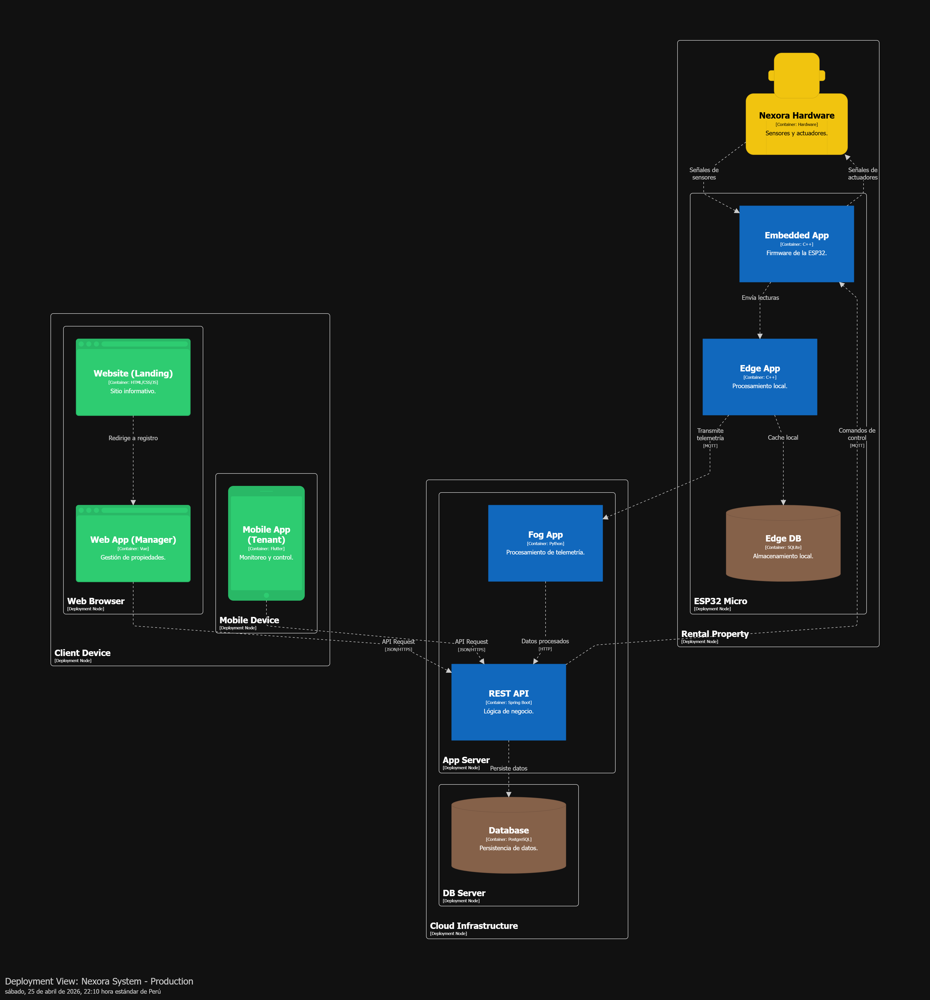

## 6.1.4. Deployment Configuration

En esta sección, el equipo especifica la configuración del despliegue de la solución, incluyendo los pasos necesarios para que, a partir de los repositorios de código fuente, se pueda lograr el despliegue o publicación satisfactorio de cada uno de los productos digitales en la solución (Landing Page, Web Services, Web Applications, Mobile Applications, Embedded Applications u otros productos incluidos).

### Deployment Diagram

A continuación se presenta el Deployment Diagram siguiendo el modelo C4, que ilustra cómo se distribuyen los componentes de la solución Nexora en los distintos proveedores de infraestructura.

### Detalles de Configuración por Producto Digital

#### 1. Landing Page
*   **Plataforma:** GitHub Pages.
*   **Configuración:** Se utiliza GitHub Actions para automatizar el despliegue. Cada vez que se realiza un *push* a la rama `main`, un workflow compila los activos estáticos y los publica en el entorno de producción de GitHub Pages.

#### 2. Web Application (Frontend)
*   **Plataforma:** Vercel.
*   **Configuración:** Vercel está conectado directamente al repositorio de GitHub. El despliegue es automático (CI/CD nativo de Vercel) para cada cambio en la rama principal, gestionando de forma eficiente el escalado y la entrega de contenido (CDN).

#### 3. Mobile Application
*   **Plataforma:** Firebase App Distribution.
*   **Configuración:** Para el desarrollo y pruebas con Flutter, se utiliza Firebase App Distribution. Esto permite distribuir versiones *beta* de la aplicación a los miembros del equipo y testers de forma rápida, integrándose con procesos de CI/CD para generar los binarios (.apk / .ipa).

#### 4. Web Service
*   **Plataforma:** Render.
*   **Configuración:** El Web Service (API REST) se despliega en Render, conectado directamente al repositorio de GitHub (`nexora.webservice`). Cada *push* a la rama principal dispara un build automático (`npm install` y `npm start`) y publica la nueva versión en producción. Las variables de entorno gestionan la conexión segura con la base de datos PostgreSQL en Supabase (`DATABASE_URL`) y la firma de tokens de autenticación (`JWT_SECRET`), asegurando que la lógica de negocio y las APIs estén disponibles y escalen según la demanda de las aplicaciones web y móviles.

#### 5. Edge Service
*   **Plataforma:** Microsoft Azure.
*   **Configuración:** Al igual que el backend, el Edge Service se aloja en Azure. Este componente es crítico para la comunicación con los dispositivos IoT, por lo que se despliega con configuraciones de alta disponibilidad para garantizar la recepción constante de telemetría.
