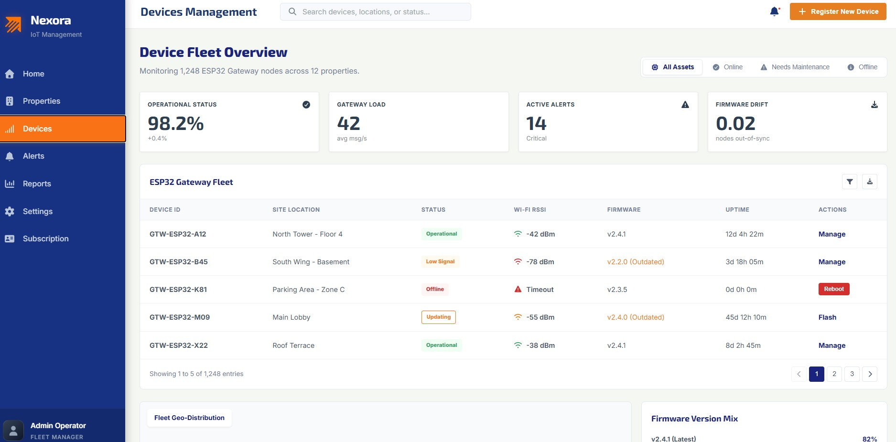
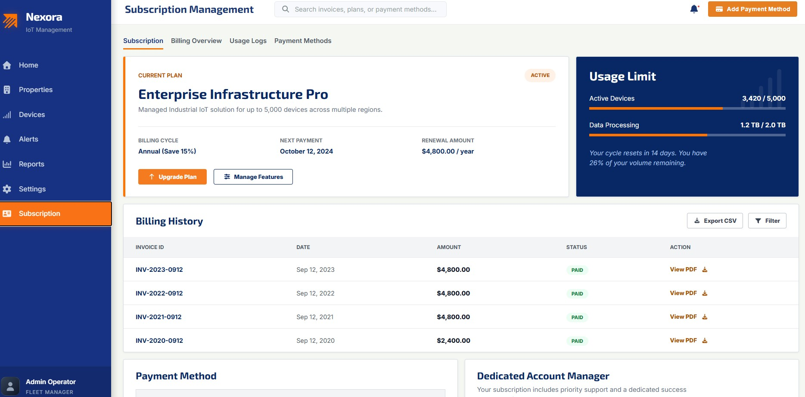
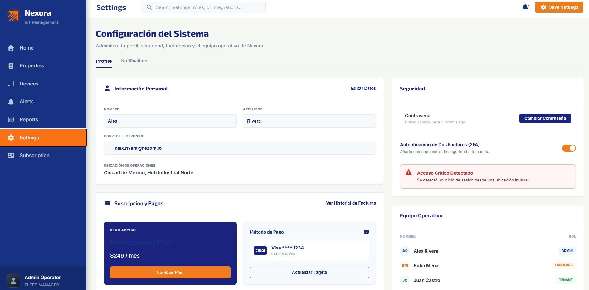

#### 6.2.1.6. Execution Evidence for Sprint Review

Durante el Sprint 1, el equipo de Nexora logró consolidar la base funcional completa tanto del Landing Page como de la Web Application. Los logros principales incluyen:

*   **Landing Page**: Implementación completa de la página de inicio, secciones informativas de productos (Mobile y Web), testimonios y centro de ayuda (FAQ).
*   **Autenticación y Seguridad**: Despliegue del módulo de inicio de sesión y gestión de sesiones de usuario.
*   **Gestión de Propiedades**: Implementación del sistema de administración de propiedades, permitiendo el registro, edición y visualización de unidades habitacionales.
*   **Monitorización y Dashboards**: Desarrollo del panel principal de control con KPIs en tiempo real y visualización general de la flota de dispositivos IoT.
*   **Alertas e Incidentes**: Configuración del centro de notificaciones de emergencia y seguimiento detallado de incidencias críticas.
*   **Reportes de Consumo**: Integración de gráficos estadísticos para el análisis de consumo energético y hídrico, incluyendo analíticas avanzadas.
*   **Suscripciones y Facturación**: Implementación del catálogo de planes, flujo de checkout y gestión de historial de pagos.

A continuación, se presentan las evidencias de la ejecución y el funcionamiento de la plataforma:

##### Pantallas de la Aplicación

| Vista | Descripción | Captura de Pantalla |
| :--- | :--- | :--- |
| **Login** | Interfaz de acceso seguro para usuarios administradores y residentes. |  |
| **Dashboard Principal** | Panel de control centralizado con indicadores clave (KPIs) y estado del sistema. |  |
| **Gestión de Dispositivos** | Vista detallada de la flota de dispositivos instalados y su estado de conexión. |  |
| **Administración de Propiedades** | Módulo para la gestión y organización de las propiedades registradas en Nexora. |  |
| **Suscripciones** | Visualización de datos de suscripción. |  |
| **Centro de Alertas** | Interfaz de gestión de emergencias y notificaciones en tiempo real. |  |
| **Configuración** | Interfaz de configuración de la aplicación. |  |

##### Video de Demostración

En el siguiente enlace se puede visualizar el recorrido funcional de la aplicación, ilustrando la navegación fluida entre módulos y la visualización de datos en tiempo real:

**Enlace al Video:** [https://1drv.ms/v/c/ec31a436d835fad6/IQB6Wk_CLkreRb0JIaixSE6tASLNX9u8MeauqWRv3ikCOAU?e=CI7eXW](https://1drv.ms/v/c/ec31a436d835fad6/IQB6Wk_CLkreRb0JIaixSE6tASLNX9u8MeauqWRv3ikCOAU?e=CI7eXW)

