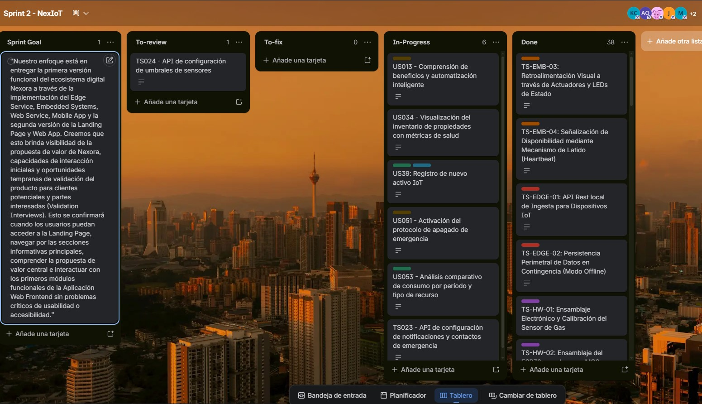

#### 6.2.2.3. Sprint Backlog 2

El Sprint Backlog 2 reúne el conjunto de User Stories y tareas técnicas definidas para la implementación de la versión final de la Landing Page comercial y la consolidación de la segunda versión de la Web Application basada en datos dinámicos y persistentes. Asimismo, durante este ciclo se integró la primera versión funcional de la Mobile Application operando bajo una arquitectura de datos simulados (FakeAPI), en paralelo con el despliegue del Backend corporativo, el desarrollo de la primera versión del EdgeService para telemetría de gases y la programación inicial de la Embedded Application para la simulación de consumo de agua, energía y lecturas de voltaje en tiempo real.

Asimismo, el Sprint Backlog permitió organizar el trabajo colaborativo del equipo mediante la descomposición de cada User Story en tareas específicas, facilitando el seguimiento del avance, la asignación de responsabilidades y el control del estado de desarrollo dentro del Sprint Board, sirviendo además como el núcleo de software evaluado durante las primeras entrevistas de validación con usuarios del segmento objetivo.

**Sprint Board URL:**
`https://trello.com/invite/b/6a18757b6ac2253d93654cef/ATTIff24fd95adda159783fb84dcded55b368BE28E3C/sprint-2-nexiot`

**Sprint 2 Backlog:**

## Sprint 2

| User Story |                                | Work-Item / Task |                                             |                                                                |                        |                   |            |
| ---------- | ------------------------------ | ---------------- | ------------------------------------------- | -------------------------------------------------------------- | ---------------------- | ----------------- | ---------- |
| **Id**     | **Title**                      | **Id**           | **Title**                                   | **Description**                                                | **Estimation (Hours)** | **Assigned To**   | **Status** |
| US01 | Acceso rápido a información | T-01 | Implementar navegación y accesos rápidos en la Landing Page | Creación de la barra de navegación responsive y accesos rápidos en la Landing Page. | 4 | Maria Fernanda Peña Riofrio | Done |
| US02 | Experiencia intuitiva de navegación | T-02 | Diseñar menú interactivo y transiciones de página | Diseño del menú interactivo, animaciones de transición y navegación interna del sitio. | 6 | Maria Fernanda Peña Riofrio | Done |
| US03 | Adaptabilidad multidispositivo | T-03 | Configurar estilos responsivos para móvil y tablet | Ajuste de estilos CSS y media queries para optimizar la visualización en dispositivos móviles. | 5 | Maria Fernanda Peña Riofrio | Done |
| US09 | Comprensión de beneficios operativos y solución inmobiliaria | T-04 | Desarrollar sección de beneficios para arrendadores | Desarrollo de las secciones de beneficios operativos y ventajas para arrendadores. | 5 | Maria Fernanda Peña Riofrio | Done |
| US11 | Monitoreo IoT en tiempo real | T-05 | Integrar visualización en vivo de telemetría de dispositivos | Integración de componentes gráficos en tiempo real para visualizar telemetría de sensores. | 8 | Jorge Alexandro Linares Arroyo | Done |
| US12 | Información de aplicación para arrendatarios | T-06 | Diseñar sección informativa para arrendatarios | Maquetación de la sección informativa de la aplicación móvil dirigida a arrendatarios. | 4 | Jhosep Jamil Argomedo Camacho | Done |
| US13 | Comprensión de beneficios y automatización inteligente | T-07 | Implementar sección de automatización de la Landing Page | Implementación de tarjetas informativas sobre automatización y control inteligente. | 4 | Kevin Alexander Castañeda Llanos | Done |
| US33 | Visualización y acceso al panel de alertas recientes | T-08 | Crear componente de alertas recientes en el dashboard | Diseño del panel resumen de alertas recientes y críticas en el dashboard principal. | 6 | Kevin Alexander Castañeda Llanos | Done |
| US34 | Visualización del inventario de propiedades con métricas de salud | T-09 | Desarrollar tabla de inventario de propiedades con estados | Desarrollo de la tabla con el listado de propiedades vinculadas y sus indicadores de salud. | 7 | Jhosep Jamil Argomedo Camacho | Done |
| US35 | Registro de nueva propiedad con vinculación de gateway IoT | T-10 | Crear formulario de registro y flujo de vinculación de gateway | Creación del formulario de registro y flujo de vinculación de un nuevo gateway IoT. | 8 | Jhosep Jamil Argomedo Camacho | Done |
| US37 | Gestión de vinculación de dispositivos en propiedad | T-11 | Implementar endpoints y UI para asociar dispositivos a propiedades | Programación de la interfaz para asociar, desvincular o editar dispositivos en propiedades. | 6 | Jhosep Jamil Argomedo Camacho | Done |
| US39 | Registro de nuevo activo IoT | T-12 | Desarrollar vista de registro de nuevos activos/dispositivos | Diseño de la interfaz de registro de nuevos activos IoT especificando tipo y ubicación. | 5 | Kevin Alexander Castañeda Llanos | Done |
| US46 | Gestión de respuesta a incidencia crítica activa | T-13 | Crear flujo de atención de incidencias y cambio de estados | Implementación de flujos de interacción para el cambio de estado de incidencias críticas. | 8 | Jhosep Jamil Argomedo Camacho | In Progress |
| US47 | Exportación de reporte de incidencias | T-14 | Implementar descarga en formato estructurado de incidencias | Programación de la lógica para descargar reportes de incidencias en formatos legibles. | 4 | Kevin Alexander Castañeda Llanos | Done |
| US49 | Visualización del detalle completo de una incidencia crítica | T-15 | Diseñar modal/vista de detalle extendido de incidencias | Desarrollo de la vista modal interactiva con el detalle completo de incidencias críticas. | 6 | Kevin Alexander Castañeda Llanos | Done |
| US51 | Activación del protocolo de apagado de emergencia | T-16 | Implementar botón de pánico y lógica de apagado remoto | Configuración del botón de parada de emergencia y control remoto del estado del actuador. | 8 | Kevin Alexander Castañeda Llanos | Done |
| US52 | Visualización de métricas de consumo del período actual | T-17 | Desarrollar gráficos de consumo eléctrico y hídrico del mes | Desarrollo de widgets y gráficas con el consumo eléctrico e hídrico del período actual. | 6 | Kevin Alexander Castañeda Llanos | In Progress |
| US53 | Análisis comparativo de consumo por período y tipo de recurso | T-18 | Integrar filtros de fecha y comparación de consumo en gráficos | Integración de filtros y vistas comparativas de consumo histórico en la aplicación. | 6 | Sebastian Ramirez Tello | Done |
| US57 | Gestión del perfil personal y ubicación de operaciones | T-19 | Desarrollar formulario de edición de perfil y operaciones | Creación de las vistas para la gestión del perfil del usuario y ubicación de operaciones. | 4 | Sebastian Ramirez Tello | Done |
| US59 | Gestión de alertas de acceso crítico detectado | T-20 | Implementar alerts push y visuales de accesos no autorizados | Configuración de notificaciones visuales y auditivas en caso de alertas de acceso crítico. | 6 | Jhosep Jamil Argomedo Camacho | Done |
| US60 | Gestión del equipo operativo | T-21 | Crear sección de visualización y edición de miembros del equipo | Desarrollo del panel CRUD para la administración del equipo y personal operativo. | 5 | Kevin Alexander Castañeda Llanos | Done |
| TS07 | API de vinculación y gestión de gateways en propiedad | T-22 | Desarrollar endpoints POST/DELETE para gateways en propiedad | Desarrollo de endpoints de la API para vincular y desvincular gateways a propiedades. | 8 | Jhosep Jamil Argomedo Camacho | Done |
| TS08 | API de gestión de arrendatarios en propiedad | T-23 | Desarrollar CRUD de arrendatarios en el Web Service | Creación del controlador y endpoints para la administración de arrendatarios. | 6 | Mauricio Muñoz Vilcapoma | In Progress |
| TS09 | API de consulta de la flota de dispositivos | T-24 | Desarrollar endpoints de consulta y paginación de dispositivos | Desarrollo de endpoints GET con paginación para consultar la flota de dispositivos. | 6 | Jhosep Jamil Argomedo Camacho | Done |
| TS11 | API de logs y perfil de hardware de dispositivo | T-25 | Implementar endpoints para consultar logs técnicos de hardware | Implementación de endpoints para obtener logs de eventos y el perfil de hardware. | 6 | Sebastian Ramirez Tello | Done |
| TS12 | API de acciones remotas sobre dispositivo | T-26 | Desarrollar endpoints para enviar comandos a los dispositivos | Desarrollo de la API para enviar comandos remotos de reinicio y calibración al hardware. | 8 | Jorge Alexandro Linares Arroyo | Done |
| TS13 | API de consulta y filtrado de alertas | T-27 | Desarrollar endpoints para filtrado y consulta de alertas | Desarrollo de endpoints con filtros de fecha y prioridad para alertas. | 6 | Jorge Alexandro Linares Arroyo | Done |
| TS14 | API de detalle y actualización de estado de alerta | T-28 | Desarrollar endpoint de actualización de estado de alertas | Programación de endpoints PUT para actualizar el estado de alertas de emergencia. | 5 | Kevin Alexander Castañeda Llanos | Done |
| TS15 | API de asignación de técnicos y personal de emergencia | T-29 | Implementar endpoints para asignar personal a incidencias | Implementación de endpoints para asignar personal a incidencias. | 6 | Kevin Alexander Castañeda Llanos | Done |
| TS16 | API de acción de apagado de emergencia | T-30 | Desarrollar endpoint de ejecución de apagado de emergencia | Desarrollo de endpoints REST para ejecutar la acción de apagado remoto de emergencia. | 8 | Sebastian Ramirez Tello | In Progress |
| TS17 | API de exportación de reporte de incidencias | T-31 | Desarrollar lógica de backend para exportación de reportes | Programación de la API de backend para generar y descargar archivos de reporte de incidencias. | 5 | Sebastian Ramirez Tello | In Progress |
| TS18 | API de métricas de consumo del período activo | T-32 | Implementar endpoints de agregación de consumo periódico | Desarrollo de endpoints de agregación de datos de consumo del período activo. | 6 | Kevin Alexander Castañeda Llanos | Done |
| TS19 | API de analítica comparativa de consumo | T-33 | Desarrollar consultas analíticas de consumo entre periodos | Desarrollo de consultas agregadas para comparar analíticas de consumo entre periodos. | 6 | Mauricio Muñoz Vilcapoma | Done |
| TS21 | API de exportación de reportes de consumo | T-34 | Desarrollar lógica de backend para exportar datos de consumo | Implementación de endpoints para exportar reportes de consumo en formatos CSV/Excel. | 5 | Kevin Alexander Castañeda Llanos | Done |
| TS22 | API de gestión del perfil de usuario | T-35 | Implementar endpoints de consulta y edición de perfil | Creación de la API de perfil de usuario para gestionar credenciales y datos personales. | 4 | Andrea Namie O'Higgins Rosales | Done |
| TS23 | API de configuración de notificaciones y contactos de emergencia | T-36 | Desarrollar endpoints para persistir contactos y config de alertas | Desarrollo de endpoints para configurar notificaciones y contactos de emergencia. | 5 | Jhosep Jamil Argomedo Camacho | Done |
| TS24 | API de configuración de umbrales de sensores | T-37 | Implementar endpoints para definir límites de alerta por sensor | Implementación de endpoints para definir y actualizar umbrales de sensores. | 6 | Andrea Namie O'Higgins Rosales | Done |
| TS-EMB-01 | Inicialización de Hardware, Lectura de Sensores y Consolidación de Payload | T-38 | Inicializar hardware y lectura de sensores en ESP32 | Programación del firmware para inicializar hardware, leer sensores y consolidar el payload. | 6 | Mauricio Muñoz Vilcapoma, Kevin Alexander Castañeda Llanos, Jorge Alexandro Linares Arroyo | Done |
| TS-EMB-02 | Transmisión de Datos por HTTP y Tolerancia a Fallos de Red Local | T-39 | Implementar cliente HTTP y reintento en caso de fallo de red | Implementación de la transmisión por HTTP y mecanismo de almacenamiento temporal local. | 8 | Kevin Alexander Castañeda Llanos, Jorge Alexandro Linares Arroyo, Mauricio Muñoz Vilcapoma | Done |
| TS-EMB-03 | Retroalimentación Visual a través de Actuadores y LEDs de Estado | T-40 | Configurar LEDs de estado y actuadores visuales en placa | Configuración del firmware para activar actuadores físicos y LEDs según estado. | 5 | Kevin Alexander Castañeda Llanos, Jorge Alexandro Linares Arroyo, Mauricio Muñoz Vilcapoma | Done |
| TS-EMB-04 | Señalización de Disponibilidad mediante Mecanismo de Latido (Heartbeat) | T-41 | Implementar envío periódico de latidos de disponibilidad | Programación de la señalización de disponibilidad mediante mecanismo de heartbeat. | 4 | Kevin Alexander Castañeda Llanos, Jorge Alexandro Linares Arroyo, Mauricio Muñoz Vilcapoma | Done |
| TS-EDGE-01 | API Rest local de Ingesta para Dispositivos IoT | T-42 | Desarrollar API local de ingesta de datos en el gateway | Desarrollo de la API REST local en el Gateway para recibir tramas del ESP32. | 8 | Jorge Alexandro Linares Arroyo | Done |
| TS-EDGE-02 | Persistencia Perimetral de Datos en Contingencia (Modo Offline) | T-43 | Implementar almacenamiento local SQLite en gateway en modo offline | Implementación del modo offline con almacenamiento en base de datos local SQLite. | 8 | Jorge Alexandro Linares Arroyo | Done |
| TS-HW-01 | Ensamblaje Electrónico y Calibración del Sensor de Gas | T-44 | Ensamblar prototipo físico y calibrar sensor de gas MQ2 | Ensamblaje del circuito y calibración física del sensor de gas analógico MQ-2. | 6 | Todo el equipo | Done |
| TS-HW-02 | Ensamblaje del ESP32 con el sensor MQ2 para detección de gases | T-45 | Montar circuito electrónico ESP32 con módulo sensor de gas | Conexión electrónica y soldadura del ESP32 con el sensor MQ2 en placa de desarrollo. | 5 | Todo el equipo | Done |

