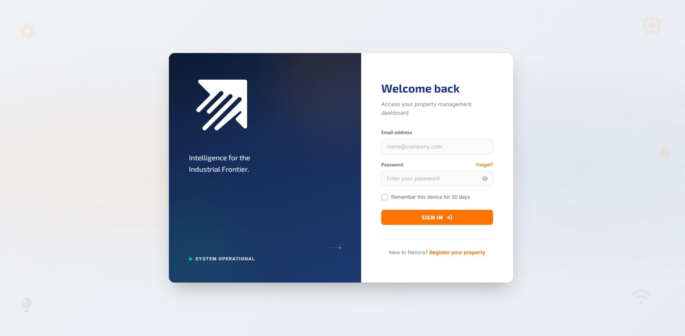
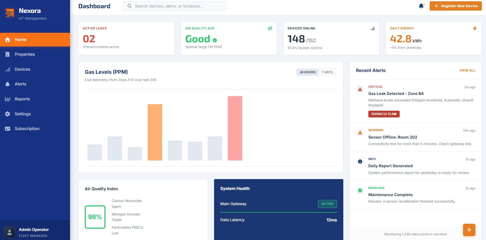
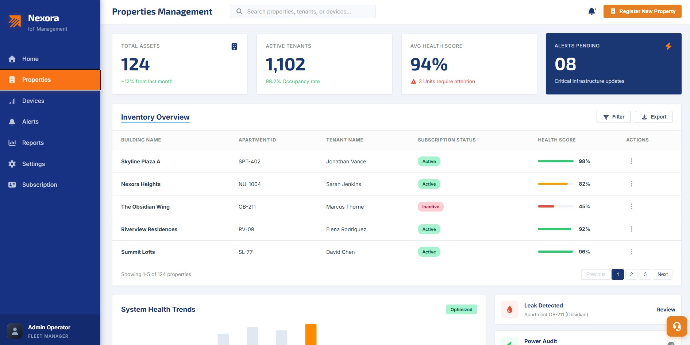
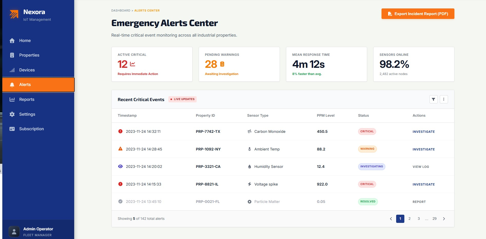

#### 6.2.2.6. Execution Evidence for Sprint Review

Durante el Sprint 2, se consolidó la integración de datos y el flujo de comunicación entre todos los componentes del sistema (Embedded App, Edge Service, Web Service y las aplicaciones frontend Web y Móvil). Los logros principales de ejecución para este Sprint incluyen:

* **Web Application**: Visualización de telemetría de sensores IoT en tiempo real mediante widgets y gráficos interactivos, centro de alertas críticas y flujos CRUD de administración inmobiliaria.
* **Mobile Application (Prototipo)**: Pantallas de login, estados de la propiedad y visualización de notificaciones del arrendatario.
* **Web Service (Backend API)**: Implementación de la versión 1 (`/api/v1/`) de los endpoints documentados en Swagger y generación de reportes PDF de alertas.
* **Edge Service**: Capacidad de ingesta de telemetría local de gases/voltaje y almacenamiento temporal offline mediante base de datos SQLite.

A continuación, se presentan las capturas de pantalla de la ejecución del sistema:

---

##### 1. Evidencia de la Web Application & Landing Page
* **Landing Page de Nexora**: Sección final comercial responsiva.
* **Dashboard y Telemetría**: Gráficos dinámicos de consumo del periodo actual.
* **Flujo de Suscripción**: Catálogo y checkout para arrendadores.

| Vista | Descripción | Captura de Pantalla |
| :--- | :--- | :--- |
| **Login / Acceso** | Interfaz de inicio de sesión seguro en el frontend. |  |
| **Dashboard y Consumos** | Panel de telemetría dinámico de agua, gas y electricidad. |  |
| **Propiedades y Gateways** | Registro de propiedades y asociación física de Gateways. |  |
| **Alertas e Incidentes** | Vista de alertas críticas en vivo (fugas de gas e intrusiones). |  |

---

##### 2. Evidencia de la Mobile Application (Flutter)
Evidencia del prototipo en desarrollo ejecutándose sobre el emulador o Chrome:

| Vista Móvil | Descripción | Captura de Pantalla |
| :--- | :--- | :--- |
| **Login Móvil** | Pantalla de inicio de sesión dirigida a inquilinos y arrendadores. |  |
| **Dashboard del Residente** | Widget resumen de consumo y estado de seguridad de la vivienda. |  |

---

##### 3. Evidencia del Backend & Swagger API
* Documentación en vivo interactiva y autorizada mediante Swagger UI en `http://localhost:5001/swagger`.

| Módulo Backend | Descripción | Captura de Pantalla |
| :--- | :--- | :--- |
| **Documentación OpenAPI** | Relación de endpoints del monolito modular RESTful. |  |

---

##### 4. Evidencia del Edge Service (Gateway IoT)
* Consola local de ejecución de Python (`app.py`) demostrando la ingesta y persistencia SQLite offline de las tramas enviadas por los sensores.

| Servicio Edge | Descripción | Captura de Pantalla |
| :--- | :--- | :--- |
| **Consola del Gateway** | logs de tramas recibidas y guardadas localmente. |  |

---

##### 5. Evidencia de la Embedded Application (ESP32 / Wokwi)
* Prototipo físico o entorno de simulación (Wokwi) de la placa ESP32 con sensores de telemetría (agua, gas, electricidad, voltaje) y actuadores de parada de emergencia.

| Componente Embebido | Descripción | Captura de Pantalla |
| :--- | :--- | :--- |
| **Simulación del Circuito** | Conexiones del microcontrolador ESP32 con sensores (MQ-2, flujo) y actuador remoto. |  |
| **Consola Serial (Logs)** | Registro del envío periódico de payloads JSON y recepción de comandos del Gateway. |  |

---

**Enlace al Video:** [Video de Ejecución - Sprint 2](https://1drv.ms/v/c/ec31a436d835fad6/IQB6Wk_CLkreRb0JIaixSE6tASLNX9u8MeauqWRv3ikCOAU?e=CI7eXW)
