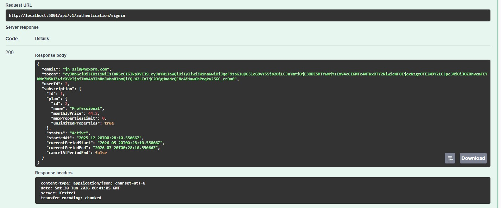
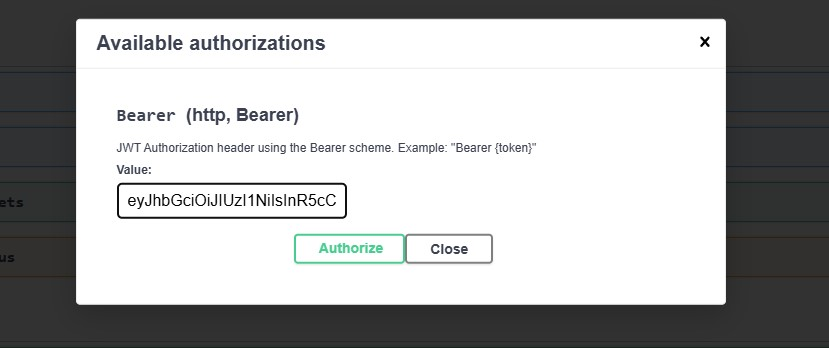
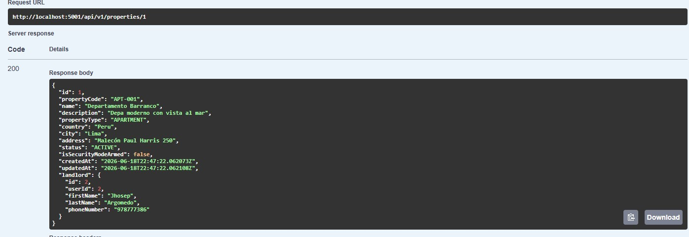
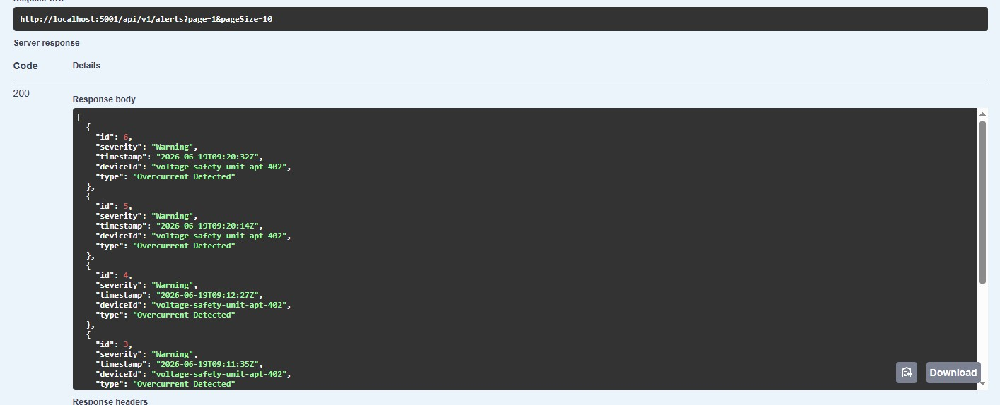
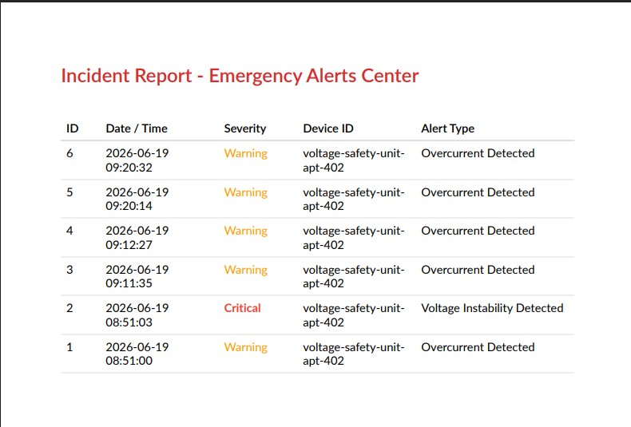

#### 6.2.2.7. Services Documentation Evidence for Sprint Review

#### **Introducción y Logros de Documentación**

Durante el Sprint 2, se ha logrado consolidar la documentación del **Web Service (Nexora Web API)** mediante la integración de **Swagger / OpenAPI (v1)** en la solución de ASP.NET Core 8. Este esfuerzo de documentación acompaña a una reestructuración de la base de código bajo un enfoque de **Monolito Modular**, agrupando la funcionalidad por contextos acotados (Bounded Contexts) bien definidos:
1. **Identity & Access Management (Gestión de Identidad y Acceso)**
2. **Resource & Asset Management (Gestión de Recursos y Activos)**
3. **Service Monitoring & Intelligence (Monitoreo e Inteligencia de Servicios)**
4. **Service Monitoring & Maintenance (Monitoreo y Mantenimiento de Servicios)**
5. **Subscriptions & Payment Management (Gestión de Suscripciones y Pagos)**

### Logros Clave de Documentación en este Sprint:
* **Diseño RESTful y Control de Versiones:** Todos los controladores han sido rediseñados bajo la versión `/api/v1/` para cumplir con las mejores prácticas de nomenclatura RESTful.
* **Seguridad Integrada (JWT Bearer):** Se ha configurado Swagger UI con soporte nativo para autorización JWT (`Bearer {token}`). Esto permite interactuar directamente con los endpoints privados desde la interfaz web de documentación.
* **Esquemas Completos de Request/Response:** Se documentaron los modelos DTO (Data Transfer Objects) tanto de entrada como de salida, incluyendo validaciones automáticas y códigos de estado HTTP estándar (200 OK, 201 Created, 400 BadRequest, 401 Unauthorized, 404 NotFound y 500 InternalServerError).
* **Parámetros y Query Filters:** Se incluyeron descripciones técnicas de los parámetros de paginación (`page`, `pageSize`) y filtrado avanzado (por ejemplo, filtros de severidad y tipo de alerta).

---

#### **Repositorio y Commits del Web Service**

* **URL del Repositorio:** [https://github.com/upc-202610-1ASI0572-6779-NexIoT/nexora.webservice](https://github.com/upc-202610-1ASI0572-6779-NexIoT/nexora.webservice)
* **Rama Principal de Desarrollo:** `develop`

#### Commits Relacionados con la Implementación y Documentación (Sprint 2):

| Commit ID | Autor / Desarrollador | Mensaje de Confirmación | Fecha |
| :--- | :--- | :--- | :--- |
| `bfcccb5` | Sebastian | refactor: redesign Web API endpoints to follow RESTful naming conventions and versioning v1 | 19/06/2026 |
| `461f06a` | Jorge, Kevin y Mauricio | feat(report): add Alerts PDF report generation and controller endpoint | 18/06/2026 |
| `a8af25b` | Jorge y Mauricio | feat(monitoring): add severity and type query filters to GET /api/v1/alerts backend endpoint | 18/06/2026 |
| `3ca33dd` | Jorge y Mauricio | feat(presentation): add DevicesController and GET latest telemetry endpoint | 18/06/2026 |
| `80ed32d` | Sebastian | fix: add CORS after JWT, condition HTTPS redirect, and UseCors | 15/06/2026 |
| `b7b0f17` | Kevin | feat: implement property management cqrs flows and analytical dashboard | 07/06/2026 |
| `af11faa` | Kevin | feat: implement secure identity management and jwt authentication | 07/06/2026 |
| `bbe3649` | Jhamil | feat: register database and ingestion dependencies in presentation host | 04/06/2026 |

---

#### **Relación General de Endpoints Documentados**

A continuación se detalla la tabla resumen de todos los endpoints configurados e indexados a través de Swagger UI:

| Contexto Acotado | Módulo/Controlador | Método HTTP | Sintaxis del Endpoint | Autorización |
| :--- | :--- | :--- | :--- | :--- |
| **Identity & Access** | `AuthController` | POST | `/api/v1/authentication/signin` | Público |
| **Identity & Access** | `AuthController` | POST | `/api/v1/authentication/signup` | Público |
| **Identity & Access** | `AuthController` | POST | `/api/v1/authentication/change-password` | Requiere JWT |
| **Identity & Access** | `ProfileController` | GET | `/api/v1/profiles/me` | Requiere JWT |
| **Identity & Access** | `ProfileController` | PUT | `/api/v1/profiles/me` | Requiere JWT |
| **Identity & Access** | `SettingsController` | GET | `/api/v1/settings` | Requiere JWT |
| **Identity & Access** | `SettingsController` | PUT | `/api/v1/settings/language` | Requiere JWT |
| **Identity & Access** | `SettingsController` | PUT | `/api/v1/settings/notifications` | Requiere JWT |
| **Identity & Access** | `SettingsController` | PUT | `/api/v1/settings/security/passwords` | Requiere JWT |
| **Identity & Access** | `SettingsController` | PUT | `/api/v1/settings/security/two-factor` | Requiere JWT |
| **Resource & Asset** | `PropertiesController` | POST | `/api/v1/properties` | Requiere JWT |
| **Resource & Asset** | `PropertiesController` | GET | `/api/v1/properties` | Requiere JWT |
| **Resource & Asset** | `PropertiesController` | GET | `/api/v1/properties/{id}` | Requiere JWT |
| **Resource & Asset** | `PropertiesController` | PUT | `/api/v1/properties/{id}` | Requiere JWT |
| **Resource & Asset** | `PropertiesController` | PUT | `/api/v1/properties/{id}/status` | Requiere JWT |
| **Resource & Asset** | `PropertiesController` | GET | `/api/v1/properties/stats` | Requiere JWT |
| **Resource & Asset** | `PropertiesController` | GET | `/api/v1/properties/dashboards` | Requiere JWT |
| **Resource & Asset** | `TenantsController` | POST | `/api/v1/tenants` | Requiere JWT |
| **Resource & Asset** | `TenantsController` | GET | `/api/v1/tenants` | Requiere JWT |
| **Resource & Asset** | `TenantsController` | GET | `/api/v1/tenants/{id}` | Requiere JWT |
| **Resource & Asset** | `TenantsController` | PUT | `/api/v1/tenants/{id}` | Requiere JWT |
| **Resource & Asset** | `TenantsController` | DELETE | `/api/v1/tenants/{id}` | Requiere JWT |
| **Resource & Asset** | `TenantsController` | GET | `/api/v1/properties/{propertyId}/tenants` | Requiere JWT |
| **Resource & Asset** | `DevicesController` | GET | `/api/v1/devices` | Requiere JWT |
| **Monitoring & Intelligence** | `TelemetryController` | POST | `/api/v1/telemetries` | Público |
| **Monitoring & Intelligence** | `TelemetryController` | GET | `/api/v1/telemetries/latest` | Público |
| **Monitoring & Intelligence** | `HealthCheckController` | GET | `/api/v1/health-checks` | Público |
| **Monitoring & Intelligence** | `ReportsController` | GET | `/api/v1/reports` | Público |
| **Monitoring & Intelligence** | `ReportsController` | GET | `/api/v1/alerts/reports` | Público |
| **Monitoring & Intelligence** | `AlertsController` | GET | `/api/v1/alerts` | Público |
| **Monitoring & Intelligence** | `AlertsController` | GET | `/api/v1/alerts/{id}` | Público |
| **Monitoring & Intelligence** | `AlertsController` | POST | `/api/v1/alerts/{id}/tickets` | Público |
| **Monitoring & Intelligence** | `AlertsController` | PUT | `/api/v1/alerts/{id}/status` | Público |
| **Subscriptions & Payment** | `SubscriptionsController` | GET | `/api/v1/subscriptions/plans` | Público |
| **Subscriptions & Payment** | `SubscriptionsController` | GET | `/api/v1/subscriptions/current` | Requiere JWT |
| **Subscriptions & Payment** | `SubscriptionsController` | POST | `/api/v1/subscriptions` | Requiere JWT |
| **Subscriptions & Payment** | `SubscriptionsController` | GET | `/api/v1/subscriptions/payment-methods` | Requiere JWT |
| **Subscriptions & Payment** | `SubscriptionsController` | GET | `/api/v1/subscriptions/payment-methods/{id}`| Requiere JWT |
| **Subscriptions & Payment** | `SubscriptionsController` | PUT | `/api/v1/subscriptions/payment-methods/{id}`| Requiere JWT |
| **Subscriptions & Payment** | `SubscriptionsController` | GET | `/api/v1/subscriptions/invoices` | Requiere JWT |
| **Subscriptions & Payment** | `SubscriptionsController` | PUT | `/api/v1/subscriptions/status` | Requiere JWT |

---

#### **Especificación Técnica de los Endpoints del Sprint 2**

A continuación se detallan los endpoints clave desarrollados y documentados en OpenAPI para el Sprint 2:

#### **Módulo de Autenticación y Perfiles (Identity & Access Management)**

#### A. Inicio de Sesión (Sign In)
* **Verbo HTTP:** POST
* **Sintaxis:** `/api/v1/authentication/signin`
* **Parámetros (Cuerpo):**
  * `email` (string, requerido): Correo electrónico del usuario.
  * `password` (string, requerido): Contraseña.
* **Ejemplo de Respuesta (HTTP 200 - OK):**
```json
{
  "token": "eyJhbGciOiJIUzI1NiIsInR5cCI6IkpXVCJ9...",
  "email": "landlord@nexora.com",
  "userId": 1,
  "role": "LANDLORD"
}
```

#### B. Registro de Arrendador (Sign Up)
* **Verbo HTTP:** POST
* **Sintaxis:** `/api/v1/authentication/signup`
* **Parámetros (Cuerpo):**
  * `email` (string, requerido): Correo electrónico único.
  * `password` (string, requerido): Contraseña fuerte.
  * `firstName` (string, requerido): Nombre.
  * `lastName` (string, requerido): Apellido.
  * `phoneNumber` (string): Número telefónico.
* **Ejemplo de Respuesta (HTTP 200 - OK):**
```json
{
  "userId": 1,
  "email": "landlord@nexora.com",
  "message": "User registered successfully."
}
```

#### C. Obtener Datos del Perfil
* **Verbo HTTP:** GET
* **Sintaxis:** `/api/v1/profiles/me`
* **Cabecera de Autorización:** `Authorization: Bearer {token}`
* **Ejemplo de Respuesta (HTTP 200 - OK):**
```json
{
  "profile": {
    "email": "landlord@nexora.com",
    "firstName": "Kevin",
    "lastName": "Reynaldo",
    "isActive": true,
    "country": "Perú",
    "city": "Lima",
    "address": "Av. Primavera 123",
    "phoneNumber": "+51999888777"
  }
}
```

---

#### **Módulo de Propiedades e Inquilinos (Resource & Asset Management)**

#### A. Crear Propiedad
* **Verbo HTTP:** POST
* **Sintaxis:** `/api/v1/properties`
* **Cabecera de Autorización:** `Authorization: Bearer {token}`
* **Parámetros (Cuerpo):**
  * `name` (string, requerido): Nombre descriptivo de la propiedad.
  * `description` (string): Descripción de la propiedad.
  * `type` (string, requerido): Tipo de propiedad (`HOUSE`, `APARTMENT`, `COMMERCIAL`).
  * `country` (string, requerido): País.
  * `city` (string, requerido): Ciudad.
  * `address` (string, requerido): Dirección.
  * `isSecurityModeArmed` (boolean): `true` si el sistema de seguridad para intrusiones está armado.
* **Ejemplo de Respuesta (HTTP 201 - Created):**
  * Retorna la cabecera `Location` con la URL del recurso `/api/v1/properties/{id}` y el ID generado.
```json
5
```

#### B. Obtener todas las Propiedades del Arrendador
* **Verbo HTTP:** GET
* **Sintaxis:** `/api/v1/properties`
* **Cabecera de Autorización:** `Authorization: Bearer {token}`
* **Parámetros de Consulta (Opcionales):**
  * `code` (string): Código único autogenerado de la propiedad para búsqueda rápida.
* **Ejemplo de Respuesta (HTTP 200 - OK):**
```json
[
  {
    "id": 5,
    "propertyCode": "PROP-928A",
    "name": "Departamento Miraflores",
    "description": "Frente al parque",
    "propertyType": "APARTMENT",
    "country": "Perú",
    "city": "Lima",
    "address": "Calle Alcanfores 456",
    "status": "ACTIVE",
    "isSecurityModeArmed": true,
    "createdAt": "2026-06-19T18:00:00Z",
    "updatedAt": "2026-06-19T18:00:00Z",
    "landlord": {
      "id": 1,
      "userId": 1,
      "firstName": "Kevin",
      "lastName": "Reynaldo",
      "phoneNumber": "+51999888777"
    }
  }
]
```

#### C. Crear Inquilino para Propiedad
* **Verbo HTTP:** POST
* **Sintaxis:** `/api/v1/tenants`
* **Cabecera de Autorización:** `Authorization: Bearer {token}`
* **Parámetros (Cuerpo):**
  * `propertyId` (long, requerido): ID de la propiedad que habitará.
  * `firstName` (string, requerido): Nombre del inquilino.
  * `lastName` (string, requerido): Apellido del inquilino.
  * `country` (string, requerido): País.
  * `city` (string, requerido): Ciudad.
  * `address` (string, requerido): Dirección.
  * `phoneNumber` (string, requerido): Teléfono.
* **Ejemplo de Respuesta (HTTP 201 - Created):**
```json
12
```

---

#### **Módulo de Telemetría y Alertas (Service Monitoring & Intelligence)**

#### A. Recepción de Telemetría (Ingesta)
* **Verbo HTTP:** POST
* **Sintaxis:** `/api/v1/telemetries`
* **Parámetros (Cuerpo):**
  * `deviceId` (string, requerido): Identificador de hardware del dispositivo IoT.
  * `waterReading` (double, requerido): Lectura del medidor de agua.
  * `gasReading` (double, requerido): Lectura del medidor de gas.
  * `presenceReading` (boolean, requerido): Sensor de movimiento.
  * `electricityReading` (double, requerido): Consumo eléctrico.
  * `voltageReading` (double, requerido): Medición de voltaje.
* **Ejemplo de Respuesta (HTTP 201 - Created):**
  * Retorna estado vacío (HTTP 201) al registrar con éxito el payload de datos y evaluar las reglas de negocio (fugas de gas/agua, intrusiones de seguridad y fluctuaciones de voltaje).

#### B. Obtener Listado Paginado y Filtrado de Alertas
* **Verbo HTTP:** GET
* **Sintaxis:** `/api/v1/alerts`
* **Parámetros de Consulta (Opcionales):**
  * `page` (int, default = 1): Número de página.
  * `pageSize` (int, default = 10): Tamaño de la página.
  * `severity` (string): Severidad de la alerta (`INFO`, `WARNING`, `CRITICAL`).
  * `type` (string): Tipo de alerta para búsqueda parcial (ej. `Gas`, `Intrusion`, `Voltage`).
* **Cabeceras de Respuesta Destacadas:**
  * `X-Total-Count`: Cantidad total de registros que coinciden con los filtros (para paginación en frontend).
* **Ejemplo de Respuesta (HTTP 200 - OK):**
```json
[
  {
    "id": 15,
    "severity": "CRITICAL",
    "timestamp": "2026-06-19T23:10:00Z",
    "deviceId": "ESP32-HW-01",
    "type": "Critical Gas Leak Detected"
  }
]
```

#### C. Exportar Reporte de Alertas en PDF
* **Verbo HTTP:** GET
* **Sintaxis:** `/api/v1/alerts/reports`
* **Parámetros de Consulta:**
  * `startDate` (datetime, opcional): Fecha de inicio del filtro.
  * `endDate` (datetime, opcional): Fecha de fin del filtro.
  * `format` (string, default = "pdf"): Formato de salida (soporta `pdf`).
* **Ejemplo de Respuesta (HTTP 200 - OK):**
  * Retorna un archivo binario bin-stream con tipo de contenido `application/pdf` y cabecera de descarga de archivos `Content-Disposition`.

---

#### **Módulo de Suscripciones y Pagos (Subscriptions & Payment Management)**

#### A. Activar Plan de Suscripción
* **Verbo HTTP:** POST
* **Sintaxis:** `/api/v1/subscriptions`
* **Cabecera de Autorización:** `Authorization: Bearer {token}`
* **Parámetros (Cuerpo):**
  * `subscriptionPlanId` (long, requerido): ID del plan seleccionado.
* **Ejemplo de Respuesta (HTTP 200 - OK):**
```json
{
  "subscription": {
    "id": 3,
    "plan": {
      "id": 2,
      "name": "Standard Plan",
      "monthlyPrice": 19.99,
      "maxPropertiesLimit": 5,
      "unlimitedProperties": false
    },
    "status": "Active",
    "startedAt": "2026-06-19T19:30:00Z",
    "currentPeriodStart": "2026-06-19T19:30:00Z",
    "currentPeriodEnd": "2026-07-19T19:30:00Z",
    "cancelAtPeriodEnd": false
  },
  "monthlyPrice": 19.99,
  "dueDate": "2026-06-26T19:30:00Z",
  "invoiceId": 8
}
```

---

#### **Capturas de Interacción con OpenAPI/Swagger**

#### **Registro e Inicio de Sesión de Usuario (Autenticación)**

* **Interacción `/api/v1/authentication/signup` y `/signin`:**
  * *Acción:* Registro de un nuevo arrendador y el subsecuente inicio de sesión para obtener el token JWT que otorga el acceso a la plataforma.
  
  
  * *Descripción:* Captura que muestra la respuesta HTTP 200 del endpoint de SignIn, devolviendo el JWT para el usuario.

---

#### **Autorización mediante Swagger UI (Bearer JWT)**

* **Interacción del botón de "Authorize" en Swagger:**
  * *Acción:* Introducir el token JWT copiado en el cuadro de diálogo de autorización de Swagger para poder testear los endpoints restringidos.
  
  
  * *Descripción:* Configuración del esquema de seguridad Bearer con el formato `"Bearer {token}"` habilitado en Swagger UI.

---

#### **Creación y Visualización de Propiedades del Arrendador**

* **Interacción `POST /api/v1/properties` y `GET /api/v1/properties`:**
  * *Acción:* Creación exitosa de una propiedad (casa/apartamento) y su consulta a través del método GET usando el token JWT en las cabeceras.
  
  
  * *Descripción:* Listado de propiedades retornadas en formato JSON donde se aprecia la relación con el Arrendador correspondiente.

---

#### **Listado Paginado de Alertas y Severidad**

* **Interacción `GET /api/v1/alerts`:**
  * *Acción:* Obtener las alertas registradas en el sistema filtrando por parámetros de consulta como `severity = CRITICAL` y `type = Gas`.
  
  
  * *Descripción:* Cabeceras HTTP de respuesta que muestran el contador total expuesto `X-Total-Count` y el listado de alertas de criticidad alta.

---

#### **Generación y Descarga de Reportes en PDF y Excel**

* **Interacción `GET /api/v1/reports` y `GET /api/v1/alerts/reports`:**
  * *Acción:* Solicitud y descarga del reporte PDF generado de manera dinámica en el backend con las alertas del sistema.
  
  
  * *Descripción:* Descarga de reporte de alertas de tipo `application/pdf`.