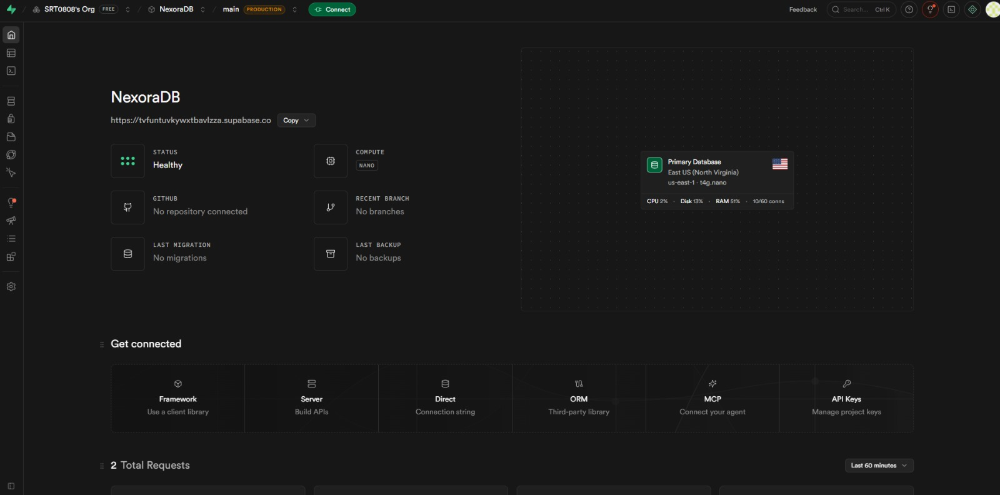
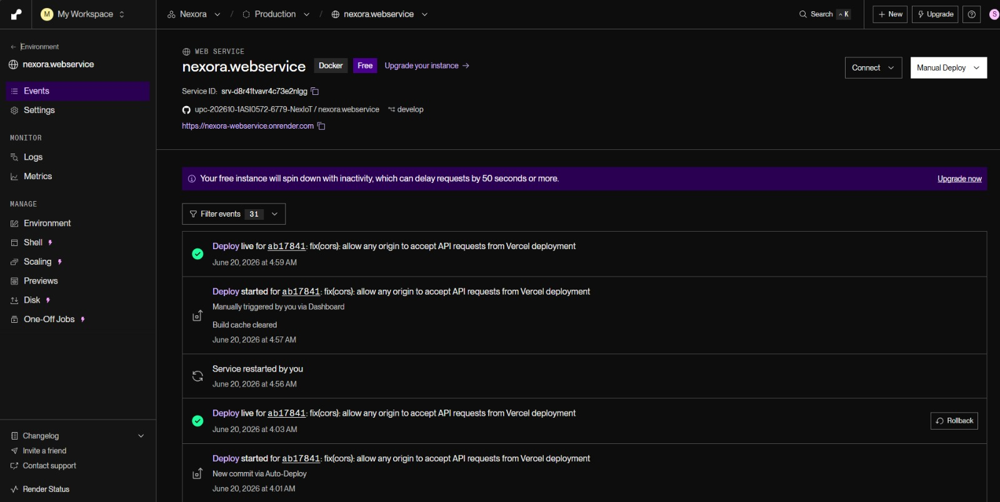
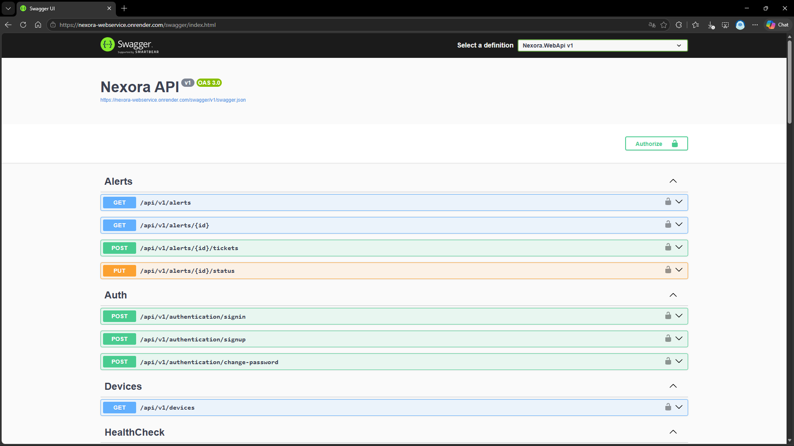
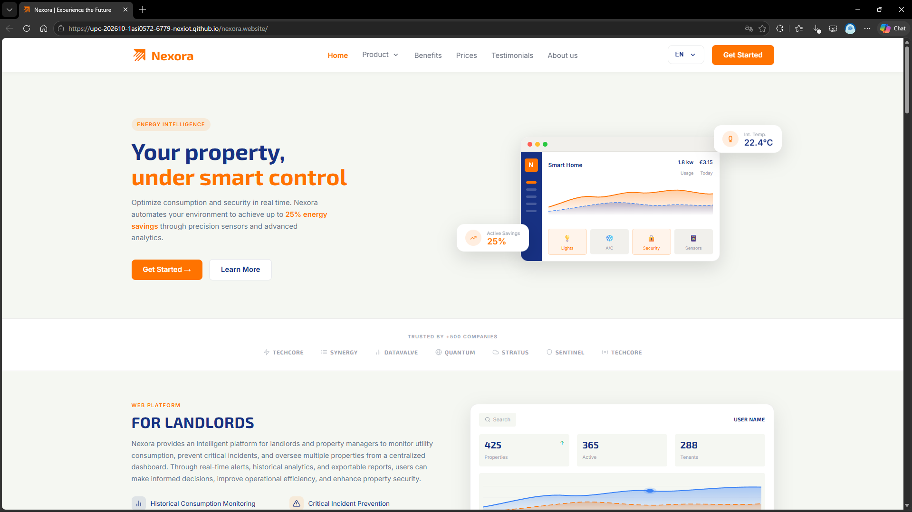
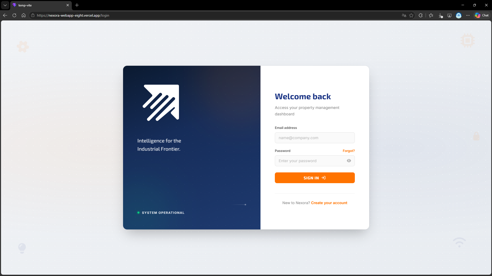

#### 6.2.2.8. Software Deployment Evidence for Sprint Review

Durante el Sprint 2, el equipo de desarrollo consolidó el despliegue de la arquitectura multi-capa del ecosistema Nexora. A diferencia del ciclo anterior, este incremento integró no solo las capas de presentación visual (Landing Page optimizada y Frontend Web), sino también la infraestructura del lado del servidor (*Backend API*) y el almacenamiento relacional (*Database*), logrando la transición de interfaces estáticas hacia un sistema dinámico que opera con datos persistentes y telemetría real en producción.

A continuación, se presentan las evidencias de configuración de la infraestructura y los entornos productivos desplegados para la revisión del Sprint.

 

# Despliegue de la Base de Datos – Supabase

## Configuración del Proyecto en Supabase

Para dar soporte a la persistencia de datos de usuarios, propiedades, planes de suscripción y telemetría de Nexora, el equipo configuró una instancia relacional gestionada en la plataforma Cloud de Supabase.

### Actividades realizadas

* Creación del proyecto y provisión de la base de datos PostgreSQL en el entorno de Supabase.
* Diseño e implementación del esquema relacional de tablas (`Users`, `Properties`, `Subscriptions`, `Telemetry`).
* Configuración de credenciales de acceso seguro y cadenas de conexión directas.
* Validación de políticas de almacenamiento de datos para operaciones en tiempo real.

---

## Configuración y Verificación del Esquema

El almacenamiento fue estructurado para permitir transacciones concurrentes desde el servidor Backend, asegurando la integridad de los datos reales del ecosistema.

### Actividades realizadas

* Creación de tablas de entidades mediante scripts SQL optimizados.
* Configuración de variables de entorno para la comunicación segura con el Backend.
* Monitoreo de logs iniciales de conexión y persistencia de datos.

### Resultado del despliegue

La base de datos relacional quedó desplegada de forma exitosa en la nube, sirviendo como el motor de persistencia centralizado para todo el portafolio de Nexora.

 

# Despliegue del WebService REST API – Render

## Configuración del Proyecto en Render

Para el despliegue de la lógica de negocio y los endpoints de la API Core (v1.0), el equipo configuró un Web Service dentro de la plataforma Render.

### Actividades realizadas

* Creación del workspace de la API en la nube de Render.
* Importación del repositorio del Backend desde el perfil de GitHub.
* Configuración de los comandos de compilación (`npm install`) y de inicio de producción (`npm start`).
* Inyección de variables de entorno críticas (`DATABASE_URL` vinculada a Supabase, `JWT_SECRET`).

---

## Configuración de Integración Continua (CI/CD)

El servicio del lado del servidor fue conectado directamente con GitHub para automatizar el despliegue ante cualquier cambio estructural en la rama principal.

### Actividades realizadas

* Conexión entre los servidores de Render y el repositorio de código de la API.
* Configuración de despliegues automáticos (*Automated Deploys*).
* Verificación de los logs de compilación de node y estado de arranque del servidor.
* Validación del correcto enrutamiento del CORS para peticiones externas del frontend.

### Resultado del despliegue

La API REST funcional de Nexora fue publicada con éxito, quedando disponible en producción para procesar las peticiones HTTP del ecosistema.

**URL de la API del Webservice:** [ https://nexora-webservice.onrender.com/swagger/index.html]( https://nexora-webservice.onrender.com/swagger/index.html)

 

# Despliegue del Landing Page – GitHub Pages

## Configuración e Integración Comercial (100%)

El sitio web corporativo fue actualizado en GitHub Pages para incorporar la versión comercial definitiva que incluye los planes Basic y Professional estructurados en dólares, los testimonios del segmento y los metadatos SEO revisados.

### Actividades realizadas

* Carga de componentes de la matriz de precios y secciones actualizadas (*About Us*).
* Configuración y optimización de etiquetas meta y Open Graph para la indexación en motores de búsqueda.
* Validación del despliegue automatizado directo a la rama de publicación de GitHub Pages.

 

**URL Landing Page:** [https://upc-202610-1asi0572-6779-nexiot.github.io/nexora.website/](https://upc-202610-1asi0572-6779-nexiot.github.io/nexora.website/)

 

# Despliegue del Frontend Web – Vercel

## Conexión Dinámica y Consolidación del Dashboard

La aplicación web en Vercel fue actualizada para transicionar de componentes visuales estáticos hacia un flujo interactivo en tiempo real conectado directamente a la API de Render.

### Actividades realizadas

* Configuración de las variables de entorno de producción en Vercel para apuntar al servidor real en Render.
* Validación del módulo completo de autenticación (*Sign Up*, *Log In* con persistencia en base de datos).
* Pruebas del flujo dinámico de gestión de propiedades y suscripciones desde el panel de control del arrendador.

**URL de la aplicación web:** [https://nexora-webapp-eight.vercel.app/login](https://nexora-webapp-eight.vercel.app/login)