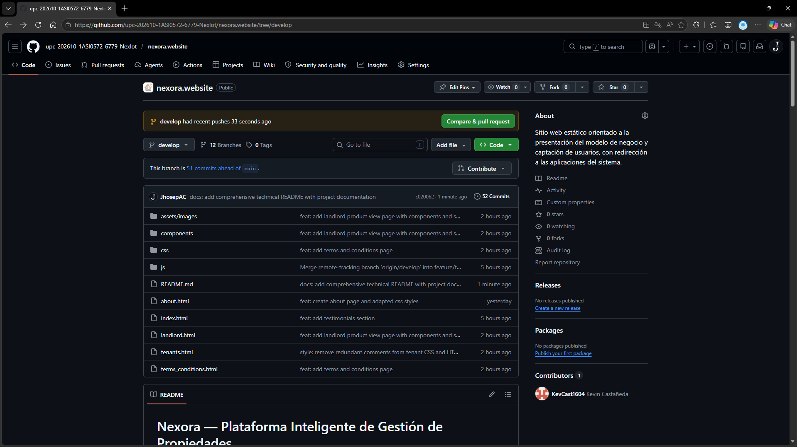
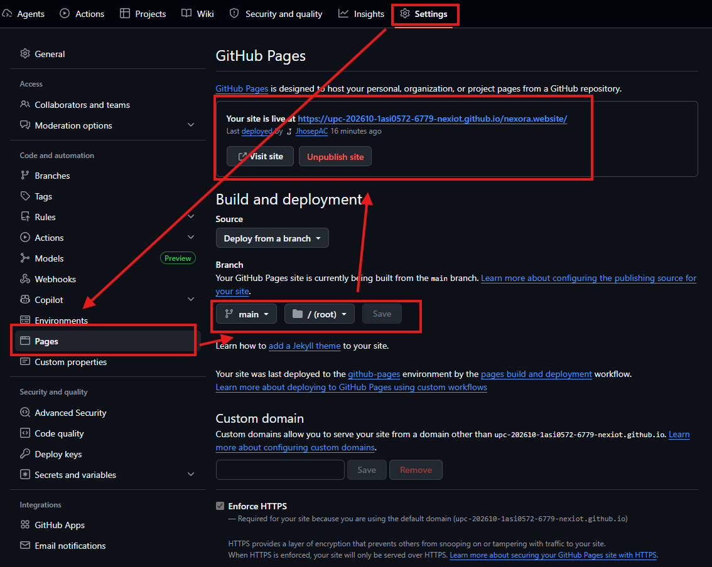
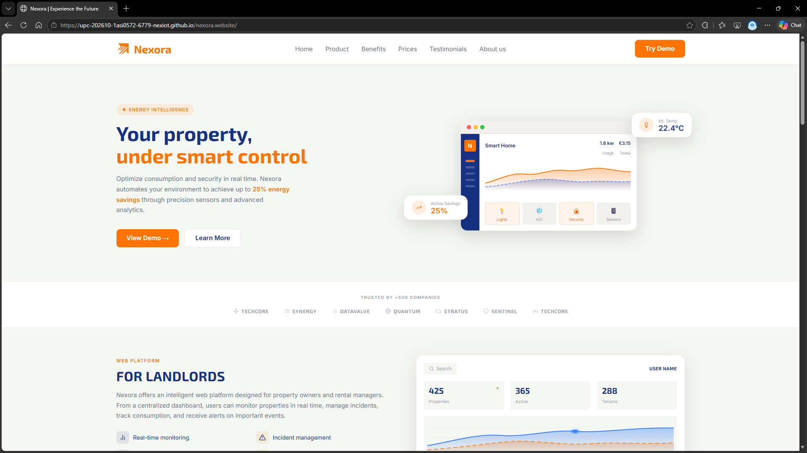
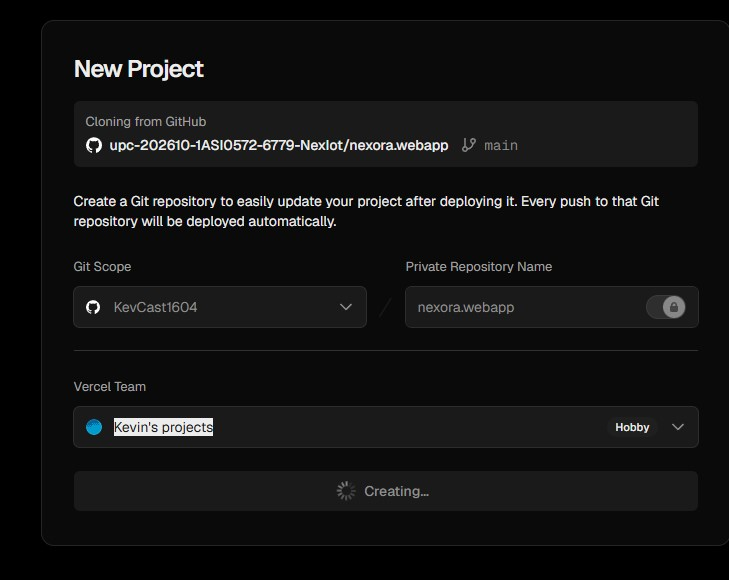
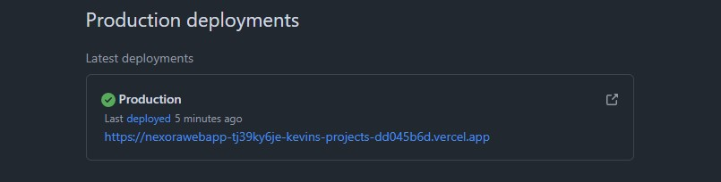
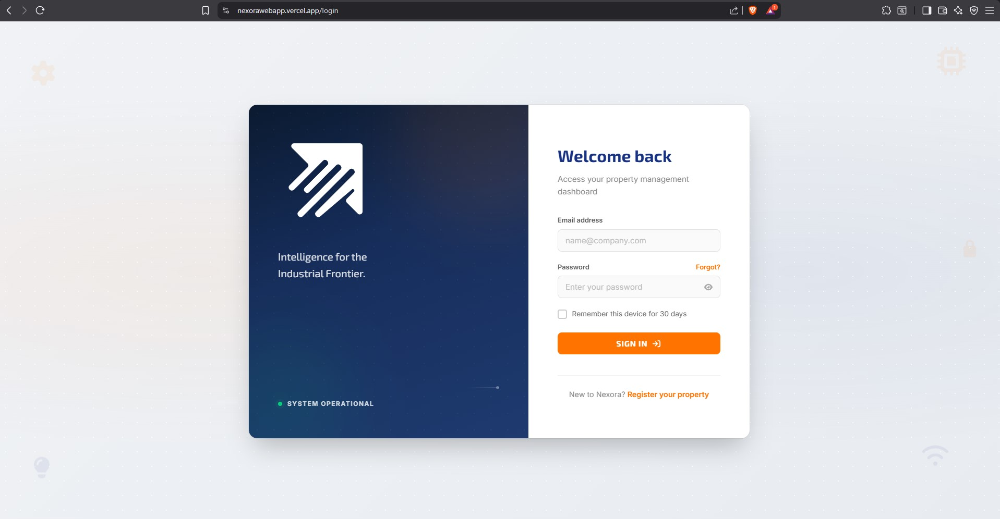

#### 6.2.2.8. Software Deployment Evidence for Sprint Review

Durante el Sprint 2, el...
---

 

# Despliegue del Landing Page – GitHub Pages

## Configuración del Repositorio en GitHub

Como parte del proceso de despliegue, el equipo configuró el repositorio del Landing Page en GitHub para permitir la publicación del sitio mediante GitHub Pages.

### Actividades realizadas

* Creación y configuración del repositorio del Landing Page.
* Validación de archivos compilados para producción.
* Configuración de la rama principal para publicación.
* Verificación de permisos y visibilidad del repositorio.

 

---

## Configuración de GitHub Pages

El despliegue del Landing Page fue realizado utilizando la funcionalidad GitHub Pages desde la configuración del repositorio.

### Actividades realizadas

* Acceso a la sección **Pages** dentro de la configuración del repositorio.
* Selección de la rama de despliegue.
* Configuración del directorio raíz para publicación.
* Activación de despliegue automático tras cada actualización del repositorio.

 

### Resultado del despliegue

El Landing Page fue publicado correctamente y quedó accesible mediante la URL pública generada por GitHub Pages.

**URL Landing Page:** https://upc-202610-1asi0572-6779-nexiot.github.io/nexora.website/ 

---

 

# Despliegue del Frontend Web – Vercel

## Configuración del Proyecto en Vercel

Para el despliegue del Frontend de la aplicación web, el equipo configuró el proyecto en la plataforma Vercel.

### Actividades realizadas

* Creación del workspace del proyecto en Vercel.
* Importación del repositorio frontend desde GitHub.
* Configuración automática del framework utilizado.
* Validación de comandos de build y directorio de salida.

 

---

## Configuración de Integración Continua

El frontend fue integrado con GitHub para permitir despliegues automáticos cada vez que se registren cambios en el repositorio.

### Actividades realizadas

* Conexión entre GitHub y Vercel.
* Configuración de despliegues automáticos.
* Validación del despliegue desde la rama principal.
* Verificación de logs y estado de compilación.

 

### Resultado del despliegue

La aplicación frontend fue desplegada exitosamente y quedó disponible mediante la URL de producción generada por Vercel.

**URL de la aplicación web:** [https://nexora-webapp-xi.vercel.app/login](https://nexora-webapp-xi.vercel.app)

---
