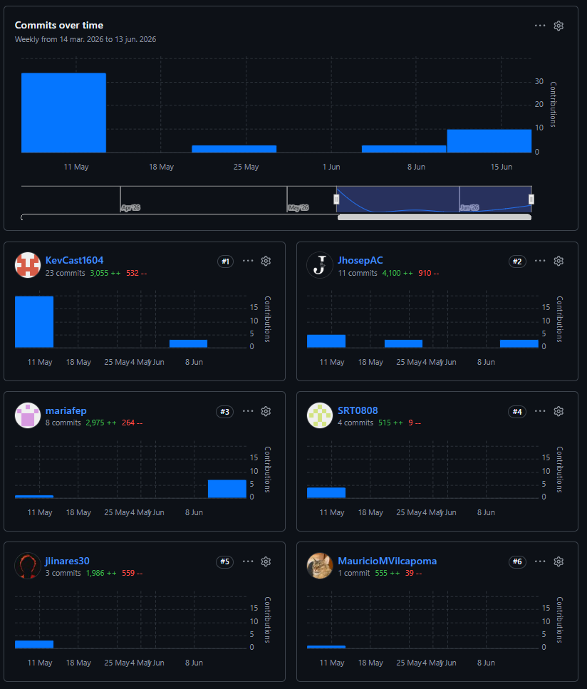
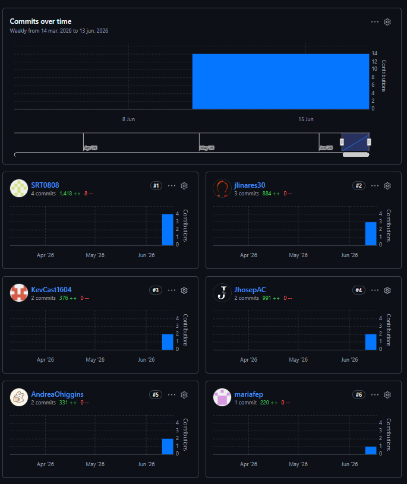
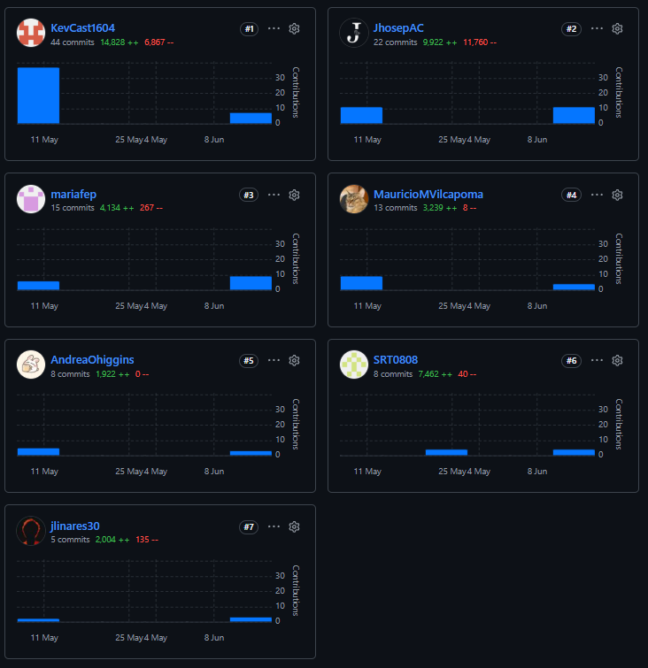
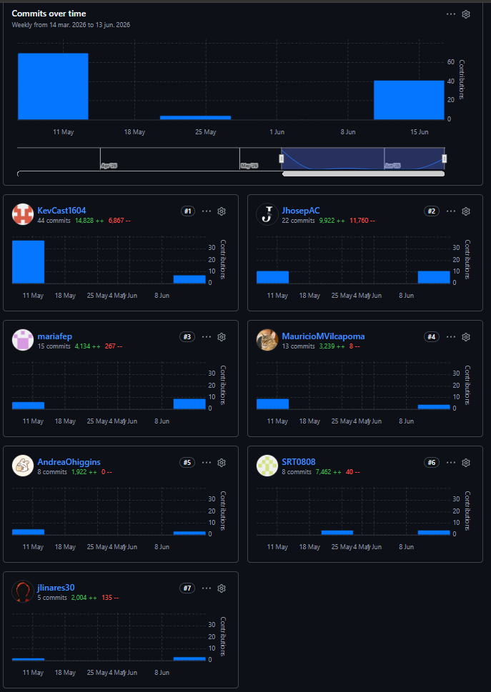
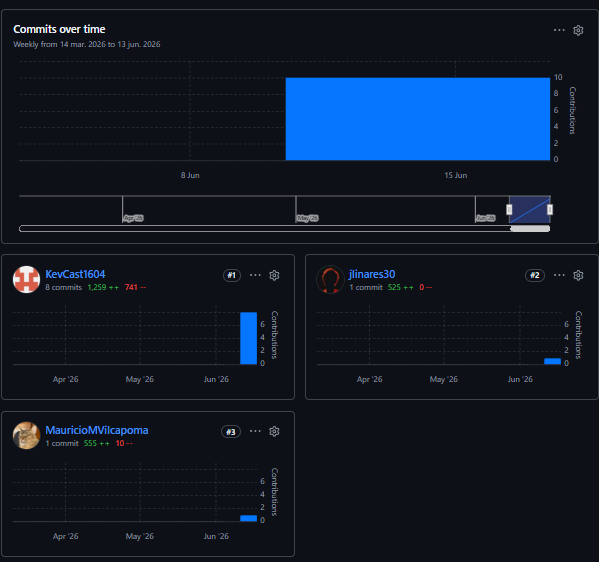

#### 6.2.2.9. Team Collaboration Insights during Sprint

Durante el desarrollo del Sprint 2, el equipo de Nexora continuó utilizando una metodología de trabajo altamente colaborativa y la división de responsabilidades según los roles técnicos definidos. Para este Sprint, el alcance incluyó el desarrollo paralelo y la integración de múltiples componentes clave de la solución de IoT: **Edge Service**, **Landing Page**, **Mobile App**, **Embedded Apps**, **Web Service** y **Web Application**.

La gestión de código y la colaboración técnica se centralizaron en GitHub, haciendo un uso riguroso de políticas de *Pull Requests*, revisiones cruzadas de código (*Code Reviews*) por parte de los líderes de aspecto, y validaciones previas a la fusión para asegurar la consistencia arquitectónica y de diseño (DDD).

##### Analíticos de Colaboración y Commits en GitHub

A continuación, se presentan las capturas de pantalla de los analíticos de colaboración (Pulse / Contributors) recopiladas directamente de GitHub para cada uno de los componentes de software desarrollados en el Sprint 2:

###### 1. Landing Page (nexora.website)

###### 2. Mobile App (nexora.mobileapp)

###### 3. Web Application (nexora.webapp)

###### 4. Edge Service (nexora.edgeservice)

###### 5. Embedded Apps (nexora.embeddedapp)

##### Interpretación de los Analíticos

A partir de las métricas visualizadas en los analíticos de GitHub para el Sprint 2, el equipo presenta la siguiente interpretación:

1.  **Distribución de Trabajo y Cohesión**: Los analíticos de contribuciones reflejan un esfuerzo conjunto. Cada miembro del equipo participó activamente en la implementación de las distintas capas del sistema (Domain, Interface, Application, Infrastructure), asegurando que el conocimiento técnico no estuviera centralizado y promoviendo la resiliencia del equipo.
2.  **Ritmo de Desarrollo y Frecuencia de Commits**: La frecuencia de los commits a lo largo del Sprint evidencia un desarrollo iterativo y constante. Se identifican incrementos de commits correlacionados con la culminación de tareas críticas y la posterior fase de integración de los microservicios y las aplicaciones del cliente.
3.  **Gestión de Ramas e Integración Sincronizada**: El *Network Graph* demuestra una correcta adopción de las políticas de ramificación. Las ramas de características específicas (*feature branches*) se mantuvieron con un ciclo de vida corto y enfocado, integrándose a `develop` de manera fluida y con resolución proactiva de conflictos de código.
4.  **Participación en los Productos del Sprint**: Se evidencia y documenta la participación equitativa de todos los miembros en la implementación de los productos definidos para este Sprint:
    -   **Landing Page**: Ajustes e integración de secciones dinámicas para la interacción del usuario final.
    -   **Web Services**: Desarrollo y refinamiento de los bounded contexts del backend siguiendo principios de DDD (Identity & Access Management, Service Monitoring & Intelligence, Subscriptions & Payment Management).
    -   **Aplicaciones (Mobile & Web)**: Desarrollo de la aplicación móvil bajo arquitectura DDD y la aplicación web para la monitorización de alertas y el panel analítico.

En conclusión, los analíticos del repositorio confirman que la entrega de valor de Nexora en este Sprint 2 se llevó a cabo bajo un enfoque coordinado, con una alta participación de todos sus integrantes, y asegurando el cumplimiento de las metas planteadas en el Sprint Backlog.
