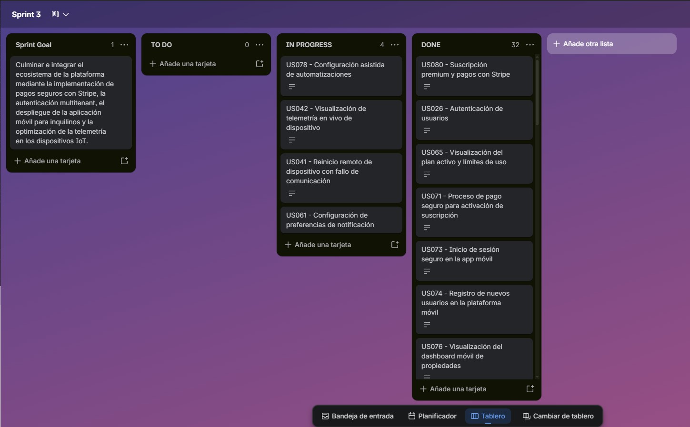

#### 6.2.3.3. Sprint Backlog 3

El Sprint Backlog 3 reúne el conjunto de User Stories y tareas técnicas definidas para la culminación e integración de todas las soluciones de software y hardware del ecosistema digital e IoT de Nexora. Durante este ciclo final, el equipo se enfocó en habilitar la pasarela de pagos seguros con Stripe para suscripciones comerciales en la Web Application, la autenticación multitenant con aislamiento a nivel de base de datos en el Web Service, el lanzamiento de la Mobile Application para inquilinos con funcionalidades de reportes de consumo, alertas y panel de incidentes, y la calibración y mitigación de ruido analógico en la Embedded Application utilizando transporte dinámico HTTP/HTTPS.

Asimismo, el Sprint Backlog permitió organizar el trabajo colaborativo del equipo mediante la descomposición de cada User Story y Technical Story en tareas específicas, facilitando el seguimiento del avance, la asignación de responsabilidades y el control del estado de desarrollo dentro del Sprint Board, asegurando una integración fluida de todos los componentes antes del cierre del proyecto.

**Sprint Board URL:**
`https://trello.com/invite/b/6a1873baa09257624311592b/ATTI9cdd4a489acc790ce6f3204767f3d5304078B41A/sprint-3`

**Sprint 3 Backlog:**

## Sprint 3

| User Story |                                | Work-Item / Task |                                             |                                                                |                        |                   |            |
| ---------- | ------------------------------ | ---------------- | ------------------------------------------- | -------------------------------------------------------------- | ---------------------- | ----------------- | ---------- |
| **Id**     | **Title**                      | **Id**           | **Title**                                   | **Description**                                                | **Estimation (Hours)** | **Assigned To**   | **Status** |
| US78 | Configuración asistida de automatizaciones | T-01 | Implementar asistente de automatizaciones | Desarrollo del wizard interactivo de configuración paso a paso en la Web Application para automatizaciones. | 8 | Andrea Namie O'Higgins Rosales | In Progress |
| US80 | Suscripción premium y pagos con Stripe | T-02 | Integrar pasarela Stripe para suscripciones premium | Configuración del formulario y flujo de suscripción premium con Stripe en la Web Application. | 8 | Kevin Alexander Castañeda Llanos | Done |
| US26 | Autenticación de usuarios | T-03 | Habilitar flujo de login y roles en Web Application | Integrar el login multitenant con redirección por rol en la Web Application. | 5 | Maria Fernanda Peña Riofrio | Done |
| US42 | Reinicio y calibración de dispositivos remotos | T-04 | Implementar UI de reinicio y calibración remota | Agregar botones y modales de acción en el dashboard web para enviar comandos de mantenimiento a los dispositivos. | 5 | Jorge Alexandro Linares Arroyo | In Progress |
| US65 | Procesamiento y confirmación de pago de suscripción | T-05 | Desarrollar pantalla de confirmación y estado de pago | Diseño e implementación de la pantalla de confirmación de pago de suscripción y manejo de errores. | 5 | Kevin Alexander Castañeda Llanos | Done |
| US69 | Gestión de métodos de pago registrados en la cuenta | T-06 | Desarrollar panel de métodos de pago | Interfaz para listar, añadir y eliminar tarjetas asociadas del cliente. | 5 | Kevin Alexander Castañeda Llanos | Done |
| US71 | Proceso de pago seguro para activación de suscripción | T-07 | Configurar elementos de pago seguro en checkout | Implementación de Stripe Elements para garantizar el cumplimiento de seguridad PCI-DSS. | 5 | Kevin Alexander Castañeda Llanos | Done |
| US73 | Inicio de sesión seguro en la app móvil | T-08 | Desarrollar login en la app móvil | Interfaz móvil de inicio de sesión seguro conectada con el servicio IAM. | 5 | Sebastian Ramirez Tello | Done |
| US74 | Registro de nuevos usuarios en la plataforma móvil | T-09 | Desarrollar flujo de registro móvil de inquilinos | Implementar el formulario de creación de cuenta móvil de inquilinos. | 5 | Maria Fernanda Peña Riofrio | Done |
| US76 | Visualización del dashboard móvil de propiedades | T-10 | Desarrollar dashboard móvil de propiedades | Implementación del dashboard principal en la aplicación móvil con KPIs de telemetría hídrica. | 5 | Sebastian Ramirez Tello | Done |
| US77 | Panel móvil de incidentes y alertas | T-11 | Diseñar centro móvil de alertas e incidentes | Vista móvil del listado de alertas de fuga o fallos críticos activos en el hogar del inquilino. | 5 | Sebastian Ramirez Tello | Done |
| US79 | Reportes de consumo en la app móvil | T-12 | Implementar reportes gráficos mobiles | Gráficos de barra de consumo diario/semanal en la interfaz móvil. | 5 | Mauricio Muñoz Vilcapoma | Done |
| US81 | Gestión y configuración de alertas por consumo elevado | T-13 | Crear configuración de alertas móviles | Interfaz móvil para activar y ajustar umbrales máximos de consumo de agua/energía. | 5 | Jorge Alexandro Linares Arroyo | In Progress |
| US38 | Visualización del listado general de dispositivos | T-14 | Implementar tabla general de dispositivos en la Web App | Grid de listado de hardware asociado, mostrando uptime y estado de comunicación. | 3 | Jhosep Jamil Argomedo Camacho | Done |
| US41 | Consulta de logs de eventos técnicos del dispositivo | T-15 | Crear visualizador de logs del dispositivo | Sección para consultar bitácora de telemetría y eventos técnicos del hardware en el dashboard web. | 3 | Jorge Alexandro Linares Arroyo | Done |
| US61 | Visualización de planes de suscripción comercial | T-16 | Diseñar sección comercial de planes | Maquetación de la tabla de planes comercial y redirección a contratación. | 3 | Kevin Alexander Castañeda Llanos | Done |
| US66 | Visualización del historial de facturación de la cuenta | T-17 | Crear panel de facturas en Web Application | Tabla para consultar el historial de cobros realizados en la cuenta del propietario. | 3 | Kevin Alexander Castañeda Llanos | Done |
| US67 | Descarga de comprobantes de pago en PDF | T-18 | Implementar botón de descarga de facturas en PDF | Botón e integración de descarga directa de PDFs de facturas generadas por Stripe. | 3 | Kevin Alexander Castañeda Llanos | Done |
| US70 | Visualización del plan de suscripción activo y límites de uso | T-19 | Implementar widget de límites y suscripción activa | Vista de resumen del plan contratado y barra de progreso sobre los límites permitidos. | 3 | Kevin Alexander Castañeda Llanos | In Progress |
| US75 | Edición de perfil de inquilino y ajustes | T-20 | Desarrollar formulario de perfil de inquilino en app móvil | Pantalla de ajustes personales y actualización de datos de contacto de inquilino. | 3 | Maria Fernanda Peña Riofrio | Done |
| TS30 | Lógica de alerta de fuga de agua y consumo excesivo | T-22 | Desarrollar motor de evaluación de fugas en backend | Lógica en el backend para detectar lecturas anómalas continuas y disparar alertas de fugas. | 8 | Jorge Alexandro Linares Arroyo | Done |
| TS01 | API de autenticación con credenciales y validación de plataforma | T-23 | Implementar endpoint de Login con control multitenant | Servicio REST para validar credenciales y emitir tokens JWT con claims de rol y tenant. | 5 | Jhosep Jamil Argomedo Camacho | Done |
| TS04 | API de validación de sesión, 2FA y filtro de autorización personalizado | T-24 | Implementar filtro RequireUserType y verificación 2FA | Atributo personalizado en la API y flujo para validar códigos de seguridad de dos factores. | 5 | Jhosep Jamil Argomedo Camacho | Done |
| TS05 | API de consulta y registro con aislamiento multitenant | T-25 | Aplicar filtros multitenant en consultas a BD | Aislamiento a nivel de base de datos para que cada propietario solo acceda a sus recursos. | 5 | Jhosep Jamil Argomedo Camacho | Done |
| TS06 | API de edición, eliminación e intento de acceso a propiedad ajena | T-26 | Desarrollar validadores de propiedad de recursos en CRUD | Filtros que validan que el ID del recurso editado pertenezca efectivamente al tenant autenticado. | 5 | Jhosep Jamil Argomedo Camacho | Done |
| TS10 | API de detalle y telemetría de dispositivo individual | T-27 | Desarrollar endpoints de telemetría de dispositivo | Endpoints REST para retornar métricas históricas de un dispositivo IoT seleccionado. | 5 | Jorge Alexandro Linares Arroyo | Done |
| TS12 | API de acciones remotas sobre dispositivo | T-28 | Crear endpoints de comandos remotos en el backend | API para despachar instrucciones de reinicio y calibración al Gateway perimetral. | 5 | Andrea Namie O'Higgins Rosales | Done |
| TS26 | API de consulta y actualización de suscripción | T-29 | Crear API de administración de suscripción | Implementar endpoints para consultar el plan actual y sus límites asociados. | 5 | Kevin Alexander Castañeda Llanos | Done |
| TS28 | API de gestión de métodos de pago y procesamiento de checkout | T-30 | Desarrollar endpoints de pago y checkout con Stripe SDK | Implementar endpoints para interactuar con la API de Stripe, gestionar tokens de tarjeta y crear cargos. | 5 | Kevin Alexander Castañeda Llanos | Done |
| TS29 | API de registro de nuevo dispositivo IoT | T-31 | Implementar endpoint de provisión de hardware | Servicio REST para registrar direcciones MAC válidas en el inventario global de hardware. | 5 | Andrea Namie O'Higgins Rosales | Done |
| TS31 | API de procesamiento de webhook de Stripe para pagos | T-32 | Configurar endpoint de Stripe Webhooks en backend | Endpoint público con firma digital de Stripe para procesar invoice.payment_succeeded. | 5 | Kevin Alexander Castañeda Llanos | Done |
| TS-EMB-05 | Selección dinámica de transporte HTTP/HTTPS para telemetría | T-33 | Implementar negociación dinámica de protocolo en firmware | Lógica en el ESP32 para determinar el uso de TLS/HTTPS según la dirección del servidor. | 5 | Jorge Alexandro Linares Arroyo | Done |
| TS-EMB-06 | Sensor de caudal a 50 LPM y mitigación de ruido analógico | T-34 | Calibrar lectura de flujo de agua y aplicar filtros de ruido | Firmware del ESP32 calibrado a 50 LPM y algoritmo de promedio móvil para evitar lecturas ruidosas. | 5 | Jorge Alexandro Linares Arroyo | Done |
| TS11 | API de logs y perfil de hardware de dispositivo | T-35 | Crear API de logs de hardware en Web Service | Endpoints para registrar y leer logs operativos y perfiles del hardware ESP32. | 3 | Sebastian Ramirez Tello | Done |
| TS27 | API de historial de facturación y comprobantes | T-36 | Implementar API de facturas e historial | Endpoint para listar facturas y coordinar la descarga de recibos con Stripe. | 3 | Kevin Alexander Castañeda Llanos | Done |

