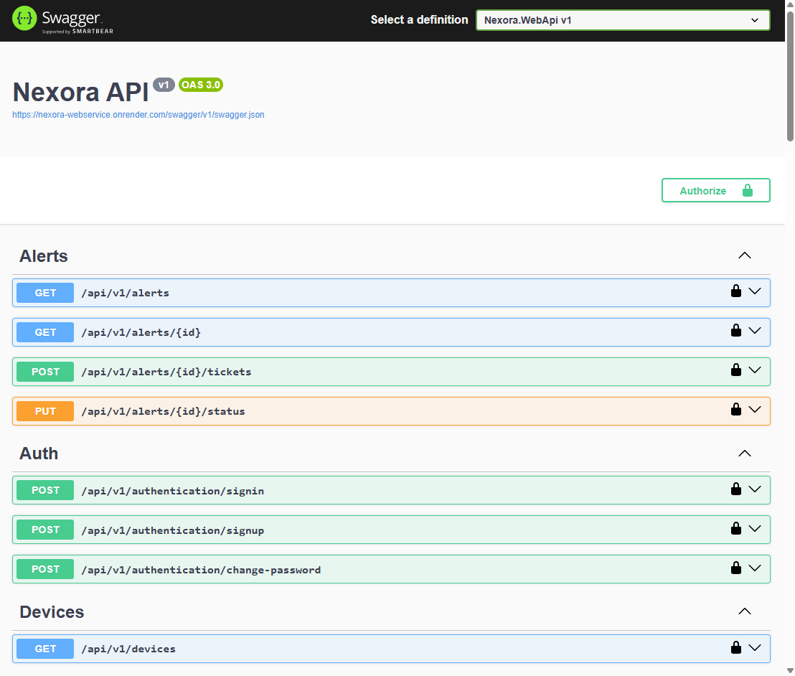
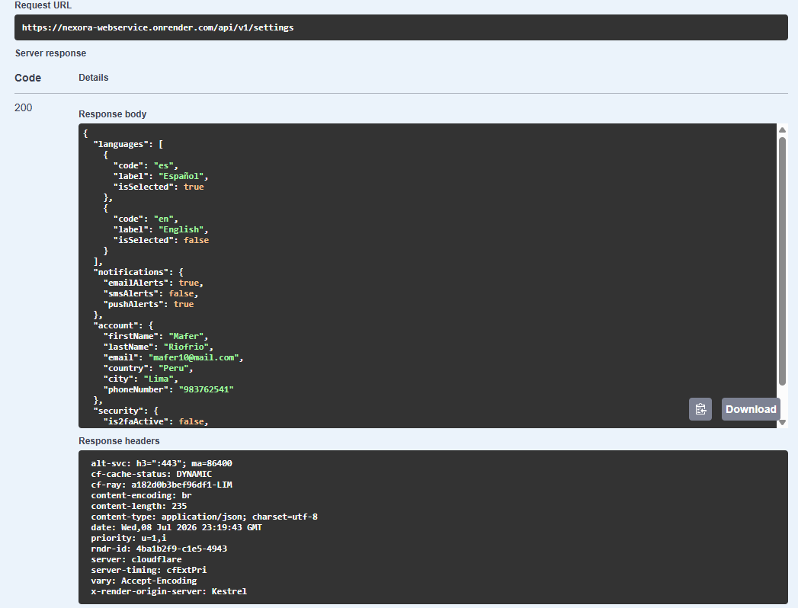
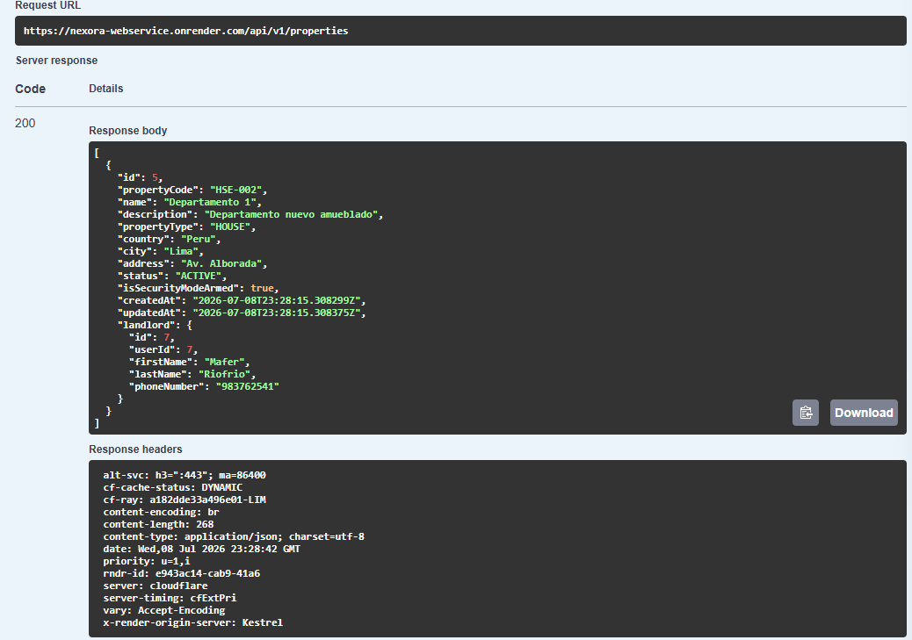
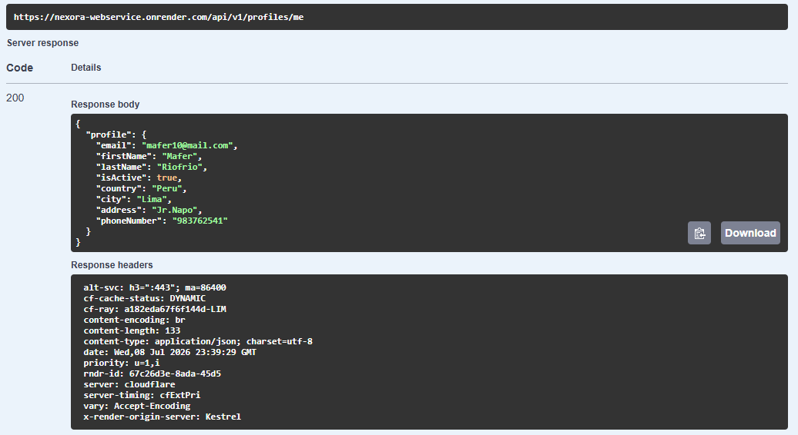
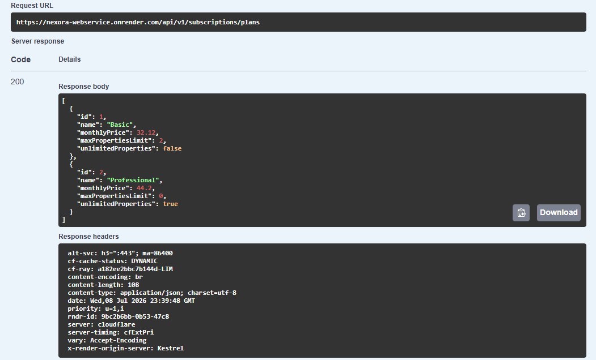

#### 6.2.3.7. Services Documentation Evidence for Sprint Review

#### **Introducción y Logros de Documentación**

Durante el Sprint 3, se documentaron y validaron los servicios del **Web Service (Nexora Web API)** utilizando **Swagger / OpenAPI (v1)** como herramienta principal de documentación y prueba. Esta documentación permitió visualizar, ejecutar y verificar el comportamiento de los principales endpoints implementados, manteniendo la estructura RESTful bajo la ruta base `/api/v1/`.

Asimismo, la documentación evidencia la implementación de servicios correspondientes a los bounded contexts del backend bajo la arquitectura de **Monolito Modular**, incluyendo funcionalidades relacionadas con la gestión de perfiles, configuración del usuario, propiedades, suscripciones y otros servicios complementarios de la plataforma. La validación de estos endpoints se realizó mediante respuestas obtenidas directamente desde Swagger, garantizando la consistencia entre la implementación del backend y su documentación técnica.

### Logros Clave de Documentación en este Sprint

* **Actualización de endpoints RESTful:** Se documentaron los principales endpoints implementados y validados durante el Sprint 3, manteniendo la estructura versionada bajo `/api/v1/`.
* **Soporte de seguridad JWT Bearer:** Swagger mantiene el esquema de autenticación mediante `Bearer {token}`, permitiendo validar correctamente los endpoints protegidos.
* **Documentación de módulos funcionales:** Se evidenciaron servicios correspondientes a los bounded contexts de Identity & Access, Resource & Asset Management, Monitoring & Intelligence y Subscriptions & Payment.
* **Validación mediante Swagger/OpenAPI:** Se verificó el funcionamiento de los endpoints utilizando Swagger, obteniendo respuestas reales del backend para documentar su comportamiento.
* **Ejemplos de solicitudes y respuestas:** La documentación incorpora ejemplos representativos de respuestas JSON obtenidas desde la API, facilitando la comprensión de la estructura de los servicios implementados.

---

#### **Repositorio y Commits del Web Service**

* **URL del Repositorio:** [https://github.com/upc-202610-1ASI0572-6779-NexIoT/nexora.webservice](https://github.com/upc-202610-1ASI0572-6779-NexIoT/nexora.webservice)
* **Rama Principal de Desarrollo:** `develop`

#### Commits Relacionados con la Implementación y Documentación (Sprint 3):

| Commit ID | Autor / Desarrollador | Mensaje de Confirmación | Fecha |
| :--- | :--- | :--- | :--- |
| `042813d` | Andrea | feat: add consumption report analytics | 29/06/26 |
| `f9961fc` | Jorge | feat: add AlertsController for monitoring and ticket management and configure Web API infrastructure | 30/06/26 |
| `395db94` | Kevin |feat(stripe): integrate checkout payments, webhook card saving, and plan upgrades| 02/07/26 |
| `919e74d` | Jhosep |feat(subscriptions): add landlord payment method retrieval and update| 04/07/26 |
| `c1a2f35` | Jorge |feat(tenants): update tenant model to support nullable PropertyId and adjust related logic| 07/07/26 |
---

#### **Relación de Endpoints Actualizados o Evidenciados en Sprint 3**

En el Sprint 3 no se repite la documentación completa de todos los servicios del backend. En su lugar, se evidencian los endpoints que fueron incorporados, ampliados o utilizados para validar las funcionalidades trabajadas durante este sprint, principalmente en configuración de usuario, gestión de propiedades e inquilinos, alertas, reportes y suscripciones.

| Contexto Acotado | Módulo/Controlador | Método HTTP | Sintaxis del Endpoint | Autorización |
| :--- | :--- | :--- | :--- | :--- |
| **Identity & Access** | `Settings` | GET | `/api/v1/settings` | Requiere JWT |
| **Identity & Access** | `Settings` | PUT | `/api/v1/settings/language` | Requiere JWT |
| **Identity & Access** | `Settings` | PUT | `/api/v1/settings/notifications` | Requiere JWT |
| **Identity & Access** | `Settings` | PUT | `/api/v1/settings/security/passwords` | Requiere JWT |
| **Identity & Access** | `Settings` | PUT | `/api/v1/settings/security/two-factor` | Requiere JWT |
| **Resource & Asset** | `Properties` | GET | `/api/v1/properties/stats` | Requiere JWT |
| **Resource & Asset** | `Properties` | GET | `/api/v1/properties/dashboards` | Requiere JWT |
| **Resource & Asset** | `Properties` | PUT | `/api/v1/properties/{id}/status` | Requiere JWT |
| **Resource & Asset** | `Tenants` | POST | `/api/v1/tenants` | Requiere JWT |
| **Resource & Asset** | `Tenants` | GET | `/api/v1/tenants` | Requiere JWT |
| **Resource & Asset** | `Tenants` | GET | `/api/v1/tenants/{id}` | Requiere JWT |
| **Resource & Asset** | `Tenants` | PUT | `/api/v1/tenants/{id}` | Requiere JWT |
| **Resource & Asset** | `Tenants` | DELETE | `/api/v1/tenants/{id}` | Requiere JWT |
| **Resource & Asset** | `Tenants` | GET | `/api/v1/properties/{propertyId}/tenants` | Requiere JWT |
| **Monitoring & Intelligence** | `Alerts` | GET | `/api/v1/alerts` | Requiere JWT |
| **Monitoring & Intelligence** | `Alerts` | GET | `/api/v1/alerts/{id}` | Requiere JWT |
| **Monitoring & Intelligence** | `Alerts` | POST | `/api/v1/alerts/{id}/tickets` | Requiere JWT |
| **Monitoring & Intelligence** | `Alerts` | PUT | `/api/v1/alerts/{id}/status` | Requiere JWT |
| **Monitoring & Intelligence** | `Reports` | GET | `/api/v1/reports` | Requiere JWT |
| **Monitoring & Intelligence** | `Reports` | GET | `/api/v1/alerts/reports` | Requiere JWT |
| **Subscriptions & Payment** | `Subscriptions` | GET | `/api/v1/subscriptions/plans` | Requiere JWT |
| **Subscriptions & Payment** | `Subscriptions` | GET | `/api/v1/subscriptions/current` | Requiere JWT |
| **Subscriptions & Payment** | `Subscriptions` | POST | `/api/v1/subscriptions` | Requiere JWT |
| **Subscriptions & Payment** | `Subscriptions` | GET | `/api/v1/subscriptions/payment-methods` | Requiere JWT |
| **Subscriptions & Payment** | `Subscriptions` | PUT | `/api/v1/subscriptions/payment-methods/{id}` | Requiere JWT |
| **Subscriptions & Payment** | `Subscriptions` | GET | `/api/v1/subscriptions/invoices` | Requiere JWT |
| **Subscriptions & Payment** | `Subscriptions` | PUT | `/api/v1/subscriptions/status` | Requiere JWT |
---

#### **Especificación Técnica de los Endpoints del Sprint 3**

Durante el Sprint 3 se validaron endpoints pertenecientes a distintos bounded contexts implementados en el backend de Nexora. A continuación, se presentan algunos de los servicios más representativos, junto con ejemplos de las respuestas obtenidas mediante Swagger/OpenAPI.

---

#### **Módulo de Configuración de Usuario**

##### A. Obtener configuración del usuario

* **Verbo HTTP:** GET
* **Sintaxis:** `/api/v1/settings`
* **Cabecera de Autorización:** `Authorization: Bearer {token}`
* **Descripción:** Permite consultar la configuración del usuario autenticado, incluyendo idioma, preferencias de notificación, información de la cuenta y opciones de seguridad.

* **Ejemplo de Respuesta (HTTP 200 - OK):**

```json
{
  "language": {
    "code": "es",
    "label": "Español",
    "isSelected": true
  },
  "notifications": {
    "emailAlerts": true,
    "smsAlerts": false,
    "pushAlerts": true
  },
  "account": {
    "firstName": "Mafer",
    "lastName": "Riofrio",
    "email": "mafer10@mail.com",
    "country": "Peru",
    "city": "Lima",
    "phoneNumber": "983762541"
  },
  "security": {
    "is2faActive": false,
    "lastPasswordChange": "Never"
  }
}
```

---

#### **Módulo de Gestión de Propiedades**

##### A. Obtener detalle de una propiedad

* **Verbo HTTP:** GET
* **Sintaxis:** `/api/v1/properties/{id}`
* **Cabecera de Autorización:** `Authorization: Bearer {token}`
* **Descripción:** Permite consultar la información detallada de una propiedad registrada, incluyendo su ubicación, estado y propietario.

* **Ejemplo de Respuesta (HTTP 200 - OK):**

```json
{
  "id": 5,
  "propertyCode": "HSE-002",
  "name": "Departamento 1",
  "propertyType": "HOUSE",
  "country": "Peru",
  "city": "Lima",
  "status": "ACTIVE",
  "isSecurityModeArmed": true,
  "landlord": {
    "id": 7,
    "firstName": "Mafer",
    "lastName": "Riofrio"
  }
}
```

---

#### **Módulo de Perfil de Usuario**

##### A. Obtener perfil del usuario autenticado

* **Verbo HTTP:** GET
* **Sintaxis:** `/api/v1/profiles/me`
* **Cabecera de Autorización:** `Authorization: Bearer {token}`
* **Descripción:** Permite obtener la información del perfil correspondiente al usuario autenticado.

* **Ejemplo de Respuesta (HTTP 200 - OK):**

```json
{
  "profile": {
    "email": "mafer10@mail.com",
    "firstName": "Mafer",
    "lastName": "Riofrio",
    "isActive": true,
    "country": "Peru",
    "city": "Lima",
    "address": "Jr. Napo",
    "phoneNumber": "983762541"
  }
}
```

---

#### **Módulo de Suscripciones**

##### A. Obtener planes de suscripción

* **Verbo HTTP:** GET
* **Sintaxis:** `/api/v1/subscriptions/plans`
* **Descripción:** Permite consultar los planes de suscripción disponibles dentro de la plataforma.

* **Ejemplo de Respuesta (HTTP 200 - OK):**

```json
[
  {
    "id": 1,
    "name": "Basic",
    "monthlyPrice": 32.12,
    "maxPropertiesLimit": 2,
    "unlimitedProperties": false
  },
  {
    "id": 2,
    "name": "Professional",
    "monthlyPrice": 44.20,
    "maxPropertiesLimit": 0,
    "unlimitedProperties": true
  }
]
```

---

#### **Capturas de Interacción con OpenAPI/Swagger**

#### **Vista general de Swagger UI**

* **Interacción:** Visualización general de todos los controladores documentados en Swagger.

* **Acción:** Se evidencia la documentación organizada por módulos como **Auth**, **Profile**, **Settings**, **Properties**, **Tenants**, **Telemetry**, **Alerts**, **Reports** y **Subscriptions**, facilitando la exploración y validación de los servicios REST implementados.



---

#### **Configuración de usuario**

* **Interacción:** `GET /api/v1/settings`, `PUT /api/v1/settings/language` y `PUT /api/v1/settings/notifications`.

* **Acción:** Se visualiza la consulta y actualización de las preferencias de configuración del usuario autenticado.



---

#### **Gestión de propiedades e inquilinos**

* **Interacción:** `POST /api/v1/tenants`, `GET /api/v1/tenants` y `GET /api/v1/properties/{propertyId}/tenants`.

* **Acción:** Se evidencia el registro, consulta y administración de los inquilinos asociados a las propiedades del usuario.



---

#### **Perfil de usuario**

* **Interacción:** `GET /api/v1/profiles/me`.

* **Acción:** Se evidencia la consulta de la información del perfil del usuario autenticado mediante JWT, mostrando que los servicios protegidos responden correctamente cuando se utiliza un token válido.



---

#### **Suscripciones y métodos de pago**

* **Interacción:** `GET /api/v1/subscriptions/plans`, `POST /api/v1/subscriptions` y `PUT /api/v1/subscriptions/payment-methods/{id}`.

* **Acción:** Se evidencia la consulta de planes disponibles, la activación de una suscripción y la actualización de los métodos de pago registrados por el usuario.



<div style="page-break-after: always;"></div>