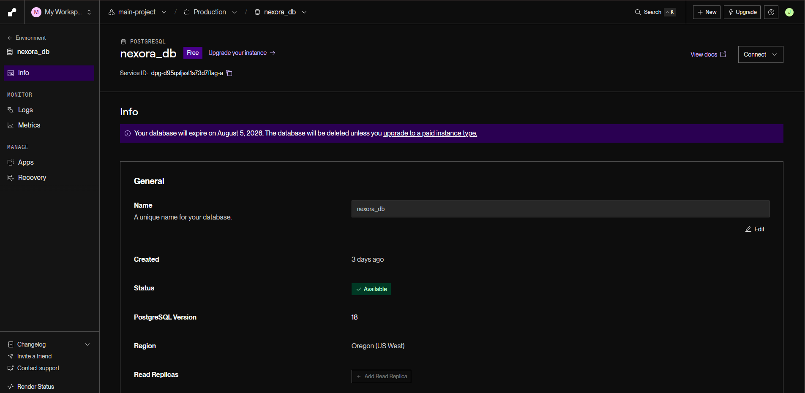
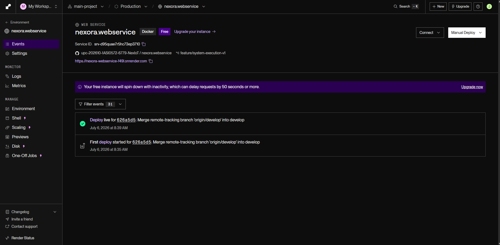
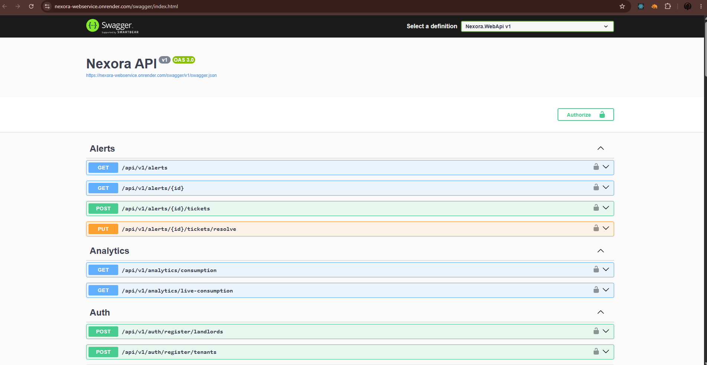
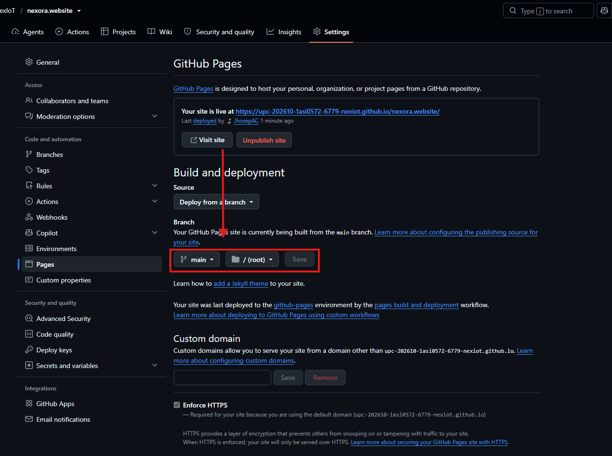
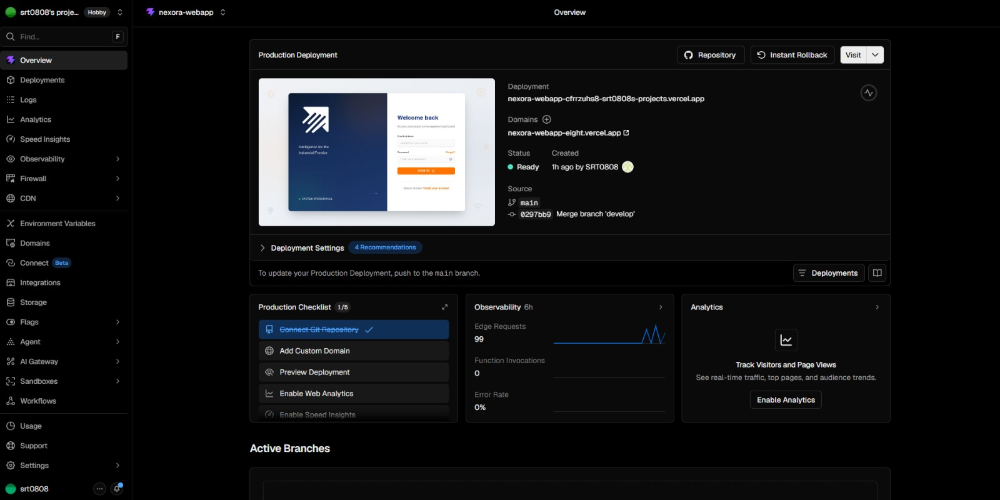
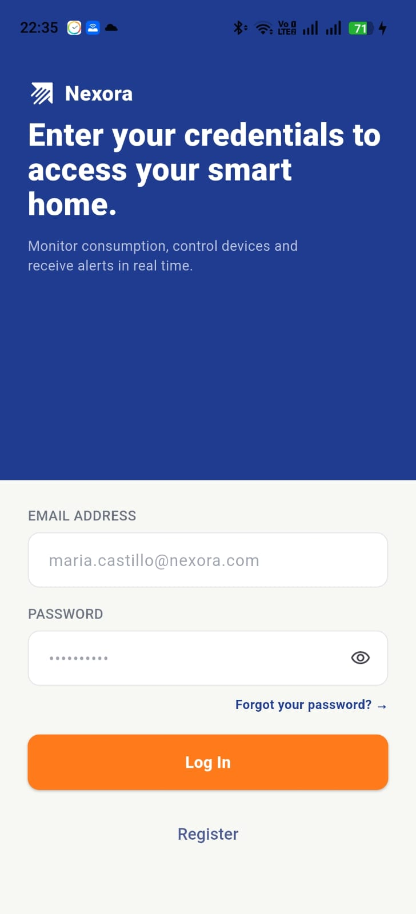
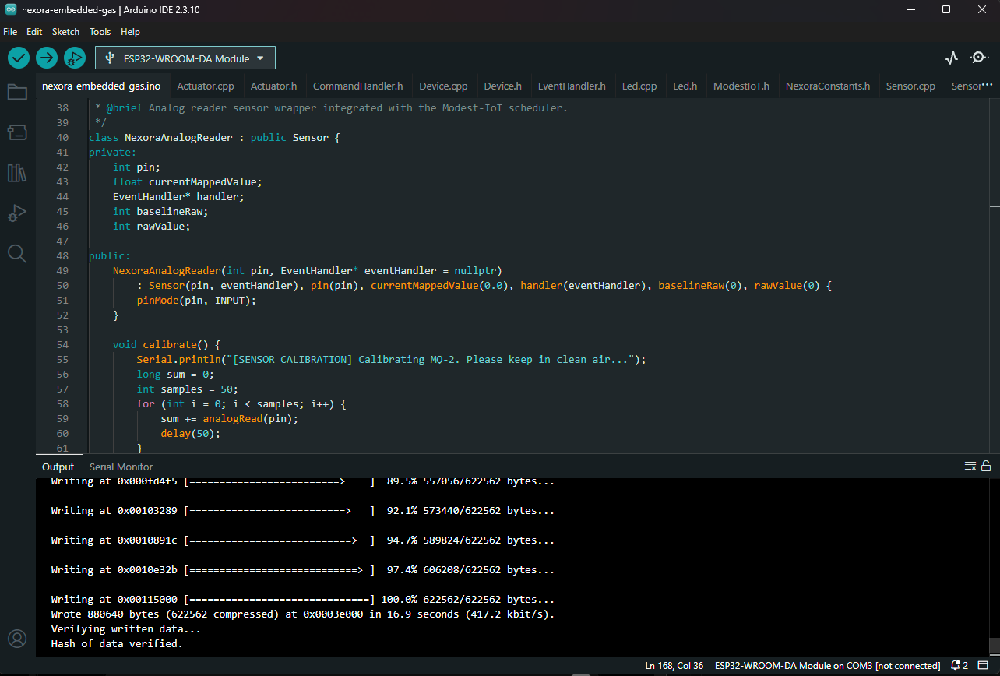

#### 6.2.3.8. Software Deployment Evidence for Sprint Review

Durante el Sprint 3, el equipo consolidó el despliegue final del ecosistema Nexora, integrando de forma completa todas las capas de la solución IoT. En esta iteración se optimizaron los servicios desplegados previamente, se incorporó la integración del hardware ESP32 con el Edge Service y el Backend, y se validó el funcionamiento de las aplicaciones Web y Mobile consumiendo información de telemetría en tiempo real.

Asimismo, se realizaron pruebas de integración extremo a extremo, verificando el flujo de datos desde el dispositivo IoT hasta las aplicaciones cliente desplegadas en producción.

 

# Base de Datos – Render

## Consolidación del almacenamiento de producción

Durante el Sprint 3 se optimizó la infraestructura de persistencia en Render para soportar la integración completa del ecosistema Nexora.

### Actividades realizadas

* Optimización del esquema relacional para soportar nuevas entidades y registros de telemetría.
* Validación del almacenamiento de información proveniente del Edge Service.
* Ajuste de políticas de acceso seguro y credenciales de producción.
* Verificación del correcto almacenamiento de datos provenientes de dispositivos IoT reales.

---

## Validación del almacenamiento en producción

Se realizaron pruebas funcionales verificando la persistencia de datos enviados desde el hardware y consumidos por las aplicaciones cliente.

### Actividades realizadas

* Validación de inserción automática de registros de telemetría.
* Verificación de consultas desde el Web Service.
* Comprobación de la integridad de la información almacenada.

### Resultado del despliegue

La base de datos permaneció completamente operativa durante el Sprint 3, almacenando correctamente la información generada por el ecosistema Nexora.

 

# Web Service REST API – Render

## Optimización y despliegue final del Backend

Durante el Sprint 3 se consolidó el despliegue del Backend incorporando mejoras en la integración con el Edge Service y el procesamiento de telemetría.

### Actividades realizadas

* Actualización de los endpoints para recepción de telemetría.
* Optimización de la lógica de procesamiento de eventos.
* Validación del almacenamiento en Supabase.
* Corrección de incidencias detectadas durante las pruebas de integración.

---

## Integración continua

El Backend continuó utilizando el pipeline automático de Render conectado directamente con GitHub.

### Actividades realizadas

* Verificación de despliegues automáticos.
* Validación de logs de ejecución.
* Comprobación de disponibilidad del servicio en producción.
* Pruebas de consumo desde la aplicación Web, Mobile y Edge Service.

### Resultado del despliegue

El Web Service quedó desplegado satisfactoriamente permitiendo la comunicación entre todos los componentes del ecosistema Nexora.

**URL de la API del Webservice:** https://nexora-webservice.onrender.com/swagger/index.html

 

# Landing Page – GitHub Pages

## Actualización de la versión comercial

La Landing Page fue refinada para reflejar la versión final del producto incorporando mejoras visuales, contenido actualizado y enlaces hacia las aplicaciones desplegadas.

### Actividades realizadas

* Actualización del contenido comercial.
* Optimización del SEO.
* Revisión del diseño responsive.
* Corrección de enlaces y navegación.

### Resultado del despliegue

La Landing Page quedó publicada mostrando la versión definitiva del producto Nexora.

**URL Landing Page:** https://upc-202610-1asi0572-6779-nexiot.github.io/nexora.website/

 

# Aplicación Web – Vercel

## Consolidación del Dashboard

Durante el Sprint 3 se finalizaron las funcionalidades principales del Dashboard Web integrando completamente la información proveniente del Backend.

### Actividades realizadas

* Optimización de autenticación.
* Integración de información en tiempo real.
* Visualización de telemetría proveniente del Edge Service.
* Corrección de errores detectados durante las pruebas funcionales.

### Resultado del despliegue

La aplicación web quedó desplegada en producción permitiendo administrar dispositivos, propiedades y visualizar información en tiempo real.

**URL de la aplicación web:** https://nexora-app-rho.vercel.app/

 

# Aplicación Mobile

## Despliegue de la versión final

Durante el Sprint 3 se consolidó la aplicación móvil integrándola completamente con el Backend y los servicios desplegados.

### Actividades realizadas

* Integración con la API REST desplegada.
* Consumo de telemetría en tiempo real.
* Validación del flujo de autenticación.
* Optimización de rendimiento y navegación.

---

## Validación de funcionamiento

Se realizaron pruebas de integración verificando la comunicación entre la aplicación móvil, el Backend y la infraestructura IoT.

### Actividades realizadas

* Pruebas sobre dispositivos Android.
* Verificación de consumo de endpoints.
* Validación de sincronización de datos.
* Corrección de incidencias detectadas durante el Sprint.

  

### Resultado del despliegue

La aplicación móvil quedó completamente integrada al ecosistema Nexora permitiendo consultar información del sistema IoT desde dispositivos móviles.

 

# Embedded Application – Arduino IDE (ESP32)

## Despliegue del Firmware IoT

Durante el Sprint 3 se consolidó el despliegue de la aplicación embebida desarrollada para el ESP32 utilizando Arduino IDE. El firmware fue optimizado para operar sobre hardware físico, permitiendo la adquisición de datos del sensor MQ-2, el control automático de actuadores y la comunicación con el Edge Service mediante peticiones HTTP.

### Actividades realizadas

* Actualización del firmware para el funcionamiento sobre un ESP32 físico.
* Integración del framework Modest-IoT para la ejecución asíncrona de sensores y actuadores.
* Configuración de la conectividad Wi-Fi para la transmisión de telemetría en tiempo real.
* Implementación del envío de datos al Edge Service mediante solicitudes HTTP.
* Integración del control automático de la válvula de gas, LED de alerta y buzzer según los niveles detectados por el sensor MQ-2.
* Optimización del proceso de calibración del sensor para pruebas en un entorno físico.
* Validación de la recepción de comandos remotos enviados desde el Backend para el control del sistema.

---

## Validación sobre Hardware

Se realizaron pruebas funcionales utilizando un ESP32, un sensor MQ-2, un servomotor, un LED y un buzzer, verificando el correcto funcionamiento de la solución IoT y su integración con el ecosistema Nexora.

### Actividades realizadas

* Verificación de la lectura del sensor MQ-2 en condiciones reales.
* Pruebas del accionamiento automático de los actuadores frente a eventos de fuga de gas.
* Validación del envío de telemetría hacia el Edge Service y el Web Service.
* Comprobación de la integración extremo a extremo entre el hardware, Backend, Web Application y Mobile App.
* Corrección de incidencias detectadas durante las pruebas finales del Sprint.

### Resultado del despliegue

La aplicación embebida quedó desplegada satisfactoriamente sobre hardware físico, permitiendo el monitoreo de concentraciones de gas, el accionamiento automático de los dispositivos de seguridad y la transmisión de telemetría en tiempo real hacia el ecosistema Nexora, validando el funcionamiento completo de la solución IoT propuesta.

