#### 6.2.3.9. Team Collaboration Insights during Sprint

Durante el desarrollo del Sprint 3, el equipo de Nexora continuó utilizando una metodología de trabajo altamente colaborativa y la división de responsabilidades según los roles técnicos definidos. Para este Sprint, el alcance incluyó el desarrollo paralelo y la integración de múltiples componentes clave de la solución de IoT: **Edge Service**, **Mobile App**, **Embedded Apps**, **Web Service** y **Web Application**.

La gestión de código y la colaboración técnica se centralizaron en GitHub, usando los estándares de Gitflow, además de realizarse revisiones cruzadas de código (*Code Reviews*) por parte de los líderes de aspecto, y validaciones previas a la fusión para asegurar la consistencia arquitectónica y de diseño (DDD).

##### Analíticos de Colaboración y Commits en GitHub

A continuación, se presentan las capturas de pantalla de los analíticos de colaboración (Pulse / Contributors) recopiladas directamente de GitHub para cada uno de los componentes de software desarrollados en el Sprint 3:

###### 1. Web Application (nexora.webapp)

*Métrica de actividad general y commits (GitHub Pulse) en el repositorio de la Web Application:*

  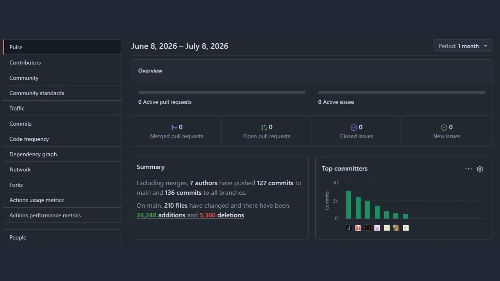

*Volumen de aportes de código y commits por autor (Página 1) en el repositorio de la Web Application:*

  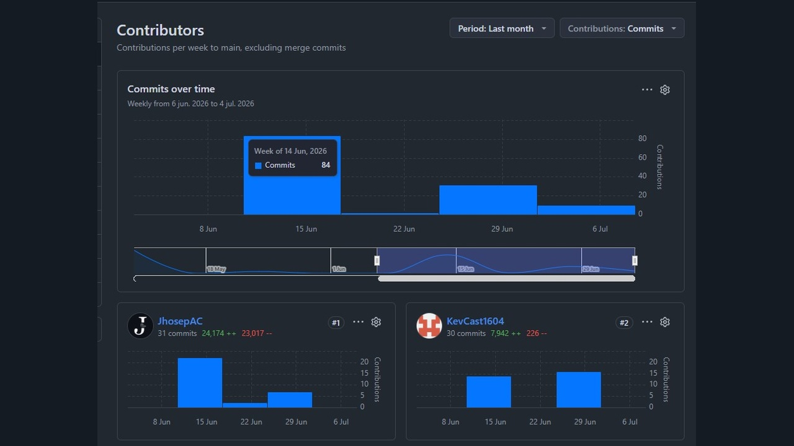

*Volumen de aportes de código y commits por autor (Página 2) en el repositorio de la Web Application:*

  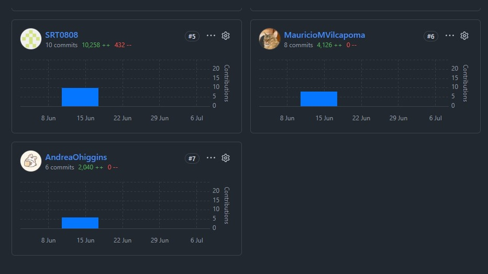

###### 2. Mobile App (nexora.mobileapp)

*Métrica de actividad general y commits (GitHub Pulse) en el repositorio de la Mobile Application:*

  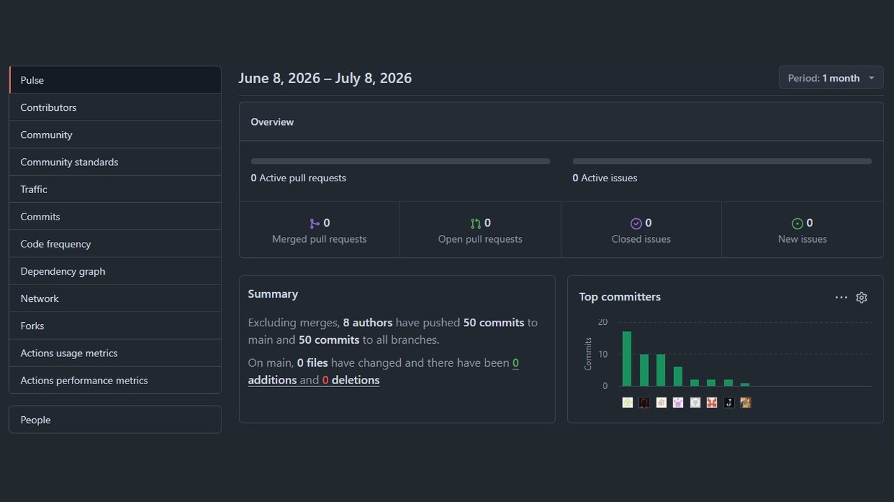

*Volumen de aportes de código y commits por autor (Página 1) en el repositorio de la Mobile Application:*

  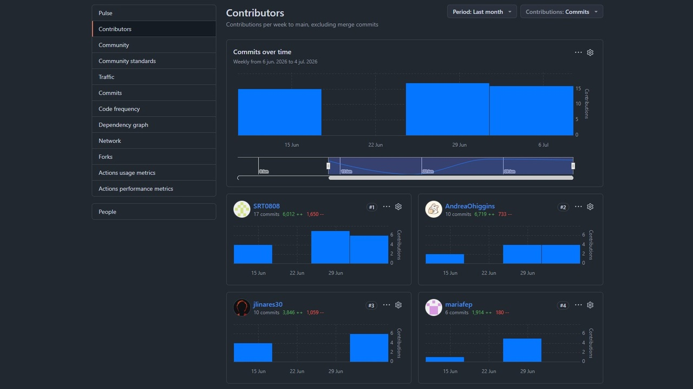

*Volumen de aportes de código y commits por autor (Página 2) en el repositorio de la Mobile Application:*

  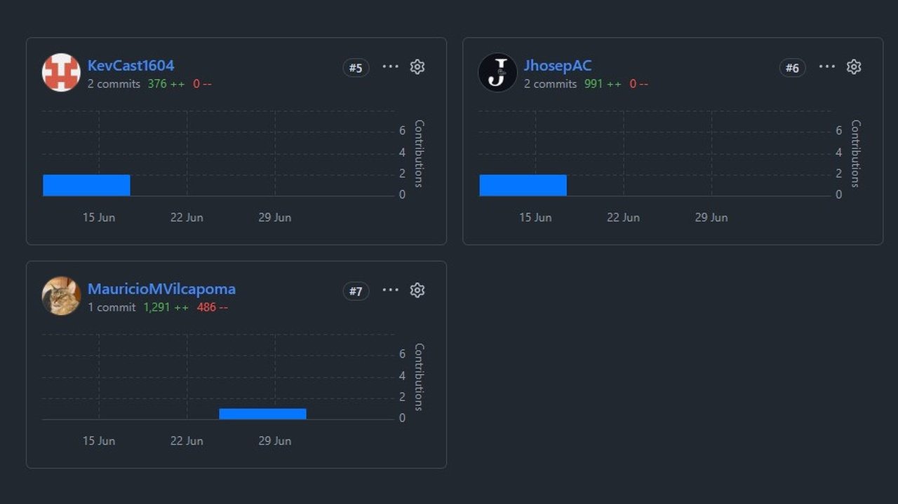

###### 3. Web Service (nexora.webservice)

*Métrica de actividad general y commits (GitHub Pulse) en el repositorio de Web Service:*

  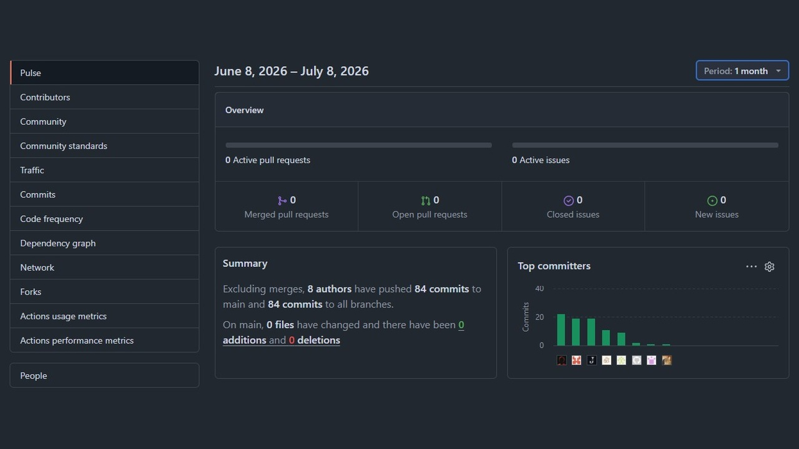

*Volumen de aportes de código y commits por autor (Página 1) en el repositorio de Web Service:*

  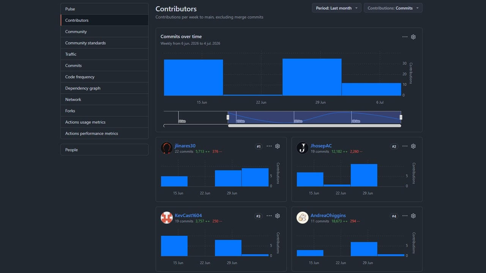

*Volumen de aportes de código y commits por autor (Página 2) en el repositorio de Web Service:*

  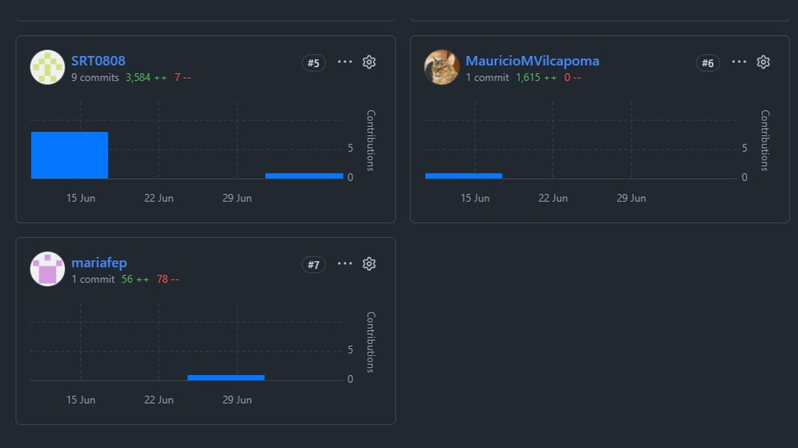

###### 4. Edge Service (nexora.edgeservice)

*Métrica de actividad general y commits (GitHub Pulse) en el repositorio de Edge Service:*

  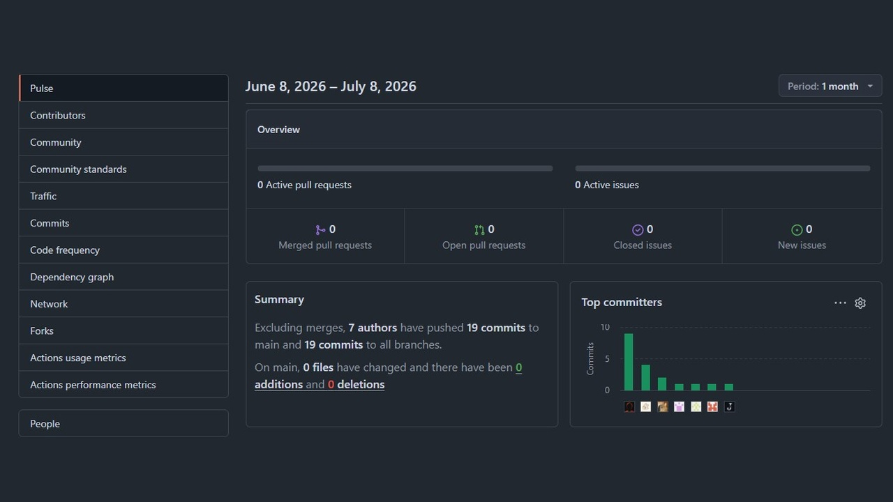

*Volumen de aportes de código y commits por autor (Página 1) en el repositorio de Edge Service:*

  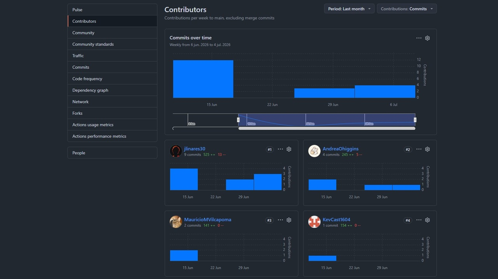

*Volumen de aportes de código y commits por autor (Página 2) en el repositorio de Edge Service:*

  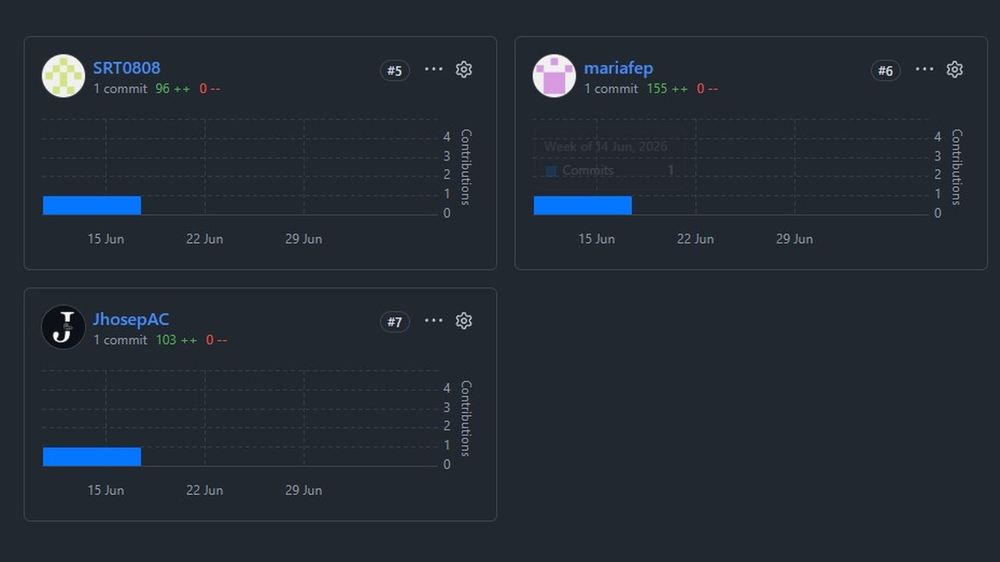

###### 5. Embedded Apps (nexora.embeddedapp)

*Métrica de actividad general y commits (GitHub Pulse) en el repositorio de la Embedded Application:*

  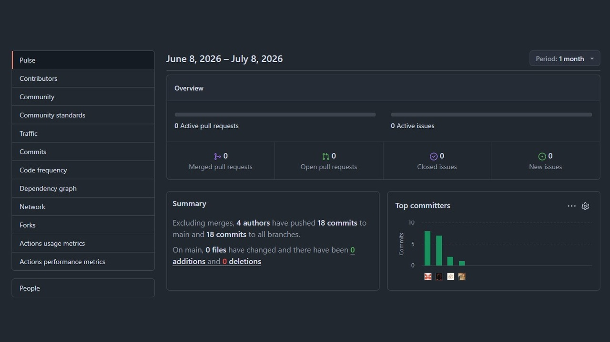

*Volumen de commits y aportes de código por autor en el repositorio de la Embedded Application:*

  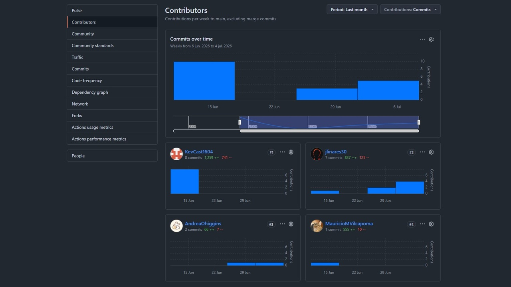

##### Interpretación de los Analíticos

A partir de las métricas visualizadas en los analíticos de GitHub para el Sprint 3, el equipo presenta la siguiente interpretación:

1.  **Distribución de Trabajo y Cohesión**: Los analíticos de contribuciones de este último Sprint reflejan la consolidación final del equipo. Las tareas de integración, pruebas cruzadas y estabilización de las capas del sistema (Domain, Interface, Application, Infrastructure) se dividieron de forma equitativa.
2.  **Ritmo de Desarrollo y Frecuencia de Commits**: La frecuencia de commits fue sumamente activa en la última fase del proyecto. Se evidencian picos elevados relacionados directamente con hitos clave: la integración de Stripe para cobros de planes premium en el backend, la finalización del asistente de configuración de automatizaciones en el frontend, y la calibración del sensor analógico de caudal con mitigación de ruido en el firmware del ESP32.
3.  **Gestión de Ramas e Integración Sincronizada**: Se mantuvo una estricta política de ramificación (feature branches independientes). El cierre ordenado de Pull Requests mediante code review y pruebas automáticas previas a la fusión a `develop` y finalmente a `main` permitió un incremento estable de valor y la posterior publicación limpia de la versión release del proyecto.
4.  **Participación en los Productos del Sprint**: Se evidencia y documenta la participación equitativa de todos los miembros en la implementación de los entregables funcionales finales de este Sprint:
    -   **Web Services & APIs**: Desarrollo final de los endpoints RESTful con filtros multitenant de aislamiento, procesamiento de pagos con Stripe y endpoints de administración de suscripciones.
    -   **Web & Mobile Application**: Maquetación e integración del flujo interactivo de pagos en la web, y desarrollo de la aplicación móvil nativa para inquilinos con visualización del dashboard de propiedades, panel de incidentes y alarmas.
    -   **Edge Service & Embedded App**: Implementación de la selección dinámica de protocolo de transporte (HTTP/HTTPS) en el firmware y optimización del sensor de flujo.

En conclusión, los analíticos del repositorio confirman que la entrega de valor de Nexora en este Sprint 3 se llevó a cabo bajo un enfoque coordinado, con una alta participación de todos sus integrantes, y asegurando el cumplimiento de las metas planteadas en el Sprint Backlog.

