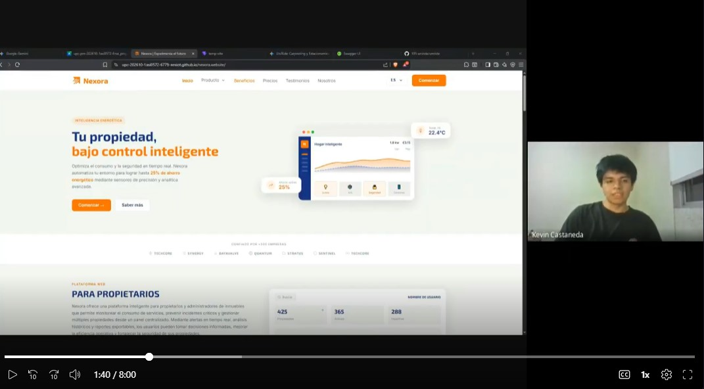
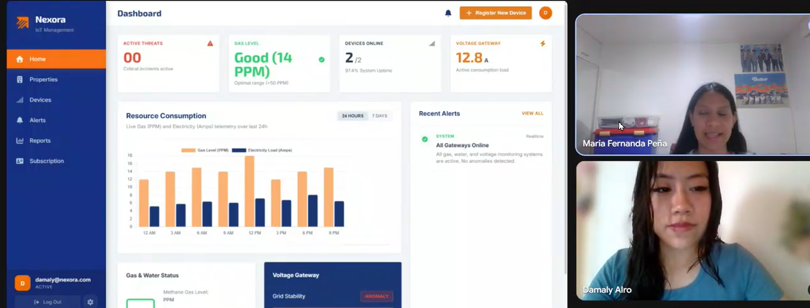
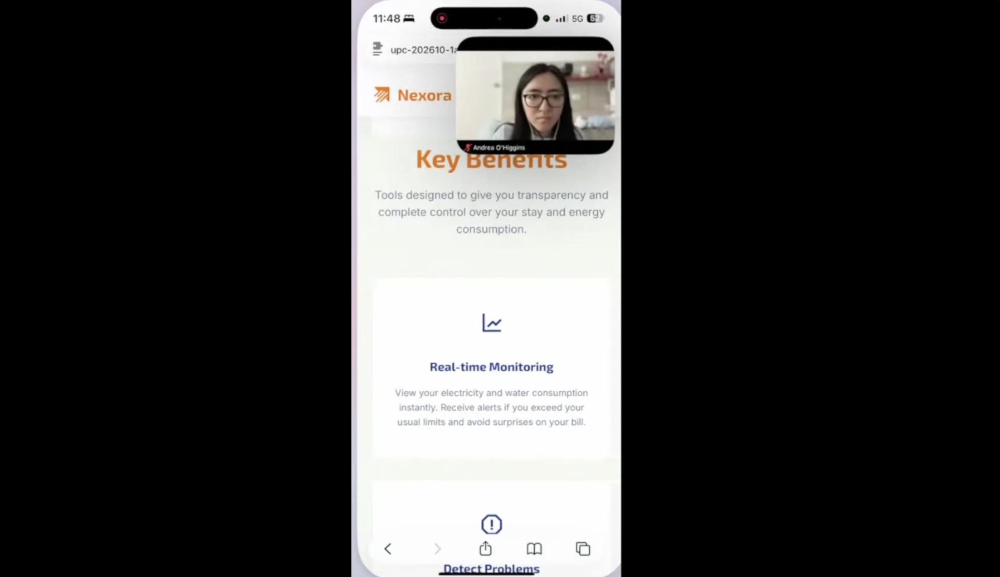

## 6.3.2. Registro de Entrevistas de Validación

Esta sección presenta el registro detallado de las entrevistas de validación realizadas con usuarios reales pertenecientes a los segmentos objetivos definidos para la solución de **Nexora**. Las entrevistas sirven como evidencia del proceso de validación e interacción directa de los usuarios con la Landing Page y los prototipos funcionales (Web y Mobile).

---

### **1. Segmento Objetivo: Arrendadores (Landlords)**

#### **Entrevista 1**
* **Nombres y Apellidos:** Yoselin Canahuiri
* **Edad:** 25 años
* **Distrito de Residencia:** Surco
* **Fecha de la Entrevista:** 19/06/2026
* **Enlace del Video:** [Video en Microsoft Stream / Clipchamp](https://upcedupe-my.sharepoint.com/:v:/g/personal/u202318814_upc_edu_pe/IQBaXNAMjnj6Qo-r0c44go5wAR0oDeMpffll7GxMyHzWcd8?e=LpxL9H&nav=eyJyZWZlcnJhbEluZm8iOnsicmVmZXJyYWxBcHAiOiJTdHJlYW1XZWJBcHAiLCJyZWZlcnJhbFZpZXciOiJTaGFyZURpYWxvZy1MaW5rIiwicmVmZXJyYWxBcHBQbGF0Zm9ybSI6IldlYiIsInJlZmVycmFsTW9kZSI6InZpZXcifX0%3D)
* **Timing de la Entrevista:** Inicio en 00:00 | Duración total: 8 Mins 00 segs

**Evidencia de la Entrevista (Screenshot):**

**Resumen de la Entrevista (Principales Apreciaciones):**
* **Landing Page:** La entrevistada considera que la landing page es clara y concisa y le parece interesante la idea de negocio.  
* **Web Application:** La entrevistada considera que el diseño de la app es ordenada, sin embargo, siente que no le queda claro como o porque deberia de comprar nuestros dispositivos para sus propiedades 
* **Conclusiones y Recomendaciones del Usuario:** A la entrevistada le convenció el diseño y el proposito de NexIoT, sin embargo, considera que debe de explicarse mejor el porque ella como propietaria, debe de comprar las soluciones IoT y el porque es beneficioso para ella en térmitos económicps.

---

#### **Entrevista 2**
* **Nombres y Apellidos:** Jocelyn Damaly Almerco Rojas
* **Edad:** 25 años
* **Distrito de Residencia:** Lima
* **Fecha de la Entrevista:** 19/06/2026
* **Enlace del Video:** [Video en Microsoft Stream / Clipchamp](https://1drv.ms/v/c/a3bebbb4408387f0/IQB0IC8AOhbDQr2pHWJwxG9RATPesag7HoY1xgmKOgBcl3U?e=Re1eYW)
* **Timing de la Entrevista:** Inicio en 00:00 | Duración total: 6 min 52 segs

**Evidencia de la Entrevista (Screenshot):**

**Resumen de la Entrevista (Principales Apreciaciones):**
* **Landing Page:** La entrevistada considera que la landing page tiene un formato claro, se ve enfocado a lo que necesita, es precisa, y le gusta mucho el tema a tratar pq le beneficia como arrendedora.  
* **Web Application:** A la entrevistada le parecio llamativa nuestra app, le parece genial que le existan secciones con gráficos,para poder visualizar mejor el contenido de la aplicación y no tener un documento que a veces no se entiende mucho, aunque cuestiona el tema de larjeta guardada en la aplicación y como sería factible saber si es seguro para el usuario que no se va a ver si otro usuario llegará entrar a la cuenta.
* **Conclusiones y Recomendaciones del Usuario:** Como conclusión, a la entrevistada le gustó lo visual y las funcionalidades claves para el proyecto, sin embargo cree que debería haber pasos de verificación para el cuidado de la tarjeta en la aplicación para que no exista un riesgo de saber los datos de esta.

---

#### **Entrevista 3**
* **Nombres y Apellidos:** `[Nombres y Apellidos del Entrevistado]`
* **Edad:** `[Edad]` años
* **Distrito de Residencia:** `[Distrito / Ciudad]`
* **Fecha de la Entrevista:** `[DD/MM/AAAA]`
* **Enlace del Video:** [Video en Microsoft Stream / Clipchamp](URL_DEL_VIDEO)
* **Timing de la Entrevista:** Inicio en `[MM:SS]` | Duración total: `[MM:SS]`

**Evidencia de la Entrevista (Screenshot):**

*(Nota: Reemplazar esta imagen por una captura del cuadro de video donde aparezca el entrevistado y el flujo de validación).*

**Resumen de la Entrevista (Principales Apreciaciones):**
* **Landing Page:** 
* **Web Application:** 
* **Mobile App:** 
* **Conclusiones y Recomendaciones del Usuario:** 

---

### **2. Segmento Objetivo: Arrendatarios / Inquilinos (Tenants)**

#### **Entrevista 2**
* **Nombres y Apellidos:** Diego Castro
* **Edad:** 25 años
* **Distrito de Residencia:** Jesus María, Lima
* **Fecha de la Entrevista:** 20/06/2026
* **Enlace del Video:** [Video en Microsoft Stream / Clipchamp](https://upcedupe-my.sharepoint.com/:v:/g/personal/u20221b178_upc_edu_pe/IQCStSYLNTFtSZd3auMZ1mptAbZkhIJviHHIye58zZJ1ScE?e=PaG2aW)
* **Timing de la Entrevista:** Inicio en 00:00 | Duración total: 5 Mins 00 segs

**Evidencia de la Entrevista (Screenshot):**

**Resumen de la Entrevista (Principales Apreciaciones):**
* **Landing Page:** El entrevistado considera que el diseño visual es moderno y explica adecuadamente cómo los sensores previenen accidentes (como fugas de gas) y aseguran la transparencia en la facturación, lo cual le genera tranquilidad como inquilino.
* **Mobile App:** Considera de gran utilidad la visualización de consumos históricos y en tiempo real de agua y energía eléctrica. Sin embargo, observó que las alertas ante anomalías de consumo deberían ser más prominentes en la pantalla de inicio, y sugirió la implementación de notificaciones push de alta prioridad.
* **Conclusiones y Recomendaciones del Usuario:** Le parece excelente contar con un control móvil para la monitorización de su departamento. Recomienda destacar visualmente las alertas críticas en la interfaz y proveer plantillas de automatización rápidas para reducir consumos comunes.