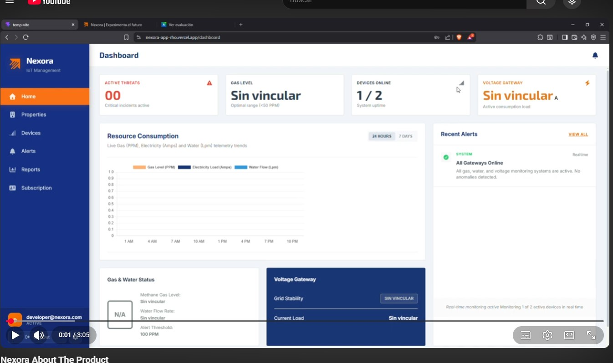

### 6.4.1. Video About-the-Product

El video *About-the-Product* de Nexora ha sido concebido bajo un enfoque de *storytelling* moderno, con el objetivo de transmitir tranquilidad y eficiencia a nuestros usuarios. El tono es profesional, cercano y optimista, alineado con nuestra propuesta de valor: **"Transformamos la gestión de inmuebles en una experiencia inteligente, segura y sin fricciones"**.

El contenido está estructurado para captar la atención de arrendadores y arrendatarios en los primeros 30 segundos, seguido de una demostración dinámica de nuestras capacidades IoT y finalizando con el respaldo de quienes ya validaron la solución.

### Resumen del contenido del video

1. **El Problema:** Breves escenas de la incertidumbre en la gestión de alquileres (incertidumbre en consumos, riesgos de seguridad).

2. **Nuestra Solución:** Presentación de Nexora como el ecosistema IoT que conecta el hogar físico con una plataforma digital intuitiva.

3. **Beneficios Clave:**
    * **Para el arrendador:** Monitoreo en tiempo real y ahorro económico.
    * **Para el arrendatario:** Transparencia y seguridad ante accidentes.

4. **Testimonios:** Opiniones reales de nuestros usuarios validados.

5. **Llamada a la acción (CTA):** Invitación a unirse a Nexora.

---

### Registro del Video (Datos Técnicos)

* **Título:** `upc-pre-202610-1asi0572-NexIot-about-the-product-sprint-3`
* **Duración: 3:05 minutos** 
* **URL Microsoft Stream / Clipchamp:** [https://1drv.ms/f/c/ec31a436d835fad6/IgAFKiYOKZusQa6DvTjjctujAdrRVLmTMVw_ty50pi8gB4w?e=9AL3gY](https://1drv.ms/f/c/ec31a436d835fad6/IgAFKiYOKZusQa6DvTjjctujAdrRVLmTMVw_ty50pi8gB4w?e=9AL3gY)
* **URL YouTube:** [https://youtu.be/mDnTLPnZwME](https://youtu.be/mDnTLPnZwME)

#### Evidencia (Screenshot del video)

---

### Testimonio de Usuario (Validación)

Como parte de nuestro compromiso con la transparencia, incluimos el testimonio de nuestra entrevistada **Veronica Rojas (40 años, Arrendadora)** (_Nota: Visualizar testimonio en el Video About The Product_):

> *"Nexora me ha dado una tranquilidad que no tenía antes. Poder monitorear mis propiedades en tiempo real y recibir alertas inmediatas de fugas sin tener que desplazarme físicamente, es un alivio total. La plataforma es intuitiva y, sinceramente, es la herramienta que todo propietario necesita para gestionar sus inmuebles con mayor eficiencia y seguridad."*

