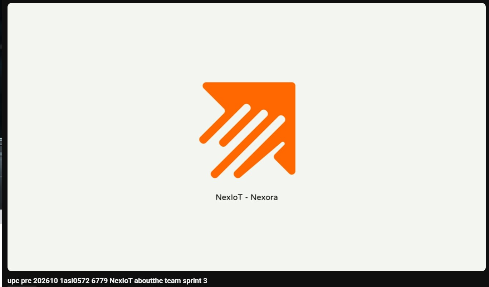

# Conclusiones

A partir del desarrollo del Sprint 3 y la consolidación de la arquitectura del proyecto Nexora, el equipo presenta las siguientes conclusiones:

## AV1

1.  **Impacto de la Integración IoT en la Experiencia de Usuario**: La implementación de dispositivos inteligentes (ESP32) integrados con interfaces web y móviles permite una gestión proactiva de la seguridad y el consumo. Esto no solo optimiza la operación de las propiedades, sino que proporciona a los residentes una herramienta de control en tiempo real que aumenta significativamente su percepción de seguridad y bienestar.
2.  **Escalabilidad mediante Diseño Orientado al Dominio (DDD)**: La adopción de arquitecturas estratégicas y tácticas basadas en DDD ha permitido separar claramente las responsabilidades del sistema. Esta modularidad garantiza que el proyecto pueda crecer con nuevas funcionalidades (como integraciones con terceros o analítica avanzada) sin comprometer la estabilidad del núcleo del negocio.
3.  **Efectividad de la Metodología Ágil y Trabajo Colaborativo**: El uso de Scrum y el flujo de trabajo en Trello durante el Sprint 1 fue fundamental para alcanzar un Producto Mínimo Viable (MVP) functional en un corto periodo de tiempo. La clara definición de roles y la integración continua permitieron resolver dependencias técnicas de forma eficiente, asegurando una entrega de alta calidad.

## TB1

1. **Desarrollo de dispositivos IoT**: La implementación de embedded apps mediante un prototipo físico usando un ESP32 y simuladores en Wokwi, nos permitió entender cómo crear soluciones conectando hardware y software. La creación de un edge service nos permitió transportar datos hacia nuestra aplicación para la realización de métricas e identificación de riesgos.
2. **Distribución del Sprint 2**: Nos distribuimos de manera eficiente y ágil para cumplir con la mayoría de historias de usuario y requisitos necesarios para el alcance del Sprint 2. Logramos tener un gran avance para nuestros embedded apps, prototipo físico, edge service, web app y la primera versión de nuestra mobile app.
3. **DDD como paradigma para todos los ítems creados**: Se utilizó Domain Driven Design para la creación de todos los software propuestos, siguiendo el patrón de carpetas de *Domain*, *Infrastructure*, *Interface/Presentation* e *Infrastructure*.

## AV2

1. **Diversificación y Sincronización Multiplataforma**: La implementación simultánea de la Web App, Mobile App, Edge Service y Embedded Apps (tanto físicas como simuladas en Wokwi) demuestra la capacidad del sistema para gestionar un ecosistema IoT multiplataforma. La sincronización de datos en tiempo real entre los sensores ESP32 y las interfaces del usuario (arrendatarios y arrendadores) valida la arquitectura de comunicación distribuida de Nexora.
2. **Eficiencia en la Captura y Procesamiento de Telemetría (Edge & Cloud)**: La integración del Edge Service como intermediario para el procesamiento local y transporte de datos de sensores hacia la nube ha optimizado el uso de ancho de banda y la velocidad de respuesta del sistema. Esto permite un monitoreo constante del consumo de recursos y la detección temprana de riesgos como fugas o consumos anómalos.
3. **Validación Práctica mediante Prototipado Híbrido**: El desarrollo del prototipo físico con ESP32 junto con simulaciones en Wokwi ha permitido al equipo validar el comportamiento del hardware bajo distintos escenarios sin depender únicamente de componentes físicos. Esta estrategia híbrida de desarrollo aceleró el ciclo de pruebas y aseguró una integración estable con el backend.

## TB2

1. **Culminación de las soluciones propuestas en el curso**: Logramos desarrollar y poner en práctica lo aprendido a lo largo del curso, teniendo en cuenta los lineamientos de arquitectura, diseño y desarrollo que se han ido aplicando de forma incremental. Se desarrolló un Web Service, Web Application, Mobile Application, Embedded Apps, Prototype y Landing Page utilizando varios lenguajes de programación, bibliotecas y frameworks, así como también, se aplicaron los conceptos de DDD y Arquitectura Hexagonal para tener un producto más escalable, mantenible y testeable para demostrar profesionalismo.
2. **Evolución y mejora continua del producto**: Se aplicaron mejoras en el producto, tales como: mejora de la arquitectura, mejora de la usabilidad, mejora de la accesibilidad, mejora de la seguridad, mejora de la performance, mejora de la mantenibilidad, mejora de la testeabilidad, mejora de la escalabilidad y mejora de la portabilidad. Esta mejora continua se reflejó en las revisiones de código, donde se aplicaron correcciones y optimizaciones en base a la retroalimentación recibida.
3. **Avances de desarrollo**: Logramos completar el desarrollo de todas las funcionalidades propuestas para el proyecto Nexora. Para el Web Service, logramos implementar la API REST con todos los endpoints necesarios para la comunicación entre los diferentes componentes de la arquitectura. Para la Web Application, logramos implementar todas las funcionalidades propuestas, tales como el registro de usuarios, registro de propiedades, registro de dispositivos, registro de sensores, registro de alertas, registro de consumos, entre otros, relacionados a nuestro primer segmento objetivo (Arrendadores). Para la Mobile Application, logramos implementar todas las funcionalidades relacionadas al monitoreo de consumo de electricidad, agua, y posibles fugas de gas para nuestro segundo segmento objetivo (Arrendatarios). Finalmente, logramos implementar un prototipo físico funcional con dispositivos ESP32, y un servicio en la nube con capacidades de Edge Computing.

# Recomendaciones

Con el fin de garantizar el crecimiento sostenible del proyecto Nexora, se sugieren las siguientes recomendaciones:

1. **Optimización y Refinamiento de la Arquitectura DDD**: Se recomienda continuar optimizando la separación de capas (Domain, Application, Infrastructure, Interface) en todos los bounded contexts. Es fundamental evitar el acoplamiento y asegurar que la lógica de negocio en la capa de Domain permanezca pura y libre de dependencias tecnológicas externas.
2. **Evolución y Desarrollo Incremental de Módulos**: Se sugiere seguir expandiendo el desarrollo de los módulos de la plataforma, priorizando la implementación de las Smart Recommendations (analítica de IA) y alertas críticas en tiempo real tanto en la aplicación web como en la móvil, basándose en la retroalimentación obtenida de las evaluaciones heurísticas.
3. **Consolidación de Pruebas de Integración y Carga**: Con el aumento del volumen de datos transmitidos por múltiples dispositivos IoT, se recomienda diseñar e implementar pruebas de carga y estrés en el Edge Service y el API Gateway para asegurar que el sistema mantenga su rendimiento ante una escala masiva de inmuebles conectados.
4. **Automatización del Despliegue y CI/CD**: Implementar pipelines de integración y despliegue continuo (CI/CD) para todos los productos independientes (Landing Page, Web App, Mobile App, Edge Service) para agilizar las entregas y minimizar errores en futuras fases de desarrollo.
5. **Mejora de la experiencia de usuario**: Se recomienda continuar mejorando la experiencia de usuario de la plataforma, implementando nuevas funcionalidades y mejorando las existentes.
6. **Mejora de la performance**: Se recomienda continuar mejorando la performance de la plataforma, revisando métricas de proveedores externos para corroborar tiempos de carga.
7. **Mejora de la testeabilidad**: Se recomienda continuar mejorando la testeabilidad de la plataforma, aumentando el alcance de los Unit Test, Tests de Integración u otras herramientas como SonarQube, Checkstyle, Selenium, etc.

## Video About The Team

* **Título:** `upc-pre-202610-1asi0572-NexIot-about-the-team`
* **Duración:** 9:43 mins 
* **URL YouTube:** [https://youtu.be/puZJ0InFw0A](https://youtu.be/puZJ0InFw0A)

### Descripción del video
En este video, el equipo de desarrollo de **Nexora** comparte la visión del proyecto, el proceso de trabajo colaborativo bajo la metodología Scrum y las contribuciones individuales que hicieron posible la integración exitosa de la Web App, Mobile App, Edge Service y Embedded Apps con sensores IoT. Se detallan los roles de cada integrante, las lecciones aprendidas y cómo se abordaron los desafíos técnicos y de arquitectura (DDD) a lo largo del ciclo de vida del desarrollo para lograr un ecosistema robusto, funcional y escalable.

